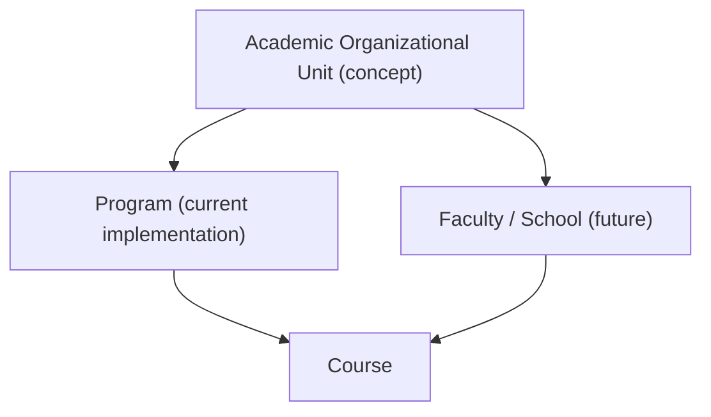

# ADR-022 — Academic Organizational Unit

**Status:** Accepted (documentation only — AI29.1A.5)  
**Date:** 2026-08-06  
**Related:** AI29, AI29.1A, AI29.1A.5, AI30, AI31, AI22

## Context

Colleges and universities organize academics differently: some use Programs (Commerce, Arts), others use Faculties, Schools, Divisions, or Institutes. AI29.1A introduced **Program** as an optional top-level grouping above Course.

Hard-coding forever to the name “Program” would force redesign when a medical school needs “Faculty of Medicine” or a university needs “School of Business”.

## Decision

Introduce the conceptual abstraction **Academic Organizational Unit (AOU)** in architecture documentation only.

- **Do not rename** the `Program` entity, table, APIs, or permissions in this phase.
- **Program** is the first concrete implementation of AOU.
- Future AOU kinds (Faculty, School, Division) may share the same structural role: optional parent of Course.

## Why Program is optional

- Many tenants already run Course → Group → Semester → Subject successfully.
- `EnablePrograms` defaults to **false**.
- `Course.ProgramId` is nullable; unassigned courses remain valid.
- Attendance and timetable flows must not require a Program.

## Future Faculty / School support

Later phases may:

1. Generalize storage to AOU with a `Kind` discriminator, **or**
2. Keep `Programs` table and map Faculty/School as AOU kinds at the application boundary.

Either path must preserve `Course.ProgramId` semantics (nullable parent unit id) for backward compatibility.

## Migration strategy

| Phase | Action |
|-------|--------|
| AI29.1A | Ship Program tables/APIs |
| AI29.1A.5 | Document AOU (this ADR); no rename |
| Future | Additive generalization; dual-read if needed; never break Course→Group→… attendance |

## Good examples

- Commerce Program containing B.Com and BBA courses
- Science Program containing B.Sc groups
- Tenant with `EnablePrograms=false` using Course as root (no Program nodes)

## Bad examples

- Renaming `Program` to `AcademicOrganizationalUnit` in a breaking migration
- Requiring ProgramId for attendance marking
- Putting operational lifecycle (Planning → Operational → Closed) on Program itself
- Duplicating hierarchy tree logic in controllers or dashboards

## Consequences

- Code and APIs continue to say **Program**.
- Architecture reviews treat Program as AOU implementation #1.
- Dashboard and scheduling may later bind to AOU without attendance redesign.
