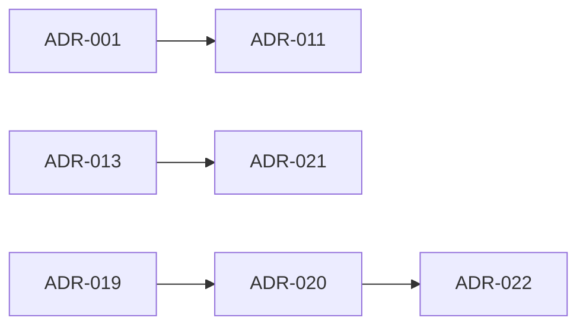

# ADR Index

Generated: 2026-08-06 UTC (AI29.1A.6 AdrIndexGenerator)

| ADR Number | Title | Status | Related Module | Dependencies | Source |
|------------|-------|--------|----------------|--------------|--------|
| ADR-001 | Multi-Tenant Isolation | Accepted | Platform | Constitution | (registry / ADL) |
| ADR-002 | Soft Delete Convention | Accepted | Platform | ADR-001 | (registry / ADL) |
| ADR-003 | Audit Fields on BaseEntity | Accepted | Platform | ADR-002 | (registry / ADL) |
| ADR-004 | JWT Authentication | Accepted | Security | ADR-001 | (registry / ADL) |
| ADR-005 | Role / Permission Model | Accepted | Security | ADR-004 | (registry / ADL) |
| ADR-006 | Attendance Capture Modes | Accepted | Attendance | AI22 | (registry / ADL) |
| ADR-007 | Attendance Session Aggregate | Accepted | Attendance | ADR-006 | (registry / ADL) |
| ADR-008 | Face Recognition Pipeline | Accepted | Attendance / AI | ADR-007 | (registry / ADL) |
| ADR-009 | Enrollment Pipeline | Accepted | Enrollment | ADR-008 | (registry / ADL) |
| ADR-010 | Artifact Storage | Accepted | Platform | ADR-009 | (registry / ADL) |
| ADR-011 | Caching Strategy (ICacheService) | Accepted | Platform | ADR-001 | (registry / ADL) |
| ADR-012 | Domain Events (in-process) | Accepted | Platform | ADR-003 | (registry / ADL) |
| ADR-013 | Repository Pattern for Scheduling | Accepted | Scheduling | AI30 | (registry / ADL) |
| ADR-014 | Timetable Governance | Accepted | Scheduling | ADR-013 | (registry / ADL) |
| ADR-015 | Conflict Detection Engine | Accepted | Scheduling | ADR-014 | (registry / ADL) |
| ADR-016 | Optimization Sandbox | Accepted | Scheduling | ADR-015 | (registry / ADL) |
| ADR-017 | Enterprise Dashboards | Accepted | Dashboards | AI31 | (registry / ADL) |
| ADR-018 | Faculty Workspace Separation | Accepted | Faculty | AI31 | (registry / ADL) |
| ADR-019 | Section Management | Accepted | Academic | AI29 | (registry / ADL) |
| ADR-020 | Program Management (optional) | Accepted | Academic | AI29.1A | (registry / ADL) |
| ADR-021 | Master Data Ownership | Accepted | Catalog / Scheduling | AI30 AC1.5 | `docs/AI30_AC15_ADR021_IMPLEMENTATION_SUMMARY.md` |
| ADR-022 | Academic Organizational Unit | Accepted | Academic Hierarchy | AI29.1A.5 / ADR-020 | `docs/ADR-022_Academic_Organizational_Unit.md` |

## Discovered ADR documents

- **ADR-021** — `docs/AI30_AC15_ADR021_IMPLEMENTATION_SUMMARY.md`
- **ADR-022** — `docs/ADR-022_Academic_Organizational_Unit.md`

## Flow

_Re-run `AdrIndexGenerator.GenerateMarkdown(docsPath)` when new ADR markdown files are added under docs/._
