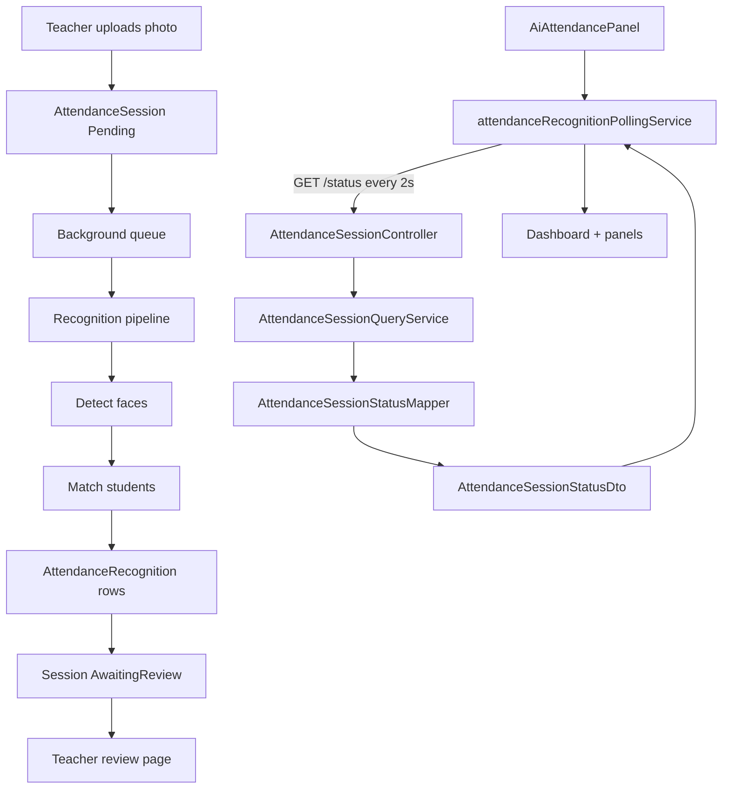

# AI11.3 Live Recognition Status Architecture Review

Milestone scope: **AI11.3.1 – AI11.3.12** — live session status API, reusable polling, dashboard binding, backend-driven workflow, processing panel, statistics, queue visualization, activity log, animations, error handling, review-ready transition, and architecture freeze.

## Verdict

**Approved for AI11.4.**

The live recognition dashboard is backend-driven, uses a single polling service with correct disposal, and keeps controllers thin with read-only query projection in Application.

---

## Architecture flow



---

## Verification checklist

| Requirement | Status | Notes |
|---|---|---|
| `GET /api/attendance-sessions/{id}/status` | Pass | Thin controller; DTO only |
| Uses `AttendanceSessionQueryService` | Pass | `GetSessionStatusAsync` |
| Read-only, no EF tracking | Pass | `AsNoTracking()` on session + recognitions |
| No business logic in controller | Pass | Mapping in `AttendanceSessionStatusMapper` |
| Uses existing AI status enums | Pass | `AiWorkflowStep`, `RecognitionQueueStatus` |
| Single polling service | Pass | `attendanceRecognitionPollingService` singleton |
| Poll every 2 seconds | Pass | `POLL_INTERVAL_MS = 2000` |
| Auto-stop on terminal status | Pass | Completed, Approved, Failed, Cancelled |
| Timer disposed on stop/unmount | Pass | `clearInterval` in `stop()`; hook cleanup |
| No duplicated polling | Pass | Removed legacy `pollAttendanceSessionStatus` |
| No memory leaks | Pass | Unsubscribe + stop in `useEffect` cleanup |
| Workflow backend-driven | Pass | `workflowStep` from API → `AiWorkflowStepper` |
| No frontend business logic | Pass | Visibility helpers use raw `status` + queue enum |
| Statistics from API | Pass | Detected/matched/reviewed/accuracy from status DTO |
| Processing panel reusable | Pass | `RecognitionProcessingPanel` props-only |
| Activity panel reusable | Pass | `RecognitionActivityPanel` props-only |
| Error UX with retry same session | Pass | `retryUpload` reuses `sessionIdRef` |
| Review-ready transition | Pass | Hides processing when `status === AwaitingReview` |
| MUI transitions only | Pass | Fade, Grow, Collapse; respects reduced motion |
| No UI changes for AI11.3.1 | Pass | API-only milestone |

---

## AI11.3.1 — Live Session Status API

**Endpoint:** `GET /api/attendance-sessions/{sessionId}/status`

**Response fields:**

| Field | Source |
|---|---|
| `attendanceSessionId` | Session id |
| `status` | `AttendanceSessionStatus` (int) |
| `workflowStep` | `AiWorkflowStep` |
| `recognitionQueueStatus` | `RecognitionQueueStatus` |
| `detectedFaces` | Session or recognition row count |
| `matchedFaces` | Recognized + manual assignment |
| `reviewedFaces` | Recognitions with `VerifiedByTeacher` |
| `recognitionAccuracy` | matched / detected × 100 |
| `startedUtc` | `StartedUtc` or upload time |
| `lastUpdatedUtc` | Completed, upload, or created |
| `elapsedMilliseconds` | UTC now − started |

Extended processing fields (AI11.3.5+): progress percent, stage, operation, ETA, file name, messages, error codes.

---

## AI11.3.2 — Polling service

`attendanceRecognitionPollingService.ts`:

- `start(sessionId)` — idempotent for same session; stops prior timer first
- `stop()` — clears interval and session id
- `subscribe(callback)` / `onError(callback)` — returns unsubscribe
- `inFlight` guard prevents overlapping requests
- Pure TypeScript — no React imports

---

## AI11.3.3 — Live dashboard

`useAttendanceSessionPolling` starts polling when `attendanceSessionId` is set.

`AiAttendancePanel` binds:

- Session status card (raw status code)
- Recognition queue card
- Workflow stepper
- Elapsed time (`SessionTimer` + API milliseconds)
- Recognition accuracy and face counts
- Processing / review / finalize sections by backend status

---

## AI11.3.4 — Workflow auto progress

Backend `AttendanceSessionStatusMapper.MapWorkflowStep` drives:

`Upload → Detect → Match → Review → Finalize`

Frontend maps numeric `workflowStep` to `AIWorkflowStep` in `sessionStatusMapper.ts`. No timers or assumed step advancement on the client.

---

## AI11.3.5 — Processing panel

`RecognitionProcessingPanel` displays MUI `LinearProgress`, current stage/operation, ETA, current file, and message list — all from status API.

---

## AI11.3.6 — Recognition statistics

`RecognitionProgressSummary` uses `AnimatedCount` for live metrics with Fade/Grow transitions. Accuracy shows `—` when null.

---

## AI11.3.7 — Recognition queue

`RecognitionQueueCard` + `recognitionQueueDisplay.tsx` map backend queue enum to chip color, icon, and description.

---

## AI11.3.8 — AI activity log

`RecognitionActivityPanel` shows newest-first timeline (max 100). Entries derived from status diffs in `buildActivityEntriesFromStatus` — no separate activity API yet.

---

## AI11.3.9 — Animations

| Component | Animation |
|---|---|
| `AiWorkflowStepper` | Active step pulse, Grow on complete |
| `RecognitionProcessingPanel` | Fade in |
| `RecognitionProgressSummary` | Fade/Grow + AnimatedCount |
| `RecognitionQueueChip` | Grow |
| `RecognitionActivityPanel` | Collapse + slide-in (disabled with `prefers-reduced-motion`) |

No third-party animation libraries.

---

## AI11.3.10 — Error handling

`RecognitionErrorPanel` handles Failed/Cancelled/Timeout/NoFacesFound/ImageTooBlurry/RecognitionError with alert, error code, expandable technical JSON, and retry (re-upload to same session).

---

## AI11.3.11 — Review ready transition

When `status === AwaitingReview` (3):

- Processing panel hidden
- `RecognitionReviewSection` shown
- Workflow step `Review` active
- Link: `/attendance/sessions/{sessionId}/review`

---

## Files created / modified

### Backend (AI11.3.1)

| File | Action |
|---|---|
| `Abhyanvaya.Application/DTOs/Attendance/AiAttendanceEnums.cs` | Created |
| `Abhyanvaya.Application/DTOs/Attendance/AttendanceSessionStatusDto.cs` | Created |
| `Abhyanvaya.Application/Internal/AttendanceSessionStatusMapper.cs` | Created |
| `Abhyanvaya.Application/Common/Interfaces/IAttendanceSessionQueryService.cs` | Modified |
| `Abhyanvaya.Application/AttendanceSessionQueryService.cs` | Modified |
| `Abhyanvaya.API/Controllers/AttendanceSessionController.cs` | Modified |

### Frontend

| File | Action | Milestone |
|---|---|---|
| `abhyanvaya-ui/src/types/liveSessionStatus.ts` | Created | 3.2 |
| `abhyanvaya-ui/src/services/attendanceSessionStatusService.ts` | Created | 3.2 |
| `abhyanvaya-ui/src/services/attendanceRecognitionPollingService.ts` | Created | 3.2 |
| `abhyanvaya-ui/src/hooks/useAttendanceSessionPolling.ts` | Created | 3.3 |
| `abhyanvaya-ui/src/utils/sessionStatusMapper.ts` | Created | 3.3–3.4 |
| `abhyanvaya-ui/src/utils/recognitionQueueDisplay.tsx` | Created | 3.7 |
| `abhyanvaya-ui/src/types/aiAttendanceState.ts` | Modified | 3.3 |
| `abhyanvaya-ui/src/components/attendance/AiAttendancePanel.tsx` | Modified | 3.3 |
| `abhyanvaya-ui/src/components/common/SessionTimer.tsx` | Modified | 3.3 |
| `abhyanvaya-ui/src/components/common/AnimatedCount.tsx` | Created | 3.6 |
| `abhyanvaya-ui/src/components/attendance/RecognitionProgressSummary.tsx` | Modified | 3.6 |
| `abhyanvaya-ui/src/components/attendance/RecognitionProcessingPanel.tsx` | Created | 3.5 |
| `abhyanvaya-ui/src/components/attendance/RecognitionQueueCard.tsx` | Created | 3.7 |
| `abhyanvaya-ui/src/components/attendance/RecognitionActivityPanel.tsx` | Created | 3.8 |
| `abhyanvaya-ui/src/components/attendance/RecognitionErrorPanel.tsx` | Created | 3.10 |
| `abhyanvaya-ui/src/components/attendance/RecognitionReviewSection.tsx` | Created | 3.11 |
| `abhyanvaya-ui/src/hooks/useClassroomPhotoUpload.ts` | Modified | 3.3 |
| `abhyanvaya-ui/src/services/attendanceSessionService.ts` | Modified | 3.2 (removed legacy poll) |

### Documentation

| File | Action |
|---|---|
| `docs/AI11_3_ARCHITECTURE_REVIEW.md` | Created |

---

## Build note

Run locally before AI11.4:

```bash
dotnet build Abhyanvaya.Application/Abhyanvaya.Application.csproj
dotnet build Abhyanvaya.API/Abhyanvaya.API.csproj
cd abhyanvaya-ui && npm run build
```

Automated build results:

- `dotnet build Abhyanvaya.Application` — **0 errors**
- `npm run build` (abhyanvaya-ui) — **0 errors**
- `dotnet build Abhyanvaya.API` — may fail with MSB3027 if Visual Studio or a running API process locks output DLLs; stop debug session and rebuild

---

## Recommended follow-ups for AI11.4

1. Server-side activity/event log table for richer timeline (optional).
2. Integration test for `GET /status` across session lifecycle states.
3. E2E test: upload → poll → AwaitingReview → review page navigation.
