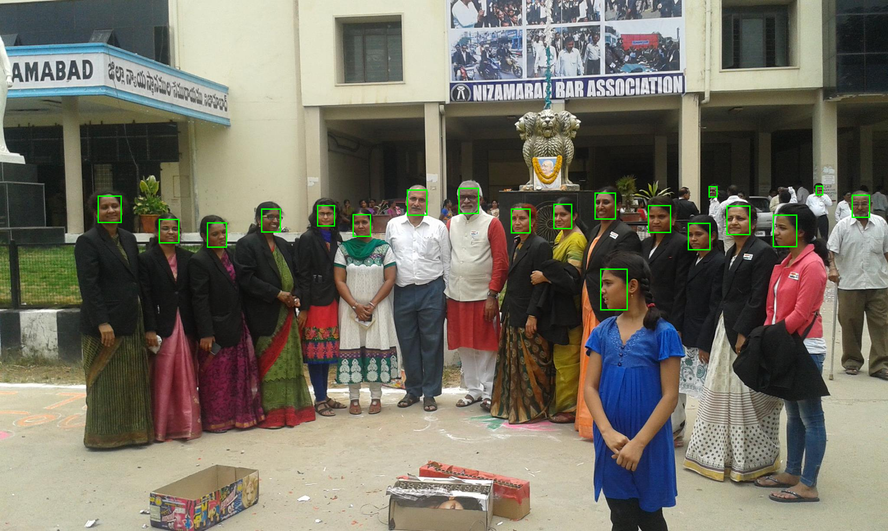

# AI11.AI.6 — End-to-End Face Detection Trace

**Type:** Read-only investigation. No application code changed.
**Method:** the actual `det_10g.onnx` was executed with `onnxruntime` on one real uploaded classroom
image, reproducing the app's letterbox pre-processing, then running **both** the current C# parsing
logic and the correct SCRFD logic. This isolates exactly which stage breaks the count.

---

## Traced image

| Property | Value |
|----------|-------|
| Session | `fc2ab073-5bd9-46f0-b1c9-dee2a3f42b23` (the session from the reported failure) |
| File | `…\Abhyanvaya.API\wwwroot\branding\attendance\1\sessions\fc2ab073-…\classroom.jpg` |
| Resolution | **2048 × 1228** |
| Visible people | ~19–22 (group photo) |

## Pre-processing (matches `BuildDetectionInput`)

```
Original 2048×1228
   ↓ scale = min(640/2048, 640/1228) = 0.31250   (uniform, aspect preserved)
Resized 640×384
   ↓ letterbox into 640×640 canvas
padX = 0, padY = 128   (centred)
   ↓ normalize (px − 127.5) / 128, channels R,G,B → tensor [1,3,640,640]
Inference (det_10g.onnx)
```

## Inference output (graph order, verified)

```
[12800,1] [3200,1] [800,1]  [12800,4] [3200,4] [800,4]  [12800,10] [3200,10] [800,10]
  score8   score16  score32   bbox8    bbox16   bbox32     kps8       kps16     kps32
```

---

## Stage-by-stage counts

| Stage | CURRENT CODE (buggy parse) | CORRECT SCRFD parse |
|-------|----------------------------|----------------------|
| Raw detections (cells passing 0.5 during parse) | **1,786** | **72** |
| After confidence filter (0.5) | 1,786 | 72 |
| After NMS (0.4) | **584** | **19** |
| Final detected faces | **584** ❌ | **19** ✅ |
| Confidence — average | **1.4491** (impossible) | 0.8347 |
| Confidence — highest | **2.8658** (impossible) | 0.8992 |
| Confidence — lowest | 0.5008 | 0.5580 |

**Expected for a ~10–20 person classroom image: ~10–20 final faces.**
- Correct parse → **19** ✅ (matches expectation)
- Current code → **584** ❌ (≈30× too many, all spurious)

## First 20 detections

### Current code (post-NMS, descending) — garbage
`score  [x1,y1,x2,y2]` — note impossible scores > 1.0 and 1-pixel-tall boxes on image edges:

```
2.8658  [266.3, 0.0, 445.5, 1.0]
2.8213  [676.4, 0.0, 855.1, 1.0]
2.7760  [1904.0, 0.0, 2048.0, 1.0]
2.7159  [1085.6, 0.0, 1264.0, 1.0]
2.6722  [555.9, 1145.8, 773.5, 1228.0]
2.6598  [968.0, 1141.5, 1179.0, 1228.0]
2.6270  [151.7, 1154.3, 357.9, 1228.0]
2.6255  [1372.0, 1144.3, 1591.1, 1228.0]
2.6213  [1496.1, 0.0, 1673.2, 1.0]
2.6049  [1478.5, 233.4, 1687.3, 484.2]
2.5934  [1787.3, 1151.6, 1997.3, 1228.0]
2.5704  [1361.1, 1227.0, 1600.0, 1228.0]
2.5703  [1777.4, 1227.0, 2004.8, 1228.0]
2.5698  [954.7, 1227.0, 1192.3, 1228.0]
2.5695  [137.4, 1227.0, 366.4, 1228.0]
2.5684  [543.9, 1227.0, 783.7, 1228.0]
2.5619  [151.5, 1200.1, 365.5, 1228.0]
2.5443  [550.6, 1198.5, 779.1, 1228.0]
2.5430  [1060.7, 223.7, 1285.4, 493.4]
2.5392  [957.7, 1199.1, 1195.2, 1228.0]
```

### Correct SCRFD (post-NMS, descending) — valid faces
```
0.8992  [1276.3, 472.0, 1319.9, 529.1]
0.8746  [225.4, 452.9, 280.5, 515.2]
0.8738  [1371.2, 445.8, 1420.7, 507.5]
0.8720  [366.5, 506.9, 413.1, 562.7]
0.8703  [938.7, 438.0, 985.6, 498.7]
0.8698  [1782.2, 496.1, 1838.1, 571.2]
0.8663  [1586.7, 515.8, 1638.3, 578.4]
0.8641  [813.4, 495.0, 855.2, 547.9]
0.8608  [1675.7, 475.3, 1730.1, 543.9]
0.8585  [1384.4, 621.1, 1447.9, 717.4]
0.8570  [477.0, 514.5, 523.6, 573.0]
0.8567  [1494.9, 474.9, 1547.9, 538.1]
0.8532  [1057.7, 434.8, 1104.7, 494.9]
0.8526  [1178.3, 482.7, 1223.8, 539.9]
0.8503  [602.7, 482.5, 647.6, 537.2]
0.8461  [731.1, 474.8, 772.4, 523.6]
0.8356  [1964.7, 450.4, 2006.3, 503.2]
0.6408  [1881.6, 429.2, 1898.5, 451.3]
0.5580  [1634.5, 430.2, 1654.3, 456.2]
```

Correct boxes are ~45×60 px and centred on faces:



---

## Which stage introduces the incorrect count?

```
Image ✅  →  Resize/letterbox ✅  →  Inference ✅  →  ❌ OUTPUT PARSING  →  (threshold)  →  (NMS)  →  wrong count
```

The **parsing stage** (`InsightFaceEngine.ParseDetectionOutputs`) is the single point of failure:

1. **Wrong tensor→role mapping** — assumes interleaved `[score,bbox,kps]` per stride; the model emits
   grouped `[scores×3, bbox×3, kps×3]`. For strides 16/32 it threshold-checks regression tensors →
   1,786 false candidates with impossible >1.0 "confidences". *(AI11.AI.2, Bug #1.)*
2. **Anchor count ignored** — 2 anchors per cell; the loop scans one anchor per cell with
   `index = y*fw + x`, mis-addressing rows. *(AI11.AI.2, Bug #2.)*

Everything upstream (model load, resize, letterbox, inference) and everything downstream that operates
on valid data (threshold, NMS, scale-back) is correct — proven by the correct-parse path yielding
**19** well-placed faces from the *same* inference tensors.

## Conclusion

| Item | Result |
|------|--------|
| Root cause | Detection **output parsing** (tensor ordering + anchor count) |
| Current final count | 584 (all spurious) |
| Correct final count | 19 (matches the ~10–20 people) |
| Model / preprocessing / inference | ✅ Correct |
| Threshold / NMS / scaling | ✅ Correct given valid inputs |
| Fix location | `InsightFaceEngine.ParseDetectionOutputs` (see AI11.AI.2 fix direction) |
