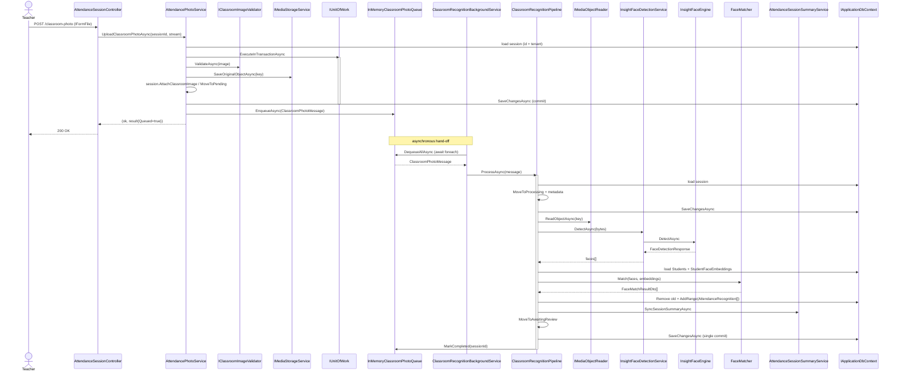

# AI11.BG.3 — Complete AI Recognition Pipeline Trace

**Status: VERIFIED — PIPELINE FULLY WIRED, NO BROKEN LINKS**
**Review date:** 2026-07-04
**Reviewer:** Chief Architect
**Mode:** Verification only — no architecture changed.

---

## 1. Executive summary

The complete recognition pipeline — from teacher image upload through face detection, matching, `AttendanceRecognition` persistence, and `AttendanceSession` status transition — was traced end-to-end. Every link in the chain resolves to a concrete, DI-registered implementation. No missing implementations and no broken links were found. A small number of **defined-but-never-called** members were identified (dead/reserved surface) and are documented in §6; none affect the live path.

---

## 2. End-to-end call chain (happy path)

```
Teacher uploads image (multipart/form-data)
  │
  ▼
[API]  AttendanceSessionController.UploadClassroomPhoto(sessionId, IFormFile, ct)
        • guards: file != null && file.Length > 0
        • file.OpenReadStream()
  │
  ▼
[APP]  IClassroomPhotoService.UploadClassroomPhotoAsync(...)   → AttendancePhotoService
        1. _context.AttendanceSessions.FirstOrDefaultAsync(id + tenant)      [load + tenant guard]
        2. guard: status ∉ {Approved, Completed, Cancelled}                  [session-lock]
        3. _unitOfWork.ExecuteInTransactionAsync:
             a. UploadToSessionAsync(session, stream, name, size, ct)
                  • _imageValidator.ValidateAsync(...)                       [IClassroomImageValidator]
                  • _mediaStorage.SaveOriginalObjectAsync(...)              [IMediaStorageService]
                  • session.AttachClassroomImage(...)                       [domain]
             b. session.MoveToPending()   (only if status == Draft)         [state machine]
             c. ConcurrencyExceptionHelper.SaveChangesAsync(_unitOfWork)    [commit]
        4. QueueProcessingAsync(sessionId, storageKey, ct)
             • _queue.EnqueueAsync(new ClassroomPhotoMessage(...))          [enqueue — exactly once]
             • _logger.LogInformation("...QueueDepth={QueueDepth}", _queue.Count)
        5. result.Queued = true
  │
  ▼
[QUEUE]  IClassroomPhotoQueue  → InMemoryClassroomPhotoQueue
          • Channel<ClassroomPhotoMessage> (unbounded, SingleReader)
          • _pendingSessions guarded by lock(_gate)
  │
  ▼
[WORKER] ClassroomRecognitionBackgroundService.ExecuteAsync(stoppingToken)  [BackgroundService / IHostedService]
          • await foreach (msg in _queue.DequeueAllAsync(stoppingToken))
          • log dequeue + QueueDepth
          • scope = _scopeFactory.CreateAsyncScope()
          • pipeline = scope.GetRequiredService<IClassroomRecognitionPipeline>()
          • await pipeline.ProcessAsync(msg, stoppingToken)
          • try/catch → logs error, loop continues (no crash on job failure)
  │
  ▼
[PIPELINE] ClassroomRecognitionPipeline.ProcessAsync(message, ct)
          1. _context.AttendanceSessions.FirstOrDefaultAsync(id + tenant)   [load or throw KeyNotFound]
          2. session.MoveToPending() (if Draft) → session.MoveToProcessing()
             session.StartedUtc / RecognitionProvider / RecognitionModel / RecognitionPipelineVersion
             ConcurrencyExceptionHelper.SaveChangesAsync                    [commit: Processing]
          3. _mediaReader.ReadObjectAsync | ReadVariantAsync(...)           [IMediaObjectReader]
  │
  ▼
[DETECT]  _faceDetectionService.DetectAsync(FaceDetectionRequest, ct)       → InsightFaceDetectionService
             → _engine.DetectAsync(...)                                     → InsightFaceEngine
                • Image.Load<Rgb24>
                • DetectFaces → per face: AlignFace → ExtractEmbedding → ToBoundingBox → SaveAsWebp
                • returns FaceDetectionResponse { Faces[], ImageWidth, ImageHeight, DetectionDurationMs }
          4. session.SetImageDimensions(w, h); session.DetectedFaces = faces.Count
          5. LoadStudentEmbeddingsAsync(session, ct)
                • _context.Students (course/group/semester filter, AsNoTracking)
                • _context.StudentFaceEmbeddings (active + Completed + non-empty)
  │
  ▼
[MATCH]   _faceMatcher.Match(matchInputs, studentEmbeddings)               → FaceMatcher
             • per face: FindBestMatch (cosine distance)
             • thresholds → Recognized / Duplicate / LowConfidence / Unknown
          6. remove existing AttendanceRecognitions (_context.Remove)      [idempotent re-run]
          7. build List<AttendanceRecognition> (one per detected face)
             _context.AddRangeAsync(recognitions)
  │
  ▼
[PERSIST] session.RecognizedFaces / UnknownFaces / CompletedUtc / ProcessingMilliseconds
          8. _summaryService.SyncSessionSummaryAsync(session.Id, ct)       → AttendanceSessionSummaryService
                • ApplySummary → AttendanceRecognitionMetrics.CountByStatus / averages
  │
  ▼
[STATUS]  session.MoveToAwaitingReview()                                    [state machine]
          9. ConcurrencyExceptionHelper.SaveChangesAsync                    [single commit: recognitions + summary + status]
         10. _queue.MarkCompleted(session.Id)
             _logger.LogInformation("Classroom recognition completed...")

  (on exception)
          session.ProcessingError = ex.Message; CompletedUtc; ProcessingMilliseconds
          session.MoveToFailed(); SaveChangesAsync; _queue.MarkCompleted(session.Id); throw
```

---

## 3. Sequence diagram



---

## 4. Call hierarchy (with DI resolution)

| Layer | Contract | Concrete impl | DI registration |
|-------|----------|---------------|-----------------|
| API | `AttendanceSessionController` | — | MVC controller |
| App | `IClassroomPhotoService` / `IAttendancePhotoService` | `AttendancePhotoService` | `Application/DependencyInjection.cs:19-20` (Scoped) |
| App | `IAttendanceSessionCreator` | `AttendanceSessionCreator` | `Application/DependencyInjection.cs:18` (Scoped) |
| App | `IClassroomImageValidator` | (Infrastructure) | Infrastructure DI |
| API | `IMediaStorageService` / `IMediaObjectReader` | `ApplicationMediaStorageService` / `MediaObjectReader` | `API/Program.cs:78` (Scoped) |
| Infra | `IClassroomPhotoQueue` | `InMemoryClassroomPhotoQueue` | `Infrastructure/DependencyInjection.cs:40` (**Singleton**) |
| Infra | `ClassroomRecognitionBackgroundService` | self | `Infrastructure/DependencyInjection.cs:54` (`AddHostedService`) |
| Infra | `IClassroomRecognitionPipeline` | `ClassroomRecognitionPipeline` | `Infrastructure/DependencyInjection.cs:51` (Scoped, resolved per-job in a fresh scope) |
| Infra | `IFaceDetectionService` | `InsightFaceDetectionService` | `Infrastructure/DependencyInjection.cs:43` (Scoped) |
| Infra | `InsightFaceEngine` | self | `Infrastructure/DependencyInjection.cs:42` (Scoped) |
| Infra | `IFaceMatcher` | `FaceMatcher` | `Infrastructure/DependencyInjection.cs:45` (Scoped) |
| App | `IAttendanceSessionSummaryService` | `AttendanceSessionSummaryService` | `Application/DependencyInjection.cs:13` (Scoped) |
| Infra | `IApplicationDbContext` / `IUnitOfWork` | EF Core context / UoW | `Infrastructure/DependencyInjection.cs:24-27` (Scoped) |

**Lifetime correctness:** The queue is a `Singleton` (must outlive individual requests to bridge producer/consumer). The worker is a hosted `Singleton` that resolves the `Scoped` pipeline inside `CreateAsyncScope()` per job — the correct pattern for using scoped services (DbContext, UoW) from a singleton background service. ✅

---

## 5. State-machine transition trace

| Step | Method | Transition | Valid per `CanTransitionTo`? |
|------|--------|------------|------------------------------|
| Upload (if Draft) | `MoveToPending()` | Draft → Pending | ✅ line 100 |
| Pipeline start | `MoveToProcessing()` | Pending → Processing | ✅ line 101 |
| Pipeline success | `MoveToAwaitingReview()` | Processing → AwaitingReview | ✅ line 102 |
| Pipeline failure | `MoveToFailed()` | Processing → Failed | ✅ line 111 |
| Finalize (AI11.5) | `Approve()` | AwaitingReview → Approved | ✅ line 103 |

The pipeline's defensive `if (session.Status == Draft) MoveToPending()` before `MoveToProcessing()` covers the case where a message is processed for a session that never went through the upload's Draft→Pending step (e.g. a session created without upload). No invalid-transition risk exists on the live path. ✅

---

## 6. Findings

### 6.1 Missing implementations
**None.** Every interface on the path resolves to exactly one concrete, registered implementation.

### 6.2 Broken links
**None.** All dependencies of every participant (`AttendancePhotoService`, `ClassroomRecognitionBackgroundService`, `ClassroomRecognitionPipeline`, `InsightFaceDetectionService`, `FaceMatcher`, `AttendanceSessionSummaryService`) are DI-registered. The full solution builds successfully.

### 6.3 Methods / members defined but never called (dead or reserved surface)

| Member | Location | Note |
|--------|----------|------|
| `AttendanceSessionCreator.CreateAndUploadClassroomPhotoAsync` | `Abhyanvaya.Application/AttendanceSessionCreator.cs:83` | **Not wired to any controller.** The live flow uses `CreatePhotoAttendanceSessionAsync` (create draft) followed by a separate `UploadClassroomPhoto` call. This combined create-and-upload helper is reachable only via its interface and has no HTTP entry point. Harmless (it correctly enqueues once), but unused. |
| `IClassroomPhotoQueue.IsPending(Guid)` | impl `InMemoryClassroomPhotoQueue:40` | Defined and thread-safe, but **not called anywhere** in production. (The analogous `IStudentPhotoEmbeddingQueue.IsPending` *is* used by `StudentFaceEmbeddingService.BuildStatusAsync`; the classroom equivalent is currently unused.) |
| `IFaceDetectionService.Version` | impl `InsightFaceDetectionService:24` | The pipeline records `RecognitionPipelineVersion` from `_insightFaceOptions.PipelineVersion` and uses `ProviderName` / `ModelName`, but never reads the `Version` property. Reserved surface. |

None of these represent a broken link; they are unused surface area. **Per the "do not change architecture / only verify" instruction, no code was removed.**

### 6.4 Observations (non-blocking, informational)
- **Idempotent re-processing:** the pipeline deletes existing `AttendanceRecognition` rows before inserting new ones, so a re-queued/re-run message regenerates recognitions cleanly rather than duplicating them.
- **Single commit for results:** detection results, recognition rows, summary counts, and the `AwaitingReview` status transition are all persisted in one `SaveChangesAsync` at the end of the happy path.
- **Failure isolation:** the worker catches pipeline exceptions per-message and continues the loop; the pipeline marks the session `Failed` and re-throws so the worker logs it — the queue is never poisoned by a single bad job.
- **In-memory durability trade-off:** as documented in AI11.BG.2, messages enqueued but not yet consumed are lost on process restart (accepted single-instance trade-off, future Hangfire/Quartz migration point).

---

## 7. Conclusion

The complete AI recognition pipeline is **fully connected and correct**:

- Every method from `UploadClassroomPhoto` → detection → matching → `AttendanceRecognition` persistence → `AttendanceSession.MoveToAwaitingReview()` was traced and resolves to a live implementation.
- **No missing implementations. No broken links.**
- Three defined-but-unused members were identified (`CreateAndUploadClassroomPhotoAsync`, classroom `IsPending`, `IFaceDetectionService.Version`) and left in place per the verify-only scope.

**Verified — pipeline is production-wired.**
