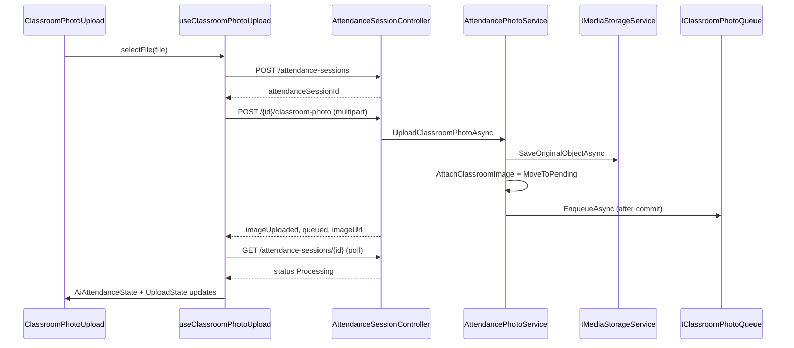

# AI11.2.6 Upload Architecture Review

Milestone scope: **AI11.2.6.1 – AI11.2.6.7** — real classroom photo upload, progress, media storage reuse, UI state machine, dashboard binding, retry, and architecture cleanup.

## Verification checklist

| Requirement | Status | Notes |
|---|---|---|
| Upload handled by `AttendancePhotoService` | Pass | `UploadClassroomPhotoAsync` validates, stores, updates session, queues |
| Media module reused | Pass | Application `IMediaStorageService` → `ApplicationMediaStorageService` → `IStorageProvider` |
| No duplicated storage code | Pass | Removed `IClassroomImageStorageService`; no `File.WriteAllBytes` / `Directory.CreateDirectory` in Application |
| `UploadState` single source of truth | Pass | `useUploadState` + `useClassroomPhotoUpload`; UI reads one state object |
| Session dashboard driven by API | Pass | Session GUID, status, queue state from create/upload/poll responses |
| No fake timers | Pass | Progress from Axios `onUploadProgress`; elapsed timer starts only when status is Processing |
| No hard-coded paths | Pass | `AttendanceSessionStoragePaths.BuildClassroomImageKey` |
| No duplicated validation | Pass | Server: `IClassroomImageValidator`; client preview only |
| State machine respected | Pass | Draft → Pending on upload; queue after commit; poll moves UI to Processing |
| Queue started only after successful upload | Pass | `QueueProcessingAsync` after transaction commit |

## End-to-end flow



## Storage layout

```
attendance/{tenantId}/sessions/{sessionId}/classroom.{ext}
```

Original image only — no WebP variants for classroom photos (student/branding uploads still use the full API `Media.IMediaStorageService`).

## API contracts

### Create session

`POST /api/attendance-sessions`

Response: `{ attendanceSessionId }`

### Upload classroom photo

`POST /api/attendance-sessions/{attendanceSessionId}/classroom-photo`  
`Content-Type: multipart/form-data`, field name `file`

Response:

```json
{
  "attendanceSessionId": "guid",
  "imageUploaded": true,
  "uploadUtc": "2026-07-03T...",
  "imageUrl": "/media/...",
  "queued": true
}
```

Recognition is **not** executed in the upload handler — only enqueued.

## Frontend state machine

| Phase | `UploadState.uploadStatus` | `AiAttendanceState.status` | Workflow step |
|---|---|---|---|
| Before file | Idle | Ready | Upload |
| Validating preview | Validating | Ready | Upload |
| Upload in progress | Uploading | Uploading | Upload |
| Retry backoff | Retrying | Uploading | Upload |
| Upload OK | Completed | Pending | Upload |
| Queue acknowledged | Completed | Pending | Upload |
| Pipeline running | Completed | Processing | Detect |
| Upload failed | Failed | Failed | Upload |

Progress milestones: **0, 10, 25, 40, 60, 80, 100** via `mapUploadProgressToMilestone`.

Retry: **3 attempts**, backoff **1s / 2s / 4s**, reuses the same `attendanceSessionId`.

## Files created

### Backend

- `Abhyanvaya.Application/Common/Interfaces/IMediaStorageService.cs`
- `Abhyanvaya.API/Media/ApplicationMediaStorageService.cs`
- `Abhyanvaya.Application/DTOs/Attendance/CreatePhotoAttendanceSessionDto.cs`
- `Abhyanvaya.Infrastructure/Migrations/20260703130000_AddClassroomImageFileSize.cs`

### Frontend

- `abhyanvaya-ui/src/services/attendanceSessionService.ts`
- `abhyanvaya-ui/src/hooks/useClassroomPhotoUpload.ts`
- `abhyanvaya-ui/src/utils/uploadProgress.ts`
- `abhyanvaya-ui/src/utils/attendanceSessionStatus.ts`
- `abhyanvaya-ui/src/types/aiAttendanceState.ts`
- `docs/AI11_UPLOAD_ARCHITECTURE_REVIEW.md`

## Files modified

### Backend

- `Abhyanvaya.Application/AttendancePhotoService.cs`
- `Abhyanvaya.Application/AttendanceSessionCreator.cs`
- `Abhyanvaya.Application/AttendanceSessionMediaPaths.cs`
- `Abhyanvaya.Application/AttendanceSessionQueryService.cs`
- `Abhyanvaya.Application/AttendanceSessionStoragePaths.cs`
- `Abhyanvaya.Application/Common/Interfaces/IAttendancePhotoService.cs`
- `Abhyanvaya.Application/Common/Interfaces/IAttendanceSessionCreator.cs`
- `Abhyanvaya.Application/Common/Interfaces/IClassroomPhotoService.cs`
- `Abhyanvaya.Application/Common/Interfaces/IMediaObjectReader.cs`
- `Abhyanvaya.API/Controllers/AttendanceSessionController.cs`
- `Abhyanvaya.API/Media/MediaObjectReader.cs`
- `Abhyanvaya.API/Program.cs`
- `Abhyanvaya.API/Services/CollegeBrandingService.cs`
- `Abhyanvaya.API/Services/StudentPhotoService.cs`
- `Abhyanvaya.Domain/Entities/AttendanceSession.Image.cs`
- `Abhyanvaya.Domain/ValueObjects/ClassroomImageMetadata.cs`
- `Abhyanvaya.Infrastructure/Persistence/Configurations/AttendanceSessionConfiguration.cs`
- `Abhyanvaya.Infrastructure/Migrations/ApplicationDbContextModelSnapshot.cs`
- `Abhyanvaya.Infrastructure/Recognition/ClassroomRecognitionPipeline.cs`

### Frontend

- `abhyanvaya-ui/src/components/attendance/AiAttendancePanel.tsx`
- `abhyanvaya-ui/src/components/attendance/ClassroomPhotoUpload.tsx`
- `abhyanvaya-ui/src/components/attendance/SessionDashboardCard.tsx`
- `abhyanvaya-ui/src/hooks/useUploadState.ts`
- `abhyanvaya-ui/src/types/uploadState.ts`
- `abhyanvaya-ui/src/pages/AttendanceMarking.tsx`

## Files removed

- `Abhyanvaya.Application/Common/Interfaces/IClassroomImageStorageService.cs`
- `Abhyanvaya.API/Services/ClassroomImageStorageService.cs`

## Build status

- **Frontend:** `npm run build` — succeeded
- **Backend:** `Abhyanvaya.Application` and `Abhyanvaya.Infrastructure` — succeeded
- **API project:** compile succeeded; full solution copy to `Abhyanvaya.API/bin` may fail while Visual Studio / running API holds DLL locks — stop the debugger and rebuild the solution to verify end-to-end

## Interface disambiguation

Two storage abstractions coexist by design:

- `Abhyanvaya.API.Media.IMediaStorageService` — full media pipeline (variants, health checks) for student photos and branding
- `Abhyanvaya.Application.Common.Interfaces.IMediaStorageService` — thin original-only adapter for attendance photos

`ApplicationMediaStorageService` explicitly implements the Application interface to avoid namespace collision.
