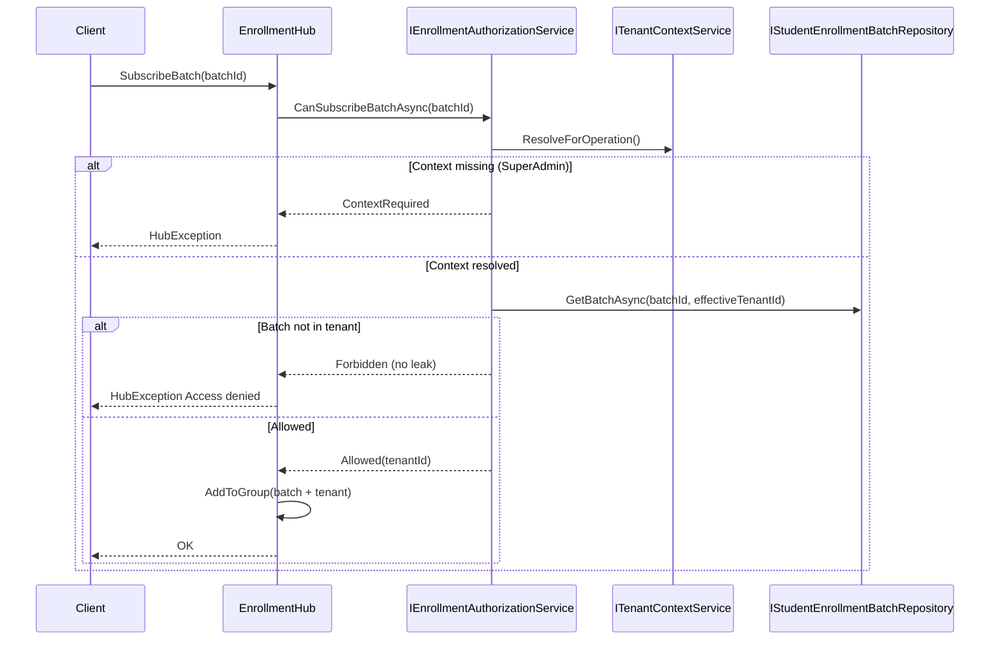

# AI20.1 Phase 1 — SignalR Authorization

## Objective

Enterprise-grade authorization for all SignalR enrollment operations. Every subscription validates tenant ownership before joining a group.

## Components

| Component | Location |
|-----------|----------|
| `IEnrollmentAuthorizationService` | `Abhyanvaya.Application/Common/Interfaces/IEnrollmentAuthorizationService.cs` |
| `EnrollmentAuthorizationService` | `Abhyanvaya.Infrastructure/EnrollmentApi/EnrollmentAuthorizationService.cs` |
| `EnrollmentHub` (orchestration only) | `Abhyanvaya.API/Hubs/EnrollmentHub.cs` |
| `EnrollmentActorPermissions` | `Abhyanvaya.API/Common/EnrollmentActorPermissions.cs` |
| `EnrollmentAuthorizationTelemetry` | `Abhyanvaya.Infrastructure/EnrollmentApi/EnrollmentAuthorizationService.cs` |

## Authorization Flow

## Validation Rules

| Actor | Rule |
|-------|------|
| College Admin | `EffectiveTenantId` must match batch tenant |
| SuperAdmin | Operational college context required; batch must belong to selected tenant |
| Unauthorized | Returns **Forbidden** — never reveals whether batch exists in another tenant |

## Hub Methods

- `SubscribeTenant()` — joins `enrollment-tenant:{tenantId}`
- `SubscribeBatch(batchId)` — authorization + batch + tenant groups
- `CancelBatch(batchId)` — `CanCancelBatch` + `IBatchCancellationService`
- `RetryBatch(batchId)` — `CanRetryBatch` + `IBatchRetryService`

## Threat Model

| Threat | Mitigation |
|--------|------------|
| Cross-tenant batch subscription | Tenant-scoped repository lookup |
| Batch enumeration | Same Forbidden response for missing/wrong tenant |
| Timing attacks | Always query with tenant filter; uniform denial message |
| Unauthorized group join | Authorization before `Groups.AddToGroupAsync` |
| Missing audit trail | `IAuditService` + `IEnrollmentAuthorizationTelemetry` |

## Tests

See `Abhyanvaya.Application.UnitTests/EnrollmentApi/EnrollmentAuthorizationServiceTests.cs` and `Abhyanvaya.IntegrationTests/Enrollment/EnrollmentAuthorizationIntegrationTests.cs`.
