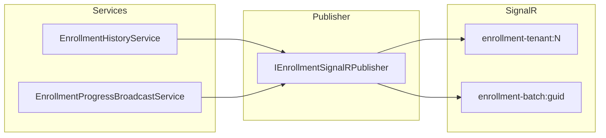

# AI20.1 Phase 2 — SignalR Group Strategy

## Objective

Remove all `Clients.All` usage. Route enrollment events only to tenant-scoped and batch-scoped groups.

## Group Strategy

| Group | Name | Purpose |
|-------|------|---------|
| Tenant | `enrollment-tenant:{tenantId}` | BatchCreated, DashboardChanged, Recovery, lifecycle tenant fan-out |
| Batch | `enrollment-batch:{batchId}` | Progress, Started, Completed, Failed, Cancelled |
| Recognition (future) | `recognition-tenant:{tenantId}` | Reserved |
| Recognition Worker (future) | `recognition-worker:{tenantId}` | Reserved |

Defined in `Abhyanvaya.Application/EnrollmentApi/EnrollmentSignalRGroups.cs`.

## Publisher

| Interface | Implementation |
|-----------|----------------|
| `IEnrollmentSignalRPublisher` | `Abhyanvaya.API/SignalR/EnrollmentSignalRPublisher.cs` |

Hub does **not** contain routing logic.

## Event Routing

| Event | Destination |
|-------|-------------|
| `BatchCreated` | Tenant group |
| `BatchStarted` | Batch group |
| `BatchProgress` | Batch group |
| `BatchCompleted` | Batch + Tenant groups |
| `BatchCancelled` | Batch + Tenant groups |
| `BatchFailed` | Batch + Tenant groups |
| `DashboardChanged` | Tenant group |
| `RecoveryEvent` | Tenant group |

## Architecture

## Tests

- `EnrollmentSignalRGroupsTests.cs`
- `SignalRIntegrationTests.cs`

No `Clients.All` remains in enrollment SignalR code paths.
