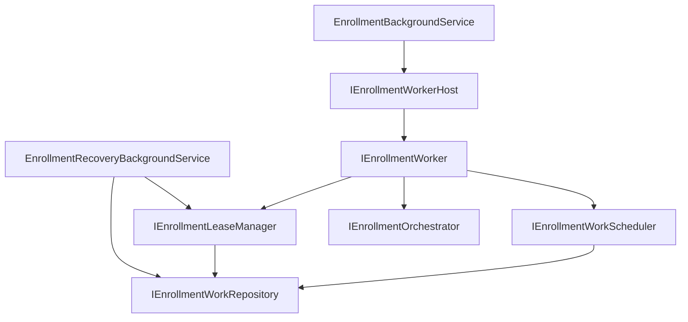
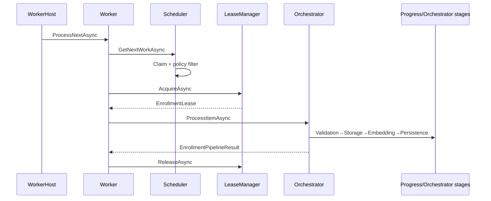

# AI20.PHASE2.2 — Enrollment Background Processing

**Milestone:** AI20.PHASE2.2 — scalable distributed worker framework.

## Objective

Transform enrollment processing into a background worker architecture. Background layer owns polling, claiming, leasing, worker execution, retry scheduling, heartbeat, and recovery — **not** pipeline logic.

```
EnrollmentBackgroundService
        ↓
IEnrollmentWorkerHost
        ↓
IEnrollmentWorker (×N)
        ↓
IEnrollmentOrchestrator  ← sole execution engine
```

## Architecture



## Sequence Diagram



## Worker Lifecycle

| State | Meaning |
|-------|---------|
| `Idle` | Waiting for work |
| `Polling` | Waiting on wake/poll timer |
| `Claiming` | Reserving work item |
| `Running` | Orchestrator executing |
| `RenewingLease` | Heartbeat + lease renewal |
| `Completed` | Item finished successfully |
| `Retrying` | Scheduled for retry |
| `Failed` | Terminal or dead-letter |
| `Cancelled` | Batch/item cancelled |
| `Stopped` | Worker shutting down |

## Lease Flow

1. Scheduler claims item (`SKIP LOCKED`, no active lease)
2. LeaseManager inserts `EnrollmentWorkLease` (unique active per item)
3. Worker renews lease + heartbeat during processing
4. Lease released on success/failure
5. Recovery expires abandoned leases and requeues stuck items

## Recovery Flow

`EnrollmentRecoveryBackgroundService` periodically:

1. Expire leases where `ExpiresUtc < now`
2. Find stuck items (`Downloading/Validating/Embedding` + stale `LastAttemptUtc`)
3. Requeue to `RetryRequired` with `NextAttemptUtc = now`
4. Emit `RecoveryExecuted` event

## Concurrency Strategy

| Mechanism | Purpose |
|-----------|---------|
| `FOR UPDATE SKIP LOCKED` | Single claim per item |
| Active lease unique index | Prevent duplicate processing |
| `pg_advisory_lock` on claim | Serialize claim across nodes |
| Stateless workers | Horizontal scale |
| Tenant context per scope | Isolation |

## Retry & Dead Letter

- Scheduler uses `IEnrollmentRetryPolicy` to compute `NextAttemptUtc`
- Worker never calculates retry timing
- Max retries → `IEnrollmentDeadLetterService`
- Existing duplicate detector + persistence policy unchanged

## Configuration

```json
{
  "EnrollmentBackground": {
    "Enabled": true,
    "WorkerCount": 2,
    "PollIntervalSeconds": 5,
    "LeaseDurationSeconds": 120,
    "HeartbeatIntervalSeconds": 30
  },
  "EnrollmentRecovery": {
    "Enabled": true,
    "TimeoutMinutes": 15,
    "ScanIntervalSeconds": 60,
    "MaxRecoveriesPerRun": 50,
    "MaxRetryCount": 5
  }
}
```

## Testing

| Test | Coverage |
|------|----------|
| `Worker_InvokesOrchestrator_WhenLeaseAcquired` | Happy path |
| `Worker_ReturnsFailure_WhenLeaseNotAcquired` | Duplicate prevention |
| `Scheduler_SchedulesRetry_UsingRetryPolicy` | Retry scheduling |
| `Scheduler_MovesToDeadLetter_WhenMaxRetriesExceeded` | Dead letter |
| `SchedulingPolicy_OrdersByPriorityThenCreated` | Priority |
| `SchedulingPolicy_RejectsFutureRetryItems` | Retry delay |
| `RecoveryService_ExpiresLeasesAndRequeuesStuckItems` | Recovery |
| `WorkerHost_StartsConfiguredWorkerCount` | Multi-worker |

**Result:** 120/120 enrollment unit tests passing.

## Files Created

See reuse analysis for full list. Key additions:

- Application interfaces (12) + `EnrollmentBackgroundModels.cs`
- Domain: `EnrollmentWorkLease`, `EnrollmentDeadLetterEntry`, `EnrollmentWorkerState`, worker events
- Infrastructure: Background services, work repository, lease manager, queue, recovery
- Migration: `AddEnrollmentBackgroundProcessing`
- Tests: `EnrollmentBackgroundFrameworkTests.cs`

## Files Modified

| File | Change |
|------|--------|
| `StudentEnrollmentItem.cs` | Added `NextAttemptUtc` |
| `IEnrollmentJobQueue.cs` | Added `WaitForSignalAsync` |
| `IApplicationDbContext.cs` / `ApplicationDbContext.cs` | New DbSets |
| `DependencyInjection.cs` | Background worker registrations |
| `StudentEnrollmentItemConfiguration.cs` | NextAttempt index |

## Verification Checklist

- [x] BackgroundService contains no business logic
- [x] IEnrollmentOrchestrator remains sole workflow engine
- [x] Workers are stateless
- [x] All work items require valid lease
- [x] Heartbeats renewed while processing
- [x] Expired leases recoverable
- [x] Duplicate processing prevented (lease + SKIP LOCKED)
- [x] Scheduling, leasing, retry, recovery are interface-driven
- [x] Queue replaceable without worker changes
- [x] 0 build errors, 120 tests pass
