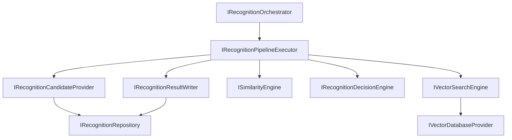
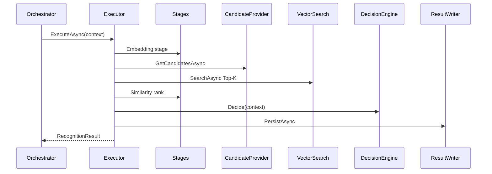

# AI20.PHASE2.3 — AI Recognition Engine & Vector Search Framework

**Milestone:** AI20.PHASE2.3 — scalable recognition with separated search, similarity, and decision stages.

## Objective

Implement a Recognition Engine capable of candidate retrieval, vector search, similarity scoring, recognition decision, and result generation — **without modifying** enrollment, embedding, storage, persistence, or worker framework.

```
Recognition Request
    ↓ Extract Embedding (IEmbeddingEngine / IFaceDetectionService)
    ↓ Candidate Retrieval (IRecognitionCandidateProvider)
    ↓ Vector Search (IVectorSearchEngine → IVectorDatabaseProvider)
    ↓ Similarity Evaluation (ISimilarityEngine)
    ↓ Recognition Decision (IRecognitionDecisionEngine)
    ↓ Result Writer (IRecognitionResultWriter)
    ↓ RecognitionResult
```

## Architecture



## Recognition Flow



## Search Flow

1. Candidate provider returns unranked embeddings filtered by strategy (tenant/course/session)
2. Vector search engine delegates to `IVectorDatabaseProvider`
3. Provider computes Top-K using configured similarity metric
4. Results returned as `RecognitionSearchResult` — no decision applied

## Decision Flow

1. Similarity engine ranks and normalizes scores
2. `RecognitionDecisionContext` built (immutable)
3. Decision engine applies `IRecognitionPolicy`:
   - Minimum confidence
   - Match/low-confidence distance thresholds
   - Tie detection
   - Duplicate handling (already-assigned students)
   - Manual review routing

## Vector Search Strategy

| Layer | Responsibility |
|-------|----------------|
| `IRecognitionCandidateProvider` | Scope filtering only |
| `IVectorSearchEngine` | Top-K orchestration |
| `IVectorDatabaseProvider` | Distance computation + ranking |
| `ISimilarityProvider` | Metric-specific distance/score |
| `ISimilarityEngine` | Post-search normalization |
| `IRecognitionDecisionEngine` | Threshold/policy decisions |

Current: PostgreSQL `real[]` embeddings with in-process Top-K (pgvector-ready abstraction).

## Pipeline Stages

| Stage | State transition |
|-------|------------------|
| Embedding | Pending → Searching |
| CandidateRetrieval | Searching |
| VectorSearch | Searching → Ranking |
| Similarity | Ranking → Evaluating |
| Decision | Evaluating → Recognized/Unknown/ManualReview |
| Persistence | → Completed |

## Configuration

```json
{
  "RecognitionEngine": {
    "DefaultTopK": 10,
    "MatchDistanceThreshold": 0.45,
    "LowConfidenceDistanceThreshold": 0.55,
    "MinimumConfidence": 55,
    "UnknownThreshold": 45,
    "TieThreshold": 0.02,
    "MaximumCandidates": 10000,
    "AutoAccept": true,
    "ManualReviewEnabled": true,
    "PipelineVersion": 1
  }
}
```

## Testing

| Test | Coverage |
|------|----------|
| `VectorSearch_ReturnsTopK_OrderedBySimilarity` | Top-K ordering |
| `SimilarityEngine_RanksMatchesDescending` | Ranking |
| `DecisionEngine_Recognizes_WhenWithinThreshold` | Happy path |
| `DecisionEngine_ReturnsUnknown_WhenNoMatches` | Unknown face |
| `DecisionEngine_ReturnsDuplicate_WhenStudentAlreadyAssigned` | Duplicate |
| `DecisionEngine_ReturnsTie_WhenTopCandidatesTooClose` | Tie-breaking |
| `DecisionEngine_ReturnsLowConfidence_InMiddleBand` | Threshold band |
| `CandidateProvider_UsesTenantStrategy_AsFallback` | Candidate retrieval |
| `Orchestrator_DelegatesToExecutor` | Orchestration |
| `VectorSearch_SupportsConcurrentRequests` | Concurrency |
| `VectorSearch_RespectsCancellation` | Cancellation |

## Files Created

See reuse analysis. Key additions:

- Application: 14 interfaces + `RecognitionModels.cs` + pipeline models + regression stubs
- Domain: `RecognitionPipelineState`, `RecognitionPipelineEvents`
- Infrastructure: Engine, orchestration, stages, repository, regression stubs
- Tests: `RecognitionEngineTests.cs`

## Files Modified

| File | Change |
|------|--------|
| `DependencyInjection.cs` | Recognition engine DI registrations |

## Verification Checklist

- [x] Recognition does not modify enrollment pipeline
- [x] `IEmbeddingEngine` reused for embedding stage
- [x] Candidate retrieval separated from vector search
- [x] Vector search separated from similarity scoring
- [x] Similarity scoring separated from decision making
- [x] Results persisted via dedicated `IRecognitionResultWriter`
- [x] All vector DB access behind `IVectorDatabaseProvider`
- [x] Future vector DB swap without architectural changes
- [x] Every stage independently testable and stateless
- [x] `ClassroomRecognitionPipeline` unchanged

## Future Work

- Wire `IRecognitionOrchestrator` into `ClassroomRecognitionPipeline` (migration phase)
- pgvector ANN index migration
- `RecognitionRegressionRunner` evaluation logic
- External ANN providers (FAISS, Qdrant, Milvus)
