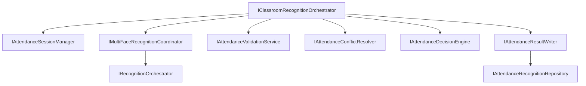
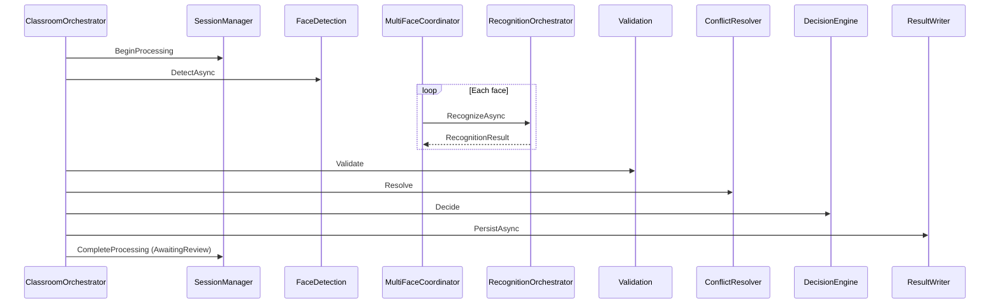

# AI20.PHASE2.4 — Classroom Recognition Orchestration & Attendance Decision Framework

**Milestone:** AI20.PHASE2.4 — convert recognition results into attendance decisions.

## Objective

Orchestrate classroom attendance processing: recognition results → validation → conflict resolution → attendance decision → persistence — **without modifying** enrollment, recognition engine, workers, or vector search.

```
Classroom Image
    ↓ Face Detection
    ↓ IMultiFaceRecognitionCoordinator → IRecognitionOrchestrator (per face)
    ↓ IAttendanceValidationService
    ↓ IAttendanceConflictResolver
    ↓ IAttendanceDecisionEngine
    ↓ IAttendanceResultWriter
    ↓ AttendanceSessionResult (AwaitingReview)
```

## Architecture



## Sequence Diagram



## Attendance Flow

| Step | Service | Output |
|------|---------|--------|
| Session load | `IAttendanceSessionManager` | `AttendanceSessionMetadata` |
| Face detection | `IFaceDetectionService` | `DetectedFaceDto[]` |
| Per-face recognition | `IMultiFaceRecognitionCoordinator` | `FaceRecognitionOutcome[]` |
| Validation | `IAttendanceValidationService` | Valid outcomes |
| Conflict resolution | `IAttendanceConflictResolver` | Resolved outcomes + conflicts |
| Decision | `IAttendanceDecisionEngine` | `AttendanceDecision[]` |
| Persistence | `IAttendanceResultWriter` | Updated recognitions + summary |

## Conflict Flow

| Conflict | Strategy |
|----------|----------|
| Duplicate student | `HighestConfidenceConflictStrategy` |
| Unknown face | `ManualReviewConflictStrategy` |
| Borderline confidence | `ManualReviewConflictStrategy` |
| Duplicate face | `ManualReviewConflictStrategy` |

## Session Lifecycle

| State | Meaning |
|-------|---------|
| `Created` | Session context initialized |
| `Detecting` | Loading image + face detection |
| `Recognizing` | Multi-face recognition dispatch |
| `Validating` | Business rule validation |
| `ResolvingConflicts` | Conflict resolution |
| `WritingAttendance` | Persisting decisions |
| `Completed` | Session moved to AwaitingReview |
| `Failed` / `Cancelled` | Terminal error states |

## Configuration

```json
{
  "ClassroomAttendance": {
    "MinimumConfidence": 55,
    "RequireTeacherApproval": true,
    "ManualReviewEnabled": true,
    "LateArrivalThreshold": "00:15:00",
    "AllowDuplicateStudents": false,
    "AllowReRecognition": true,
    "UnknownFaceThreshold": 45,
    "DefaultTopK": 10,
    "PipelineVersion": 1
  }
}
```

## Testing

| Test | Coverage |
|------|----------|
| `DecisionEngine_MarksPresent_WhenRecognizedWithConfidence` | Present decision |
| `DecisionEngine_MarksUnknown_WhenNoRecognitionDecision` | Unknown face |
| `DecisionEngine_MarksDuplicate_WhenSameStudentTwice` | Duplicate student |
| `ConflictResolver_DetectsDuplicateStudent` | Conflict detection |
| `ValidationService_RejectsEmptyOutcomes` | Validation rules |
| `MultiFaceCoordinator_DispatchesRecognitionPerFace` | Multi-face + ordering |
| `ManualReviewService_FlagsLowConfidence` | Manual review |

## Files Created

See reuse analysis. Key additions:

- Application: 11 interfaces + `ClassroomAttendanceModels.cs`
- Domain: `AttendanceSessionState`, `AttendanceSessionEvents`
- Infrastructure: Orchestrator, session manager, validation, conflict, decision, coordinator, repository, writer, analytics
- Tests: `ClassroomAttendanceFrameworkTests.cs`

## Files Modified

| File | Change |
|------|--------|
| `DependencyInjection.cs` | Classroom attendance DI registrations |

## Verification Checklist

- [x] `IRecognitionOrchestrator` unchanged
- [x] Recognition engine focused on AI inference only
- [x] Validation, conflict, decision, persistence isolated
- [x] Multi-face coordination independent of attendance policy
- [x] Business rules interface-driven (`IAttendancePolicy`)
- [x] Session context immutable
- [x] No attendance component accesses embeddings/vector search
- [x] All services stateless and independently testable
- [x] `ClassroomRecognitionPipeline` unchanged
- [x] Background workers unchanged

## Migration Note

`IClassroomRecognitionOrchestrator` is registered and ready. Wire into `ClassroomRecognitionBackgroundService` behind a feature flag in a future phase.
