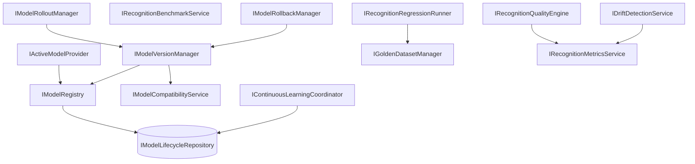

# AI20.PHASE2.5 — AI Model Lifecycle & Recognition Quality Framework

**Milestone:** AI20.PHASE2.5 — enterprise AI governance platform.

## Objective

Build model versioning, golden datasets, regression, benchmarking, drift detection, rollout, rollback, and quality monitoring — **without modifying** enrollment, recognition, attendance, workers, or pipeline executors.

```
Recognition Engine (frozen)
        ↓
IActiveModelProvider
        ↓
IModelRegistry / IModelVersionManager
        ↓
Recognition (runtime — future wire)
        ↓
IRecognitionQualityEngine
        ↓
IRecognitionMetricsService
```

## Architecture



## Lifecycle

| State | Meaning |
|-------|---------|
| `Draft` | Version created |
| `Testing` | Under validation |
| `Benchmarking` | Performance evaluation |
| `Approved` | Passed gates |
| `Canary` | Limited rollout |
| `Production` | Active model |
| `Deprecated` | Scheduled retirement |
| `Retired` | No longer used |
| `RolledBack` | Superseded by rollback |

## Rollout

Supported via `IModelRolloutPolicy`:

- Tenant rollout
- Percentage rollout
- Canary deployment
- Future: campus, department, feature flag, blue/green

`IModelRolloutManager` activates versions — never performs inference.

## Rollback

`IModelRollbackManager`:

1. Mark current version `RolledBack`
2. Deactivate all active versions
3. Activate target version as `Production`
4. Write audit entry with reason

## Regression

`IRecognitionRegressionRunner`:

- Loads golden dataset + model version
- Compares expected vs actual identities
- Produces `RecognitionRegressionReport`
- **Never deploys models**

## Benchmark

`IRecognitionBenchmarkService`:

- Independent of regression
- Reports precision, recall, FAR, FRR, Top-1, Top-5, latency, throughput
- Produces `RecognitionBenchmarkReport` (no persistence in report type)

## Quality Framework

`IRecognitionQualityEngine` aggregates:

- Daily / weekly / monthly `RecognitionQualitySummary`
- Accuracy, precision, recall, unknown %, manual review %

`IDriftDetectionService` (observational):

- Accuracy degradation
- Unknown rate trend
- False positive trend
- Severity + recommendation (no auto-correction)

## Continuous Learning

`IContinuousLearningCoordinator`:

- Queues teacher correction candidates
- Creates dataset candidates for future retraining
- **Never retrains models**

## Configuration

```json
{
  "ModelLifecycle": {
    "SupportedPipelineVersion": 1,
    "DefaultEmbeddingVersion": "insightface-1.0",
    "DefaultRecognitionVersion": "insightface-1.0",
    "DriftAccuracyThresholdPercent": 5,
    "DriftUnknownThresholdPercent": 10
  }
}
```

## Testing

| Test | Coverage |
|------|----------|
| `CompatibilityService_ApprovesMatchingVersions` | Compatibility |
| `CompatibilityService_FlagsUnsupportedPipeline` | Pipeline gate |
| `ActiveModelProvider_ReturnsProductionModel` | Active model |
| `VersionManager_ActivatesVersion_WhenCompatible` | Activation |
| `RollbackManager_RestoresPreviousVersion` | Rollback |
| `DriftDetection_ReportsSeverity_WhenThresholdExceeded` | Drift |
| `ContinuousLearning_QueuesCandidate_WithoutRetraining` | Learning queue |

## Files Created

See reuse analysis. Key additions:

- Domain: `AIModelState`, lifecycle entities, events
- Application: 15 interfaces + `ModelLifecycleModels.cs`
- Infrastructure: Registry, version manager, quality, rollout, repository
- Migration: `AddModelLifecycleTables`
- Tests: `ModelLifecycleFrameworkTests.cs`

## Files Modified

| File | Change |
|------|--------|
| `IApplicationDbContext.cs` / `ApplicationDbContext.cs` | Model lifecycle DbSets |
| `DependencyInjection.cs` | Lifecycle DI registrations |

## Verification Checklist

- [x] Recognition consumes models only through `IActiveModelProvider` (provider ready; engine unchanged)
- [x] Model registration independent of inference
- [x] Rollout/rollback never modify recognition logic
- [x] Golden datasets versioned and immutable
- [x] Regression independent of deployment
- [x] Benchmarking independent of regression
- [x] Drift detection observational only
- [x] Continuous learning queues candidates only
- [x] All lifecycle services stateless and testable
- [x] Enrollment, recognition, attendance, workers unchanged
