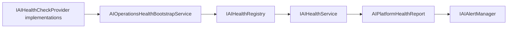
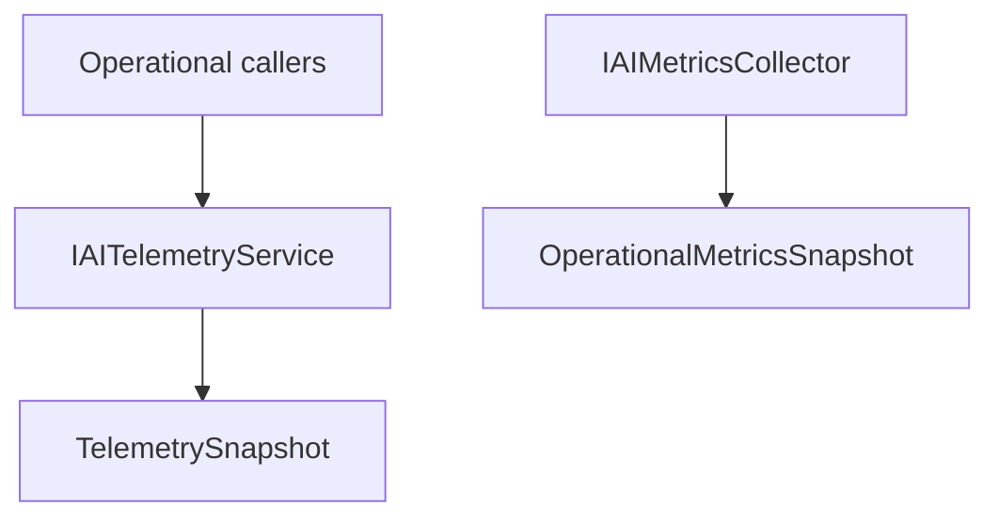
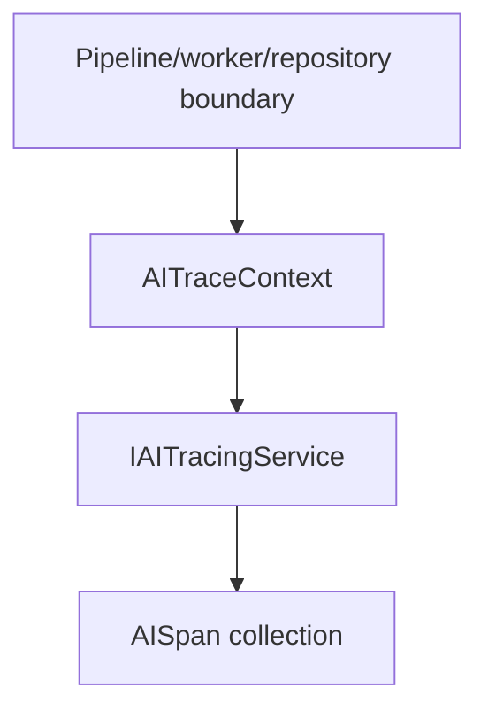

# AI20.PHASE2.6 — Enterprise AI Operations, Observability & Production Readiness

## Architecture

PHASE2.6 adds an observer-only operations layer across Application and Infrastructure:

```
Application/AIOperations          → immutable operational models + policies
Application/Common/Interfaces     → IAI* service contracts
Infrastructure/Operations         → stateless implementations + health providers
Infrastructure/DependencyInjection → AddAIOperationsPlatform()
```

Frozen domains (Enrollment, Recognition, Attendance, Governance, Workers) are **not modified**. Operations reads existing persistence and emits health, metrics, traces, alerts, and readiness reports.

## Health Flow



Supported statuses: **Ready**, **Live**, **Degraded**, **Maintenance**, **Offline**.

Registered providers:

- Recognition, Attendance, Enrollment, Workers
- Model Registry, Database, Storage, Vector Provider
- Background Jobs, Governance

## Telemetry Flow



Collected metrics (no PII):

- Recognition/Attendance/Embedding/VectorSearch durations
- Model load time, queue length, worker load
- CPU, memory, optional GPU

## Tracing Flow



`AITraceContext` fields: TraceId, CorrelationId, SessionId, WorkerId, TenantId, PipelineId, ParentSpanId, CurrentSpanId.

## Operational Dashboard

`IAIOperationalDashboardService` returns immutable `OperationalDashboardModel`:

- Current health and alerts
- Worker count, recognition/attendance TPS
- Queue depth, CPU, memory, storage
- Model and recognition versions

No UI in this phase — model only.

## Alerting

`IAIAlertManager` with `IAlertPolicy` supports:

- Critical / Warning / Information
- Escalation, suppression, maintenance windows (architecture hooks)

Alerts for health failure, worker failure, high latency, database/storage failure, queue overflow, drift — **no automatic repair**.

## Resilience

`IAIResilienceManager` centralizes policy types (Retry, Timeout, CircuitBreaker, Bulkhead, Fallback). Does **not** duplicate enrollment photo import retry (`ExternalPhotoImportPolicies`).

## Feature Flags

`IAIFeatureFlagProvider` + `IAIFeatureFlagPolicy` support tenant, campus, department, role, percentage, and environment evaluation. Ready for future LaunchDarkly/Azure App Configuration.

## Compliance

`IAIComplianceReporter` generates audit reports using aggregate counts only — no PII, images, embeddings, or vectors.

## Production Checklist

Run `IAIProductionVerificationService.VerifyAsync()` to produce `ProductionReadinessReport`:

| Check | Description |
|---|---|
| Health | Platform aggregate status |
| Database / Storage | Dependency health |
| Recognition / Attendance / Governance / Workers | Component health |
| Feature Flags | Critical flags enabled |
| Dependencies | Diagnostics dependency graph |
| Configuration | Configuration diagnostics present |

Pass/Fail with recommendations.

## Runbooks

`IOperationalRunbookService` provides architecture-only recovery steps for:

- Recognition failure, Worker failure, Storage failure
- Database failure, Model failure

## Capacity Planning

`IAICapacityPlanner` produces `CapacityPlanningReport` with peak/average volumes, resource trends, growth metrics, and architecture-only forecast note.

## Thread Safety

All services are stateless or use concurrent collections. Operational models are immutable records.

## Logging

Structured logging for health checks, alerts, diagnostics, feature evaluation, capacity reports, and production verification. Never logs images, embeddings, vectors, or PII.

## Modified Files

| File | Change |
|---|---|
| `Abhyanvaya.Domain/Enums/AIHealthStatus.cs` | Added |
| `Abhyanvaya.Domain/Events/AIOperationsEvents.cs` | Added |
| `Abhyanvaya.Application/AIOperations/AIOperationsModels.cs` | Added |
| `Abhyanvaya.Application/Common/Interfaces/IAIOperationsServices.cs` | Added |
| `Abhyanvaya.Infrastructure/Operations/*` | Added operations platform |
| `Abhyanvaya.Infrastructure/DependencyInjection.cs` | `AddAIOperationsPlatform()` |
| `Abhyanvaya.Application.UnitTests/Operations/OperationsFrameworkTests.cs` | Added |
| `docs/AI20_PHASE2_6_REUSE_ANALYSIS.md` | Added |
| `docs/AI20_PHASE2_6_ENTERPRISE_OPERATIONS.md` | Added |

## Verification

- Build: 0 errors
- Tests: operations framework unit tests
- Frozen layers unchanged: Recognition, Enrollment, Attendance, Governance, Workers
