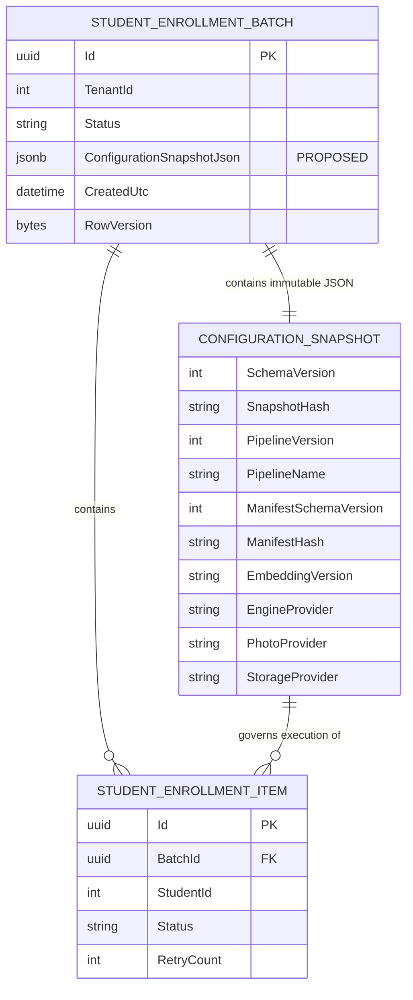

# AI20.PHASE2.0.20 — Enrollment Configuration Snapshot

**Type:** Architecture and contract design only. No production code, database schema, migration, worker, API, or UI change is implemented by this milestone.

**Status of proposed artifacts:** every C#, JSON, SQL, and Mermaid block below is illustrative documentation. In particular, `StudentEnrollmentBatch` currently has **no** configuration-snapshot property or column. `ConfigurationSnapshotJson` is a proposed future persistence addition.

---

## 0. Decision summary

Every enrollment batch must capture one immutable `ConfigurationSnapshot` during batch creation. The snapshot is the batch's complete, result-affecting effective configuration: resolved providers, model identity, numeric thresholds, validation gates, pinned pipeline and manifest identity, retry behavior, optional features, and future prompt identity.

The worker must deserialize and use the batch's frozen snapshot for every item. It must not re-resolve result-affecting values from live `appsettings`, environment variables, options monitors, or provider defaults after the batch has been created.

The recommended persistence is a versioned JSON document stored with `StudentEnrollmentBatch`, through a proposed `ConfigurationSnapshotJson` JSON/JSONB column. JSON is favored over a normalized related-table graph because this record is immutable, schema-evolving, read as a whole, and retained primarily for audit and replay. This recommendation is documentation-only; no column or migration is created here.

---

## 1. Why configuration history matters

Configuration is part of an AI result. Providers are swapped, thresholds are tuned, model artifacts are upgraded, optional stages are enabled, and retry behavior changes. A batch row that records only its status and timestamps cannot answer the operationally essential question:

> What exact settings produced this result six months ago?

Reading today's `appsettings` is not an answer because today's values may not be the values that governed the historical batch. It is also unsafe during execution: a configuration reload halfway through a large batch could otherwise make early and late items run under different rules while still appearing to belong to one run.

The snapshot provides four concrete capabilities:

### 1.1 Audit — prove what ran

The retained snapshot proves which photo, embedding, engine, storage, pipeline, manifest, retry, validation, threshold, feature-flag, AI-model, and prompt identities governed the batch. Audit views may display this non-secret record alongside the batch lifecycle trail. The snapshot identifies configuration; it does not contain images, vectors, credentials, or secret values.

### 1.2 Reproducibility — re-run historical behavior

A diagnostic replay can construct the same pipeline from the historical snapshot and re-run an item against the same result-affecting rules. Exact reproducibility also depends on retaining or being able to retrieve the identified model and pipeline artifacts; the snapshot supplies the immutable identities, versions, checksums/references, and parameters needed to request them.

A manual retry of an item **within the same batch** continues to use that batch's snapshot. An intentional run under current settings is a **new batch with a new snapshot**, not a mutation of the old batch.

### 1.3 Debugging — explain anomalous results

Support can compare an anomalous batch with a known-good batch and identify concrete differences: a lower blur threshold, another recognition threshold, a changed `EngineProvider`, a different `EmbeddingVersion`, a newly enabled optional stage, or changed retry timing. This replaces guesswork based on current global configuration.

### 1.4 Rollback — return to known-good behavior

A prior snapshot is a known-good configuration recipe. Rollback creates a **new** batch/configuration deployment based on that recipe; it never edits the historical snapshot or rewrites already-recorded outcomes. This aligns with `AI20.PHASE2.0.14`'s version-pinning and compensating-action strategy: rollback is forward-moving compensation under an explicitly selected prior version, not destructive history mutation.

---

## 2. Capture boundary and invariants

1. **Resolve once.** During `CreateBatchAsync`, resolve overrides, tenant settings, provider defaults, application configuration, pipeline manifest, and retry policy into one effective snapshot.
2. **Validate before acceptance.** Batch creation fails before work is queued if the effective snapshot is incomplete, references an unavailable required provider/stage, contains invalid thresholds, or cannot be serialized.
3. **Persist atomically.** The proposed snapshot document is inserted in the same transaction as the batch and its initial items. No executable batch may exist without exactly one valid snapshot.
4. **Freeze forever.** After insertion, the snapshot is never updated—not on start, retry, resume, completion, deployment, or live configuration reload. This is exactly parallel to batch version pinning in `AI20.PHASE2.0.14`.
5. **Read per batch, not per item from live config.** The worker loads the batch snapshot, validates `SchemaVersion`, and supplies it to every item execution and stage.
6. **Retain with history.** The snapshot remains available after success, partial failure, cancellation, and rollback for the same retention period as the batch audit record.
7. **Detect corruption.** A canonical SHA-256 `SnapshotHash` may be stored beside/in the document and verified when read. The hash is integrity metadata, not a secret and not a substitute for database access controls.

The persisted snapshot is the authority for what the batch **was instructed to run**. Per-item result metadata remains the authority for what an individual execution **actually produced**; for example, embedding output should still record actual `EngineProvider`, `EmbeddingVersion`, and model provenance as designed in `AI20_PHASE2_EMBEDDING_METADATA.md`.

---

## 3. Proposed `ConfigurationSnapshot` model

The vocabulary deliberately follows `AI20_PHASE2_EMBEDDING_METADATA.md`: `EmbeddingProvider`, `EmbeddingModel`, `EmbeddingVersion`, `EngineProvider`, and `NormalizationMethod` are explicit rather than collapsed into one ambiguous model string.

```csharp
// PROPOSED CONTRACT ONLY — does not exist in production code.
namespace Abhyanvaya.Application.Enrollment.Configuration;

public sealed record ConfigurationSnapshot
{
    public required int SchemaVersion { get; init; }
    public required DateTime CapturedUtc { get; init; }
    public required string SnapshotHash { get; init; }

    public required string EmbeddingProvider { get; init; }
    public required string EmbeddingModel { get; init; }
    public required string EmbeddingVersion { get; init; }
    public required string EngineProvider { get; init; }
    public required string NormalizationMethod { get; init; }
    public required string AiModelVersion { get; init; }
    public string? ModelChecksum { get; init; }

    public required ThresholdSnapshot Thresholds { get; init; }
    public required string PhotoProvider { get; init; }
    public required IReadOnlyDictionary<string, string> PhotoProviderSettings { get; init; }
    public required ValidationRulesSnapshot ValidationRules { get; init; }
    public required string StorageProvider { get; init; }
    public required IReadOnlyDictionary<string, string> StorageProviderSettings { get; init; }

    public required int PipelineVersion { get; init; }
    public required PipelineManifestReference PipelineManifest { get; init; }
    public required RetryPolicySnapshot RetryPolicy { get; init; }
    public required IReadOnlyDictionary<string, bool> FeatureFlags { get; init; }

    // Reserved now so prompt-based future stages remain reproducible.
    public string? FuturePromptVersion { get; init; }
}

public sealed record ThresholdSnapshot
{
    public required float RecognitionMatchDistanceThreshold { get; init; }
    public required float RecognitionLowConfidenceDistanceThreshold { get; init; }
    public float? MinimumCompositeQualityScore { get; init; }
    public required float DetectionThreshold { get; init; }
    public required float NmsThreshold { get; init; }
}

public sealed record ValidationRulesSnapshot
{
    public required bool RequireExactlyOneFace { get; init; }
    public required int MinimumSourceWidth { get; init; }
    public required int MinimumSourceHeight { get; init; }
    public required int MinimumFaceWidth { get; init; }
    public required int MinimumFaceHeight { get; init; }
    public required string BlurMethod { get; init; }
    public required double BlurThreshold { get; init; }
    public required double MaximumAbsoluteYawDegrees { get; init; }
    public required double MaximumAbsolutePitchDegrees { get; init; }
    public required double MaximumAbsoluteRollDegrees { get; init; }
    public required bool CompositeQualityIsAdvisory { get; init; }
    public required IReadOnlyDictionary<string, double> CompositeQualityWeights { get; init; }
}

public sealed record PipelineManifestReference
{
    public required string PipelineName { get; init; }
    public required int PipelineVersion { get; init; }
    public required int ManifestSchemaVersion { get; init; }
    public required string ManifestHash { get; init; }
}

public sealed record RetryPolicySnapshot
{
    public required string PolicySetVersion { get; init; }
    public required IReadOnlyDictionary<string, string> StagePolicyNames { get; init; }
    public required int MaxAutomaticRetries { get; init; }
    public required int MaximumAutomaticAttempts { get; init; }
    public required TimeSpan RetryWindow { get; init; }
    public required string BackoffStrategy { get; init; }
    public required TimeSpan BaseDelay { get; init; }
    public required TimeSpan MaxDelay { get; init; }
    public required int MaximumConsecutiveImmediateRetries { get; init; }
    public required RetryBudgetSnapshot BatchBudget { get; init; }
    public required IReadOnlyDictionary<string, int> StageBudgetCosts { get; init; }
    public required IReadOnlyList<string> AutomaticRetrySafetyFloor { get; init; }
    public required bool ScheduledRetryHonorsRetryAfter { get; init; }
    public required StageInvocationRetrySnapshot LowLevelPhotoImport { get; init; }
}

public sealed record RetryBudgetSnapshot
{
    public required int CapacityTokens { get; init; }
    public required int RefillTokens { get; init; }
    public required TimeSpan RefillInterval { get; init; }
    public required int LifetimeSpendCeilingTokens { get; init; }
}

public sealed record StageInvocationRetrySnapshot
{
    public required int MaxRetriesWithinAttempt { get; init; }
    public required IReadOnlyList<int> BackoffSeconds { get; init; }
    public required IReadOnlyList<string> RetryableConditions { get; init; }
}
```

`EmbeddingProvider` is the configured provider selection used to resolve an embedding implementation. `EngineProvider` is the engine/provenance identity that the selected implementation declares and that comparability checks use. They commonly match (`InsightFace` today), but retaining both detects factory aliases or a provider implementation that resolves to a different underlying engine.

`AiModelVersion` is the model/vendor artifact version actually selected for AI inference. `EmbeddingVersion` is the platform-owned, comparable embedding identity defined by `AI20_PHASE2_EMBEDDING_METADATA.md`; they are intentionally not synonyms.

`FuturePromptVersion` is nullable because current enrollment stages are ONNX/algorithm based. It is reserved now because a future prompt-based quality, classification, or review stage can change behavior when only prompt text changes. Capturing its stable registry/version identifier avoids a future reproducibility gap without pretending such a stage exists today. Prompt text itself need not be copied into every snapshot if a versioned, immutable prompt registry retains it.

---

## 4. Field catalog and source mapping

| Field | Type | Effective source | Result-affecting? | Notes |
|---|---|---|---|---|
| `SchemaVersion` | `int` | Snapshot serializer contract | Yes, for interpretation | Starts at a documented version such as `1`; selects the tolerant reader/upcaster. |
| `CapturedUtc` | `DateTime` (UTC) | Batch-creation clock | No | Records when resolution occurred; immutable audit metadata. |
| `SnapshotHash` | `string` | SHA-256 of canonical snapshot JSON excluding the hash field | No | Optional integrity verification and equality comparison. |
| `EmbeddingProvider` | `string` | Resolved `Embedding:DefaultProvider` / `IEmbeddingProviderFactory` | Yes | Current configured value is `InsightFace`; use provider vocabulary from `EmbeddingProviders`. |
| `EmbeddingModel` | `string` | Resolved `IEmbeddingGenerator.ModelName` / model config | Yes | Current artifact family is grounded in `InsightFace:RecognitionModelFile` (`w600k_r50.onnx`). |
| `EmbeddingVersion` | `string` | Platform embedding identity composition | Yes | Exact vocabulary and compatibility token from `AI20_PHASE2_EMBEDDING_METADATA.md`, e.g. `insightface-r50-v1.0`. |
| `EngineProvider` | `string` | Resolved `IEmbeddingGenerator.ProviderName` | Yes | Provenance/comparability interlock; currently `InsightFace`. |
| `NormalizationMethod` | `string` | Resolved embedding normalization implementation/config | Yes | Currently L2 per the engine design; changing it can change vector comparability. |
| `AiModelVersion` | `string` | Provider/model artifact release metadata | Yes | Raw model/vendor version, distinct from platform `EmbeddingVersion`. |
| `ModelChecksum` | `string?` | SHA-256 of loaded model artifact | Yes | Detects silent model binary replacement under unchanged names; nullable only until artifact hashing is available. |
| `Thresholds.RecognitionMatchDistanceThreshold` | `float` | `Recognition:MatchDistanceThreshold` | Yes | Current app configuration is `0.45`; snapshot freezes the resolved value rather than exposing a UI constant. |
| `Thresholds.RecognitionLowConfidenceDistanceThreshold` | `float` | `Recognition:LowConfidenceDistanceThreshold` | Yes | Current app configuration is `0.55`. |
| `Thresholds.MinimumCompositeQualityScore` | `float?` | Effective enrollment quality policy | Yes when configured | Null means advisory-only quality. Phase 1 UI correctly says **Configured**; the actual numeric value belongs here. |
| `Thresholds.DetectionThreshold` | `float` | `InsightFace:DetectionThreshold` | Yes | Current app configuration is `0.5`. |
| `Thresholds.NmsThreshold` | `float` | `InsightFace:NmsThreshold` | Yes | Current app configuration is `0.4`. |
| `PhotoProvider` | `string` | Batch override, else `StudentPhotoProvider:DefaultProvider` resolved by factory | Yes | Current provider is `ExamBranch`; record the resolved provider, not merely the default key. |
| `PhotoProviderSettings` | `IReadOnlyDictionary<string,string>` | Safe, result-affecting provider settings | Yes | Example: sanitized base URL template and timeout (`15` seconds). Never include credentials, signed query strings, or tokens. |
| `ValidationRules` | structured record | Effective enrollment validator options | Yes | Freezes exactly-one-face, `640×480` source floor, `112×112` face floor, calibrated blur threshold/method, pose limits, and quality weights from `AI20_ENROLLMENT_ENGINE.md`. |
| `StorageProvider` | `string` | Resolved `Media:Provider`, with current legacy `Branding:Provider` fallback | Yes | Current effective vocabulary is `local` or `s3` (including S3-compatible R2). |
| `StorageProviderSettings` | `IReadOnlyDictionary<string,string>` | Safe provider routing/format settings | Yes when bytes/keys differ | May include non-secret region, endpoint identity, bucket alias, force-path-style, key-layout/encoding version; never access keys or connection strings. |
| `PipelineVersion` | `int` | Version registry/manifest selected at batch creation | Yes | The monotonic integer pin from `AI20.PHASE2.0.14`; do not substitute the later Active value. |
| `PipelineManifest.PipelineName` | `string` | Effective manifest from `AI20.PHASE2.0.16` | Yes | Stable manifest selection key, currently `StudentEnrollment`. |
| `PipelineManifest.PipelineVersion` | `int` | Effective manifest from `AI20.PHASE2.0.16` | Yes | Must equal the root batch `PipelineVersion`. |
| `PipelineManifest.ManifestSchemaVersion` | `int` | Manifest `SchemaVersion` from `AI20.PHASE2.0.16` | Yes, for interpretation | Versions the manifest schema independently of the pipeline and snapshot schemas. |
| `PipelineManifest.ManifestHash` | `string` | Canonical manifest hash from `AI20.PHASE2.0.16` | Yes | Detects content drift under a reused manifest version. |
| `RetryPolicy` | structured record | Effective policy set from `AI20.PHASE2.0.17` plus manifest stage references | Yes | Freezes policy-set version, canonical per-stage names, item/window/backoff limits, calculated batch token budget, stage costs, safety floor, scheduling behavior, and separate low-level photo retry. |
| `FeatureFlags` | `IReadOnlyDictionary<string,bool>` | Manifest optional-stage resolution + feature configuration | Yes | Records enabled/disabled optional stages such as `Liveness`, `Mask`, `Occlusion`, `Spoof`, `FaceQualityRanking`, `FaceNormalization`, and `DuplicateDetection`. |
| `FuturePromptVersion` | `string?` | Future prompt registry / manifest stage config | Yes when present | Reserved nullable identity for prompt-based stages; null means no prompt-governed stage participated. |

The initial values above describe the current configuration and design precedents, not new defaults. Most enrollment validation options are not implemented/configured yet; an implementation milestone must make them explicit and calibrated before it can create an executable snapshot.

---

## 5. Example persisted JSON

This example shows the proposed serialized document. Values are illustrative but grounded in current app configuration and enrollment design; the calculated retry-budget values illustrate a 1,000-student batch under `AI20.PHASE2.0.17`'s recommended formulas. `blurThreshold` and pose limits require real-photo calibration before implementation; their presence demonstrates that the **resolved numeric values**, not prose such as "configured," are frozen.

```json
{
  "schemaVersion": 1,
  "capturedUtc": "2026-07-16T11:30:00Z",
  "snapshotHash": "sha256:8f55c72a8f7d9d8cf4e413a54ff7d2c998028f062b6bdfe02f7dbd55a5a4d3e1",
  "embeddingProvider": "InsightFace",
  "embeddingModel": "w600k_r50",
  "embeddingVersion": "insightface-r50-v1.0",
  "engineProvider": "InsightFace",
  "normalizationMethod": "L2",
  "aiModelVersion": "1.0",
  "modelChecksum": "sha256:MODEL_ARTIFACT_HASH",
  "thresholds": {
    "recognitionMatchDistanceThreshold": 0.45,
    "recognitionLowConfidenceDistanceThreshold": 0.55,
    "minimumCompositeQualityScore": null,
    "detectionThreshold": 0.5,
    "nmsThreshold": 0.4
  },
  "photoProvider": "ExamBranch",
  "photoProviderSettings": {
    "baseUrlTemplate": "https://exambranch.example/PHOTOS/{collegeCode}/{academicYear}/{studentNumber}.jpg",
    "timeoutSeconds": "15"
  },
  "validationRules": {
    "requireExactlyOneFace": true,
    "minimumSourceWidth": 640,
    "minimumSourceHeight": 480,
    "minimumFaceWidth": 112,
    "minimumFaceHeight": 112,
    "blurMethod": "VarianceOfLaplacian",
    "blurThreshold": 100.0,
    "maximumAbsoluteYawDegrees": 25.0,
    "maximumAbsolutePitchDegrees": 25.0,
    "maximumAbsoluteRollDegrees": 25.0,
    "compositeQualityIsAdvisory": true,
    "compositeQualityWeights": {
      "detection": 0.30,
      "faceArea": 0.20,
      "sharpness": 0.30,
      "pose": 0.20
    }
  },
  "storageProvider": "s3",
  "storageProviderSettings": {
    "service": "CloudflareR2",
    "region": "auto",
    "endpointHost": "tenant.r2.cloudflarestorage.com",
    "bucketAlias": "student-media",
    "forcePathStyle": "true",
    "keyLayoutVersion": "students-v1"
  },
  "pipelineVersion": 1,
  "pipelineManifest": {
    "pipelineName": "StudentEnrollment",
    "pipelineVersion": 1,
    "manifestSchemaVersion": 1,
    "manifestHash": "sha256:MANIFEST_CANONICAL_HASH"
  },
  "retryPolicy": {
    "policySetVersion": "AI20.PHASE2.RETRY.v1",
    "stagePolicyNames": {
      "Download": "TransientNetworkPolicy",
      "Validation": "NeverRetryPolicy",
      "Storage": "TransientStoragePolicy",
      "Embedding": "TransientEnginePolicy",
      "ResultWrite": "TransientDbPolicy"
    },
    "maxAutomaticRetries": 3,
    "maximumAutomaticAttempts": 4,
    "retryWindow": "1.00:00:00",
    "backoffStrategy": "CappedExponentialFullJitter",
    "baseDelay": "00:00:30",
    "maxDelay": "00:30:00",
    "maximumConsecutiveImmediateRetries": 1,
    "batchBudget": {
      "capacityTokens": 250,
      "refillTokens": 10,
      "refillInterval": "01:00:00",
      "lifetimeSpendCeilingTokens": 500
    },
    "stageBudgetCosts": {
      "Download": 1,
      "Validation": 2,
      "Storage": 2,
      "Embedding": 3,
      "ResultWrite": 3
    },
    "automaticRetrySafetyFloor": [
      "PhotoNotFound",
      "AccessDenied",
      "InvalidImage",
      "CorruptImage",
      "NoFaceDetected",
      "MultipleFacesDetected",
      "BlurRejected",
      "LowResolutionRejected"
    ],
    "scheduledRetryHonorsRetryAfter": true,
    "lowLevelPhotoImport": {
      "maxRetriesWithinAttempt": 3,
      "backoffSeconds": [2, 4, 8],
      "retryableConditions": [
        "HttpRequestException",
        "TaskCanceledException",
        "Http5xx",
        "TooManyRequests"
      ]
    }
  },
  "featureFlags": {
    "Liveness": false,
    "Mask": false,
    "Occlusion": false,
    "Spoof": false,
    "FaceQualityRanking": false,
    "FaceNormalization": false,
    "DuplicateDetection": false
  },
  "futurePromptVersion": null
}
```

No secret-shaped field is present. The example uses endpoint identity and a bucket alias, never access keys, secret keys, authorization headers, signed URLs, database/Redis connection strings, or JWT material.

---

## 6. Persistence recommendation: JSON document on the batch

### 6.1 Recommended shape

Add, in a future implementation milestone, one required immutable JSON/JSONB document associated 1:1 with the batch:

```csharp
// PROPOSED ENTITY ADDITION ONLY — do not add in this documentation milestone.
public string ConfigurationSnapshotJson { get; private set; } = null!;
```

Illustrative storage intent only:

```sql
-- PROPOSED SCHEMA ONLY — no migration is created by this milestone.
ALTER TABLE "StudentEnrollmentBatches"
ADD COLUMN "ConfigurationSnapshotJson" jsonb NOT NULL;
```

The application contract should expose a typed `ConfigurationSnapshot`; the serialized JSON string is a persistence detail. A future implementation may use an EF value converter/owned JSON mapping instead of a raw string while preserving the same architecture.

### 6.2 Why JSON is favored

- **Immutable aggregate document:** the snapshot is created and consumed as one unit; independent row updates are neither needed nor allowed.
- **Schema evolution:** new providers, optional stages, retry parameters, and future prompt metadata can be added without a table/column migration for every field.
- **Historical fidelity:** each old document retains the exact shape captured by its `SchemaVersion`.
- **Atomicity and locality:** storing with the batch naturally participates in the batch-creation transaction and avoids a missing/orphan related row.
- **Audit export:** one self-contained non-secret JSON document is straightforward to hash, retain, compare, and export.

### 6.3 Why not a normalized related table

A normalized `ConfigurationSnapshot` table plus child tables for thresholds, validation rules, retry parameters, and feature flags creates many joins and migration pressure for a record that is never partially updated and is almost always read as a whole. Normalization becomes attractive only if the product later requires high-volume relational queries over individual snapshot properties. If that need appears, promote selected searchable values to generated/indexed columns or an analytics projection while retaining the immutable JSON as the audit source of truth.

The conceptual 1:1 snapshot below does **not** assert that a physical snapshot table exists; under the recommendation it is represented by the proposed JSON document on `StudentEnrollmentBatch`.

---

## 7. Snapshot schema versioning and tolerant reading

`SchemaVersion` versions the **snapshot document contract**, not the AI pipeline. It is separate from the integer `PipelineVersion`, `ManifestSchemaVersion`, `EmbeddingVersion`, `AiModelVersion`, and `FuturePromptVersion`.

Reader rules:

1. Writers emit only the current schema version.
2. Readers accept all supported historical versions and deserialize missing newly-added optional fields to documented semantics.
3. A deterministic upcaster may convert an old in-memory shape to the current typed model for execution or display, but it must never overwrite the stored historical JSON.
4. Additive fields should be preferred. Renames or semantic changes require a new `SchemaVersion` and an explicit upcaster.
5. Unknown additive properties are ignored/preserved according to serializer policy; an unknown **newer major schema** fails closed for execution with a clear unsupported-snapshot error.
6. If an old snapshot cannot supply a newly mandatory result-affecting field, it remains readable for audit but is not silently replayed with a live/default value. Replay requires an explicit, audited compatibility decision or a new batch.
7. Database migrations may change how the JSON is stored or indexed, but should not rewrite historical snapshot meaning.

This separation lets an old batch remain readable after application upgrades while ensuring a replay never quietly substitutes current values for missing historical ones.

---

## 8. Secret hygiene and data classification

The snapshot captures provider **names**, versions, checksums, non-secret routing identities, and result-affecting parameters. It must **never** capture secret values.

Explicitly prohibited:

- API keys, access keys, secret keys, passwords, client secrets, bearer tokens, cookies, or authorization headers;
- database, Redis, or storage connection strings;
- signed URLs or URL query strings containing credentials;
- private key material;
- raw image bytes, aligned face bytes, or embedding vectors.

Safe examples include `InsightFace`, `ExamBranch`, `s3`, a model filename/version/checksum, non-secret region, endpoint host, bucket alias, timeout, threshold, and key-layout version. When a provider needs credentials, the snapshot may record a non-sensitive credential **reference identity/version** such as `exambranch-prod-v3` only if that identifier itself grants no access. The worker resolves the current secret material through the secret store at connection time; secret rotation does not mutate the snapshot.

Snapshot construction must use an explicit allowlist of safe fields. It must not serialize arbitrary `IConfiguration`, options objects, environment variables, or provider objects, because those can contain secrets (the current application configuration includes connection, JWT, and S3 credential fields).

---

## 9. Frozen snapshot versus live configuration

The decision boundary is whether a setting can change the durable business result, stage path, classification, generated artifact, or retry disposition.

| Snapshot-governed: worker must use frozen value | May remain live: operational only |
|---|---|
| Provider selection and safe result-affecting provider parameters | Log level and log sink routing |
| Embedding/AI model identity, artifact checksum, dimension, normalization | Metrics exporter endpoint and sampling of non-audit telemetry |
| Recognition, detection, NMS, blur, quality, pose, liveness, duplicate, and other gate thresholds | Health-check cadence |
| Exactly-one-face and all validation rules | Dashboard refresh interval |
| Storage provider and artifact/key/encoding behavior | Worker heartbeat interval when it cannot alter retry/claim semantics |
| Pinned integer `PipelineVersion` and effective manifest identity/hash | Purely diagnostic memory warnings |
| Retry classification, attempt cap, timeout, and backoff | Host shutdown grace period, subject to normal safe checkpointing |
| Enabled optional stages / feature flags | UI presentation preferences |
| `FuturePromptVersion` when a prompt stage participates | Non-result-affecting tracing verbosity |

Operational settings may remain live only if changing them cannot alter which items succeed/fail, the bytes/vectors produced, item classification, or durable retry history. Concurrency and scheduling controls need deliberate classification: if changing them can affect deterministic outcomes, rate-limit behavior, claim timeouts, or retry disposition, they belong in the snapshot; otherwise they may remain operational.

At execution, a worker must not call `IOptionsMonitor.CurrentValue` or `IConfiguration` for snapshot-governed settings. Provider factories may still resolve an implementation by the **frozen provider name**, but must not replace that name with the current default.

---

## 10. Relationship to pipeline version, manifest, and retry policy

### 10.1 `AI20.PHASE2.0.14` — pipeline version pinning

`ConfigurationSnapshot.PipelineVersion` is the natural home for the monotonic integer version to which the batch is pinned. The worker selects the implementation compatible with that pinned version for every item, including automatic and manual retries in the same batch. A global Active-version change affects only batches created after the change. If `AI20.PHASE2.0.14` later also adds its proposed dedicated `StudentEnrollmentBatch.PipelineVersion` column for indexing/grouping, that value and the snapshot value must be written atomically and must match; the snapshot remains the broader effective-configuration authority.

Rollback uses a new batch whose new immutable snapshot intentionally references the prior known-good `PipelineVersion` and associated configuration. This preserves the compensating-action model: history stays intact, and the rollback action is itself auditable.

### 10.2 `AI20.PHASE2.0.16` — pipeline manifest

The manifest is part of effective configuration. The snapshot stores the manifest's `PipelineName`, integer `PipelineVersion`, manifest `SchemaVersion`, and a canonical `ManifestHash`. The manifest's integer version must equal the batch pin; the hash proves the exact **effective composed manifest** content (base plus tenant/college override and plugin fragments) and detects accidental mutation under a reused version. `FeatureFlags` records the resolved enabled/disabled state of optional stages, rather than requiring a historical reader to recompute it from today's environment.

If the manifest itself is stored in an immutable registry, the version/hash reference is sufficient. If registry retention cannot be guaranteed, the snapshot should additionally embed a safe canonical manifest subset required for replay.

### 10.3 `AI20.PHASE2.0.17` — retry policy

The snapshot records the effective retry policy-set version, each manifest stage's canonical named policy, and all resolved parameters. A name alone is insufficient if operators can later edit the policy under the same name. The frozen pipeline-level data includes `MaxAutomaticRetries = 3`, `MaximumAutomaticAttempts = 4`, the retry window, capped-exponential/full-jitter base and maximum delay, the **calculated numeric batch token budget**, stage token costs, safety-floor classifications, immediate-retry cap, and scheduled `Retry-After` behavior.

The snapshot also records low-level `ExternalPhotoImportPolicies` behavior separately (currently three in-call retries at `2/4/8` seconds for network/5xx/429 conditions). Per `AI20.PHASE2.0.17`, those calls remain inside one Download attempt and do not consume `RetryCount`, a new `PipelineExecutionId`, or pipeline retry-budget tokens. They must not be conflated with durable whole-item retry.

Retries within a batch therefore do not adopt a newly tuned global retry policy. To intentionally test the new policy, create a new batch and snapshot.

---

## 11. ER diagram — documentation-only proposed relationship



`CONFIGURATION_SNAPSHOT` is a conceptual document boundary in this diagram. Under the recommended design it is not a separate relational table; its fields are serialized into the proposed JSON/JSONB column on `STUDENT_ENROLLMENT_BATCH`.

---

## 12. Lifecycle diagram

```mermaid
flowchart LR
    REQUEST["SuperAdmin creates batch"] --> RESOLVE["Resolve effective configuration<br/>overrides + tenant settings + defaults"]
    RESOLVE --> VALIDATE["Validate providers, versions,<br/>manifest, rules, and policy"]
    VALIDATE --> CAPTURE["Capture ConfigurationSnapshot<br/>with SchemaVersion + hash"]
    CAPTURE --> TX["Atomically persist batch,<br/>snapshot, and items"]
    TX --> FROZEN["Snapshot frozen forever"]
    FROZEN --> ITEM1["Item 1 reads frozen snapshot"]
    FROZEN --> ITEMN["Every later/retried item<br/>reads same frozen snapshot"]
    ITEM1 --> EXECUTE["Execute pinned pipeline,<br/>manifest, rules, flags, and retry policy"]
    ITEMN --> EXECUTE
    EXECUTE --> COMPLETE["Batch completes, partially fails,<br/>or is cancelled"]
    COMPLETE --> RETAIN["Retain snapshot with batch"]
    RETAIN --> USES["Audit · reproduce · debug · rollback<br/>(rollback creates a new batch)"]

    LIVE["Later live-config changes"] -. "do not mutate or govern" .-> FROZEN
```



---

## 13. Operational and security checks

- Emit the `BatchId`, `SchemaVersion`, `SnapshotHash`, integer `PipelineVersion`, `PipelineName`, `ManifestSchemaVersion`, `ManifestHash`, and non-secret provider/model identities in structured audit events; do not emit the entire JSON by default.
- Verify the snapshot hash and supported schema before claiming the first item. Treat corruption or unsupported execution schema as a batch-level fail-closed condition, not an invitation to use live defaults.
- Cache the parsed snapshot per batch for performance only if the cached object is immutable and keyed by `BatchId` + `SnapshotHash`.
- Validate that the selected runtime implementation declares compatibility with the pinned pipeline/manifest/model identity.
- Compare per-item actual embedding provenance with the snapshot expectation. A mismatch is an auditable configuration-drift failure, not a successful result.
- Apply database authorization and retention controls to snapshot JSON because provider topology and threshold policy are operationally sensitive even though secrets are forbidden.
- Redact or reject prohibited keys during snapshot construction and test the allowlist against connection strings, JWT keys, S3 credentials, signed URLs, and provider tokens.

---

## 14. Alternatives and consequences

| Decision | Consequence |
|---|---|
| Immutable snapshot at batch creation | Strong within-batch consistency; configuration changes require a new batch, which is intentional and auditable. |
| JSON on/with the batch | Easy evolution and whole-record reads; ad hoc SQL over nested fields is less convenient than normalized columns. |
| `SchemaVersion` + tolerant readers | Old batches remain readable; readers/upcasters must be maintained for the audit-retention window. |
| Manifest pipeline/schema identity **and** effective-content hash | Detects mutable/reused labels and composed-override drift; requires canonical serialization/hash rules. |
| Policy name/version **and** parameters | Enables replay even if the named policy later changes; increases snapshot size slightly. |
| Explicit feature-flag map | Proves which optional stages ran; new flags are naturally additive. |
| Secret allowlist | Safe audit persistence; exact credential material is intentionally outside reproducibility and remains secret-store governed. |
| New batch for rollback/current-config retry | Preserves history and clean attribution; operators cannot silently repurpose an old batch. |

---

## Constraints Confirmed

- Exactly one deliverable is produced: `docs/AI20_PHASE2_CONFIGURATION_SNAPSHOT.md`.
- This is architecture/documentation only. No `.cs`, `.csproj`, `.tsx`, `.ts`, configuration, production code, or other non-markdown file is created or modified.
- `StudentEnrollmentBatch` is accurately treated as having **no current configuration-snapshot property or column**.
- `ConfigurationSnapshotJson`, its JSON/JSONB column, and all C#/SQL shapes are explicitly **proposed future design only**; no migration or schema change is implemented.
- The snapshot is immutable, schema-versioned, secret-free, captured atomically at batch creation, and used instead of live result-affecting configuration throughout item execution.
- The design forward-references and aligns with pipeline pinning (`AI20.PHASE2.0.14`), pipeline manifest identity (`AI20.PHASE2.0.16`), and effective retry policy (`AI20.PHASE2.0.17`).
- The required field table, C# model, example JSON, ER diagram, lifecycle diagram, four configuration-history enablers, storage decision, versioning, secret hygiene, and frozen-vs-live rules are included.
