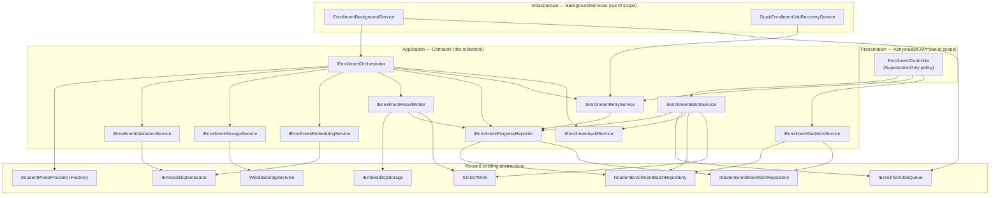
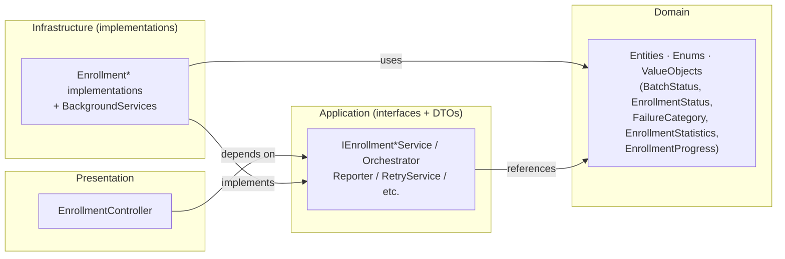

# AI20.PHASE2.0.1 — Enrollment Engine Contracts

**Type:** Contract/interface design only. No production code was written or modified to produce this document. No business logic, HTTP endpoints, background worker, database update, or image processing is implemented here — only the interfaces, DTOs, enums, and orchestration contracts that establish the Clean Architecture boundary for Phase 2.

**Status of the code blocks below:** every C# block is a **proposed** contract that does not yet exist in the codebase. They are the design artifact of this milestone, not committed code.

---

## 0. Design principles (carried from Phase 1)

Every contract below obeys the conventions already established in `Abhyanvaya.Application/Common/Interfaces/`:

1. **Interfaces + DTOs live in `Abhyanvaya.Application`; implementations live in `Abhyanvaya.Infrastructure`.** Domain enums/value objects (`BatchStatus`, `EnrollmentStatus`, `FailureCategory`, `EnrollmentStatistics`, `EnrollmentProgress`) already exist in `Abhyanvaya.Domain` and are reused unchanged.
2. **Expected failures never throw.** Mirroring `IStudentPhotoProvider.FetchPhotoAsync`/`StudentPhotoFetchResult`, any outcome the pipeline can reasonably expect (photo missing, no face, blur, storage hiccup) is returned as a *result object carrying a `FailureCategory`*, so callers classify retry-vs-terminal without depending on exception types. Only genuinely unexpected/programmer errors throw.
3. **All async methods take a trailing `CancellationToken cancellationToken = default`.**
4. **DTOs are `sealed record` with `required`/`init` members**, matching `EmbeddingGenerationRequest`, `StudentPhotoFetchRequest`, etc.
5. **The AI engine stays storage-agnostic and persistence-agnostic** (the AI18/AI19 rule): validation/embedding services produce values; only `IEnrollmentResultWriter` and `IEnrollmentProgressReporter` touch the database, and only `IEnrollmentStorageService` touches object storage.
6. **Tenant scoping is ambient**, set by the worker (`ITenantContextAccessor`, per `AI20_ENROLLMENT_BACKGROUND.md` §1) before any scoped service runs; contracts pass `TenantId` explicitly only where a method is called outside a tenant-scoped request (e.g. the recovery sweep, cross-tenant SuperAdmin reads).

---

## 1. Contract catalog (overview)

| # | Interface | Layer of caller | One-line responsibility | Touches DB? | Touches storage/engine? |
|---|---|---|---|---|---|
| 1 | `IEnrollmentBatchService` | API controller | Create/cancel/resume a batch; the command surface | Yes (tx) | No |
| 2 | `IEnrollmentOrchestrator` | Background worker | Run one claimed item through the full pipeline | Via #3/#9 only | Via #6/#7/#8 only |
| 3 | `IEnrollmentProgressReporter` | #1, #2, recovery | Atomic status transition + denormalized counter update; read `EnrollmentProgress` | Yes (tx) | No |
| 4 | `IEnrollmentRetryService` | API, recovery | Classify failure→retry/terminal; manual bulk retry; stuck reset | Yes (tx) | No |
| 5 | `IEnrollmentStatisticsService` | API controller | Read-model aggregation + speed metrics for dashboards | Read-only | No |
| 6 | `IEnrollmentValidationService` | #2 | Strict single-face / blur / resolution / pose gate + quality score | No | Engine (read) |
| 7 | `IEnrollmentStorageService` | #2 | Persist the enrollment photo to R2; return deterministic key | No | Storage |
| 8 | `IEnrollmentEmbeddingService` | #2 | Generate + normalize the 512-d embedding for the approved face | No | Engine |
| 9 | `IEnrollmentResultWriter` | #2 | Transactionally finalize an item (embedding row + Student.PhotoKey + item + counters) | Yes (tx) | No |
| 10 | `IEnrollmentAuditService` | #1, #2, #4 | Structured audit of every lifecycle action; never logs image bytes | Append-only log | No |

**Reused, not redesigned** (already exist): `IStudentPhotoProvider` + `IStudentPhotoProviderFactory` (download), `IEmbeddingGenerator` (embedding math), `IMediaStorageService` (R2 write), `IEmbeddingStorage`/`StudentFaceEmbedding` (embedding persistence precedent), `IStudentEnrollmentBatchRepository`/`IStudentEnrollmentItemRepository` (reads), `IUnitOfWork` (transactions), `IEnrollmentJobQueue` (wake signal, designed in `AI20_ENROLLMENT_BACKGROUND.md` §3.1), `ICurrentUserService` (actor identity).

---

## 2. Shared DTOs and enums

These are consumed by more than one interface, so they are defined once here.

```csharp
namespace Abhyanvaya.Application.Enrollment;

/// <summary>
/// Immutable working context for one claimed <see cref="StudentEnrollmentItem"/>, assembled once by
/// the orchestrator from the item + its batch + its student, then passed down every pipeline stage so
/// each stage service stays free of repository access. Mirrors the "narrow request record" style of
/// <see cref="StudentPhotoFetchRequest"/>.
/// </summary>
public sealed record EnrollmentItemContext
{
    public required Guid BatchId { get; init; }
    public required Guid ItemId { get; init; }
    public required int TenantId { get; init; }
    public required int StudentId { get; init; }
    public required string StudentNumber { get; init; }
    public required string CollegeCode { get; init; }
    public required int AcademicYear { get; init; }
    /// <summary>Provider name resolved for this batch (config-driven, per IStudentPhotoProviderFactory).</summary>
    public required string PhotoProviderName { get; init; }
    /// <summary>Correlation id for structured logging across all stages of this item.</summary>
    public required Guid ExecutionTraceId { get; init; }
}

/// <summary>
/// Terminal or non-terminal disposition of one pipeline stage / one whole item. This is the single
/// vocabulary every stage speaks so the orchestrator can branch uniformly without inspecting
/// exception types (design principle #2).
/// </summary>
public enum EnrollmentStageOutcome
{
    /// <summary>Stage succeeded; proceed to the next stage.</summary>
    Succeeded = 0,
    /// <summary>Permanent failure — move item to <see cref="EnrollmentStatus.Failed"/> with the category.</summary>
    Failed = 1,
    /// <summary>Transient failure — move item to <see cref="EnrollmentStatus.RetryRequired"/> for auto-retry.</summary>
    RetryRequired = 2,
    /// <summary>Batch was cancelled while this item was in flight — stop, do not persist a result.</summary>
    Cancelled = 3,
}

/// <summary>Result envelope every stage returns; carries the outcome, optional failure classification, and a reason for audit.</summary>
public sealed record EnrollmentStageResult
{
    public required EnrollmentStageOutcome Outcome { get; init; }
    /// <summary>Set only when Outcome is Failed or RetryRequired.</summary>
    public FailureCategory? FailureCategory { get; init; }
    /// <summary>Human-readable, non-sensitive reason for logs/audit (never image data).</summary>
    public string? Reason { get; init; }

    public static EnrollmentStageResult Ok() => new() { Outcome = EnrollmentStageOutcome.Succeeded };
    public static EnrollmentStageResult Fail(FailureCategory category, string reason) =>
        new() { Outcome = EnrollmentStageOutcome.Failed, FailureCategory = category, Reason = reason };
    public static EnrollmentStageResult Retry(FailureCategory? category, string reason) =>
        new() { Outcome = EnrollmentStageOutcome.RetryRequired, FailureCategory = category, Reason = reason };
}
```

---

## 3. `IEnrollmentBatchService`

```csharp
namespace Abhyanvaya.Application.Common.Interfaces;

/// <summary>Command surface for the batch lifecycle. The only enrollment contract an API controller calls to *mutate* state.</summary>
public interface IEnrollmentBatchService
{
    Task<CreateEnrollmentBatchResult> CreateBatchAsync(
        CreateEnrollmentBatchRequest request, CancellationToken cancellationToken = default);

    Task<EnrollmentCommandResult> CancelBatchAsync(
        Guid batchId, int tenantId, int requestedByUserId, CancellationToken cancellationToken = default);

    /// <summary>Clears <c>CancellationRequestedUtc</c> so the worker resumes claiming remaining items (AI20_ENROLLMENT_BACKGROUND.md §3.4).</summary>
    Task<EnrollmentCommandResult> ResumeBatchAsync(
        Guid batchId, int tenantId, int requestedByUserId, CancellationToken cancellationToken = default);
}

public sealed record CreateEnrollmentBatchRequest
{
    public required int TenantId { get; init; }
    public required int UniversityId { get; init; }
    public required int CollegeId { get; init; }
    public required int AcademicYear { get; init; }
    public required int RequestedByUserId { get; init; }
    /// <summary>Optional override; when null the config default provider is used (IStudentPhotoProviderFactory.GetDefaultProvider).</summary>
    public string? PhotoProviderName { get; init; }
    /// <summary>When true, students that already have an active embedding are skipped (re-enroll only the un-enrolled).</summary>
    public bool SkipAlreadyEnrolled { get; init; } = true;
}

public sealed record CreateEnrollmentBatchResult
{
    public required Guid BatchId { get; init; }
    public required int TotalStudents { get; init; }
    public required BatchStatus Status { get; init; }
}

/// <summary>Generic command ack for cancel/resume; reports whether the command applied and why not, without throwing for expected states.</summary>
public sealed record EnrollmentCommandResult
{
    public required bool Applied { get; init; }
    public required BatchStatus Status { get; init; }
    public string? Reason { get; init; }
    public static EnrollmentCommandResult Ok(BatchStatus status) => new() { Applied = true, Status = status };
    public static EnrollmentCommandResult NoOp(BatchStatus status, string reason) =>
        new() { Applied = false, Status = status, Reason = reason };
}
```

- **Purpose.** Own the *write* side of a batch's lifecycle: creation (materializing the batch row + one `StudentEnrollmentItem` per in-scope student), cancellation, and resume.
- **Responsibilities.** Resolve the in-scope student set (delegating the query to the repositories); create the batch + item rows with initial `Pending`/counter state in one transaction; set/clear `CancellationRequestedUtc`; fire the `IEnrollmentJobQueue.SignalWork()` wake after commit; emit audit events. It does **not** process items (that is #2) and does **not** compute dashboards (that is #5).
- **Methods.** `CreateBatchAsync`, `CancelBatchAsync`, `ResumeBatchAsync` (above).
- **Input DTOs.** `CreateEnrollmentBatchRequest`; scalar `batchId/tenantId/requestedByUserId` for cancel/resume.
- **Output DTOs.** `CreateEnrollmentBatchResult`, `EnrollmentCommandResult`.
- **Failure handling.** Invalid scope (no college / zero eligible students) → returns a result with `TotalStudents = 0` and `Status = Created` (or a `NoOp` for cancel/resume on an already-terminal batch); *not* an exception. Authorization is enforced upstream (SuperAdmin policy at the controller) — this service trusts `RequestedByUserId`. Concurrency conflicts on the batch row (double cancel) resolve to an idempotent `NoOp`.
- **Thread safety.** Stateless, registered `Scoped`. One instance per request; no shared mutable state. Safe.
- **Transaction boundary.** `CreateBatchAsync` = **one** `IUnitOfWork.ExecuteInTransactionAsync` covering the batch insert + all item inserts + counter initialization (batch and its items are consistent or neither exists). `Cancel/Resume` = one short transaction updating only the batch row. The queue `SignalWork()` happens **after** commit (never inside the transaction).
- **Expected caller.** `EnrollmentController` (new API, out of scope this milestone) under the `SuperAdminOnly` policy.
- **Expected implementation.** `EnrollmentBatchService : IEnrollmentBatchService` in `Abhyanvaya.Infrastructure/Enrollment/`, depending on the two repositories, `IUnitOfWork`, `IEnrollmentProgressReporter` (for counter init), `IEnrollmentJobQueue`, `IEnrollmentAuditService`, and a student-scope query.

---

## 4. `IEnrollmentOrchestrator`

```csharp
namespace Abhyanvaya.Application.Common.Interfaces;

/// <summary>
/// Runs one already-claimed enrollment item through the full pipeline
/// (download → validate → upload → embed → write) by composing the stage services.
/// Owns *sequencing and branching only* — no image processing, no storage, no DB writes of its own
/// (those are delegated to #6/#7/#8 and #3/#9). Mirrors ClassroomRecognitionPipeline's role.
/// </summary>
public interface IEnrollmentOrchestrator
{
    /// <summary>
    /// Processes one item. The item has already been claimed (moved to Downloading via the claim
    /// protocol) by the worker before this is called. Returns the terminal disposition; the
    /// orchestrator has already persisted that disposition via #3/#9 before returning.
    /// </summary>
    Task<EnrollmentStageResult> ProcessItemAsync(
        EnrollmentItemContext context, CancellationToken cancellationToken = default);
}
```

- **Purpose.** Be the single place that knows the *order* of the enrollment stages and how to branch on each stage's `EnrollmentStageResult`.
- **Responsibilities.** For one `EnrollmentItemContext`: (1) call `IStudentPhotoProvider.FetchPhotoAsync` via the factory; (2) call `IEnrollmentValidationService`; (3) call `IEnrollmentStorageService`; (4) call `IEnrollmentEmbeddingService`; (5) call `IEnrollmentResultWriter` to finalize; and between stages, drive `IEnrollmentProgressReporter` status transitions and check cancellation. On any non-`Succeeded` stage result, short-circuit to the appropriate terminal write and stop. It performs **no** I/O, decoding, or DB mutation directly.
- **Methods.** `ProcessItemAsync` (above).
- **Input DTOs.** `EnrollmentItemContext`.
- **Output DTOs.** `EnrollmentStageResult` (the item's final disposition, already persisted).
- **Failure handling.** Expected stage failures arrive as `EnrollmentStageResult` and are routed to `IEnrollmentResultWriter.WriteFailureAsync`/`WriteRetryAsync`. An *unexpected* exception escaping a stage is caught by the orchestrator, logged+audited, and converted to a `RetryRequired`/`Failed` write (so an item never silently disappears) — mirroring the worker's catch-log-continue precedent, but with a durable DB result rather than just a log line.
- **Thread safety.** `Scoped`, created inside the worker's per-item `CreateAsyncScope()`. Exactly one item per instance; no cross-thread sharing. The CPU-bound stages it calls (#6/#8) are gated by the worker's semaphores (`AI20_ENROLLMENT_BACKGROUND.md` §3.5), not by the orchestrator.
- **Transaction boundary.** **None of its own** — deliberately. Download/validate/upload/embed are long-running I/O+CPU and must not hold a DB transaction open. Each *state change* is a separate short transaction owned by #3 (stage transitions) or #9 (final write). The orchestrator only sequences those calls.
- **Expected caller.** `EnrollmentBackgroundService` (out of scope), once per claimed item id from `IEnrollmentJobQueue.DequeueClaimedJobIdsAsync`.
- **Expected implementation.** `EnrollmentOrchestrator : IEnrollmentOrchestrator` in `Abhyanvaya.Infrastructure/Enrollment/Pipeline/`.

---

## 5. `IEnrollmentProgressReporter`

```csharp
namespace Abhyanvaya.Application.Common.Interfaces;

/// <summary>
/// The only writer of item Status transitions and the denormalized batch counters, and the reader of
/// the composed EnrollmentProgress read-model. Centralizing transitions here guarantees the
/// "decrement old counter + increment new counter + set item Status" triple is always atomic and
/// always consistent (AI20_ENROLLMENT_BACKGROUND.md §3.2).
/// </summary>
public interface IEnrollmentProgressReporter
{
    /// <summary>
    /// Atomically transitions one item to <paramref name="toStatus"/> and adjusts the batch counters.
    /// Uses the item's RowVersion for optimistic concurrency; a conflict is surfaced (not swallowed) so
    /// the caller/claim-protocol can decide (usually: another worker won, skip).
    /// </summary>
    Task<EnrollmentTransitionResult> TransitionItemAsync(
        EnrollmentTransitionRequest request, CancellationToken cancellationToken = default);

    /// <summary>Recomputes and persists the batch's terminal BatchStatus once no items remain in-flight.</summary>
    Task FinalizeBatchIfCompleteAsync(Guid batchId, CancellationToken cancellationToken = default);

    /// <summary>O(1) read of the batch's counters + timestamps as the domain EnrollmentProgress value object.</summary>
    Task<EnrollmentProgress?> GetProgressAsync(
        Guid batchId, int tenantId, CancellationToken cancellationToken = default);
}

public sealed record EnrollmentTransitionRequest
{
    public required Guid ItemId { get; init; }
    public required Guid BatchId { get; init; }
    public required EnrollmentStatus FromStatus { get; init; }
    public required EnrollmentStatus ToStatus { get; init; }
    public FailureCategory? FailureCategory { get; init; }
    public string? LastError { get; init; }
    /// <summary>Which stage timestamp to stamp (e.g. DownloadStartedUtc) — null for pure status flips.</summary>
    public EnrollmentStageTimestamp? StampTimestamp { get; init; }
}

public enum EnrollmentStageTimestamp
{
    DownloadStarted, Downloaded, ValidationStarted, Validated, EmbeddingStarted, Completed,
}

public sealed record EnrollmentTransitionResult
{
    public required bool Applied { get; init; }
    /// <summary>True when a concurrency token mismatch means another worker already transitioned this item.</summary>
    public required bool ConcurrencyConflict { get; init; }
}
```

- **Purpose.** Be the *single* authority for item-status + batch-counter mutation, so counters can never drift from item states.
- **Responsibilities.** Apply one guarded status transition (with `From`→`To` guard + `RowVersion` check); adjust the matching pair of denormalized counters in the same `SaveChanges`; stamp the relevant stage timestamp; compute the batch's terminal `BatchStatus` (`Completed` vs `PartiallyFailed` vs `Cancelled`) when in-flight reaches zero; and serve the `EnrollmentProgress` read.
- **Input DTOs.** `EnrollmentTransitionRequest`.
- **Output DTOs.** `EnrollmentTransitionResult`, domain `EnrollmentProgress`.
- **Failure handling.** A `RowVersion` mismatch is returned as `ConcurrencyConflict = true` (expected during the claim race), **not** thrown. A `From`-guard mismatch (item not in the expected state) returns `Applied = false`. Illegal transitions (e.g. `Completed → Downloading`) throw — that is a programmer error.
- **Thread safety.** `Scoped`, stateless. Correctness under concurrency comes from DB-level optimistic concurrency (`RowVersion`) — multiple workers/instances calling `TransitionItemAsync` for different items in parallel is safe by construction; two racing on the *same* item resolve deterministically (one `Applied`, one `ConcurrencyConflict`).
- **Transaction boundary.** Each `TransitionItemAsync` = **one** short transaction (item row + batch counter row). `FinalizeBatchIfCompleteAsync` = one short transaction on the batch row. `GetProgressAsync` = a single read, no transaction.
- **Expected caller.** `IEnrollmentOrchestrator` (per-stage transitions), `IEnrollmentBatchService` (counter init at create; cancel sweep), `StuckEnrollmentJobRecoveryService` and `IEnrollmentRetryService` (reset transitions), `IEnrollmentStatisticsService`/API (progress read).
- **Expected implementation.** `EnrollmentProgressReporter : IEnrollmentProgressReporter`, using EF Core concurrency semantics (the `ConcurrencyExceptionHelper` precedent) and `EnrollmentStatistics`/`EnrollmentProgress` to shape the read.

---

## 6. `IEnrollmentRetryService`

```csharp
namespace Abhyanvaya.Application.Common.Interfaces;

/// <summary>
/// Owns the *policy* of retry: classifying a failure as transient-vs-permanent, performing manual
/// (SuperAdmin) bulk retries, and resetting stuck items. Separated from the mechanics of transition
/// (#3) so the retry *rules* live in one testable place (AI20_ENROLLMENT_ENGINE.md §7).
/// </summary>
public interface IEnrollmentRetryService
{
    /// <summary>Pure classification: given a failure category + current retry count, decide the next status.</summary>
    RetryDecision Classify(FailureCategory? category, int currentRetryCount);

    /// <summary>SuperAdmin manual retry of Failed/RetryRequired items (whole batch or a filtered subset). Resets them to Pending.</summary>
    Task<BulkRetryResult> RetryAsync(BulkRetryRequest request, CancellationToken cancellationToken = default);

    /// <summary>Recovery-sweep entry: reset one stuck in-flight item (Downloading/Validating/Embedding past timeout).</summary>
    Task<EnrollmentTransitionResult> ResetStuckItemAsync(
        Guid itemId, CancellationToken cancellationToken = default);
}

public sealed record RetryDecision
{
    /// <summary>Either RetryRequired (auto-retry) or Failed (give up).</summary>
    public required EnrollmentStatus NextStatus { get; init; }
    public required bool IsRetryable { get; init; }
}

public sealed record BulkRetryRequest
{
    public required Guid BatchId { get; init; }
    public required int TenantId { get; init; }
    public required int RequestedByUserId { get; init; }
    /// <summary>Null = retry all Failed items; set = retry only items with this failure category.</summary>
    public FailureCategory? OnlyCategory { get; init; }
    public bool IncludeRetryRequired { get; init; }
}

public sealed record BulkRetryResult
{
    public required int RequeuedCount { get; init; }
    public required BatchStatus BatchStatus { get; init; }
}
```

- **Purpose.** Concentrate the retry decision table (`FailureCategory` → transient vs permanent, `MaxAutoRetries`) and the manual/stuck reset flows.
- **Responsibilities.** `Classify` is a pure function of `(category, retryCount, MaxAutoRetries)` — no I/O — implementing `AI20_ENROLLMENT_ENGINE.md` §7 (e.g. `StorageUploadFailed`/`EmbeddingEngineFailed`/timeouts/5xx = retryable up to the cap; `PhotoNotFound`/`AccessDenied`/`NoFaceDetected`/`MultipleFacesDetected`/`Blur`/`LowResolution`/`CorruptImage` = permanent). `RetryAsync` re-`Pending`s the selected terminal items and re-signals the queue. `ResetStuckItemAsync` is the per-item action the recovery sweep calls.
- **Input DTOs.** `BulkRetryRequest`; scalars for classify/reset.
- **Output DTOs.** `RetryDecision`, `BulkRetryResult`, `EnrollmentTransitionResult`.
- **Failure handling.** `Classify` never throws (total function). `RetryAsync` on a non-existent/other-tenant batch → `RequeuedCount = 0`. Concurrency conflicts during reset flow through as `EnrollmentTransitionResult.ConcurrencyConflict`.
- **Thread safety.** `Scoped`; `Classify` is pure and can be called from any thread. The write methods delegate mutation to #3 and inherit its concurrency safety.
- **Transaction boundary.** `RetryAsync` = one transaction that flips the selected items + adjusts counters (via #3 semantics) — bounded by a sensible page size for very large batches. `ResetStuckItemAsync` = one short transaction. `Classify` = none.
- **Expected caller.** `EnrollmentController` (manual bulk retry endpoint), `StuckEnrollmentJobRecoveryService` (per-item reset), and `IEnrollmentOrchestrator` (uses `Classify` to decide whether a stage's transient result becomes `RetryRequired` or `Failed` once the cap is hit).
- **Expected implementation.** `EnrollmentRetryService : IEnrollmentRetryService`, reading `MaxAutoRetries` from an options class, delegating writes to `IEnrollmentProgressReporter` + `IUnitOfWork`, auditing via #10.

---

## 7. `IEnrollmentStatisticsService`

```csharp
namespace Abhyanvaya.Application.Common.Interfaces;

/// <summary>Read-only aggregation surface for the SuperAdmin dashboard. No mutation, ever.</summary>
public interface IEnrollmentStatisticsService
{
    /// <summary>O(1) counters + derived rates for one batch (wraps EnrollmentStatistics).</summary>
    Task<EnrollmentBatchStatisticsDto?> GetBatchStatisticsAsync(
        Guid batchId, int tenantId, CancellationToken cancellationToken = default);

    /// <summary>Speed metrics (avg download/validate/embed durations) from recent completed items.</summary>
    Task<EnrollmentSpeedMetricsDto?> GetSpeedMetricsAsync(
        Guid batchId, int tenantId, int sampleSize = 50, CancellationToken cancellationToken = default);

    /// <summary>Dashboard summary tiles across a college/year scope (Total/Embedded/Pending/Failed/ProcessedToday).</summary>
    Task<EnrollmentDashboardSummaryDto> GetDashboardSummaryAsync(
        EnrollmentDashboardScope scope, CancellationToken cancellationToken = default);
}

public sealed record EnrollmentBatchStatisticsDto
{
    public required Guid BatchId { get; init; }
    public required EnrollmentStatistics Statistics { get; init; }
    public required BatchStatus Status { get; init; }
    public TimeSpan? Elapsed { get; init; }
}

public sealed record EnrollmentSpeedMetricsDto
{
    public double? AvgDownloadMs { get; init; }
    public double? AvgValidationMs { get; init; }
    public double? AvgEmbeddingMs { get; init; }
    public double? ItemsPerMinute { get; init; }
}

public sealed record EnrollmentDashboardScope
{
    public required int TenantId { get; init; }
    public int? CollegeId { get; init; }
    public int? AcademicYear { get; init; }
}

public sealed record EnrollmentDashboardSummaryDto
{
    public required int TotalStudents { get; init; }
    public required int Embedded { get; init; }
    public required int Pending { get; init; }
    public required int Failed { get; init; }
    public required int ProcessedToday { get; init; }
}
```

- **Purpose.** Feed the Phase-1 dashboard shell (`StudentEnrollmentPage`) real numbers without any component change — every DTO field maps 1:1 to an existing `StatCard`/status widget.
- **Responsibilities.** Compose `EnrollmentStatistics`/`EnrollmentProgress` reads; compute speed metrics from `StudentEnrollmentItem` stage-timestamp deltas over a recent sample (`AI20_ENROLLMENT_BACKGROUND.md` §3.2); roll up scope-level summary tiles.
- **Input DTOs.** scalars, `EnrollmentDashboardScope`.
- **Output DTOs.** `EnrollmentBatchStatisticsDto`, `EnrollmentSpeedMetricsDto`, `EnrollmentDashboardSummaryDto`.
- **Failure handling.** Missing/other-tenant batch → `null` (or empty summary), never an exception. Insufficient sample for speed metrics → `null` fields, not zeroes (so the UI can show "--").
- **Thread safety.** `Scoped`, stateless, read-only. Fully safe; no locking needed.
- **Transaction boundary.** **None** — read-only queries; may run under a read/`AsNoTracking` connection. No write path exists on this interface at all.
- **Expected caller.** `EnrollmentController` read endpoints (`GET .../batches/{id}/statistics`, `.../speed`, `.../summary`).
- **Expected implementation.** `EnrollmentStatisticsService : IEnrollmentStatisticsService`, using the repositories with `AsNoTracking` and the domain value objects for derivations.

---

## 8. `IEnrollmentValidationService`

```csharp
namespace Abhyanvaya.Application.Common.Interfaces;

/// <summary>
/// The strict, reject-by-default face gate that does NOT exist for classroom recognition
/// (AI20_ENROLLMENT_ENGINE.md §3). Wraps the existing detection/alignment engine and enforces:
/// exactly one face, minimum source + face-crop resolution, no blur, acceptable pose. Produces the
/// aligned face bytes + advisory quality score. Performs no storage and no embedding.
/// </summary>
public interface IEnrollmentValidationService
{
    Task<EnrollmentValidationResult> ValidateAsync(
        EnrollmentValidationRequest request, CancellationToken cancellationToken = default);
}

public sealed record EnrollmentValidationRequest
{
    public required int TenantId { get; init; }
    public required int StudentId { get; init; }
    /// <summary>Raw downloaded photo bytes (not yet stored). Never logged.</summary>
    public required byte[] PhotoBytes { get; init; }
    public string? ContentType { get; init; }
    public required Guid ExecutionTraceId { get; init; }
}

public sealed record EnrollmentValidationResult
{
    public required bool IsValid { get; init; }
    /// <summary>Set only when IsValid is false (NoFaceDetected / MultipleFacesDetected / BlurRejected / LowResolutionRejected / InvalidImage / CorruptImage).</summary>
    public FailureCategory? FailureCategory { get; init; }
    public string? Reason { get; init; }
    /// <summary>WebP-encoded aligned single-face crop — the exact bytes the storage + embedding stages consume. Null on failure.</summary>
    public byte[]? AlignedFaceBytes { get; init; }
    /// <summary>Advisory 0..1 composite (detection × resolution × sharpness × pose). Never causes rejection by itself (§ Composite Quality Score).</summary>
    public float? QualityScore { get; init; }
    public int? SourceWidth { get; init; }
    public int? SourceHeight { get; init; }
}
```

- **Purpose.** Encapsulate the enrollment-only quality gate so a permanent ground-truth embedding is never generated from a bad photo.
- **Responsibilities.** Decode → detect faces → enforce exactly-one-face, source-resolution floor (≥640×480) and face-crop floor (≥112×112), blur (variance-of-Laplacian, calibrated threshold), and pose; align the approved face; compute the advisory composite `QualityScore`. It reads the singleton ONNX host but **owns no storage/DB**.
- **Input/Output DTOs.** `EnrollmentValidationRequest` / `EnrollmentValidationResult`.
- **Failure handling.** All quality rejections are returned as `IsValid = false` + a permanent `FailureCategory` (design principle #2). An engine/ONNX exception is *not* a validation rejection — it is thrown and surfaces to the orchestrator as a transient `EmbeddingEngineFailed` retry. Image bytes are never logged.
- **Thread safety.** `Scoped`, stateless per call. It calls the thread-safe singleton `InsightFaceOnnxModelHost` sessions, but total concurrent invocations are bounded by the worker's embedding semaphore (`AI20_ENROLLMENT_BACKGROUND.md` §3.5) to avoid CPU oversubscription with live recognition.
- **Transaction boundary.** **None** — pure computation over in-memory bytes; touches neither DB nor storage.
- **Expected caller.** `IEnrollmentOrchestrator` (validate stage), immediately after download and before storage/embedding.
- **Expected implementation.** `EnrollmentValidationService : IEnrollmentValidationService` in `Abhyanvaya.Infrastructure/Enrollment/Validation/`, reusing the existing detection/alignment path and `ClassroomImageValidator` precedents; thresholds bound from an options class (not hardcoded, per §3.3's calibration note).

---

## 9. `IEnrollmentStorageService`

```csharp
namespace Abhyanvaya.Application.Common.Interfaces;

/// <summary>
/// Persists the validated enrollment photo to tenant storage and returns the deterministic key to be
/// recorded on Student.PhotoKey + StudentEnrollmentItem.PhotoKey. The enrollment analogue of
/// IRecognitionMediaService: the only seam between the pipeline and storage; the engine stays unaware.
/// </summary>
public interface IEnrollmentStorageService
{
    /// <summary>
    /// Uploads the enrollment photo (and its variants) under the EXISTING student-photo key space
    /// (students/{tenantId}/{studentId}) so an AI-enrolled photo is indistinguishable from a
    /// manually-uploaded one everywhere else in the app (AI20_ENROLLMENT_ARCHITECTURE.md §2). Returns
    /// the stored key only on success; throws if nothing was written (never returns null/empty).
    /// </summary>
    Task<EnrollmentStorageResult> PersistEnrollmentPhotoAsync(
        EnrollmentStorageRequest request, CancellationToken cancellationToken = default);
}

public sealed record EnrollmentStorageRequest
{
    public required int TenantId { get; init; }
    public required int StudentId { get; init; }
    /// <summary>The original downloaded image bytes to store as the canonical student photo.</summary>
    public required byte[] PhotoBytes { get; init; }
    public string? ContentType { get; init; }
    public required Guid ExecutionTraceId { get; init; }
}

public sealed record EnrollmentStorageResult
{
    public required string PhotoKey { get; init; }
    public required string Checksum { get; init; }
    public required int ByteSize { get; init; }
}
```

- **Purpose.** Own the enrollment photo's persistence to R2/local via the storage abstraction, producing the key + checksum the result writer records.
- **Responsibilities.** Build the deterministic `students/{tenantId}/{studentId}` key (reusing `StudentMediaPaths`), generate the standard WebP variants (reusing the existing `BuildWebpVariantsAsync`/`SaveVariantsAsync` path — no duplicate upload code), compute the SHA-256 checksum for idempotency, and return `PhotoKey`/`Checksum`/`ByteSize`.
- **Input/Output DTOs.** `EnrollmentStorageRequest` / `EnrollmentStorageResult`.
- **Failure handling.** A storage failure **throws** (caller must not record a `PhotoKey` pointing at nothing — identical rule to `IRecognitionMediaService`); the orchestrator catches it and classifies it as transient `StorageUploadFailed` (retryable). It never returns a null/empty key.
- **Thread safety.** `Scoped`, stateless; delegates to the already-concurrency-safe `IMediaStorageService`/provider factory. Safe.
- **Transaction boundary.** **None** — object storage is not transactional. Ordering guarantee (upload succeeds *before* the DB records the key) is enforced by the orchestrator calling this **before** `IEnrollmentResultWriter`, exactly as the recognition pipeline does.
- **Expected caller.** `IEnrollmentOrchestrator` (upload stage), after validation, before embedding+write.
- **Expected implementation.** `EnrollmentStorageService : IEnrollmentStorageService` in `Abhyanvaya.Infrastructure/Enrollment/`, composing the API-layer media service + `IMediaStorageService`; no new provider logic.

---

## 10. `IEnrollmentEmbeddingService`

```csharp
namespace Abhyanvaya.Application.Common.Interfaces;

/// <summary>
/// Generates and L2-normalizes the 512-d embedding for the single approved face, and returns it plus
/// provider/version/quality metadata. Wraps IEmbeddingGenerator; performs no persistence (that is #9
/// via IEmbeddingStorage) — keeping the embedding *math* separate from the embedding *write*.
/// </summary>
public interface IEnrollmentEmbeddingService
{
    Task<EnrollmentEmbeddingResult> GenerateAsync(
        EnrollmentEmbeddingRequest request, CancellationToken cancellationToken = default);
}

public sealed record EnrollmentEmbeddingRequest
{
    public required int TenantId { get; init; }
    public required int StudentId { get; init; }
    /// <summary>The aligned single-face crop produced by IEnrollmentValidationService (preferred), avoiding a re-download/re-detect.</summary>
    public required byte[] AlignedFaceBytes { get; init; }
    /// <summary>The stored photo key (audit/fallback); embedding is computed from AlignedFaceBytes, not re-fetched from storage.</summary>
    public required string PhotoKey { get; init; }
    public required Guid ExecutionTraceId { get; init; }
}

public sealed record EnrollmentEmbeddingResult
{
    /// <summary>L2-normalized 512-d vector ready for cosine similarity.</summary>
    public required float[] NormalizedVector { get; init; }
    public required string Model { get; init; }
    public required string Version { get; init; }
    public required EmbeddingQuality Quality { get; init; }
    public int Dimension { get; init; }
}
```

- **Purpose.** Produce the final normalized embedding vector + provenance metadata for the approved face, decoupled from how/where it is stored.
- **Responsibilities.** Invoke the configured `IEmbeddingGenerator` against the aligned face crop, L2-normalize the vector (so downstream cosine similarity is a dot product), and surface `Model`/`Version`/`Quality`/`Dimension`. No DB, no storage.
- **Input/Output DTOs.** `EnrollmentEmbeddingRequest` / `EnrollmentEmbeddingResult`.
- **Failure handling.** An engine exception or a dimension mismatch (≠ expected 512) **throws**, and the orchestrator classifies it as transient `EmbeddingEngineFailed` (retryable). A structurally valid but empty/NaN vector is treated the same way. No image/vector bytes are logged.
- **Thread safety.** `Scoped`, stateless; calls the thread-safe singleton ONNX sessions, bounded by the worker's embedding semaphore. Safe.
- **Transaction boundary.** **None** — pure computation. Persistence of the resulting vector is #9's responsibility inside its transaction.
- **Expected caller.** `IEnrollmentOrchestrator` (embed stage), consuming the `AlignedFaceBytes` from the validation stage (so the network runs once, no re-detect).
- **Expected implementation.** `EnrollmentEmbeddingService : IEnrollmentEmbeddingService`, delegating to `IEmbeddingGenerator` + a shared normalization helper (the same one the manual-upload embedding path uses).

---

## 11. `IEnrollmentResultWriter`

```csharp
namespace Abhyanvaya.Application.Common.Interfaces;

/// <summary>
/// The single transactional finalizer for one item. Writes the success or failure outcome atomically:
/// on success it links the new StudentFaceEmbedding, updates Student.PhotoKey, sets the item terminal,
/// and adjusts batch counters — all-or-nothing. Guarantees no dangling PhotoKey / no half-written result.
/// </summary>
public interface IEnrollmentResultWriter
{
    Task WriteSuccessAsync(EnrollmentSuccessWrite write, CancellationToken cancellationToken = default);

    Task WriteFailureAsync(EnrollmentFailureWrite write, CancellationToken cancellationToken = default);

    /// <summary>Transient failure path — increments RetryCount and moves the item to RetryRequired (or Failed if the cap is hit).</summary>
    Task WriteRetryAsync(EnrollmentFailureWrite write, CancellationToken cancellationToken = default);
}

public sealed record EnrollmentSuccessWrite
{
    public required EnrollmentItemContext Context { get; init; }
    public required string PhotoKey { get; init; }
    public required string Checksum { get; init; }
    public required int ByteSize { get; init; }
    public required int SourceWidth { get; init; }
    public required int SourceHeight { get; init; }
    public required float QualityScore { get; init; }
    public required float[] NormalizedVector { get; init; }
    public required string EmbeddingModel { get; init; }
    public required string EmbeddingVersion { get; init; }
    public required EmbeddingQuality EmbeddingQuality { get; init; }
}

public sealed record EnrollmentFailureWrite
{
    public required EnrollmentItemContext Context { get; init; }
    public required FailureCategory FailureCategory { get; init; }
    public required string Reason { get; init; }
    /// <summary>The resolved source URL actually attempted (audit), even when the download itself failed.</summary>
    public string? SourceUrl { get; init; }
}
```

- **Purpose.** Be the one place that commits an item's *terminal* outcome, so the invariant "a `Completed` item always has a real embedding + a real `PhotoKey` + consistent counters" can never be violated by a partial write.
- **Responsibilities.** On success: create the `StudentFaceEmbedding` row (reusing `IEmbeddingStorage`/the mapper precedent), set `Student.PhotoKey`/`PhotoUploadedUtc`, populate the item's photo+embedding metadata + `StudentFaceEmbeddingId`, set `Status = Completed` + timestamps, and decrement `Embedding`/increment `Completed` counters — **all in one transaction**. On failure/retry: set the item status/category/error + timestamps and adjust counters (delegating the transition semantics to #3), also transactional.
- **Input DTOs.** `EnrollmentSuccessWrite`, `EnrollmentFailureWrite`.
- **Output DTOs.** none (void tasks) — success is the absence of a thrown exception; the durable state *is* the result.
- **Failure handling.** A DB failure mid-write rolls the whole transaction back (nothing persisted) and throws; the orchestrator then routes to a retry write. A concurrency conflict on the item (recovery sweep already moved it) is surfaced so the orchestrator can no-op rather than double-write. Because upload (#9) already succeeded before this runs, a rolled-back success write leaves an orphan storage object — acceptable and documented as a future orphan-audit concern (out of scope), never a dangling *DB* key.
- **Thread safety.** `Scoped`, stateless. One item per call; concurrency safety via the item/batch `RowVersion` tokens.
- **Transaction boundary.** **The critical one in the whole pipeline.** `WriteSuccessAsync` = a single `IUnitOfWork.ExecuteInTransactionAsync` spanning: `StudentFaceEmbedding` insert + `Student` update + `StudentEnrollmentItem` update + `StudentEnrollmentBatch` counter update. `WriteFailure/WriteRetry` = one short transaction on the item + counters.
- **Expected caller.** `IEnrollmentOrchestrator` only (the last step of every item, on every branch).
- **Expected implementation.** `EnrollmentResultWriter : IEnrollmentResultWriter`, composing `IEmbeddingStorage`, the `Student` repository, and `IEnrollmentProgressReporter` inside one `IUnitOfWork` transaction.

---

## 12. `IEnrollmentAuditService`

```csharp
namespace Abhyanvaya.Application.Common.Interfaces;

/// <summary>
/// Append-only structured audit of every enrollment lifecycle action (who did what, to which batch,
/// when, and the before/after status). Never records image bytes or embedding vectors. Mirrors the
/// structured-logging conventions RecognitionMediaService established (AI20_ENROLLMENT_BACKGROUND.md §3.7).
/// </summary>
public interface IEnrollmentAuditService
{
    Task RecordAsync(EnrollmentAuditEvent auditEvent, CancellationToken cancellationToken = default);
}

public enum EnrollmentAuditAction
{
    BatchCreated, BatchCancelled, BatchResumed, BatchCompleted,
    ItemTransition, ItemFailed, ItemCompleted,
    BulkRetryRequested, StuckItemReset,
}

public sealed record EnrollmentAuditEvent
{
    public required EnrollmentAuditAction Action { get; init; }
    public required int TenantId { get; init; }
    public Guid? BatchId { get; init; }
    public Guid? ItemId { get; init; }
    public int? StudentId { get; init; }
    /// <summary>Acting SuperAdmin user id for admin actions; null for autonomous worker/recovery transitions.</summary>
    public int? ActorUserId { get; init; }
    public EnrollmentStatus? FromStatus { get; init; }
    public EnrollmentStatus? ToStatus { get; init; }
    public FailureCategory? FailureCategory { get; init; }
    public required Guid ExecutionTraceId { get; init; }
    /// <summary>Short, non-sensitive note. MUST NOT contain image data, URLs with secrets, or vectors.</summary>
    public string? Detail { get; init; }
}
```

- **Purpose.** Provide a tamper-evident, queryable trail of *who initiated what* (batch create/cancel/resume/bulk-retry by a named SuperAdmin) and *what the system did autonomously* (transitions, failures, stuck resets) for compliance and support.
- **Responsibilities.** Accept one `EnrollmentAuditEvent` and persist/emit it (structured log sink now; a dedicated audit table is a permitted future backing store — the interface hides which). Enforce the "never log image/vector data" rule at the contract level via the constrained `Detail` field.
- **Input DTOs.** `EnrollmentAuditEvent` (+ `EnrollmentAuditAction`).
- **Output DTOs.** none.
- **Failure handling.** Auditing must **never** fail the primary operation: implementations swallow+log their own sink errors rather than propagating (a failed audit write cannot roll back a completed enrollment). This is the one deliberate exception to "surface failures," justified because audit is a side-channel.
- **Thread safety.** `Scoped` (or `Singleton` if backed purely by the logger); implementations must be safe to call concurrently from many worker threads. Append-only, no shared mutable state.
- **Transaction boundary.** **Intentionally outside** the caller's transaction — audit events are recorded *after* the primary transaction commits (for admin commands) or as fire-and-forget structured logs (for per-item transitions), so audit never participates in or blocks the pipeline's transactions.
- **Expected caller.** `IEnrollmentBatchService` (create/cancel/resume), `IEnrollmentRetryService` (bulk retry / stuck reset), `IEnrollmentOrchestrator` (per-item terminal events).
- **Expected implementation.** `EnrollmentAuditService : IEnrollmentAuditService`, initially a structured-logging adapter (`ILogger` with the established correlation-id fields); swappable for a DB-backed audit store later with no caller change.

---

## 13. Component Diagram



## 14. Dependency Diagram (Clean Architecture layering)



**Rule enforced:** dependencies point **inward only** (`Presentation → Application → Domain`; `Infrastructure → Application → Domain`). No contract in `Application` references anything in `Infrastructure` or `Presentation`; the Domain layer references nothing. This is identical to how `IStudentPhotoProvider`/`IEmbeddingGenerator` already sit.

## 15. Sequence Diagram — one item through the pipeline

```mermaid
sequenceDiagram
    participant BG as EnrollmentBackgroundService
    participant ORCH as IEnrollmentOrchestrator
    participant PROG as IEnrollmentProgressReporter
    participant PHOTO as IStudentPhotoProvider
    participant VAL as IEnrollmentValidationService
    participant STORE as IEnrollmentStorageService
    participant EMB as IEnrollmentEmbeddingService
    participant WRITE as IEnrollmentResultWriter
    participant AUD as IEnrollmentAuditService

    BG->>PROG: claim item (Pending→Downloading, RowVersion)
    Note over BG,PROG: DB-level optimistic claim; conflict ⇒ another worker won, skip
    BG->>ORCH: ProcessItemAsync(context)

    ORCH->>PHOTO: FetchPhotoAsync(request)
    alt fetch fails (permanent)
        PHOTO-->>ORCH: Failure(PhotoNotFound/AccessDenied)
        ORCH->>WRITE: WriteFailureAsync(...)  %% tx
        ORCH->>AUD: RecordAsync(ItemFailed)
    else fetch fails (transient)
        PHOTO-->>ORCH: Failure(null category / 5xx)
        ORCH->>WRITE: WriteRetryAsync(...)   %% tx, RetryCount++
    else fetch ok
        PHOTO-->>ORCH: Success(bytes)
        ORCH->>PROG: Downloading→Validating (tx)
        ORCH->>VAL: ValidateAsync(bytes)
        alt invalid (no/multi face, blur, low-res)
            VAL-->>ORCH: IsValid=false + FailureCategory
            ORCH->>WRITE: WriteFailureAsync(...)  %% tx (permanent)
            ORCH->>AUD: RecordAsync(ItemFailed)
        else valid
            VAL-->>ORCH: AlignedFaceBytes + QualityScore
            ORCH->>STORE: PersistEnrollmentPhotoAsync(bytes)
            STORE-->>ORCH: PhotoKey + Checksum
            ORCH->>PROG: Validating→Embedding (tx)
            ORCH->>EMB: GenerateAsync(alignedFace)
            EMB-->>ORCH: NormalizedVector + model/version
            ORCH->>WRITE: WriteSuccessAsync(embedding+PhotoKey+item+counters)
            Note over WRITE: SINGLE transaction:<br/>StudentFaceEmbedding + Student.PhotoKey<br/>+ item Completed + batch counters
            ORCH->>AUD: RecordAsync(ItemCompleted)
        end
    end

    ORCH-->>BG: EnrollmentStageResult (already persisted)
    BG->>PROG: FinalizeBatchIfCompleteAsync(batchId)
```

---

## 16. Cross-cutting summary

| Concern | Where owned | Notes |
|---|---|---|
| **DB writes** | #3 (transitions/counters), #9 (finalize), #1 (create), #4 (retry) | Every DB mutation is behind exactly one of these; #2/#6/#7/#8/#10 never write item/batch state. |
| **Object storage** | #7 only | Engine + writers stay storage-agnostic (AI18/AI19 rule). |
| **ONNX/engine** | #6, #8 only | Bounded by the worker's embedding semaphore; sessions are the existing singletons. |
| **Transactions** | #1 create (1 tx), #3 transition (1 tx), #9 finalize (1 tx), #4 retry (1 tx) | #2 orchestrator holds **no** transaction across long-running I/O; #5/#6/#7/#8/#10 are transaction-free. |
| **Concurrency** | `RowVersion` optimistic tokens on item + batch | Multiple workers/instances safe by construction; conflicts are expected and returned, not thrown. |
| **Retry policy** | #4 `Classify` (pure) | Single decision table; consumed by #2 and the recovery sweep. |
| **Audit** | #10 | Append-only, never blocks/rolls back the pipeline, never logs image/vector data. |
| **Reuse** | providers, embedding gen, media storage, embedding storage, repos, UoW, queue | No parallel/duplicate infrastructure introduced. |

---

## Constraints Confirmed

- No production code was written or modified. Every C# block above is a **proposed contract**, not a committed file.
- No business logic, HTTP endpoint, background worker, DI registration, database update, migration, or image processing was implemented.
- Only interfaces, DTOs, enums, and orchestration contracts are described.
- All designs reuse existing Application-layer interfaces and Domain enums/value objects without changing them.
- Deliverable produced: `docs/AI20_PHASE2_ENGINE_CONTRACTS.md`, including Component, Dependency, and Sequence diagrams.
