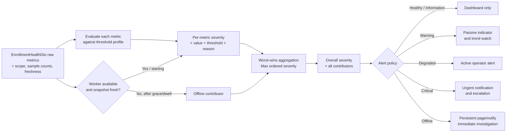

# AI20.PHASE2.0.18 — Enrollment Health Severity Framework

**Type:** Architecture and contract design only. No production implementation is included.

**Decision:** Evaluate every available `EnrollmentHealthDto` metric against calibrated thresholds, retain the severity and reason for each metric, and set the overall enrollment severity to the worst evaluated result. The ordered levels are `Healthy`, `Information`, `Warning`, `Degraded`, `Critical`, and `Offline`.

The raw health DTO remains the evidence-bearing operational snapshot. Severity is a higher-level interpretation produced by the proposed sibling `IEnrollmentHealthService`; it does not replace, mutate, or hide the raw values.

---

## 1. Severity Levels and Ordering

The following enum is **illustrative proposed code only**. The numeric ordering is intentional so aggregation can take the maximum.

```csharp
namespace Abhyanvaya.Application.Enrollment;

/// <summary>
/// Ordered operational impact for the student-enrollment subsystem.
/// Higher numeric values represent more severe operator impact.
/// </summary>
public enum EnrollmentHealthSeverity
{
    Healthy = 0,
    Information = 1,
    Warning = 2,
    Degraded = 3,
    Critical = 4,
    Offline = 5,
}
```

| Severity | Precise operational meaning | Typical enrollment reality |
|---|---|---|
| `Healthy` | All evaluable metrics are within their calibrated nominal bands. The pipeline is idle with no claimable work, or work is flowing at the expected rate without material failures. | `QueueLength == 0 && ActiveWorkers == 0`, or active workers are draining a queue with normal latency, throughput, retries, and outcomes. |
| `Information` | A noteworthy lifecycle or load event deserves visibility but does not indicate impairment. It is not a weaker warning. | A large batch has just started, workers are inside their startup grace period, or a nominal queue has changed from empty to active. |
| `Warning` | The pipeline still functions and is expected to complete, but one or more leading indicators are elevated. Operator awareness is useful; immediate intervention is normally unnecessary. | Stage latency is above baseline, retries have increased, a small number of failures appeared, or backlog is elevated while still draining. |
| `Degraded` | User-visible completion is materially slower or less reliable. At least one stage/dependency is impaired, but useful work continues. | Throughput is well below normal, backlog grows over several samples, success falls below 90%, or one dependency repeatedly fails while other items continue. |
| `Critical` | Enrollment is functioning only marginally or is causing substantial loss/delay. Prompt operator action is required to prevent or limit impact. | Success is below 75%, a stage is extremely slow, failures are concentrated, throughput is near zero despite active work, or the queue grows without bound. |
| `Offline` | Claimable enrollment work cannot execute, or the health surface cannot establish that the worker subsystem is available. This is the highest operational severity. | `ActiveWorkers == 0 && QueueLength > 0` beyond the startup/restart grace period; the hosted worker is explicitly stopped; or a fresh health snapshot cannot be obtained beyond the freshness timeout. |

`Unknown` is deliberately not a seventh severity. It is a **data-quality/evaluation state** used when a nullable metric has no valid sample or a denominator is empty. Unknown metrics are displayed as unknown and excluded from worst-wins aggregation. If the entire health snapshot becomes stale or unavailable, the subsystem becomes `Offline`, because the dashboard can no longer establish operational availability.

---

## 2. Evaluation Scope, Windows, and Tunable Defaults

The numbers below are **initial tunable defaults, not hardcoded operational truth**. They provide deterministic Phase 2 behavior until production baselines exist. They must move to validated configuration and be calibrated from representative college workloads, image sizes, deployment resources, provider latency, and batch size.

Default evaluation assumptions:

1. Latency and throughput use the most recent valid sample selected by `EnrollmentHealthScope.SampleSize` (default `50`).
2. Failure counts use distinct affected items in a rolling `15-minute` reporting window. If only current-snapshot failure state is available, the API must label that limitation and must not imply historical incident counts.
3. Rate thresholds require meaningful denominators. `SuccessRatePercentage` is not evaluated until at least `20` terminal outcomes exist; `RetryRatePercentage` is not evaluated until at least `20` in-scope items exist.
4. Throughput is evaluated only while `QueueLength > 0`. A null throughput or zero throughput with an empty queue means idle/no sample, not failure.
5. Queue trend rules compare equivalent global queue snapshots. “Growing” means an increase of at least `10%` and at least `25` items per sample; tiny fluctuations do not count.
6. `ActiveWorkers` is process-local while `QueueLength` is deployment-database-global. In a future multi-instance deployment, the worker value must be labeled by instance or aggregated by the monitoring backend before applying deployment-wide rules.
7. A newly started worker gets a default `60-second` grace period. During that period, `QueueLength > 0 && ActiveWorkers == 0` is `Information`; after the grace period it is `Offline`.

The severity result should include `ObservedAtUtc`, the analytical scope, reporting window, sample/denominator counts, threshold-profile version, and metric freshness. Those supporting fields prevent a percentage of `0` from an empty scope or an unavailable latency sample from becoming a false incident.

---

## 3. Metric-to-Severity Threshold Table

Ranges use inclusive bounds unless shown with `<` or `>`. “Not evaluated” means the metric contributes no severity and must expose an `Unknown` reason. `Information` is event-driven and is therefore called out in notes rather than used as an impairment band.

| Metric | Healthy range | Warning range | Degraded range | Critical range | Offline condition |
|---|---|---|---|---|---|
| `SuccessRatePercentage` (`0–100%`) | `>= 98%` | `>= 90% and < 98%` | `>= 75% and < 90%` | `< 75%` | None by itself. Not evaluated with fewer than `20` terminal outcomes. |
| `RetryRatePercentage` (`0–100%`) | `< 5%` | `>= 5% and < 10%` | `>= 10% and < 20%` | `>= 20%` | None by itself. Not evaluated with fewer than `20` total items. |
| `AverageDownloadTimeMs` | `<= 2,000 ms` | `> 2,000 and <= 5,000 ms` | `> 5,000 and <= 15,000 ms` | `> 15,000 ms` | None by itself; `null` is unknown, not offline. |
| `AverageValidationTimeMs` | `<= 500 ms` | `> 500 and <= 1,000 ms` | `> 1,000 and <= 3,000 ms` | `> 3,000 ms` | None by itself; `null` is unknown, not offline. |
| `AverageEmbeddingTimeMs` | `<= 1,000 ms` | `> 1,000 and <= 2,500 ms` | `> 2,500 and <= 7,500 ms` | `> 7,500 ms` | None by itself; `null` is unknown, not offline. |
| `AverageStorageTimeMs` | `<= 1,000 ms` | `> 1,000 and <= 3,000 ms` | `> 3,000 and <= 10,000 ms` | `> 10,000 ms` | None by itself. It remains unknown until dedicated storage telemetry exists; do not derive it from unrelated timestamps. |
| `ItemsPerMinute` | `>= 10` while queue has work; idle queue is healthy | `>= 5 and < 10` | `>= 1 and < 5` | `< 1` for at least `3` samples while queue has work and workers are active | Worker-offline rule applies when queue has work and no worker is active. `null` is unknown. |
| `QueueLength` (global items) | `0–100` and stable/draining | `101–500`, or growth in `2` consecutive samples | `501–2,000`, or growth in `3` consecutive samples | `> 2,000`, or growth in `5` consecutive samples | Combined rule: `> 0` while `ActiveWorkers == 0` after the `60-second` grace period. A transition from `0` to a nominal active queue may emit `Information`. |
| `ActiveWorkers` (current-process slots) | `>= 1` when queue has work; `0` when queue is empty is healthy idle | No standalone warning band; `0` with queued work inside startup grace is `Information` | No standalone degraded band | No standalone critical band | `== 0 && QueueLength > 0` beyond grace, or worker explicitly reported stopped. |
| `StorageFailures` (distinct items/window) | `0` | `1–2` | `3–9` | `>= 10` | None by count alone; dependency unavailability can independently make the subsystem offline only when it prevents all work. |
| `EmbeddingFailures` (distinct items/window) | `0` | `1–2` | `3–9` | `>= 10` | None by count alone; an unavailable embedding dependency normally yields `Degraded`/`Critical` while work still flows, and `Offline` only when no claimable work can execute. |
| `ValidationFailures` (distinct items/window) | `0` | `1–2` | `3–9` | `>= 10` | None by count alone. Quality rejections should be segmented from engine faults when stage-aware telemetry is available. |

### 3.1 Why these defaults are defensible

- The success bands distinguish nominal reliability (`>= 98%`), recoverable concern (`90–98%`), material impairment (`75–90%`), and broad failure (`< 75%`).
- Retry rate is an early instability signal even when eventual success stays high; it is intentionally independent from success rate.
- Stage-specific latency thresholds differ because network download, CPU validation/embedding, and object storage have different expected costs.
- Absolute failure-count thresholds are intentionally simple for the first 15-minute window. They must later be supplemented or replaced by stage failure rates for differently sized workloads.
- Queue severity combines depth and sustained direction. A one-time large batch is not automatically “unbounded”; repeated growth while workers are active is stronger evidence.
- Worker idleness is healthy when there is no work. Offline requires queued work, no active worker, and a dwell/grace check.

---

## 4. Severity Aggregation Rule

**Overall severity is the maximum (worst) severity across all evaluated metric results and explicit availability rules.**

```text
OverallSeverity = Max(
    perMetricSeverities,
    lifecycleInformationEvents,
    workerAvailabilitySeverity,
    snapshotFreshnessSeverity)
```

Worst-wins is appropriate for health because averaging can conceal a failed dependency: ten healthy metrics must not dilute one offline worker condition or a critically low success rate. The overall value is a routing and attention signal, not a statistical score.

Worst-wins must not discard explanation. The proposed response should retain:

```csharp
// PROPOSED response shape only; not implemented.
public sealed record EnrollmentHealthSeverityResult
{
    public required EnrollmentHealthSeverity OverallSeverity { get; init; }
    public required IReadOnlyList<EnrollmentHealthContributor> Contributors { get; init; }
    public required DateTimeOffset ObservedAtUtc { get; init; }
    public required string ThresholdProfileVersion { get; init; }
}

public sealed record EnrollmentHealthContributor
{
    public required string Metric { get; init; }
    public required EnrollmentHealthSeverity Severity { get; init; }
    public required string Reason { get; init; }
    public double? ObservedValue { get; init; }
    public string? Unit { get; init; }
    public string? Threshold { get; init; }
}
```

Return every contributor at the overall severity first, followed by lesser non-healthy contributors. Also return unknown/not-evaluated reasons separately or as contributor metadata. This lets an operator see “Critical because success is 71.4% and queue grew for five samples,” rather than only a red badge.

When several metrics tie for worst, all tied contributors are causes. `Information` wins over `Healthy`, but any `Warning` or higher wins over `Information`. `Offline` always wins.

---

## 5. Decision Matrix

This matrix is the normative evaluation order. Metric rows reference the concrete bands in §3.

| Priority | Condition | Per-condition result | Aggregation effect |
|---:|---|---|---|
| 1 | Health snapshot cannot be obtained or is older than the configured freshness timeout (`30 seconds` while actively monitored by default) | `Offline` (`HealthSnapshot`) | Overall is `Offline`; retain last known metric values as stale, never as current. |
| 2 | `QueueLength > 0 && ActiveWorkers == 0` after worker startup/restart grace, or worker explicitly reports stopped | `Offline` (`ActiveWorkers`) | Overall is `Offline` regardless of all other metrics. |
| 3 | Same worker condition during the first `60 seconds` after known startup/restart | `Information` (`WorkerStarting`) | Overall is at least `Information`; suppress the offline alert until grace expires. |
| 4 | Any metric is in its Critical band, including sustained queue growth/near-zero throughput | `Critical` for each matching metric | Overall is at least `Critical`, unless an Offline condition exists. |
| 5 | Any metric is in its Degraded band | `Degraded` for each matching metric | Overall is at least `Degraded`, unless Critical/Offline exists. |
| 6 | Any metric is in its Warning band | `Warning` for each matching metric | Overall is at least `Warning`, unless a higher result exists. |
| 7 | Large batch started, queue transitioned from idle to nominal work, or another recognized non-problem lifecycle event occurred | `Information` (`LifecycleEvent`) | Overall is `Information` only when every evaluable health metric is Healthy. |
| 8 | Metric is `null`, denominator/sample is below minimum, or source cannot measure it yet | `Unknown` evaluation state | Exclude that metric from `Max`; expose the reason. If all sources/snapshot are unavailable, priority 1 applies. |
| 9 | All evaluable metrics are in Healthy bands, no active information event exists, and snapshot is fresh | `Healthy` | Overall is `Healthy`. |

Example combinations:

| Metric conditions in one snapshot | Per-metric contributors | Overall |
|---|---|---|
| Queue `0`, workers `0`, no failures, valid rates nominal | All `Healthy` (idle is healthy) | `Healthy` |
| Queue `80`, workers `0`, known restart age `20 seconds` | Worker `Information`; queue nominal | `Information` |
| Success `96%`, retries `3%`, all latency nominal | Success `Warning`; others `Healthy` | `Warning` |
| Embedding `3,200 ms`, storage failures `1`, success `99%` | Embedding `Degraded`; storage failures `Warning` | `Degraded` |
| Success `72%`, queue growth for five samples, workers `2` | Success `Critical`; queue `Critical`; workers `Healthy` | `Critical` |
| Queue `40`, workers `0` for `90 seconds`, success `99%` | Worker `Offline`; success `Healthy` | `Offline` |

---

## 6. Evaluation and Alert Flow



The health dashboard should use the adaptive conditional polling pattern already recommended for progress: immediate read, approximately `3-second` visible-page refresh, slower cadence after unchanged responses, `15–30-second` hidden-tab backoff, no overlapping requests, and bounded retry backoff with jitter. Unlike one terminal batch-progress screen, subsystem health remains refreshable while the dashboard is open. A threshold crossing changes the severity response/version and should therefore break an unchanged-response streak on the next poll.

---

## 7. Dashboard Color, Icon, and Operator Action

All colors use MUI theme roles. No hardcoded hex values are proposed. Icons are conceptual MUI icon names; text and icon shape accompany color so status is not color-only.

| Severity | Theme-relative color | Suggested icon | Dashboard treatment | Default operator/alert action |
|---|---|---|---|---|
| `Healthy` | `success.main` / chip `color="success"` | `CheckCircle` | Normal status chip/tile | No alert; retain trend history. |
| `Information` | `info.main` / chip `color="info"` | `InfoOutlined` or `Autorenew` for startup | Informational chip; optional short-lived event text | Dashboard only; no external notification. |
| `Warning` | `warning.main` / chip `color="warning"` | `WarningAmberOutlined` | Persistent passive indicator with contributor text | Watch/trend; optional digest if sustained. |
| `Degraded` | `error.light` through `theme.palette.error.light` | `ReportProblemOutlined` | Prominent tile/banner, visually below Critical | Active in-app alert; notify operations after dwell. |
| `Critical` | `error.main` / chip `color="error"` | `Error` | High-prominence error banner and contributor list | Urgent notification; open/escalate incident per policy. |
| `Offline` | `text.disabled`, `action.disabled`, or a theme `grey` token; chip `color="default"` | `CloudOffOutlined` or `PowerSettingsNewOutlined` | Persistent neutral/grey unavailable tile with explicit “Offline” text | Immediate page/notify; investigate worker and health endpoint. |

### 7.1 Alignment with the existing Phase 1 UI

The framework generalizes, rather than replaces, `AiSystemStatusCard`:

| Existing `AiSystemStatusLevel` | Severity-framework alignment |
|---|---|
| `ready` (`success`, check icon) | `Healthy`; subsystem-specific text may remain “Ready” or “Running.” |
| `starting` (`warning`, rotating icon) | Usually `Information` during a known startup grace period; becomes `Warning` when startup is unusually slow but not yet unavailable. |
| `offline` (offline label/error icon today) | `Offline`; preserve the explicit label and non-color icon cue. In the generalized six-level palette, neutral/grey distinguishes unavailable/offline from confirmed `Critical` failure, while the alert action remains highest urgency. |
| `unknown` (`default`, disabled icon) | Remains a data/evaluation state, not an operational severity. Individual unknown metrics do not falsely degrade health. |

`AIStatusChip` already establishes `success` for ready/completed, `info` for active processing, `warning` for pending/review, `error` for failed, and `default` for cancelled/not-started states. The proposed severity palette follows those theme-relative conventions. It introduces no literal color values and keeps icons/labels alongside color.

---

## 8. Operator Alert Policy

| Severity transition | Default behavior | Acknowledgement/escalation |
|---|---|---|
| Any → `Healthy` | Resolve the active dashboard incident after recovery dwell; record recovery time. | Send a recovery notification only if an external alert was previously opened. |
| `Healthy` → `Information` | Show event in the dashboard/activity feed. | No acknowledgement. Auto-expire lifecycle information. |
| Any lower → `Warning` | Show passive persistent indicator and contributors. | No page. Include in an optional operations digest if sustained for `15 minutes`. |
| Any lower → `Degraded` | Raise active in-app alert after `2-minute` dwell. | Notify the operations channel; acknowledge and investigate if sustained. |
| Any lower → `Critical` | Raise urgent in-app and external alert after `60-second` dwell, except immediately actionable explicit dependency faults. | Escalate if unacknowledged according to the on-call policy. |
| Any lower → `Offline` | Immediately show a persistent dashboard banner; external notification after worker grace/freshness rule confirms offline. | Page the responsible operator; keep open until recovery dwell completes. |

Severity alone should not decide a business action such as cancelling a batch or retrying an item. Alerts inform operators; the existing outcome/retry contracts remain authoritative for pipeline behavior.

---

## 9. Future Notification Integration and Flap Control

Future adapters may notify by email, SMS, Slack, Microsoft Teams, or a generic signed webhook when the **overall severity crosses upward** into an alertable level. Notifications should include tenant/scope, overall severity, all worst-level contributors, observed values and thresholds, first-observed time, current duration, dashboard link, correlation/trace identifiers where available, and threshold-profile version. They must contain no image data, vectors, secret-bearing URLs, or student PII.

Recommended anti-noise controls:

1. **State-change notifications:** notify on threshold crossing, not every poll. Re-notify only on escalation, a configured reminder interval, or recovery.
2. **Minimum dwell:** defaults are `2 minutes` for Degraded, `60 seconds` for Critical, and the worker/freshness grace rules for Offline. Warning remains passive unless sustained.
3. **Hysteresis bands:** recovery requires crossing a healthier boundary with margin. Initial defaults are `2 percentage points` for rates, `10%` below latency/queue thresholds, and `10%` above throughput thresholds.
4. **Recovery dwell:** require `3` consecutive healthy evaluations or `2 minutes`, whichever is longer, before resolving an alert. An explicit worker restart may still refresh immediately but does not declare recovery until work resumes or the queue is empty.
5. **Deduplication key:** use environment + analytical scope + overall severity + contributor metric set. This prevents each adaptive poll from creating a new incident.
6. **Escalation without duplication:** Warning → Degraded → Critical updates one incident/thread; it does not open three unrelated alerts.
7. **Maintenance suppression:** planned deployments may suppress external notification while retaining health history and dashboard state.

Hysteresis applies to clearing/downward transitions, while the threshold table remains the entry condition. This makes incidents responsive to real deterioration without oscillating when a metric sits exactly on a boundary.

---

## 10. Future Monitoring and OpenTelemetry Integration

The application-level evaluator should own the canonical semantics and threshold-profile version. External platforms may mirror alert rules for operational independence, but they should consume the same documented bands rather than invent incompatible meanings.

Represent the ordered severity as both a stable name and numeric gauge:

```text
enrollment.health.severity = 0..5
enrollment.health.status = "healthy|information|warning|degraded|critical|offline"
```

Low-cardinality attributes may include environment, deployment/instance, analytical scope type, and contributor metric. Do not use batch IDs, student IDs, diagnostic messages, or other unbounded values as metric labels. Per-stage telemetry from `EnrollmentStageTelemetry` supplies stage duration and diagnostic context; the severity evaluator supplies the roll-up.

| Platform | How severity is represented | How thresholds and alerts are configured |
|---|---|---|
| Azure Monitor | Custom metric `enrollment.health.severity` (`0–5`), plus dimensions such as environment and contributor; optional standard health endpoint availability probe. | Metric alert rules trigger on sustained `>= 3` (Degraded), `>= 4` (Critical), or `== 5` (Offline). Action Groups route email/SMS/webhook/Teams integrations; dynamic thresholds can later refine calibrated stage metrics. |
| Application Insights | Custom metric for numeric severity, custom event on transitions, and availability result for the health endpoint. Stage telemetry maps to dependency/request telemetry as described by the pipeline-telemetry design. | Azure Monitor alert rules query custom metrics/events with dwell windows; availability alerts detect unreachable/stale health responses. Contributor fields become bounded custom dimensions. |
| Grafana | Time series gauge with value mapping `0–5`, colored by the theme/dashboard; contributor metrics remain separate panels/labels. | Grafana Alerting expressions evaluate the canonical bands and `for` durations. Contact points route Slack, Teams, email, or webhooks; silence/maintenance rules suppress planned work. |
| Datadog | Gauge such as `abhyanvaya.enrollment.health.severity`, service check for worker/endpoint availability, and events on severity transition. | Metric monitors use thresholds and recovery thresholds (hysteresis); service-check monitors page on Offline. Composite monitors can combine queue depth, worker activity, and freshness. |
| OpenTelemetry | Observable gauge `enrollment.health.severity`; log/event on transitions; span/resource attributes for stage and instance. `service.instance.id` supports future multi-instance attribution. | The OTel Collector exports signals but does not define the product incident policy. Backend alert rules consume the gauge; Views/processors constrain attributes and route to the chosen monitoring backend. |
| Standard `/health` endpoint | Authenticated operational detail returns overall severity, freshness, contributors, and raw-metric link/reference. A minimal orchestrator probe can map Healthy/Information/Warning to healthy, Degraded/Critical to degraded, and Offline to unhealthy. | Hosting/platform probes check reachability separately from authorized detail. Alerting uses repeated failure/dwell, and responses avoid sensitive values. Do not expose cross-tenant operational detail publicly. |

The three-state conventions of common health-check libraries cannot preserve all six levels. Therefore the full severity name and numeric value must remain in the detailed contract/telemetry even when a platform probe collapses it to healthy/degraded/unhealthy.

---

## 11. Calibration and Governance

1. Store thresholds in one versioned profile owned by the severity evaluator; do not duplicate constants independently in API, React, and alerting adapters.
2. Establish baselines from at least several representative batches and compare averages with p95/p99 stage telemetry before revising defaults.
3. Review thresholds after provider/model changes, deployment-size changes, concurrency changes, or horizontal scaling.
4. Keep scope explicit. Selected-scope rates/latencies/failures and global queue/process-local worker gauges must not be presented as if they share one tenant boundary.
5. Audit threshold-profile changes and include the profile version in each severity result and alert.
6. Prefer future rate/percentile signals over raw failure counts once stage-aware historical telemetry has sufficient retention.
7. Test boundary values, empty scopes, null samples, stale snapshots, startup grace, queue growth, ties, and multi-metric worst-wins behavior before implementation release.

---

## Constraints Confirmed

- This is architecture/documentation only; no health evaluator, enum, DTO, service, endpoint, alert, monitoring adapter, polling client, or UI behavior was implemented.
- Every C# and text contract block is illustrative/proposed only.
- No `.cs`, `.csproj`, `.tsx`, `.ts`, migration, configuration, or other non-markdown file was created or modified.
- The existing `EnrollmentHealthDto`, `IEnrollmentHealthService` recommendation, `AiSystemStatusCard`, `AIStatusChip`, `StudentEnrollmentPage`, progress-streaming design, and pipeline-telemetry design remain unchanged.
- Thresholds are initial tunable defaults requiring production calibration; they are not hardcoded truth.
- The only artifact produced for this task is `docs/AI20_PHASE2_HEALTH_SEVERITY.md`.
