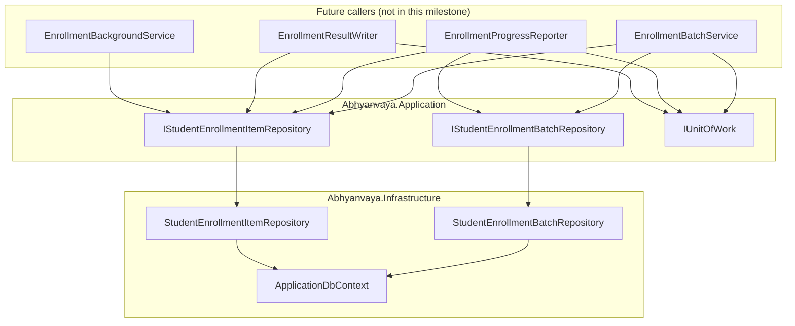
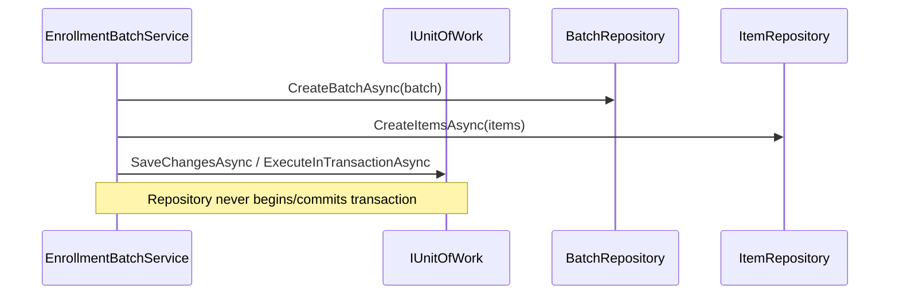
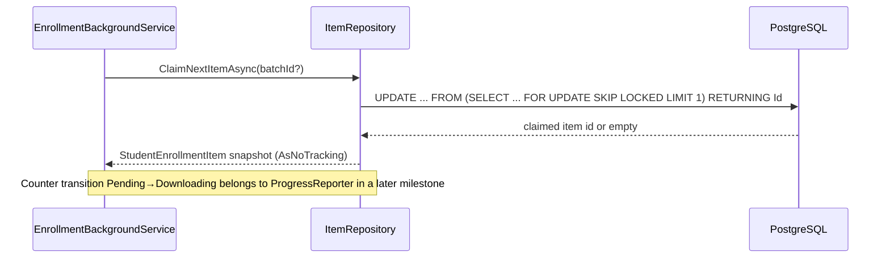

# AI20.PHASE2.1.1 — Enrollment Repository Implementation Review

**Milestone:** AI20.PHASE2.1.1 — first Phase 2 implementation deliverable (persistence layer only).

**Verdict:** **Approved for AI20.PHASE2.1.2** — repositories are thin, match approved architecture, and introduce no orchestration or business logic.

---

## Scope delivered

| Component | Status |
|---|---|
| `IStudentEnrollmentBatchRepository` | Extended from read-only stub to full persistence contract |
| `IStudentEnrollmentItemRepository` | Extended from read-only stub to full persistence contract |
| `StudentEnrollmentBatchRepository` | Implemented |
| `StudentEnrollmentItemRepository` | Implemented |
| DI registration | Updated comment; registrations unchanged (already present) |
| Unit tests | Not added — no existing enrollment repository test project |

---

## Repository diagram

**Layering:** interfaces in Application; implementations in Infrastructure; Domain entities/value objects only as parameters and return types. No `BaseRepository` exists in Abhyanvaya — pattern matches `StudentRepository` (constructor-injected `ApplicationDbContext`, no `SaveChanges` inside repositories).

---

## Method catalog

### `IStudentEnrollmentBatchRepository`

| Method | Responsibility |
|---|---|
| `CreateBatchAsync` | Stage batch insert (`AddAsync` only) |
| `GetBatchAsync` | Load by id (optional tenant guard overload) |
| `UpdateBatchAsync` | Mark batch entity modified |
| `GetStatisticsAsync` | O(1) read of denormalized counters → `EnrollmentStatistics` |
| `ExistsAsync` | Batch existence check |
| `GetByCollegeAsync` | Historical list for college/year scope |

### `IStudentEnrollmentItemRepository`

| Method | Responsibility |
|---|---|
| `CreateItemsAsync` | Bulk stage item inserts |
| `GetByIdAsync` | Load by id |
| `GetByBatchAndStudentAsync` | Unique `(BatchId, StudentId)` lookup |
| `GetByBatchAsync` | Optional status filter |
| `GetPendingItemsAsync` | Non-locking peek at queue (`Pending` + `RetryRequired`, excludes cancelled batches) |
| `ClaimNextItemAsync` | Atomic claim via `FOR UPDATE SKIP LOCKED` |
| `UpdateItemAsync` | Mark item entity modified |
| `GetFailedItemsAsync` | Terminal `Failed` items for a batch |
| `ExistsAsync` | `(BatchId, StudentId)` existence |
| `GetHistoryForStudentAsync` | Cross-batch student history |

---

## Query flow

### Batch creation (caller-owned transaction)

### Worker claim (single-statement ownership)

---

## Concurrency review

| Requirement | Implementation |
|---|---|
| Single worker ownership | `ClaimNextItemAsync` uses one atomic PostgreSQL `UPDATE … FOR UPDATE OF i SKIP LOCKED LIMIT 1` |
| No double claim | Row lock + status filter in subquery; competing workers skip locked rows |
| Optimistic concurrency on updates | `RowVersion` (`bytea`) updated on claim; EF `IsConcurrencyToken()` on entities; `UpdateItemAsync`/`UpdateBatchAsync` participate in `SaveChanges` token checks |
| Cancelled batches excluded | Join/filter on `StudentEnrollmentBatch.CancellationRequestedUtc IS NULL` in claim SQL and pending peek queries |

**Note:** `ClaimNextItemAsync` sets status to `Downloading` at claim time (per `AI20_ENROLLMENT_BACKGROUND.md`). Denormalized batch counter adjustments remain the responsibility of `IEnrollmentProgressReporter` (Phase 2 service layer), not the repository — preserving thin-repository boundaries.

---

## Performance review

| Query | Index used | Complexity |
|---|---|---|
| `GetStatisticsAsync` | PK on `StudentEnrollmentBatch` | O(1) — projects counter columns only |
| `GetPendingItemsAsync` | `IX_StudentEnrollmentItem_Batch_Status`, batch join | O(limit) |
| `ClaimNextItemAsync` | `IX_StudentEnrollmentItem_Batch_Status` + `CreatedUtc` order | O(1) per claim |
| `GetFailedItemsAsync` | `IX_StudentEnrollmentItem_Batch_Status` | O(failed count) |
| `GetByCollegeAsync` | `IX_StudentEnrollmentBatch_University_College_Year` | O(batches in scope) |
| `GetHistoryForStudentAsync` | `IX_StudentEnrollmentItem_Tenant_Student` | O(history rows) |

Read-heavy dashboard paths use `AsNoTracking()` where entities are not mutated in the same scope.

---

## Transaction boundaries

Repositories **never** call `SaveChangesAsync` or `ExecuteInTransactionAsync`. They only:

- `Add` / `AddRange` / `Update` on the shared `ApplicationDbContext`
- Execute the claim SQL (participates in caller's ambient transaction when one is open)

Transaction ownership remains with `EnrollmentBatchService`, `EnrollmentProgressReporter`, `EnrollmentResultWriter`, and `IUnitOfWork` per `AI20_PHASE2_ENGINE_CONTRACTS.md`.

---

## Architectural drift check

| Check | Result |
|---|---|
| No business logic in repositories | Pass |
| No retry/validation/embedding logic | Pass |
| No duplicate repository base class | Pass — follows `StudentRepository` pattern |
| Reuses existing entities/enums/value objects | Pass |
| Matches DB design (`AI20_ENROLLMENT_DATABASE.md`) | Pass |
| Claim protocol aligned with background design | Pass — SKIP LOCKED superset of documented RowVersion claim |
| No new tables/migrations | Pass |
| Build (Application + Infrastructure) | Pass — 0 errors |

---

## Files created / modified

| File | Action |
|---|---|
| `Abhyanvaya.Application/Common/Interfaces/IStudentEnrollmentBatchRepository.cs` | Modified |
| `Abhyanvaya.Application/Common/Interfaces/IStudentEnrollmentItemRepository.cs` | Modified |
| `Abhyanvaya.Infrastructure/Persistence/Repositories/StudentEnrollmentBatchRepository.cs` | Modified |
| `Abhyanvaya.Infrastructure/Persistence/Repositories/StudentEnrollmentItemRepository.cs` | Modified |
| `Abhyanvaya.Infrastructure/DependencyInjection.cs` | Modified (comment) |
| `docs/AI20_PHASE2_IMPLEMENTATION_1_REPOSITORY_REVIEW.md` | Created |

**Unchanged (prior milestones, referenced only):** domain entities, EF configurations, migration `20260716060756_AddStudentEnrollmentTables`, `ApplicationDbContext` DbSets and `RowVersion` stamping in `SaveChangesAsync`.

---

## Follow-up for AI20.PHASE2.1.2+

1. Integration test for `ClaimNextItemAsync` under concurrent workers (two connections, assert single claim).
2. Wire `EnrollmentProgressReporter` to call `UpdateItemAsync` / counter logic inside caller transactions.
3. Ensure claim + counter transition occur in one transaction when worker starts processing.
