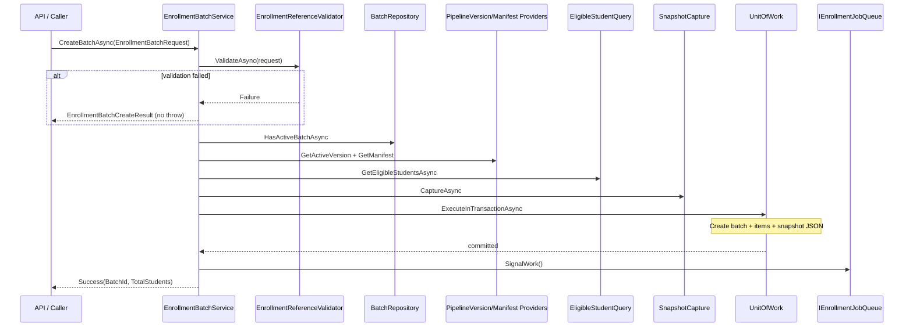
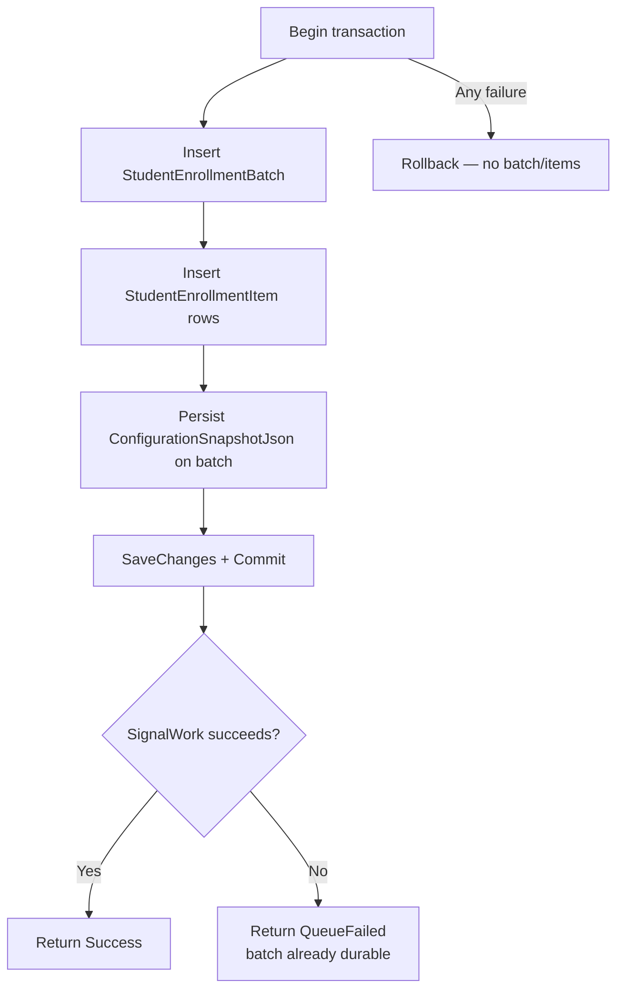
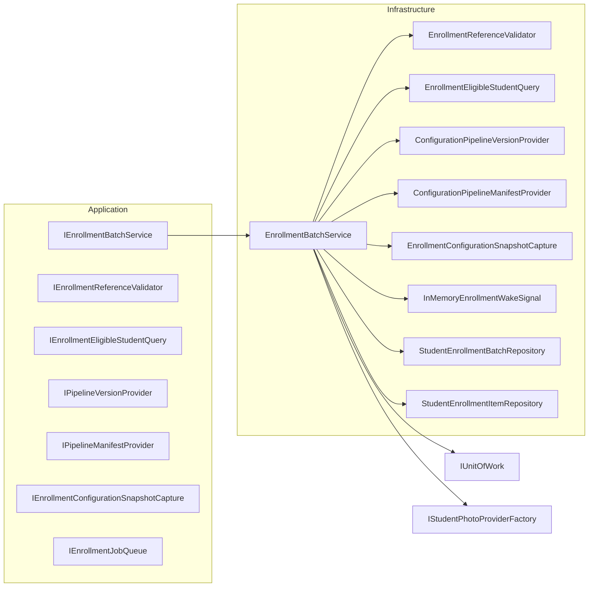

# AI20.PHASE2.1.2 — Enrollment Batch Service Implementation Review

**Milestone:** AI20.PHASE2.1.2 — Enrollment Batch Service  
**Status:** Implemented  
**Authority:** Frozen AI20 Phase 2 architecture documents (`AI20_PHASE2_ENGINE_CONTRACTS`, `AI20_PHASE2_CONFIGURATION_SNAPSHOT`, `AI20_PHASE2_PIPELINE_VERSIONING`, `AI20_PHASE2_PIPELINE_MANIFEST`, `AI20_ENROLLMENT_BACKGROUND`)

---

## 1. Responsibilities (implemented scope)

`IEnrollmentBatchService.CreateBatchAsync` is responsible **only** for batch creation:

| Responsibility | Implementation |
|---|---|
| Validate request | `EnrollmentReferenceValidator` + inline pipeline/photo checks |
| Validate college exists | `IEnrollmentReferenceValidator` |
| Validate course/group/subject/admission batch (when provided) | `EnrollmentReferenceValidator` |
| Verify no active batch | `IStudentEnrollmentBatchRepository.HasActiveBatchAsync` |
| Resolve pipeline version | `IPipelineVersionProvider` |
| Resolve pipeline manifest | `IPipelineManifestProvider` |
| Capture configuration snapshot | `IEnrollmentConfigurationSnapshotCapture` |
| Create `StudentEnrollmentBatch` | `EnrollmentBatchService` + batch repository |
| Load eligible students | `IEnrollmentEligibleStudentQuery` (does **not** modify `StudentRepository`) |
| Create `StudentEnrollmentItem` rows | Item repository, status `Pending` |
| Initialize statistics | `PendingCount = TotalStudents`, all other counters = 0 |
| Queue batch | `IEnrollmentJobQueue.SignalWork()` **after** transaction commit |
| Return batch id | `EnrollmentBatchCreateResult` |

**Explicitly not implemented in this service:** photo download, embedding, validation, storage, orchestrator, worker logic, cancel/resume (stubs return `NoOp`).

---

## 2. Sequence diagram



---

## 3. Transaction diagram



Per frozen engine contracts (`AI20_PHASE2_ENGINE_CONTRACTS` §3), the queue wake signal runs **after** commit. The durable queue is `StudentEnrollmentItem` rows with `Pending` status; `SignalWork()` is a latency optimization only.

---

## 4. Dependency diagram



---

## 5. Validation matrix

| Input / rule | Failure code | Throws? |
|---|---|---|
| Missing tenant/university/college/year/user | `InvalidRequest` | No |
| College not found or university mismatch | `CollegeNotFound` | No |
| CourseId provided but not found | `CourseNotFound` | No |
| GroupId provided but not found | `GroupNotFound` | No |
| Batch filter provided but no students | `BatchNotFound` | No |
| SubjectId provided but not found | `SubjectNotFound` | No |
| Active batch for college+year | `ActiveBatchAlreadyRunning` | No |
| Pipeline version not registered | `PipelineVersionNotFound` | No |
| Pipeline manifest missing | `PipelineManifestNotFound` | No |
| Zero eligible students | `NoEligibleStudents` | No |
| Snapshot incomplete / not serializable | `ConfigurationSnapshotFailed` | No |
| DB transaction failure | `PersistenceFailed` | No |
| Queue signal failure (post-commit) | `QueueFailed` | No |
| Unknown photo provider name | `InvalidRequest` | No |

---

## 6. Failure matrix

| Scenario | DB state after | Worker impact |
|---|---|---|
| Pre-transaction validation failure | Unchanged | None |
| Transaction failure | Rolled back — no batch/items | None |
| Commit success + queue signal failure | Batch + items persisted | Poll/recovery still finds `Pending` rows |
| Success | Batch `Created`, items `Pending` | Wake signal + poll claim items |

---

## 7. Performance notes

- Student discovery uses indexed tenant-scoped queries with optional filters; no photo/embedding I/O.
- Item creation is bulk `AddRange` inside one transaction.
- Snapshot capture reads configuration once; JSON serialized once; hash computed once.
- `HasActiveBatchAsync` is a single `EXISTS`-style query on `(TenantId, CollegeId, AcademicYear, Status)`.
- Structured logs include `CorrelationId`, `PipelineVersion`, counts, and duration — never URLs with secrets, embeddings, or image bytes.

---

## 8. Evidence

| Check | Result |
|---|---|
| `dotnet build Abhyanvaya.Infrastructure` | 0 errors |
| `dotnet test Abhyanvaya.Application.UnitTests` | 7/7 passed |
| Architecture drift | None — Application interfaces, Infrastructure implementations |
| Recognition / attendance / embedding engine | Untouched |
| `StudentRepository` | Untouched — discovery via `IEnrollmentEligibleStudentQuery` |

---

## 9. Files modified / created

### Domain
- `Abhyanvaya.Domain/Entities/StudentEnrollmentBatch.cs` — added `PipelineVersion`, `ConfigurationSnapshotJson`, `CorrelationId`, `PhotoProviderName`, `Priority`

### Application
- `Abhyanvaya.Application/Common/Interfaces/IEnrollmentBatchService.cs` *(new)*
- `Abhyanvaya.Application/Common/Interfaces/IEnrollmentJobQueue.cs` *(new)*
- `Abhyanvaya.Application/Common/Interfaces/IPipelineVersionProvider.cs` *(new)*
- `Abhyanvaya.Application/Common/Interfaces/IPipelineManifestProvider.cs` *(new)*
- `Abhyanvaya.Application/Common/Interfaces/IEnrollmentConfigurationSnapshotCapture.cs` *(new)*
- `Abhyanvaya.Application/Common/Interfaces/IEnrollmentEligibleStudentQuery.cs` *(new)*
- `Abhyanvaya.Application/Common/Interfaces/IEnrollmentReferenceValidator.cs` *(new)*
- `Abhyanvaya.Application/Common/Interfaces/IStudentEnrollmentBatchRepository.cs` — `HasActiveBatchAsync`
- `Abhyanvaya.Application/Enrollment/EnrollmentBatchModels.cs` *(new)*
- `Abhyanvaya.Application/Enrollment/EnrollmentSourceUrlBuilder.cs` *(new)*
- `Abhyanvaya.Application/Enrollment/Configuration/ConfigurationSnapshot.cs` *(new)*
- `Abhyanvaya.Application/Enrollment/Pipeline/EnrollmentPipelineStage.cs` *(new)*
- `Abhyanvaya.Application/Enrollment/Pipeline/Manifest/PipelineManifestModels.cs` *(new)*
- `Abhyanvaya.Application/Enrollment/Versioning/PipelineVersion.cs` *(new)*
- `Abhyanvaya.Application/Abhyanvaya.Application.csproj` — `InternalsVisibleTo` unit tests

### Infrastructure
- `Abhyanvaya.Infrastructure/Enrollment/EnrollmentBatchService.cs` *(new)*
- `Abhyanvaya.Infrastructure/Enrollment/Configuration/EnrollmentPipelineOptions.cs` *(new)*
- `Abhyanvaya.Infrastructure/Enrollment/Configuration/EnrollmentConfigurationSnapshotCapture.cs` *(new)*
- `Abhyanvaya.Infrastructure/Enrollment/Versioning/ConfigurationPipelineVersionProvider.cs` *(new)*
- `Abhyanvaya.Infrastructure/Enrollment/Pipeline/ConfigurationPipelineManifestProvider.cs` *(new)*
- `Abhyanvaya.Infrastructure/Enrollment/Queries/EnrollmentEligibleStudentQuery.cs` *(new)*
- `Abhyanvaya.Infrastructure/Enrollment/Validation/EnrollmentReferenceValidator.cs` *(new)*
- `Abhyanvaya.Infrastructure/Enrollment/Queue/InMemoryEnrollmentWakeSignal.cs` *(new)*
- `Abhyanvaya.Infrastructure/Persistence/Repositories/StudentEnrollmentBatchRepository.cs` — `HasActiveBatchAsync`
- `Abhyanvaya.Infrastructure/Persistence/Configurations/StudentEnrollmentBatchConfiguration.cs` — new columns
- `Abhyanvaya.Infrastructure/Migrations/20260716143000_AddEnrollmentBatchSnapshotColumns.cs` *(new)*
- `Abhyanvaya.Infrastructure/Migrations/ApplicationDbContextModelSnapshot.cs` — updated
- `Abhyanvaya.Infrastructure/DependencyInjection.cs` — DI registrations

### API / config
- `Abhyanvaya.API/appsettings.json` — `EnrollmentPipeline` section

### Tests
- `Abhyanvaya.Application.UnitTests/Abhyanvaya.Application.UnitTests.csproj` *(new)*
- `Abhyanvaya.Application.UnitTests/Enrollment/EnrollmentBatchServiceTests.cs` *(new)*
- `Abhyanvaya.sln` — test project added

### Documentation
- `docs/AI20_PHASE2_IMPLEMENTATION_2_BATCH_SERVICE_REVIEW.md` *(this file)*

---

## 10. Post-deploy step

Apply migration on the target database:

```powershell
dotnet ef database update --project Abhyanvaya.Infrastructure --startup-project Abhyanvaya.API
```

Ensure `StudentPhotoProvider:ExamBranch:BaseUrlTemplate` is configured before creating batches (snapshot validation requires it for ExamBranch provider).
