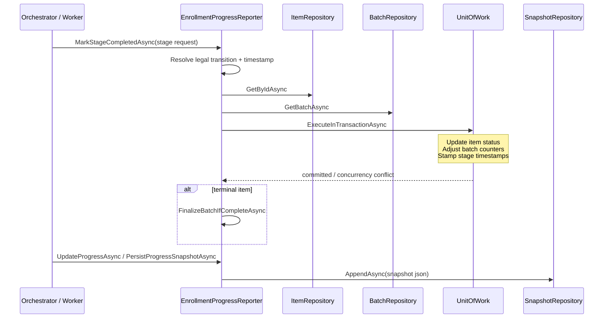
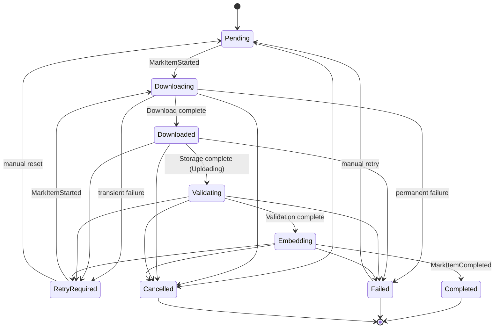
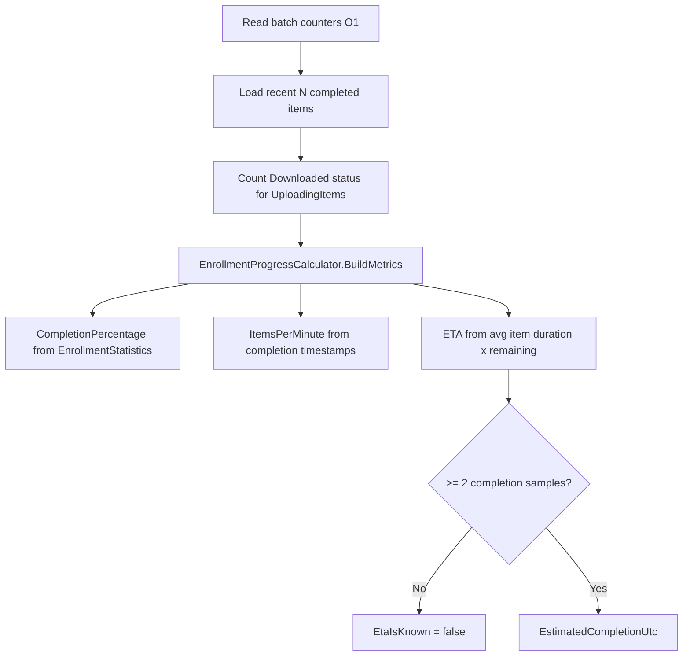

# AI20.PHASE2.1.3 — Enrollment Progress Reporter Implementation Review

**Milestone:** AI20.PHASE2.1.3 — Enrollment Progress Reporter  
**Status:** Implemented  
**Authority:** `AI20_PHASE2_ENGINE_CONTRACTS.md` §5, `AI20_ENROLLMENT_ARCHITECTURE.md` §6, `AI20_ENROLLMENT_BACKGROUND.md` §3.2, `AI20_PHASE2_PROGRESS_STREAMING.md`

---

## 1. Responsibilities

`IEnrollmentProgressReporter` is the **sole owner** of enrollment progress mutation:

| Method | Purpose |
|---|---|
| `TransitionItemAsync` | Atomic item status change + batch counter adjustment (frozen core contract) |
| `MarkItemStartedAsync` | `Pending`/`RetryRequired` → `Downloading` |
| `MarkStageCompletedAsync` | Pipeline stage completion transitions |
| `MarkStageFailedAsync` | Stage failure → `Failed` or `RetryRequired` |
| `MarkRetryScheduledAsync` | Schedule automatic retry |
| `MarkItemCompletedAsync` | Terminal success |
| `MarkBatchCompletedAsync` / `MarkBatchFailedAsync` | Explicit batch terminal commands |
| `FinalizeBatchIfCompleteAsync` | Derive terminal batch status when in-flight reaches zero |
| `UpdateProgressAsync` | O(1) counter read + derived metrics |
| `CalculateProgress` / `CalculateETA` | Pure metrics/ETA from counters + recent completion samples |
| `PersistProgressSnapshotAsync` | Append immutable JSON snapshot row |
| `GetProgressAsync` | Canonical `EnrollmentProgress` read model |

**Not implemented here:** photo download, embedding, storage, validation, batch creation, queue/worker logic.

---

## 2. Sequence diagram



---

## 3. State transition diagram



Illegal transitions throw `InvalidOperationException` (programmer error). Guard/`RowVersion` mismatches return `EnrollmentTransitionResult` without throwing.

---

## 4. Progress calculation flow



**UploadingItems** maps to items in `EnrollmentStatus.Downloaded` (storage/upload stage) via a single indexed count query — not a full batch rescan.

**Counter bucket rule:** `Downloaded` shares `DownloadingCount` until transition to `Validating`.

---

## 5. ETA algorithm

```
remainingItems = Total - TerminalCount
if remainingItems == 0 → ETA = now
if completedSamples < 2 → ETA unknown
avgSeconds = mean(CompletedUtc - CreatedUtc) over recent sample
ETA = utcNow + (remainingItems × avgSeconds)
```

Never uses fixed estimates. `ItemsPerMinute` requires ≥2 completion timestamps with positive elapsed interval.

---

## 6. Concurrency review

| Scenario | Behavior |
|---|---|
| `RowVersion` conflict on item/batch save | Returns `ConcurrencyConflict = true`; restores in-memory versions |
| `FromStatus` guard mismatch | Returns `Applied = false` with reason |
| Illegal transition | Throws (programmer error) |
| Batch finalize conflict | Logged warning; no throw |

Each mutation uses one short `ExecuteInTransactionAsync` — never held across service calls.

---

## 7. Performance notes

- Progress reads are O(1) from denormalized batch counters.
- ETA/throughput uses bounded recent-completed sample (default 25), not full batch aggregation.
- Snapshot persistence is append-only; no rewrite of historical snapshots.
- `UpdateProgressAsync` performs one batch read + one bounded item query + one optional status count.

---

## 8. Evidence

| Check | Result |
|---|---|
| `dotnet build Abhyanvaya.Infrastructure` | 0 errors |
| `dotnet test Abhyanvaya.Application.UnitTests` | 27/27 passed |
| Enrollment Batch Service | Unmodified |
| Recognition / attendance / embedding | Unmodified |

---

## 9. Files modified / created

### Domain
- `Abhyanvaya.Domain/Entities/StudentEnrollmentProgressSnapshot.cs` *(new)*

### Application
- `Abhyanvaya.Application/Common/Interfaces/IEnrollmentProgressReporter.cs` *(new)*
- `Abhyanvaya.Application/Common/Interfaces/IEnrollmentProgressSnapshotRepository.cs` *(new)*
- `Abhyanvaya.Application/Common/Interfaces/IStudentEnrollmentItemRepository.cs` — `CountByStatusAsync`, `GetRecentlyCompletedAsync`
- `Abhyanvaya.Application/Common/Interfaces/IApplicationDbContext.cs` — progress snapshot queryable
- `Abhyanvaya.Application/Enrollment/Progress/EnrollmentProgressModels.cs` *(new)*
- `Abhyanvaya.Application/Enrollment/Progress/EnrollmentStatusTransitionRules.cs` *(new)*
- `Abhyanvaya.Application/Enrollment/Progress/EnrollmentBatchCounterRules.cs` *(new)*
- `Abhyanvaya.Application/Enrollment/Progress/EnrollmentProgressCalculator.cs` *(new)*

### Infrastructure
- `Abhyanvaya.Infrastructure/Enrollment/EnrollmentProgressReporter.cs` *(new)*
- `Abhyanvaya.Infrastructure/Persistence/Repositories/EnrollmentProgressSnapshotRepository.cs` *(new)*
- `Abhyanvaya.Infrastructure/Persistence/Repositories/StudentEnrollmentItemRepository.cs` — new query methods
- `Abhyanvaya.Infrastructure/Persistence/Configurations/StudentEnrollmentProgressSnapshotConfiguration.cs` *(new)*
- `Abhyanvaya.Infrastructure/Persistence/ApplicationDbContext.cs` — snapshot entity registration
- `Abhyanvaya.Infrastructure/Migrations/20260716150000_AddStudentEnrollmentProgressSnapshot.cs` *(new)*
- `Abhyanvaya.Infrastructure/Migrations/ApplicationDbContextModelSnapshot.cs` — updated
- `Abhyanvaya.Infrastructure/DependencyInjection.cs` — reporter + snapshot repo registration

### Tests
- `Abhyanvaya.Application.UnitTests/Enrollment/Progress/EnrollmentStatusTransitionRulesTests.cs` *(new)*
- `Abhyanvaya.Application.UnitTests/Enrollment/Progress/EnrollmentBatchCounterRulesTests.cs` *(new)*
- `Abhyanvaya.Application.UnitTests/Enrollment/Progress/EnrollmentProgressCalculatorTests.cs` *(new)*
- `Abhyanvaya.Application.UnitTests/Enrollment/Progress/EnrollmentProgressReporterTests.cs` *(new)*

### Documentation
- `docs/AI20_PHASE2_IMPLEMENTATION_3_PROGRESS_REPORTER_REVIEW.md` *(this file)*

---

## 10. Post-deploy step

```powershell
dotnet ef database update --project Abhyanvaya.Infrastructure --startup-project Abhyanvaya.API
```
