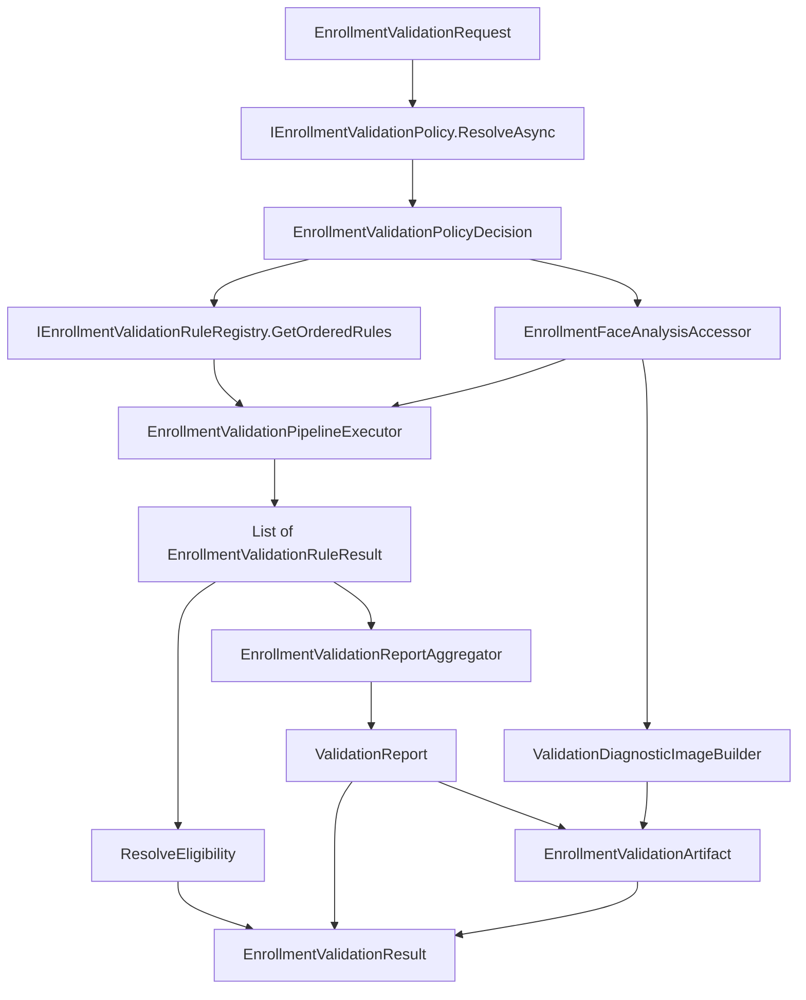

# AI20.PHASE2.1.4A — Validation Framework Enhancements

**Phase:** AI20.PHASE2.1.4A  
**Status:** Implemented  
**Scope:** Internal architecture only — external validation behavior preserved from AI20.PHASE2.1.4

---

## Objective

Improve extensibility of the Enrollment Validation framework without changing its external behavior. `IEnrollmentValidationService` continues to produce identical pass/fail eligibility decisions. Additive properties (`Artifact`, `ValidationProfile` on request) are backward compatible.

---

## Pipeline Diagram



**Service flow (never hardcodes rule order):**

1. Load policy (profile + thresholds + severity overrides)
2. Load ordered rules from registry
3. Execute rules via pipeline executor
4. Aggregate results into `ValidationReport`
5. Build optional diagnostic images and `EnrollmentValidationArtifact`
6. Return `EnrollmentValidationResult` (unchanged contract + additive `Artifact`)

---

## Rule Architecture

### Contract

`IEnrollmentValidationRule` defines:

| Member | Purpose |
|--------|---------|
| `Name` | Stable rule identifier (`EnrollmentValidationRuleIds`) |
| `Order` | Pipeline sort key — **not** hardcoded in service |
| `Enabled` | Rule-level default enablement |
| `Enforcement` | Hard / Warning / Information default |
| `ExecuteAsync` | Single-responsibility evaluation |

Each rule returns exactly one `EnrollmentValidationRuleResult`:

- `RuleName`, `Passed`, `Severity`, `FailureCode`, `WarningCode`, `Message`, `ExecutionTime`, `Telemetry`

### Initial Rules (12 active + 8 future placeholders)

| Order | Rule | Responsibility |
|------:|------|----------------|
| 10 | `ImageFormatRule` | MIME/extension/size gate |
| 20 | `CorruptImageRule` | Decode integrity |
| 30 | `MinimumResolutionRule` | Minimum source dimensions |
| 40 | `MaximumResolutionRule` | Maximum source dimensions |
| 50 | `ExactlyOneFaceRule` | Single face requirement |
| 55 | `FaceConfidenceRule` | Detection score threshold |
| 60 | `MinimumFaceCropResolutionRule` | Face crop pixel minimum |
| 70 | `FaceCoverageRule` | Face area ratio in frame |
| 80 | `BlurRule` | Laplacian blur score |
| 90 | `PoseRule` | Yaw/pitch/roll limits |
| 100 | `BrightnessRule` | Luminance range |
| 110 | `ContrastRule` | Contrast minimum |

Future disabled rules live in `FutureValidationRuleFactory` (glasses, mask, occlusion, etc.).

### Rule Isolation

- Rules are **stateless**; context is passed via `EnrollmentValidationRuleContext`.
- Shared analysis is **lazy and cached** in `EnrollmentFaceAnalysisAccessor` (single decode, single InsightFace call).
- Integrity/resolution failures call `MarkDetectionSkipped()` — face detection is not invoked (preserves 2.1.4 behavior).

### Extended Severities

`ValidationRuleOutcome` now includes:

- `Pass`, `Fail`, `Skipped`, `Warning`, `Information`, `NotApplicable`

**Eligibility:** only `Fail` with a `FailureCategory` rejects enrollment. Warnings and information never block enrollment.

---

## Registry Design

`IEnrollmentValidationRuleRegistry`:

- **Discover** — DI registers all `IEnrollmentValidationRule` implementations
- **Register** — runtime `Register()` for future dynamic loading
- **Order** — `GetOrderedRules(profile)` sorts by `Order`, then `Name`
- **Enable/Disable** — `IsRuleEnabled(ruleName, profile)` consults profile `EnabledRules`

`ValidationService` requests rules **only** through the registry.

---

## Validation Profiles

`ValidationProfileKind`: Default, Strict, Mobile, Kiosk, Passport, Exam

Each `ValidationProfileDefinition` specifies:

- `EnabledRules` — per-rule on/off (empty = all enabled)
- `ThresholdOverrides` — merged onto policy base thresholds
- `SeverityOverrides` — map rule name → Warning/Information enforcement

Profiles are static definitions in `ValidationProfiles.cs`. Institutions select via `EnrollmentValidationRequest.ValidationProfile` (optional; defaults to Default). No UI in this phase.

---

## Policy Layer

`IEnrollmentValidationPolicy` resolves institution-specific behavior:

```
ValidationService → ValidationPolicy → Thresholds → Rules
```

`EnrollmentValidationPolicyRequest` supports future SaaS dimensions:

- Tenant, College, Program, Exam, Admission Type (interfaces only; no storage)

`DefaultEnrollmentValidationPolicy` merges:

1. `EnrollmentValidationOptions` (appsettings)
2. Selected validation profile overrides
3. Future tenant-specific overrides (extension point)

**ValidationService never hardcodes thresholds.**

---

## Artifact Design

`EnrollmentValidationArtifact` (immutable record):

| Field | Description |
|-------|-------------|
| `Report` | Full aggregated validation report |
| `AlignedFaceImage` | WebP bytes when passed |
| `BoundingBox` | Detected face rectangle |
| `Landmarks` | 5-point landmarks |
| `FaceQualityMetrics` | Blur, brightness, contrast, pose |
| `QualityScore` | Composite from report |
| `Telemetry` | Execution metrics |
| `TimestampUtc` | Validation timestamp |
| `CorrelationId` | Pipeline correlation |
| `DiagnosticImages` | Optional debug bundle |

Created by `ValidationDiagnosticImageBuilder` inside the service. **Not persisted. No embeddings.**

`EnrollmentValidationResult.Artifact` is additive; existing consumers of `AlignedFaceBytes` and `Report` unchanged.

---

## Validation Cache (Framework Seam)

`IValidationCache`: `LookupAsync`, `StoreAsync`, `InvalidateAsync`

- Registered as `NoOpValidationCache` (no persistence)
- Future phases may key on image hash
- Not wired into hot path yet — DI-ready extension point

---

## Diagnostic Images

`ValidationDiagnosticImage` (optional, in-memory only):

- Original Image, Aligned Face, Bounding Box Overlay, Landmarks Overlay, Face Crop

Not persisted. Not exposed through API. For future debugging only.

---

## Performance Analysis

| Concern | Mitigation |
|---------|------------|
| Repeated decode | `EnrollmentFaceAnalysisAccessor` caches decode result |
| Repeated InsightFace | Single `AnalyzeAsync` per validation when detection not skipped |
| Repeated quality analysis | `GetQualityMetricsAsync` caches metrics from aligned WebP |
| Thread safety | Stateless rules + per-request accessor instance |
| Early exit | `MarkDetectionSkipped()` after format/decode/resolution failures |
| Rule ordering cost | O(n log n) sort once per validation from registry |

---

## Future Extension Points

1. **Configuration-driven rules** — load rule enablement from DB via registry
2. **Tenant policy storage** — implement `IEnrollmentValidationPolicy` with repository
3. **Validation cache** — swap `NoOpValidationCache` for Redis/in-memory keyed by hash
4. **Custom rules** — implement `IEnrollmentValidationRule`, register in DI
5. **Diagnostic overlays** — extend `ValidationDiagnosticImageBuilder` with ImageSharp drawing
6. **Profile catalog API** — expose profile list without changing validation contracts

---

## Backward Compatibility

| Area | Status |
|------|--------|
| `IEnrollmentValidationService.ValidateAsync` | Unchanged signature |
| Pass/fail eligibility | Preserved (18 original service tests pass) |
| `ValidationReport.RuleResults` | Same rule IDs via aggregator |
| `AlignedFaceBytes` on result | Unchanged |
| Embedding engine, storage, batch, API | Not modified |

---

## Testing

`EnrollmentValidationFrameworkTests` covers:

- Rule registry ordering and enable/disable
- Validation profiles (Strict thresholds)
- Warning aggregation (severity override → pass with warning)
- Artifact creation on successful validation
- Rule isolation (independent execution)
- Pipeline execution
- Cache interface (NoOp)
- Diagnostic image generation path

**Result:** 53/53 unit tests pass (26 validation-specific).

---

## Files Modified / Created

### Application

| File | Action |
|------|--------|
| `Common/Interfaces/IEnrollmentValidationRule.cs` | Created |
| `Common/Interfaces/IEnrollmentValidationRuleRegistry.cs` | Created |
| `Common/Interfaces/IEnrollmentValidationPolicy.cs` | Created |
| `Common/Interfaces/IValidationCache.cs` | Created |
| `Enrollment/Validation/ValidationProfiles.cs` | Created |
| `Enrollment/Validation/EnrollmentValidationFrameworkModels.cs` | Created |
| `Enrollment/Validation/EnrollmentValidationPolicyModels.cs` | Created |
| `Enrollment/Validation/EnrollmentValidationRuleResult.cs` | Created |
| `Enrollment/Validation/EnrollmentValidationModels.cs` | Modified |
| `Enrollment/Validation/ValidationReport.cs` | Modified |

### Infrastructure

| File | Action |
|------|--------|
| `DependencyInjection.cs` | Modified |
| `Abhyanvaya.Infrastructure.csproj` | Modified |
| `Enrollment/Validation/EnrollmentValidationService.cs` | Modified |
| `Enrollment/Validation/EnrollmentValidationRuleRegistry.cs` | Created |
| `Enrollment/Validation/EnrollmentValidationPipelineExecutor.cs` | Created |
| `Enrollment/Validation/EnrollmentValidationReportAggregator.cs` | Created |
| `Enrollment/Validation/EnrollmentValidationThresholdMapper.cs` | Created |
| `Enrollment/Validation/DefaultEnrollmentValidationPolicy.cs` | Created |
| `Enrollment/Validation/EnrollmentFaceAnalysisAccessor.cs` | Created |
| `Enrollment/Validation/ValidationDiagnosticImageBuilder.cs` | Created |
| `Enrollment/Validation/NoOpValidationCache.cs` | Created |
| `Enrollment/Validation/Rules/EnrollmentValidationRuleBase.cs` | Created |
| `Enrollment/Validation/Rules/EnrollmentValidationRules.cs` | Created |
| `Enrollment/Validation/Rules/FutureValidationRuleFactory.cs` | Created |

### Tests

| File | Action |
|------|--------|
| `Enrollment/Validation/EnrollmentValidationFrameworkTests.cs` | Created |
| `Enrollment/Validation/EnrollmentValidationTestFactory.cs` | Created |
| `Enrollment/Validation/EnrollmentValidationServiceTests.cs` | Modified |

### Documentation

| File | Action |
|------|--------|
| `docs/AI20_PHASE2_IMPLEMENTATION_4A_VALIDATION_FRAMEWORK_ENHANCEMENTS.md` | Created |

---

## Verification

```
dotnet test Abhyanvaya.Application.UnitTests --filter FullyQualifiedName~Enrollment.Validation
Passed: 53, Failed: 0
```

No duplicated AI logic — rules delegate to existing `EnrollmentImageIntegrityChecker`, `IEnrollmentFaceAnalysisService` / InsightFace, and `EnrollmentFaceQualityAnalyzer`.
