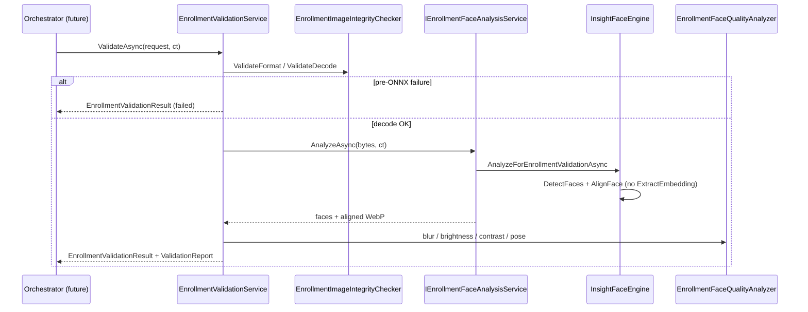

# AI20.PHASE2.1.4 — Enrollment Validation Service Review

**Milestone:** AI20.PHASE2.1.4  
**Status:** Implemented  
**Prerequisites:** `AI20_PHASE2_IMPLEMENTATION_4_REUSE_ANALYSIS.md`, `AI20_PHASE2_VALIDATION_RULE_MATRIX.md`

---

## 1. Responsibilities

`IEnrollmentValidationService` is a **pure evaluation engine**:

| Does | Does NOT |
|---|---|
| Decode and validate image integrity/format | Download photos |
| Run ONNX face detection via existing engine | Generate embeddings |
| Enforce enrollment quality gates | Persist media or DB rows |
| Align single-face crop (WebP bytes on success) | Call progress reporter, batch service, orchestrator |
| Produce `ValidationReport` + telemetry | Log image bytes |

---

## 2. Validation Pipeline

```
EnrollmentValidationRequest (stream + metadata + execution context)
  → Format / size pre-check
  → Image.IdentifyAsync (corrupt / dimensions)
  → Source min/max resolution (pre-ONNX short-circuit)
  → IEnrollmentFaceAnalysisService.AnalyzeAsync (DetectFaces + AlignFace, no embedding)
  → Face-count / confidence / crop / coverage / blur / pose / brightness / contrast rules
  → Future rules (Skipped)
  → Composite score (informational)
  → EnrollmentValidationResult
```

---

## 3. Rule Matrix

Authoritative matrix: `docs/AI20_PHASE2_VALIDATION_RULE_MATRIX.md`

12 required rules + 8 future extension points (Skipped). First hard failure sets `FailureCategory` + `DiagnosticCode`.

---

## 4. Sequence Diagram



---

## 5. ValidationReport Example (passed)

```json
{
  "overallResult": "Passed",
  "overallScore": 0.87,
  "faceCount": 1,
  "faceConfidence": 0.94,
  "detectionConfidence": 0.94,
  "blurScore": 312.5,
  "pose": { "yaw": 2.1, "pitch": -1.0, "roll": 0.5, "deviation": 1.4 },
  "brightness": 0.52,
  "contrast": 0.21,
  "sourceWidth": 800,
  "sourceHeight": 600,
  "faceWidth": 220,
  "faceHeight": 260,
  "faceCoveragePercent": 11.9,
  "faceSizeRatio": 0.119,
  "compositeScore": 0.87,
  "ruleResults": [ { "ruleId": "ExactlyOneFace", "outcome": "Pass" } ],
  "validationFailures": [],
  "warnings": []
}
```

---

## 6. Composite Score Algorithm

Informational only — **never** determines pass/fail.

```
CompositeScore = (w1 * norm(DetectionConfidence)
                + w2 * norm(FaceSizeRatio / (2 * MinCoverage))
                + w3 * norm(BlurScore / BlurNormalizationReference)
                + w4 * (1 - norm(Pose.Deviation / MaxPoseDeviation)))
              / (w1 + w2 + w3 + w4)
```

Default weights (`EnrollmentValidationOptions`): detection **0.40**, face area **0.20**, sharpness **0.25**, pose **0.15**.

Each `norm(x)` clamps to `[0, 1]`.

---

## 7. Future Extension Points

`FutureEnrollmentValidationRules` registers eight disabled rules returning `ValidationRuleOutcome.Skipped`:

Liveness, MaskDetection, EyeOpenness, SpoofDetection, Occlusion, Sunglasses, Smile, Expression.

No AI models loaded in v1.

---

## 8. Performance Review

| Stage | Cost |
|---|---|
| Format / identify | O(1) header read |
| Source resolution | O(1) |
| ONNX detection | Same SCRFD session as recognition (singleton host) |
| Alignment | One 112×112 warp per single-face path |
| Laplacian / luma | O(pixels) on 112×112 crop — negligible vs ONNX |
| Embedding | **Not executed** |

Service is **stateless** (scoped DI, no mutable fields). Safe for parallel workers bounded by existing embedding semaphore policy.

---

## 9. Evidence

### Build

```
dotnet build Abhyanvaya.Infrastructure  → 0 errors
dotnet test Abhyanvaya.Application.UnitTests → 45/45 passed (18 new validation tests)
```

### Tests (18 new)

Valid image, no face, multiple faces, low resolution, blur, brightness, contrast, corrupt, unsupported format, cancellation, thread safety, telemetry, composite score informational, report rule outcomes, future placeholders, quality analyzer unit tests.

---

## 10. Modified / Created Files

### Application

| File | Action |
|---|---|
| `Abhyanvaya.Application/Common/Interfaces/IEnrollmentValidationService.cs` | Created |
| `Abhyanvaya.Application/Common/Interfaces/IEnrollmentFaceAnalysisService.cs` | Created |
| `Abhyanvaya.Application/Enrollment/Validation/EnrollmentValidationModels.cs` | Created |
| `Abhyanvaya.Application/Enrollment/Validation/ValidationReport.cs` | Created |
| `Abhyanvaya.Application/Enrollment/Validation/EnrollmentValidationRuleIds.cs` | Created |
| `Abhyanvaya.Application/Enrollment/Validation/EnrollmentValidationDiagnosticCodes.cs` | Created |

### Infrastructure

| File | Action |
|---|---|
| `Abhyanvaya.Infrastructure/InsightFace/InsightFaceEngine.cs` | Modified — `AnalyzeForEnrollmentValidationAsync` |
| `Abhyanvaya.Infrastructure/InsightFace/EnrollmentFaceAnalysisEngineResult.cs` | Created |
| `Abhyanvaya.Infrastructure/InsightFace/InsightFaceEnrollmentFaceAnalysisService.cs` | Created |
| `Abhyanvaya.Infrastructure/Enrollment/Validation/EnrollmentValidationService.cs` | Created |
| `Abhyanvaya.Infrastructure/Enrollment/Validation/EnrollmentValidationOptions.cs` | Created |
| `Abhyanvaya.Infrastructure/Enrollment/Validation/EnrollmentImageIntegrityChecker.cs` | Created |
| `Abhyanvaya.Infrastructure/Enrollment/Validation/EnrollmentFaceQualityAnalyzer.cs` | Created |
| `Abhyanvaya.Infrastructure/Enrollment/Validation/Rules/FutureEnrollmentValidationRules.cs` | Created |
| `Abhyanvaya.Infrastructure/DependencyInjection.cs` | Modified — DI registration |
| `Abhyanvaya.Infrastructure/Abhyanvaya.Infrastructure.csproj` | Modified — InternalsVisibleTo |

### Tests

| File | Action |
|---|---|
| `Abhyanvaya.Application.UnitTests/Enrollment/Validation/EnrollmentValidationServiceTests.cs` | Created |
| `Abhyanvaya.Application.UnitTests/Enrollment/Validation/EnrollmentFaceQualityAnalyzerTests.cs` | Created |
| `Abhyanvaya.Application.UnitTests/Abhyanvaya.Application.UnitTests.csproj` | Modified — ImageSharp ref |

### Documentation

| File | Action |
|---|---|
| `docs/AI20_PHASE2_IMPLEMENTATION_4_REUSE_ANALYSIS.md` | Created |
| `docs/AI20_PHASE2_VALIDATION_RULE_MATRIX.md` | Created |
| `docs/AI20_PHASE2_IMPLEMENTATION_4_VALIDATION_SERVICE_REVIEW.md` | Created |

---

## Constraints Verified

- Recognition / attendance pipelines — unchanged  
- Embedding engine / storage / repositories / progress reporter / batch service — not referenced  
- No schema changes, no UI changes  
- No duplicated ONNX / SCRFD logic  
