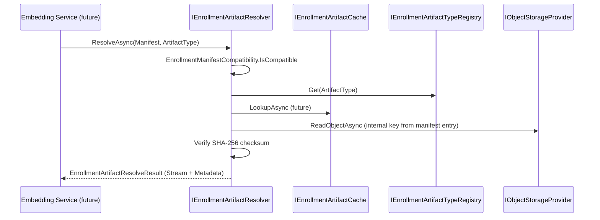
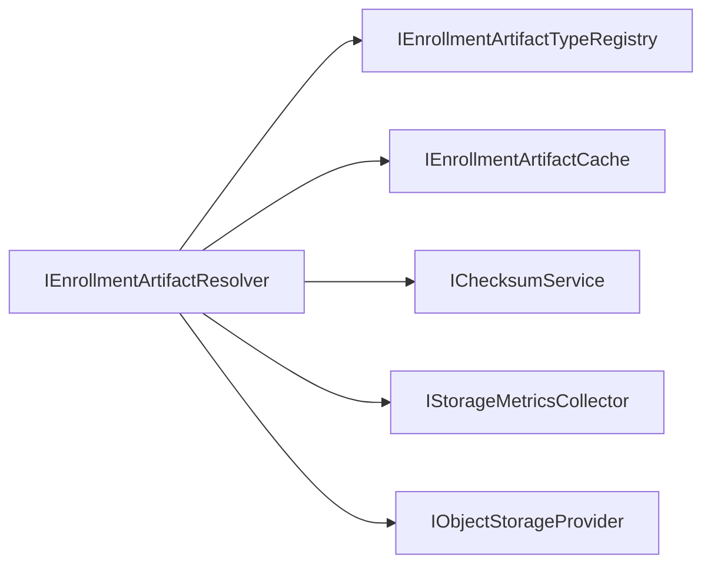

# AI20.PHASE2.1.5A — Artifact Resolver

**Phase:** AI20.PHASE2.1.5A  
**Status:** Implemented

---

## Architecture

`IEnrollmentArtifactResolver` is the **only** component that resolves enrollment artifacts from storage for downstream consumers (embedding engine). It accepts a manifest + artifact type and returns a streaming `EnrollmentArtifact` without exposing object keys, buckets, or provider paths.



---

## Artifact Flow

1. Validate manifest version compatibility
2. Confirm artifact type is registered (unsupported types fail fast)
3. Optional cache lookup (`NoOpEnrollmentArtifactCache` today)
4. Locate manifest entry by type (latest version)
5. Stream object from storage provider (infrastructure-only object key)
6. Verify checksum (buffer small artifacts; streaming wrapper for large)
7. Return `EnrollmentArtifact` — **no** `ObjectKey`, `StoragePath`, or provider details

---

## Future Cache Strategy

| Layer | Interface | Status |
|-------|-----------|--------|
| Memory | `IEnrollmentArtifactCache` | Interface + `NoOpEnrollmentArtifactCache` |
| Distributed | Same interface | Future Redis implementation |
| Image hash key | Cache key = `(ManifestId, ArtifactType)` | Extension point documented |

Public contracts unchanged when cache is enabled — resolver checks cache before object storage.

---

## Dependency Diagram



Embedding service depends only on `IEnrollmentArtifactResolver`.

---

## Error Handling (Result Pattern)

| Code | Condition |
|------|-----------|
| `artifact.missing` | Type registered but not in manifest |
| `artifact.unsupported` | Type not in registry |
| `artifact.checksum_mismatch` | SHA-256 verification failed |
| `manifest.incompatible` | Manifest version too new |
| `artifact.stream_unavailable` | Object not found in storage |

---

## Files Modified / Created

### Application
| File | Action |
|------|--------|
| `Common/Interfaces/IEnrollmentArtifactResolver.cs` | Created |
| `Common/Interfaces/IEnrollmentArtifactCache.cs` | Created |
| `Common/Interfaces/IStorageMetricsCollector.cs` | Created |
| `Common/Interfaces/IEnrollmentStorageStep.cs` | Created |
| `Enrollment/Storage/EnrollmentArtifactModels.cs` | Created |
| `Enrollment/Storage/EnrollmentStoragePipelineContext.cs` | Created |
| `Enrollment/Storage/EnrollmentManifestCompatibility.cs` | Created |
| `Enrollment/Storage/EnrollmentStorageModels.cs` | Modified (manifest versions, policy tiers) |

### Infrastructure
| File | Action |
|------|--------|
| `Enrollment/Storage/EnrollmentArtifactResolver.cs` | Created |
| `Enrollment/Storage/NoOpEnrollmentArtifactCache.cs` | Created |
| `Enrollment/Storage/NoOpStorageMetricsCollector.cs` | Created |
| `Enrollment/Storage/EnrollmentStorageMappers.cs` | Created |
| `Enrollment/Storage/EnrollmentStorageService.cs` | Modified (pipeline orchestrator) |
| `Enrollment/Storage/DefaultEnrollmentStoragePolicy.cs` | Modified |
| `Enrollment/Storage/Pipeline/EnrollmentStoragePipelineExecutor.cs` | Created |
| `Enrollment/Storage/Pipeline/EnrollmentStoragePipelineSteps.cs` | Created |
| `DependencyInjection.cs` | Modified |

### Tests
| File | Action |
|------|--------|
| `Enrollment/Storage/EnrollmentArtifactResolverTests.cs` | Created |
| `Enrollment/Storage/EnrollmentStorageTestFactory.cs` | Created |
| `Enrollment/Storage/EnrollmentStorageServiceTests.cs` | Modified |

---

## Verification

```
dotnet test --filter FullyQualifiedName~Enrollment
Passed: 72
```
