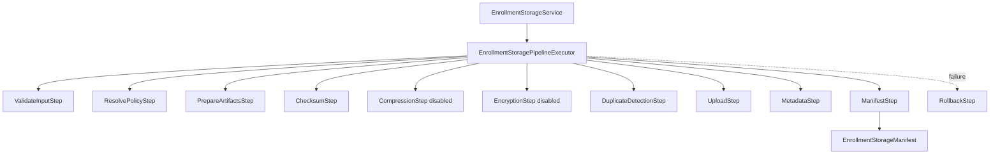

# AI20.PHASE2.1.5B — Storage Pipeline Framework

**Phase:** AI20.PHASE2.1.5B  
**Status:** Implemented

---

## Objective

Refactor `EnrollmentStorageService` into a pluggable pipeline without changing external storage behavior.

---

## Pipeline Diagram

---

## Steps

| Order | Step | Responsibility | Enabled |
|------:|------|----------------|---------|
| 10 | ValidateInputStep | Validation report must pass | Yes |
| 20 | ResolvePolicyStep | `IEnrollmentStoragePolicy` | Yes |
| 30 | PrepareArtifactsStep | Registry payload extraction | Yes |
| 40 | ChecksumStep | SHA-256 via `IChecksumService` | Yes |
| 45 | CompressionStep | Future compression | No |
| 47 | EncryptionStep | Future encryption | No |
| 50 | DuplicateDetectionStep | Checksum deduplication | Yes |
| 60 | UploadStep | `IObjectStorageProvider` write | Yes |
| 70 | MetadataStep | DB transaction | Yes |
| 80 | ManifestStep | Build versioned manifest | Yes |
| — | RollbackStep | Delete orphaned objects on failure | On error |

---

## Manifest Versioning

Every `EnrollmentStorageManifest` now includes:

| Field | Purpose |
|-------|---------|
| `ManifestVersion` | Manifest contract version |
| `SchemaVersion` | JSON/schema version |
| `PipelineVersion` | Enrollment pipeline version |
| `ValidationVersion` | Validation report schema |
| `StorageVersion` | Storage metadata schema |
| `ArtifactVersion` | Highest artifact version in group |

### Compatibility Matrix

| Manifest | Schema | Storage | Validation | Consumer |
|----------|--------|---------|------------|----------|
| 1 | 1 | 1 | 1 | Resolver + Embedding (current) |

Validated via `EnrollmentManifestCompatibility.IsCompatible()` before artifact resolution.

---

## Storage Policy Enhancements

`EnrollmentStoragePolicyDecision` extended with:

- `StorageLifecycleTier`: Hot, Cool, Archive, Delete
- `StorageRetentionAction`: Retain, Archive, Delete
- `EnableReplication`, `LegalHold`
- Existing: compression, encryption, retention days

Default policy: Hot tier, Retain, no compression/encryption/replication/legal hold.

---

## Metrics Abstraction

`IStorageMetricsCollector` records:

- Upload/download time and throughput
- Provider latency
- Checksum and pipeline duration
- Failure rate

Implemented as `NoOpStorageMetricsCollector` — ready for DataDog, OpenTelemetry, or Prometheus adapters without changing pipeline code.

---

## Extension Points

- Register new `IEnrollmentStorageStep` implementations in DI
- Enable CompressionStep / EncryptionStep when ready
- Swap `NoOpStorageMetricsCollector` for real telemetry
- Add VirusScanStep, WatermarkStep, ReplicationStep as future steps

---

## Files Modified / Created

See `AI20_PHASE2_IMPLEMENTATION_5A_ARTIFACT_RESOLVER.md` for complete file list. Key pipeline files:

- `Pipeline/EnrollmentStoragePipelineExecutor.cs`
- `Pipeline/EnrollmentStoragePipelineSteps.cs`
- `Enrollment/Storage/EnrollmentStoragePipelineContext.cs`

---

## Verification

Storage service tests continue to pass with pipeline-backed implementation. Total enrollment tests: **72/72**.
