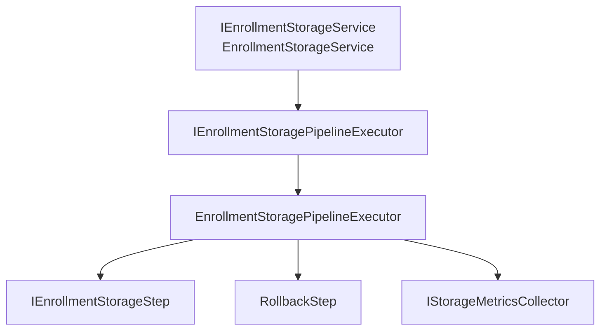

# AI20.PHASE2.1.5F — Storage Pipeline Dependency Inversion

**Milestone:** Refactoring only — no functional or behavioral changes.

## Objective

Introduce complete Dependency Inversion for the Enrollment Storage Pipeline so `EnrollmentStorageService` never depends on the concrete `EnrollmentStoragePipelineExecutor`.

## Before

```
EnrollmentStorageService
        ↓ (concrete)
EnrollmentStoragePipelineExecutor
        ↓
IEnrollmentStorageStep[]
```

`EnrollmentStorageService` constructor accepted `EnrollmentStoragePipelineExecutor` directly. DI registered only the concrete executor.

## After

```
EnrollmentStorageService
        ↓
IEnrollmentStoragePipelineExecutor
        ↓
EnrollmentStoragePipelineExecutor
        ↓
IEnrollmentStorageStep[]
```

`EnrollmentStorageService` depends only on `IEnrollmentStoragePipelineExecutor`. The concrete executor is registered in DI and resolved through the interface.

## Dependency Graph



## Interface Contract

`IEnrollmentStoragePipelineExecutor` exposes:

| Member | Purpose |
|--------|---------|
| `ExecuteAsync(context, ct)` | Runs ordered storage steps (unchanged behavior) |
| `DescribePipeline()` | Returns ordered step metadata (added in 5G for self-describing pipeline) |

The interface is designed to support future **decorators** without changing `EnrollmentStorageService`:

- Metrics decorator
- Tracing decorator
- Retry decorator
- Circuit breaker decorator
- Caching decorator

Example future registration:

```csharp
services.AddScoped<EnrollmentStoragePipelineExecutor>();
services.AddScoped<IEnrollmentStoragePipelineExecutor>(sp =>
    new TracingStoragePipelineDecorator(
        sp.GetRequiredService<EnrollmentStoragePipelineExecutor>()));
```

## DI Registration

```csharp
services.AddScoped<EnrollmentStoragePipelineExecutor>();
services.AddScoped<IEnrollmentStoragePipelineExecutor>(sp =>
    sp.GetRequiredService<EnrollmentStoragePipelineExecutor>());
```

## Testing

| Test | Validates |
|------|-----------|
| `DependencyInjection_ResolvesPipelineExecutorAsInterface` | Interface resolves to concrete executor |
| `StoreAsync_DelegatesToPipelineExecutor` | Service uses mocked executor (no concrete coupling) |
| Existing `EnrollmentStorageServiceTests` (10 tests) | End-to-end storage behavior unchanged |

**Result:** 79/79 enrollment unit tests passing.

## Files Created

| File |
|------|
| `Abhyanvaya.Application/Common/Interfaces/IEnrollmentStoragePipelineExecutor.cs` |
| `Abhyanvaya.Application.UnitTests/Enrollment/Storage/EnrollmentStoragePipelineExecutorTests.cs` |
| `docs/AI20_PHASE2_IMPLEMENTATION_5F_PIPELINE_DEPENDENCY_INVERSION.md` |

## Files Modified

| File | Change |
|------|--------|
| `Abhyanvaya.Infrastructure/Enrollment/Storage/EnrollmentStorageService.cs` | Depends on `IEnrollmentStoragePipelineExecutor` |
| `Abhyanvaya.Infrastructure/Enrollment/Storage/Pipeline/EnrollmentStoragePipelineExecutor.cs` | Implements interface |
| `Abhyanvaya.Infrastructure/DependencyInjection.cs` | Registers interface → implementation |
| `Abhyanvaya.Application.UnitTests/Enrollment/Storage/EnrollmentStorageTestFactory.cs` | Returns interface type |

## Verification

- 0 build errors
- 0 new warnings introduced
- All enrollment tests pass
- No execution logic changes
- Backward compatibility maintained
