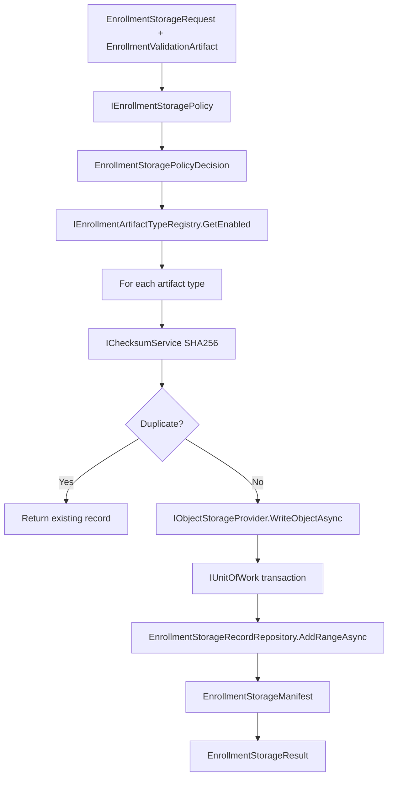

# AI20.PHASE2.1.5 — Storage Service Review

**Phase:** AI20.PHASE2.1.5  
**Status:** Implemented  
**Scope:** Enrollment artifact persistence only — no validation, embedding, batch, or progress logic.

---

## Architecture Diagram



---

## Storage Flow

1. Validate artifact (`ValidationReport.OverallResult == Passed`).
2. Resolve storage policy (enabled artifact types, retention metadata).
3. For each enabled artifact type from registry (no switch statements):
   - Extract payload via `IEnrollmentArtifactTypeDefinition.TryCreatePayloadAsync`
   - Compute SHA-256 checksum
   - Check duplicate via `(TenantId, StudentId, ArtifactType, Checksum)`
   - Assign next `ArtifactVersion` (append-only)
   - Build deterministic object key
   - Upload to object storage
4. Persist metadata in DB transaction (`SaveChangesAsync`).
5. On metadata failure: delete uploaded objects (rollback).
6. Build immutable `EnrollmentStorageManifest` for downstream embedding phase.

---

## Versioning Strategy

| Version | Meaning |
|---------|---------|
| `ArtifactVersion` | Per student + artifact type sequence; never overwritten |
| `StorageVersion` | Storage schema version (`EnrollmentStorageVersions.StorageSchemaVersion = 1`) |
| `PipelineVersion` | From enrollment batch/request |
| `ValidationVersion` | Validation report schema version (`= 1`) |

Append-only: new store operation creates new rows and new object keys under `.../v{pipelineVersion}/a{artifactVersion}/`.

---

## Checksum Strategy

- Algorithm: SHA-256 lowercase hex (64 chars)
- Service: `IChecksumService` / `Sha256ChecksumService`
- Computed once per artifact payload before upload
- Persisted on `EnrollmentStorageRecord.Checksum`
- Used for duplicate detection (returns existing record, skips re-upload)

---

## Metadata Schema

**Table:** `EnrollmentStorageRecord`

| Column | Type | Purpose |
|--------|------|---------|
| Id | uuid | Storage record identifier |
| StorageGroupId | uuid | Links artifacts from one store operation |
| TenantId, CollegeId, AcademicYear, StudentId | int | Scope |
| BatchId, ItemId | uuid | Enrollment attempt linkage |
| ArtifactType | varchar(64) | From registry |
| ObjectKey | varchar(1000) | Deterministic storage path |
| StorageProvider | varchar(64) | Active provider name |
| Checksum | varchar(64) | SHA-256 hex |
| ContentType | varchar(128) | MIME type |
| FileSize | bigint | Bytes stored |
| ImageWidth/Height | int? | Image metadata when applicable |
| ArtifactVersion | int | Append-only version |
| StorageVersion, PipelineVersion, ValidationVersion | int | Versioning |
| ValidationProfile | varchar(64)? | Profile name |
| CorrelationId | uuid | Pipeline correlation |
| IsPrimary | bool | Primary artifact (AlignedFace) |
| CreatedUtc | timestamptz | Immutable timestamp |

---

## Object Path Strategy

```
enrollment/{tenantId}/{collegeId}/{academicYear}/{studentId}/v{pipelineVersion}/a{artifactVersion}/{artifactType}{extension}
```

Examples:
- `.../AlignedFace.webp`
- `.../ValidationReport.json`

Canonical student photo base (engine contract): `students/{tenantId}/{studentId}` via `StudentMediaPaths`.

Provider-specific paths never leak outside Infrastructure/API adapter layer.

---

## Failure Matrix

| Condition | Behavior |
|-----------|----------|
| Validation not passed | Return `Success=false`, no upload |
| Missing aligned face payload | Primary missing → failure after rollback |
| Duplicate checksum | Return existing record, skip upload |
| Object storage unavailable | Catch, delete partial uploads, return failure |
| Metadata save fails | Delete uploaded objects, return failure |
| Provider throws | Log error, rollback objects |

---

## Recovery Strategy

- **Partial upload:** `RollbackUploadedObjectsAsync` deletes keys uploaded in failed operation.
- **Metadata failure:** Same rollback path; no orphaned DB rows (transaction rolls back).
- **Duplicate:** Idempotent return of existing `StorageRecordId` — safe for retries.

---

## Performance Notes

- Single checksum computation per artifact before upload.
- One `MemoryStream` per artifact for upload (aligned face typically small ~112×112 WebP).
- No validation re-processing; consumes `EnrollmentValidationArtifact` as-is.
- Registry-driven iteration avoids hardcoded type lists.
- Future: stream-through checksum for very large artifacts via `ComputeSha256HexAsync(Stream)`.

---

## Evidence — Files Modified / Created

### Application
| File | Action |
|------|--------|
| `Common/Interfaces/IObjectStorageProvider.cs` | Created |
| `Common/Interfaces/IChecksumService.cs` | Created |
| `Common/Interfaces/IEnrollmentStorageService.cs` | Created |
| `Common/Interfaces/IEnrollmentArtifactTypeRegistry.cs` | Created |
| `Common/Interfaces/IEnrollmentStoragePolicy.cs` | Created |
| `Common/Interfaces/IEnrollmentStorageRecordRepository.cs` | Created |
| `Common/Interfaces/IApplicationDbContext.cs` | Modified |
| `Enrollment/Storage/EnrollmentStorageModels.cs` | Created |

### Domain
| File | Action |
|------|--------|
| `Entities/EnrollmentStorageRecord.cs` | Created |

### Infrastructure
| File | Action |
|------|--------|
| `Enrollment/Storage/EnrollmentStorageService.cs` | Created |
| `Enrollment/Storage/Sha256ChecksumService.cs` | Created |
| `Enrollment/Storage/EnrollmentStoragePathBuilder.cs` | Created |
| `Enrollment/Storage/EnrollmentArtifactTypeRegistry.cs` | Created |
| `Enrollment/Storage/DefaultEnrollmentStoragePolicy.cs` | Created |
| `Enrollment/Storage/ArtifactTypes/EnrollmentArtifactTypeDefinitions.cs` | Created |
| `Persistence/Repositories/EnrollmentStorageRecordRepository.cs` | Created |
| `Persistence/Configurations/EnrollmentStorageRecordConfiguration.cs` | Created |
| `Persistence/ApplicationDbContext.cs` | Modified |
| `DependencyInjection.cs` | Modified |
| `Migrations/*AddEnrollmentStorageRecord*` | Created |

### API
| File | Action |
|------|--------|
| `Media/ObjectStorageProviderAdapter.cs` | Created |
| `Program.cs` | Modified |

### Tests
| File | Action |
|------|--------|
| `Enrollment/Storage/EnrollmentStorageServiceTests.cs` | Created |

### Docs
| File | Action |
|------|--------|
| `docs/AI20_PHASE2_IMPLEMENTATION_5_STORAGE_REUSE_ANALYSIS.md` | Created |
| `docs/AI20_PHASE2_IMPLEMENTATION_5_STORAGE_SERVICE_REVIEW.md` | Created |

---

## Verification

```
dotnet test Abhyanvaya.Application.UnitTests --filter FullyQualifiedName~Enrollment.Storage
```

No duplicated storage provider logic — delegates to existing `IStorageProvider` via `ObjectStorageProviderAdapter`.

Validation framework, progress reporter, batch service, embedding engine unchanged.
