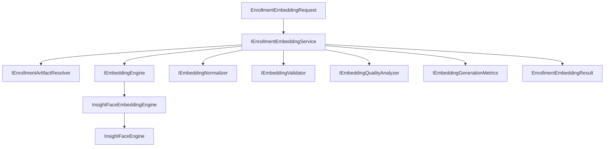
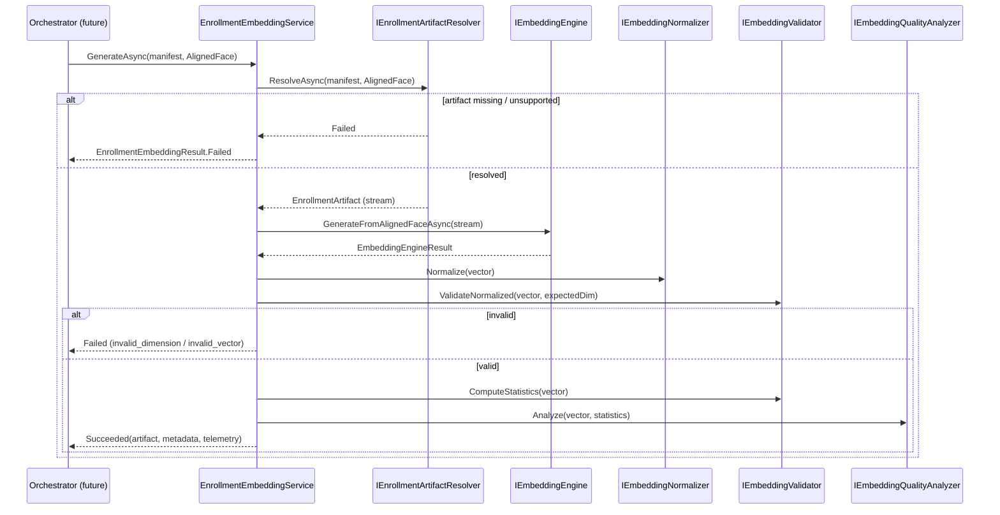

# AI20.PHASE2.1.6 — Enrollment Embedding Service

**Milestone:** AI20.PHASE2.1.6 — sole owner of enrollment face-embedding generation.

## Objective

Implement `IEnrollmentEmbeddingService` — the only component responsible for:

```
Enrollment Artifact (AlignedFace)
        ↓
Embedding Engine
        ↓
Enrollment Embedding Artifact
```

No validation, storage, persistence, progress, or batch updates.

## Architecture



## Sequence Diagram



## Embedding Flow

1. **Resolve** — `IEnrollmentArtifactResolver` loads latest `AlignedFace` entry from manifest (checksum verified).
2. **Verify** — Content type must be `image/*`.
3. **Infer** — `IEmbeddingEngine` decodes stream and runs ArcFace ONNX (no re-detection).
4. **Normalize** — `IEmbeddingNormalizer` L2-normalizes (idempotent with engine output).
5. **Validate** — `IEmbeddingValidator` checks dimension, NaN, Infinity, zero magnitude, unit length.
6. **Analyze** — `IEmbeddingQualityAnalyzer` produces advisory quality score + diagnostics.
7. **Emit** — Immutable `EnrollmentEmbeddingArtifact` + metadata + telemetry.

## Dependency Graph

| Dependency | Role |
|------------|------|
| `IEnrollmentArtifactResolver` | Read aligned face from manifest |
| `IEmbeddingEngine` | Provider-agnostic inference |
| `IEmbeddingValidator` | Vector integrity (delegated — not in service) |
| `IEmbeddingNormalizer` | L2 normalization (reuse) |
| `IEmbeddingQualityAnalyzer` | Advisory diagnostics |
| `IEmbeddingGenerationMetrics` | Success/failure metrics |
| `TimeProvider` | `CreatedUtc` |
| `ILogger` | Structured logging |

**Not depended upon:** storage, validation service, repositories, progress reporter, result writer, object storage.

## Embedding Validation

| Check | Owner |
|-------|-------|
| Expected dimension (512) | `IEmbeddingValidator.Validate` |
| NaN / Infinity | `IEmbeddingValidator.Validate` |
| Zero magnitude | `IEmbeddingValidator.Validate` |
| L2 normalized (|v| ≈ 1) | `IEmbeddingValidator.ValidateNormalized` |
| Statistics (min/max/mean/magnitude) | `IEmbeddingValidator.ComputeStatistics` |
| Quality score / diagnostics | `IEmbeddingQualityAnalyzer` |

Failure codes: `artifact.missing`, `artifact.unsupported`, `embedding.failure`, `embedding.invalid_dimension`, `embedding.invalid_vector`.

## Performance Notes

- **No re-detection** — embeds stored 112×112 aligned WebP directly.
- **Stream-based decode** — artifact stream passed to engine without full buffering (resolver may buffer small artifacts; large artifacts use streaming checksum wrapper).
- **Pooled ONNX tensors** — `ExtractEmbedding` reuses `ArrayPool<float>` (AI16.RUNTIME.3).
- **Stateless service** — safe for concurrent enrollment workers.
- **Future GPU/batching** — swap `IEmbeddingEngine` implementation via DI.

## Reuse Analysis

See `docs/AI20_PHASE2_IMPLEMENTATION_6_REUSE_ANALYSIS.md`.

## Testing

| Test | Coverage |
|------|----------|
| `GenerateAsync_ReturnsEmbeddingArtifact_WhenPipelineSucceeds` | Happy path |
| `GenerateAsync_ReturnsMissingArtifact_WhenResolverFails` | Missing artifact |
| `GenerateAsync_ReturnsInvalidDimension_WhenVectorLengthMismatch` | Dimension gate |
| `GenerateAsync_ReturnsInvalidVector_WhenVectorContainsNaN` | Invalid vector |
| `GenerateAsync_NormalizesVector_ToUnitMagnitude` | Normalization |
| `GenerateAsync_SupportsConcurrentExecution` | Thread safety |
| `GenerateAsync_PropagatesCancellation` | Cancellation |
| `GenerateAsync_HandlesLargeAlignedFaceStream` | Large stream |
| `GenerateAsync_ReturnsEmbeddingFailure_WhenEngineThrows` | Corrupted image |
| `GenerateAsync_PopulatesTelemetryDurations` | Telemetry |

**Result:** 92/92 enrollment unit tests passing.

## Files Created

| File |
|------|
| `Abhyanvaya.Application/Common/Interfaces/IEnrollmentEmbeddingService.cs` |
| `Abhyanvaya.Application/Common/Interfaces/IEmbeddingEngine.cs` |
| `Abhyanvaya.Application/Common/Interfaces/IEmbeddingQualityAnalyzer.cs` |
| `Abhyanvaya.Application/Enrollment/Embedding/EnrollmentEmbeddingModels.cs` |
| `Abhyanvaya.Infrastructure/Enrollment/Embedding/EnrollmentEmbeddingService.cs` |
| `Abhyanvaya.Infrastructure/Enrollment/Embedding/InsightFaceEmbeddingEngine.cs` |
| `Abhyanvaya.Infrastructure/Enrollment/Embedding/EmbeddingQualityAnalyzer.cs` |
| `Abhyanvaya.Application.UnitTests/Enrollment/Embedding/EnrollmentEmbeddingServiceTests.cs` |
| `docs/AI20_PHASE2_IMPLEMENTATION_6_REUSE_ANALYSIS.md` |
| `docs/AI20_PHASE2_IMPLEMENTATION_6_EMBEDDING_SERVICE.md` |

## Files Modified

| File | Change |
|------|--------|
| `Abhyanvaya.Application/Common/Interfaces/IEmbeddingValidator.cs` | Added `ValidateNormalized`, `ComputeStatistics`, `EmbeddingValidationStatistics` |
| `Abhyanvaya.Infrastructure/Embedding/EmbeddingValidator.cs` | Zero-magnitude + normalization + statistics |
| `Abhyanvaya.Infrastructure/InsightFace/InsightFaceEngine.cs` | Added `GenerateEmbeddingFromAlignedFace(Stream)` |
| `Abhyanvaya.Infrastructure/DependencyInjection.cs` | Registered embedding engine + service |

## Verification

- 0 build errors
- 92/92 enrollment tests pass
- No duplicated AI/ONNX logic
- Validation, storage, artifact resolver unchanged
- Backward compatibility maintained for manual upload embedding pipeline
