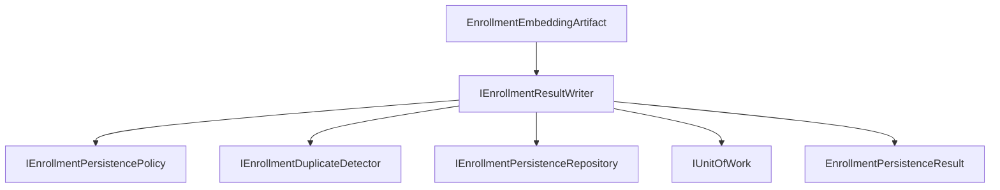
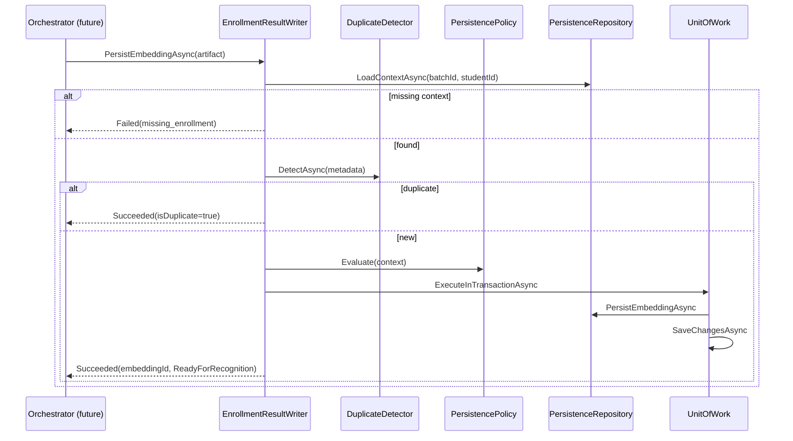

# AI20.PHASE2.1.7 — Enrollment Result Writer

**Milestone:** AI20.PHASE2.1.7 — sole owner of enrollment embedding persistence.

## Objective

Implement `IEnrollmentResultWriter` to persist immutable `EnrollmentEmbeddingArtifact` outputs and finalize enrollment state in a single transaction.

```
EnrollmentEmbeddingArtifact
        ↓
IEnrollmentResultWriter
        ↓
IEnrollmentPersistenceRepository
        ↓
StudentFaceEmbedding + Snapshot + Audit + Item + Batch + Student
```

## Architecture



## Sequence Diagram



## Persistence Flow

1. **Load context** — item + batch + student via `IEnrollmentPersistenceRepository`
2. **Duplicate check** — metadata-only idempotency (`IEnrollmentDuplicateDetector`)
3. **Policy evaluation** — `IEnrollmentPersistencePolicy` (no hardcoded rules in writer)
4. **Single transaction:**
   - Deactivate prior active embeddings (reuse `EmbeddingStorage` pattern)
   - Insert `StudentFaceEmbedding` (vector copy from artifact)
   - Insert `EnrollmentEmbeddingVersionSnapshot` (immutable)
   - Insert `EnrollmentPersistenceAudit`
   - Update `Student.PhotoKey` when item has photo key
   - Transition item `Embedding → Completed`
   - Update batch counters via `EnrollmentBatchCounterRules`
5. **Commit** — one `SaveChangesAsync` inside transaction
6. **Return** — `EnrollmentPersistenceResult` with statistics + telemetry

## Logical Persistence States

| State | Meaning |
|-------|---------|
| `EmbeddingPending` | Item in `Embedding` status awaiting persistence |
| `EmbeddingGenerated` | Artifact received by writer |
| `Persisted` | Transaction committed |
| `ReadyForRecognition` | Active embedding + item Completed |

Maps to existing `EnrollmentStatus.Embedding → Completed` without enum changes.

## Repository Usage

`IEnrollmentPersistenceRepository` is the **only** SQL abstraction used by the writer:

| Method | Purpose |
|--------|---------|
| `LoadContextAsync` | Load item, batch, student |
| `GetEmbeddingByIdAsync` | Duplicate detector lookup |
| `PersistEmbeddingAsync` | All inserts/updates in transaction |

## Transaction Strategy

- One `IUnitOfWork.ExecuteInTransactionAsync` per persist call
- One `SaveChangesAsync` inside the transaction
- Rollback on any failure (concurrency, constraint, infrastructure)
- `DbUpdateConcurrencyException` → `persistence.concurrency_conflict` result

## Idempotency

- Duplicate detection by item status + embedding version + model metadata
- Retry returns existing `EmbeddingId` without creating duplicate rows
- `IsDuplicate=true` on result for callers

## Domain Events (Event-Ready)

| Event | When |
|-------|------|
| `EmbeddingPersisted` | Successful commit |
| `EmbeddingPersistenceFailed` | Database failure |

Not published externally in this phase — models created for future event bus.

## Testing

| Test | Coverage |
|------|----------|
| `PersistEmbeddingAsync_Succeeds_WhenItemIsInEmbeddingStatus` | Happy path |
| `PersistEmbeddingAsync_ReturnsDuplicate_WhenAlreadyPersisted` | Idempotency |
| `PersistEmbeddingAsync_ReturnsMissingEnrollment_WhenContextNotFound` | Missing enrollment |
| `PersistEmbeddingAsync_ReturnsValidationMismatch_WhenStatusIsNotEmbedding` | State guard |
| `PersistEmbeddingAsync_ReturnsConcurrencyConflict_*` | Optimistic concurrency |
| `PersistEmbeddingAsync_ReturnsDatabaseFailure_*` | Repository failure |
| `PersistEmbeddingAsync_PropagatesCancellation` | Cancellation |
| `PersistEmbeddingAsync_HandlesLargeEmbeddingVector` | Large vector |
| `PersistEmbeddingAsync_IsIdempotent_OnRetry` | Retry safety |
| `Policy_RejectsTerminalStatuses` | Policy unit test |

**Result:** 102/102 enrollment unit tests passing.

## Files Created

| File |
|------|
| `Abhyanvaya.Application/Common/Interfaces/IEnrollmentResultWriter.cs` |
| `Abhyanvaya.Application/Common/Interfaces/IEnrollmentPersistenceRepository.cs` |
| `Abhyanvaya.Application/Common/Interfaces/IEnrollmentPersistencePolicy.cs` |
| `Abhyanvaya.Application/Common/Interfaces/IEnrollmentDuplicateDetector.cs` |
| `Abhyanvaya.Application/Common/Interfaces/IEnrollmentPersistenceMetrics.cs` |
| `Abhyanvaya.Application/Enrollment/Persistence/EnrollmentPersistenceModels.cs` |
| `Abhyanvaya.Domain/Entities/EnrollmentEmbeddingVersionSnapshot.cs` |
| `Abhyanvaya.Domain/Entities/EnrollmentPersistenceAudit.cs` |
| `Abhyanvaya.Domain/Events/EnrollmentEmbeddingEvents.cs` |
| `Abhyanvaya.Infrastructure/Enrollment/Persistence/EnrollmentResultWriter.cs` |
| `Abhyanvaya.Infrastructure/Enrollment/Persistence/EnrollmentPersistenceRepository.cs` |
| `Abhyanvaya.Infrastructure/Enrollment/Persistence/DefaultEnrollmentPersistencePolicy.cs` |
| `Abhyanvaya.Infrastructure/Enrollment/Persistence/EnrollmentDuplicateDetector.cs` |
| `Abhyanvaya.Infrastructure/Enrollment/Persistence/NoOpEnrollmentPersistenceMetrics.cs` |
| `Abhyanvaya.Infrastructure/Persistence/Configurations/EnrollmentEmbeddingVersionSnapshotConfiguration.cs` |
| `Abhyanvaya.Infrastructure/Persistence/Configurations/EnrollmentPersistenceAuditConfiguration.cs` |
| `Abhyanvaya.Infrastructure/Migrations/*AddEnrollmentPersistenceTables*` |
| `Abhyanvaya.Application.UnitTests/Enrollment/Persistence/EnrollmentResultWriterTests.cs` |
| `docs/AI20_PHASE2_IMPLEMENTATION_7_REUSE_ANALYSIS.md` |
| `docs/AI20_PHASE2_IMPLEMENTATION_7_RESULT_WRITER.md` |

## Files Modified

| File | Change |
|------|--------|
| `Abhyanvaya.Application/Common/Interfaces/IApplicationDbContext.cs` | New DbSets |
| `Abhyanvaya.Infrastructure/Persistence/ApplicationDbContext.cs` | New DbSets |
| `Abhyanvaya.Infrastructure/DependencyInjection.cs` | DI registrations |

## Verification

- 0 build errors
- 102/102 enrollment tests pass
- No AI logic duplicated
- Validation, storage, embedding, artifact resolver unchanged
- Backward compatibility maintained
