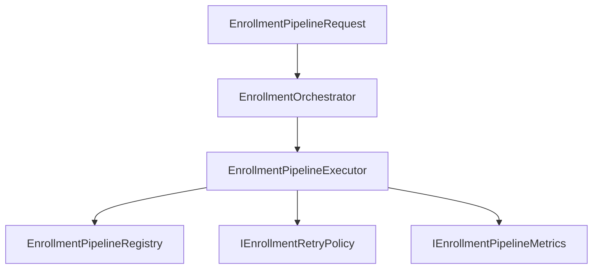
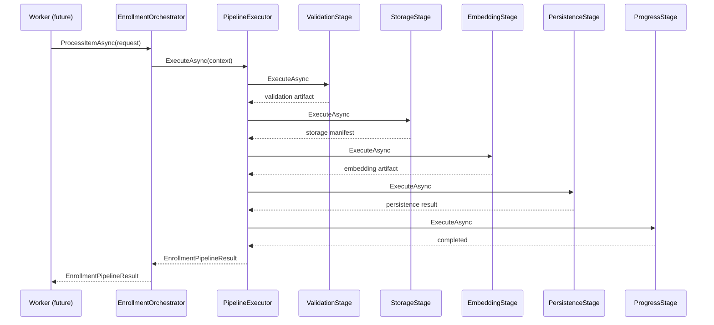

# AI20.PHASE2.1.8 — Enrollment Orchestrator

**Milestone:** AI20.PHASE2.1.8 — sole coordinator of the enrollment end-to-end pipeline.

## Objective

Implement `IEnrollmentOrchestrator` as the only workflow coordinator. It owns sequence, error propagation, cancellation, and progress invocation — nothing else.

```
EnrollmentPipelineRequest
        ↓
IEnrollmentOrchestrator
        ↓
IEnrollmentPipelineExecutor
        ↓
IEnrollmentPipelineRegistry → ordered IEnrollmentPipelineStage[]
        ↓
Validation → Storage → Embedding → Persistence → Progress
        ↓
EnrollmentPipelineResult
```

## Architecture



## Sequence Diagram



## Dependency Graph

| Layer | Component | Depends On |
|-------|-----------|------------|
| Application | `IEnrollmentOrchestrator` | `IEnrollmentPipelineExecutor` |
| Application | `IEnrollmentPipelineExecutor` | Registry, RetryPolicy, Metrics |
| Application | `IEnrollmentPipelineStage` | Stage services only |
| Infrastructure | Stage handlers | One frozen service each |
| Infrastructure | `EnrollmentPipelineRegistry` | `IPipelineManifestProvider` |

## Stage Flow

| Order | Stage | Service | Output |
|-------|-------|---------|--------|
| 0 | Download | `IStudentPhotoProvider` | Photo bytes |
| 1 | Validation | `IEnrollmentValidationService` | Validation artifact |
| 2 | Storage | `IEnrollmentStorageService` | Storage manifest |
| 3 | Embedding | `IEnrollmentEmbeddingService` | Embedding artifact |
| 4 | Persistence | `IEnrollmentResultWriter` | Persistence result |
| 5 | Progress | `IEnrollmentProgressReporter` | Batch/item progress |

Stages are discovered via `IEnrollmentPipelineRegistry` — never hardcoded in the orchestrator.

## Immutable Context

`EnrollmentPipelineContext` accumulates artifacts immutably (`with` expressions). Previous artifacts are never mutated.

## Cancellation

`CancellationToken` flows through executor and every stage. Cancellation stops the pipeline immediately and returns `EnrollmentPipelineFailureCodes.Cancelled`.

## Error Propagation

Every stage returns a result pattern. On failure:
1. Executor stops immediately — no subsequent stages run
2. `EnrollmentPipelineResult` includes failed stage, failure code, and stage results
3. Progress reporter `MarkStageFailedAsync` invoked by validation stage on validation failure

## Retry Policy

`IEnrollmentRetryPolicy` evaluates transient failures (storage, embedding, persistence) with exponential backoff. Max 3 attempts per stage.

## Domain Events (Event-Ready)

| Event | When |
|-------|------|
| `PipelineStarted` | Pipeline begins |
| `PipelineStageCompleted` | Stage succeeds |
| `PipelineFailed` | Stage fails |
| `PipelineCompleted` | All stages succeed |
| `PipelineCancelled` | Cancellation observed |

Not published externally in this phase.

## Testing

| Test | Coverage |
|------|----------|
| `ProcessItemAsync_Succeeds_WhenAllStagesPass` | Happy path |
| `ProcessItemAsync_StopsOnValidationFailure` | Validation failure short-circuit |
| `ProcessItemAsync_StopsOnStorageFailure` | Storage failure |
| `ProcessItemAsync_StopsOnEmbeddingFailure` | Embedding failure |
| `ProcessItemAsync_StopsOnPersistenceFailure` | Persistence failure |
| `ProcessItemAsync_PropagatesCancellation` | Cancellation |
| `ProcessItemAsync_ReportsProgressOnSuccess` | Progress reporter invocation |
| `ProcessItemAsync_RetriesTransientStorageFailure` | Retry policy |
| `ProcessItemAsync_IncludesTelemetryInResult` | Statistics/telemetry |
| `Registry_OrdersPersistenceBetweenEmbeddingAndFinalize` | Dynamic ordering |

**Result:** 112/112 enrollment unit tests passing.

## Files Created

| File |
|------|
| `Abhyanvaya.Application/Common/Interfaces/IEnrollmentOrchestrator.cs` |
| `Abhyanvaya.Application/Common/Interfaces/IEnrollmentPipelineStage.cs` |
| `Abhyanvaya.Application/Common/Interfaces/IEnrollmentPipelineRegistry.cs` |
| `Abhyanvaya.Application/Common/Interfaces/IEnrollmentPipelineExecutor.cs` |
| `Abhyanvaya.Application/Common/Interfaces/IEnrollmentRetryPolicy.cs` |
| `Abhyanvaya.Application/Common/Interfaces/IEnrollmentPipelineMetrics.cs` |
| `Abhyanvaya.Application/Enrollment/Orchestration/EnrollmentPipelineModels.cs` |
| `Abhyanvaya.Domain/Events/EnrollmentPipelineEvents.cs` |
| `Abhyanvaya.Infrastructure/Enrollment/Orchestration/EnrollmentOrchestrator.cs` |
| `Abhyanvaya.Infrastructure/Enrollment/Orchestration/EnrollmentPipelineExecutor.cs` |
| `Abhyanvaya.Infrastructure/Enrollment/Orchestration/EnrollmentPipelineRegistry.cs` |
| `Abhyanvaya.Infrastructure/Enrollment/Orchestration/DefaultEnrollmentRetryPolicy.cs` |
| `Abhyanvaya.Infrastructure/Enrollment/Orchestration/NoOpEnrollmentPipelineMetrics.cs` |
| `Abhyanvaya.Infrastructure/Enrollment/Orchestration/Stages/DownloadEnrollmentPipelineStage.cs` |
| `Abhyanvaya.Infrastructure/Enrollment/Orchestration/Stages/ValidationEnrollmentPipelineStage.cs` |
| `Abhyanvaya.Infrastructure/Enrollment/Orchestration/Stages/StorageEnrollmentPipelineStage.cs` |
| `Abhyanvaya.Infrastructure/Enrollment/Orchestration/Stages/EmbeddingEnrollmentPipelineStage.cs` |
| `Abhyanvaya.Infrastructure/Enrollment/Orchestration/Stages/PersistenceEnrollmentPipelineStage.cs` |
| `Abhyanvaya.Infrastructure/Enrollment/Orchestration/Stages/ProgressEnrollmentPipelineStage.cs` |
| `Abhyanvaya.Application.UnitTests/Enrollment/Orchestration/EnrollmentOrchestratorTests.cs` |
| `docs/AI20_PHASE2_IMPLEMENTATION_8_REUSE_ANALYSIS.md` |
| `docs/AI20_PHASE2_IMPLEMENTATION_8_ORCHESTRATOR.md` |

## Files Modified

| File | Change |
|------|--------|
| `Abhyanvaya.Infrastructure/DependencyInjection.cs` | DI registrations for orchestrator pipeline |

## Verification

- 0 build errors
- 112/112 enrollment tests pass
- No business logic duplicated
- Validation, storage, embedding, persistence services unchanged
- Backward compatibility maintained
