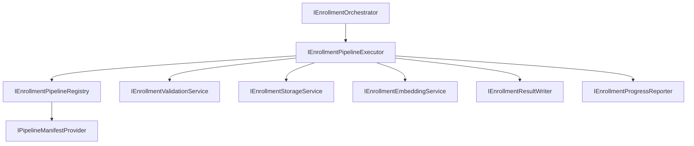

# AI20.PHASE2.1.8 — Orchestrator Reuse Analysis

**Milestone:** Pre-implementation review for `IEnrollmentOrchestrator`.

## Existing Components Reused

| Component | Location | Reuse |
|-----------|----------|-------|
| `IEnrollmentValidationService` | Application/Infrastructure | Validation stage delegate |
| `IEnrollmentStorageService` | Application/Infrastructure | Storage stage delegate |
| `IEnrollmentEmbeddingService` | Application/Infrastructure | Embedding stage delegate |
| `IEnrollmentResultWriter` | Application/Infrastructure | Persistence stage delegate |
| `IEnrollmentProgressReporter` | Application/Infrastructure | Progress transitions only — orchestrator invokes, never writes directly |
| `IStudentPhotoProviderFactory` | Application/Infrastructure | Download stage delegate |
| `IPipelineManifestProvider` | Application/Infrastructure | Dynamic stage ordering from manifest |
| `EnrollmentPipelineStage` enum | Application/Enrollment/Pipeline | Manifest stage identity (frozen) |
| `EnrollmentPipelineDefaults.CreateV1Manifest()` | Infrastructure/Configuration | V1 stage order |
| `EnrollmentStageProgressRequest` | Application/Enrollment/Progress | Progress reporter contracts |
| `ClassroomRecognitionPipeline` pattern | Infrastructure/Recognition | Sequential orchestration reference |

## Not Reused (and Why)

| Component | Reason |
|-----------|--------|
| Direct repository access | Orchestrator must not run SQL |
| `IEmbeddingPipeline` | Manual upload path — separate from enrollment batch pipeline |
| `EnrollmentStoragePipelineExecutor` | Internal to storage service — orchestrator calls storage service only |
| `EnrollmentValidationPipelineExecutor` | Internal to validation service |

## New Components — Rationale

| Class | Why new |
|-------|---------|
| `IEnrollmentOrchestrator` | Sole workflow coordinator |
| `IEnrollmentPipelineStage` | Stage abstraction — no hardcoded stage list in orchestrator |
| `IEnrollmentPipelineRegistry` | Dynamic stage discovery and ordering |
| `IEnrollmentPipelineExecutor` | Reusable workflow engine (retry, metrics, logging) |
| `IEnrollmentRetryPolicy` | Centralized retry rules — no hardcoded backoff |
| `EnrollmentPipelineContext` | Immutable artifact accumulator between stages |
| `EnrollmentPipelineResult` | Unified pipeline output with telemetry |
| `EnrollmentPipelineState` | In-memory pipeline state (distinct from domain `EnrollmentStatus`) |
| Pipeline domain events | Event-ready architecture (not published externally) |

## Architecture Diagram

## Methods Reused

| Logic | Source |
|-------|--------|
| Stage ordering | `PipelineManifest.Stages` via `IPipelineManifestProvider` |
| Progress transitions | `IEnrollmentProgressReporter.MarkStageCompletedAsync` |
| Failure classification | Existing `FailureCategory` enum |
| Result pattern | Per-stage service results (`EnrollmentValidationResult`, etc.) |

## Architecture Boundary

The orchestrator owns **sequence only**. Every stage delegates to an existing frozen service. No AI, storage I/O, persistence SQL, or business rules are duplicated.
