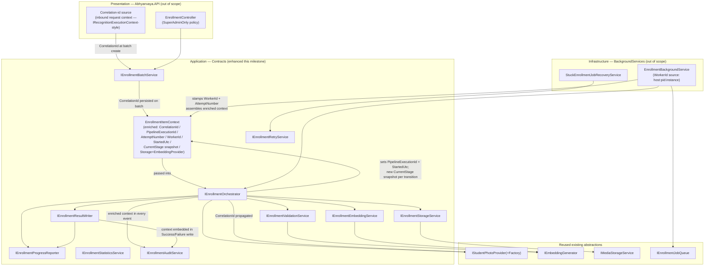

# AI20.PHASE2.0.2 — Pipeline Execution Context

**Type:** Contract/interface *enhancement* design only. No production code was written or modified to produce this document. No business logic, HTTP endpoint, background worker, DI registration, database update, migration, or image processing is implemented or changed here — this milestone only *enriches* the immutable execution context DTO and the interface signatures that carry it, all as **proposed** contracts.

**Baseline being enhanced:** `docs/AI20_PHASE2_ENGINE_CONTRACTS.md` (AI20.PHASE2.0.1) — specifically the `EnrollmentItemContext` record (§2), `IEnrollmentOrchestrator.ProcessItemAsync` (§4), the `EnrollmentSuccessWrite`/`EnrollmentFailureWrite` DTOs (§11), the `EnrollmentAuditEvent` DTO (§12), the Component Diagram (§13), and the Sequence Diagram (§15).

**Status of the code blocks below:** every C# block is a **proposed** contract that does not yet exist in the codebase. They are the design artifact of this milestone, not committed code. All interfaces/DTOs remain in namespace `Abhyanvaya.Application.Common.Interfaces` / `Abhyanvaya.Application.Enrollment`.

---

## 0. Objective and scope

Introduce a richer *immutable* execution context that travels through every enrollment pipeline stage so that diagnostics, telemetry, distributed tracing, and future observability improve **without changing any business logic**. Concretely:

- Every stage log line, audit event, and (on failure) durable error record can be pinned to a precise "who / which run / which attempt / which stage / which providers" tuple.
- The three-level correlation model (batch → item → attempt) makes it possible to zoom a query from "the whole SuperAdmin batch operation across services" down to "one specific retry attempt of one student."
- All of this is achieved by *adding init-only fields to one record* and threading it through existing signatures — no stage service gains new responsibilities, no transaction boundary moves, no new I/O is introduced.

This is a **contract enhancement only.** Nothing here implements, registers, or wires anything.

---

## 1. Baseline recap — the context being enhanced

The AI20.PHASE2.0.1 baseline (`docs/AI20_PHASE2_ENGINE_CONTRACTS.md` §2) defined:

```csharp
namespace Abhyanvaya.Application.Enrollment;

public sealed record EnrollmentItemContext
{
    public required Guid BatchId { get; init; }
    public required Guid ItemId { get; init; }
    public required int TenantId { get; init; }
    public required int StudentId { get; init; }
    public required string StudentNumber { get; init; }
    public required string CollegeCode { get; init; }
    public required int AcademicYear { get; init; }
    /// <summary>Provider name resolved for this batch (config-driven, per IStudentPhotoProviderFactory).</summary>
    public required string PhotoProviderName { get; init; }
    /// <summary>Correlation id for structured logging across all stages of this item.</summary>
    public required Guid ExecutionTraceId { get; init; }
}
```

It is assembled once by the orchestrator (from item + batch + student) and passed down every stage so stage services stay free of repository access. All nine existing fields are **retained unchanged** for backward compatibility; this milestone only *adds* fields and clarifies the semantics of `ExecutionTraceId`.

---

## 2. Design tension #1 — immutability vs. a "current stage" that changes

The task requires a `CurrentStage` (and a point-in-time `CancellationRequested`) on a record whose whole design premise is immutability. These two requirements only *appear* to conflict.

**Resolution — snapshot-per-transition, never mutate-in-place.** `EnrollmentItemContext` stays a `sealed record` with `init`-only members. `CurrentStage` and `CancellationRequested` are **not** fields the orchestrator writes back onto a shared instance. Instead, at each stage boundary the orchestrator produces a **new immutable snapshot** via a `with` expression:

```csharp
// Inside IEnrollmentOrchestrator implementation (illustrative — NOT part of the contract):
context = context with { CurrentStage = EnrollmentStage.Validating,
                         CancellationRequested = cancellationToken.IsCancellationRequested };
```

Consequences that make this sound:

- **No mutable state ever exists.** Each snapshot is frozen at creation. Any snapshot already handed to a stage service, captured in a log scope, or embedded in an audit event keeps the exact `CurrentStage`/`CancellationRequested` values it had *at that moment* — it is never mutated out from under a reader. This is precisely the diagnostic property we want: an audit event recorded during the Embedding stage should forever read `CurrentStage = Embedding`, even after the orchestrator moves on.
- **`CurrentStage` is a diagnostic marker, not the source of truth.** The authoritative lifecycle state remains `StudentEnrollmentItem.Status` (persisted by `IEnrollmentProgressReporter`). `CurrentStage` is the *in-memory* echo of "where the orchestrator currently is," used only for logs/telemetry when no DB row read is warranted. It is intentionally a lighter enum (see §4) than `EnrollmentStatus`.
- **`CancellationRequested` is a captured observation, not the control signal.** The authoritative cancellation mechanism is unchanged: the `CancellationToken` plus the batch's `CancellationRequestedUtc` (per `AI20_ENROLLMENT_BACKGROUND.md` §3.6). `CancellationRequested` on the snapshot merely records "cancellation had been observed as requested at the instant this snapshot was taken," so a log/audit line can explain *why* a stage short-circuited without re-reading anything.

This is the crux of the design and it is resolved firmly in favor of immutability: **"current stage that changes" is modeled as a stream of immutable snapshots, one per transition — not as a mutable field.**

---

## 3. Design tension #2 — `ExecutionTraceId` vs `CorrelationId` (and `PhotoProvider` vs `PhotoProviderName`)

### 3.1 A three-level correlation model

`ExecutionTraceId` and `CorrelationId` are **distinct concepts, kept as separate fields** (neither is renamed or deprecated). Adding `PipelineExecutionId` completes a clean three-level nesting, where each id answers a different "zoom level" diagnostic question:

| Id | Scope | Lifetime | Answers | Cross-service? |
|---|---|---|---|---|
| `CorrelationId` | **Batch / originating request** | 1 per batch (shared by every item + every attempt) | "Show me *everything* that belongs to this SuperAdmin operation — across the API request, the worker, and outbound external calls (photo provider HTTP, storage)." | **Yes** — propagated outward |
| `ExecutionTraceId` | **Item** | 1 per item, **stable across all retry attempts** | "Show me the whole story of *this one student's* enrollment across all its stages and all its retries." | No — pipeline-internal |
| `PipelineExecutionId` | **Attempt** | 1 per `ProcessItemAsync` invocation (regenerated on each retry) | "Show me exactly *this one execution attempt* — attempt #2's stage lines, distinct from attempt #1's." | No — pipeline-internal |

Nesting: `CorrelationId` ⊃ `ExecutionTraceId` ⊃ `PipelineExecutionId`.

**Why keep both `ExecutionTraceId` and `CorrelationId` rather than collapse them:**

- `ExecutionTraceId` already exists and already flows through `EnrollmentValidationRequest`, `EnrollmentStorageRequest`, `EnrollmentEmbeddingRequest`, and `EnrollmentAuditEvent` (baseline §8–§12), matching the established `IRecognitionExecutionContext`-style pipeline-internal correlation id (`AI20_ENROLLMENT_BACKGROUND.md` §3.7). Renaming or removing it would be a *breaking* change to those contracts and would sever continuity with the recognition-side convention. It is therefore **retained with its exact meaning** ("across all stages of this item").
- `CorrelationId` is a genuinely different, *wider* concept: it originates from the inbound SuperAdmin request that created the batch (or is generated at batch creation if absent), is carried on the batch, copied into every item's context, and — crucially — is the id that gets **propagated to external dependencies** (e.g. an `X-Correlation-Id` header on photo-provider HTTP calls, tagged on storage operations). It lets an operator stitch a trace together *across service and process boundaries*, which a pipeline-internal id cannot do.

So the reasoning is explicit: **`ExecutionTraceId` is pipeline-internal and item-scoped; `CorrelationId` is cross-service and batch/request-scoped; `PipelineExecutionId` is the new pipeline-internal, attempt-scoped id.** All three coexist because they answer non-overlapping questions.

### 3.2 `PhotoProvider` vs the existing `PhotoProviderName`

The task lists a new `PhotoProvider` property, but the baseline already has `PhotoProviderName` (which **must remain**). These are the **same concept**, so introducing a second field would create two fields that always hold the same value — a maintenance hazard and a violation of "one fact, one field."

**Resolution:** keep `PhotoProviderName` (backward compatible, already referenced by `IStudentPhotoProviderFactory`), and do **not** add a redundant `PhotoProvider`. The "photo provider" dimension the task asks for is already satisfied by `PhotoProviderName`. To make the *engine-provider triple* explicit and symmetric, this milestone instead adds its two genuinely-missing siblings — `StorageProvider` and `EmbeddingProvider` — so the context records all three providers in play (photo source, object storage, embedding engine) using one naming convention. This is the intended spirit of "PhotoProvider" without duplicating an existing field.

---

## 4. Enhanced `EnrollmentItemContext` (proposed)

```csharp
namespace Abhyanvaya.Application.Enrollment;

/// <summary>
/// Immutable working context for one claimed <see cref="StudentEnrollmentItem"/>. Assembled once by
/// the orchestrator from the item + its batch + its student, then passed down every pipeline stage so
/// each stage service stays free of repository access. Mirrors the "narrow request record" style of
/// <see cref="StudentPhotoFetchRequest"/>.
///
/// <para>
/// AI20.PHASE2.0.2 enrichment: adds attempt/worker/provider/timing diagnostics and a three-level
/// correlation model (<see cref="CorrelationId"/> ⊃ <see cref="ExecutionTraceId"/> ⊃
/// <see cref="PipelineExecutionId"/>). The record remains fully immutable: the "current stage" is
/// represented as a *new snapshot per transition* (produced with a <c>with</c> expression by the
/// orchestrator), never as a mutated field. See docs/AI20_PHASE2_PIPELINE_CONTEXT.md §2–§3.
/// </para>
/// </summary>
public sealed record EnrollmentItemContext
{
    // ---- Identity (unchanged from AI20.PHASE2.0.1 — backward compatible) ----

    public required Guid BatchId { get; init; }
    public required Guid ItemId { get; init; }
    public required int TenantId { get; init; }
    public required int StudentId { get; init; }
    public required string StudentNumber { get; init; }
    public required string CollegeCode { get; init; }
    public required int AcademicYear { get; init; }

    /// <summary>Photo-source provider name resolved for this batch (config-driven, per IStudentPhotoProviderFactory).
    /// This is the single "photo provider" fact — no separate <c>PhotoProvider</c> field is added (see §3.2).</summary>
    public required string PhotoProviderName { get; init; }

    /// <summary>Pipeline-internal, ITEM-scoped correlation id: stable across every stage AND every retry
    /// attempt of this one item. Retained verbatim from the baseline; consumed by all stage-request DTOs
    /// and audit events (§7). Distinct from <see cref="CorrelationId"/> and <see cref="PipelineExecutionId"/> — see §3.1.</summary>
    public required Guid ExecutionTraceId { get; init; }

    // ---- AI20.PHASE2.0.2 additions: correlation ----

    /// <summary>Cross-service, BATCH/REQUEST-scoped correlation id. Originates from the inbound SuperAdmin
    /// request that created the batch (generated at batch creation if none was supplied), carried on the
    /// batch, and copied to every item. Propagated OUTWARD to external dependencies (e.g. an
    /// X-Correlation-Id header on photo-provider HTTP calls, tagged on storage ops) so a trace can be
    /// stitched across process/service boundaries — which a pipeline-internal id cannot do (§3.1).</summary>
    public required Guid CorrelationId { get; init; }

    /// <summary>Pipeline-internal, ATTEMPT-scoped id: one per <see cref="IEnrollmentOrchestrator"/>.ProcessItemAsync
    /// invocation, regenerated on each retry. Pairs with <see cref="AttemptNumber"/> so attempt #2's stage
    /// lines are unambiguously separable from attempt #1's for the same item (§3.1).</summary>
    public required Guid PipelineExecutionId { get; init; }

    // ---- AI20.PHASE2.0.2 additions: attempt / worker / timing diagnostics ----

    /// <summary>1-based attempt counter for THIS execution (= <see cref="StudentEnrollmentItem.RetryCount"/> + 1
    /// at claim time). Increments on each automatic/manual retry. Lets telemetry distinguish first-try
    /// success rate from eventual success rate.</summary>
    public required int AttemptNumber { get; init; }

    /// <summary>Identity of the worker instance that claimed this item (e.g. "{host}:{pid}:{instanceGuid}").
    /// Stamped by the background worker at claim time. Answers "which node/instance processed this item?"
    /// for multi-instance deployments (Render scale-out) — the source is the host/worker, not any DB row.</summary>
    public required string WorkerId { get; init; }

    /// <summary>UTC instant this pipeline execution attempt began (set by the orchestrator at the start of
    /// ProcessItemAsync). Enables in-memory "how long has THIS attempt been running" diagnostics without a
    /// DB read; the durable per-stage timestamps on the item remain the authoritative timeline.</summary>
    public required DateTime StartedUtc { get; init; }

    /// <summary>Object-storage provider identifier in play for this attempt (config-resolved). Recorded so a
    /// storage failure's diagnostics say which backend was targeted. Sibling of <see cref="PhotoProviderName"/>.</summary>
    public required string StorageProvider { get; init; }

    /// <summary>Embedding-engine provider identifier in play for this attempt (config-resolved; see
    /// <see cref="Domain.Constants.EmbeddingProviders"/>). Recorded so an embedding failure or a model/version
    /// question is traceable to the engine used. Sibling of <see cref="PhotoProviderName"/>.</summary>
    public required string EmbeddingProvider { get; init; }

    // ---- AI20.PHASE2.0.2 additions: per-transition SNAPSHOT fields (immutable via `with`, not mutated) ----

    /// <summary>The stage the orchestrator is at FOR THIS SNAPSHOT. NOT a mutable field: the orchestrator
    /// creates a NEW snapshot (<c>context with { CurrentStage = ... }</c>) at each transition, so every
    /// captured copy keeps the value it had when captured (§2). Diagnostic echo only — the authoritative
    /// lifecycle state is <see cref="StudentEnrollmentItem.Status"/>.</summary>
    public EnrollmentStage CurrentStage { get; init; } = EnrollmentStage.NotStarted;

    /// <summary>Point-in-time OBSERVATION of whether cancellation had been requested when this snapshot was
    /// taken. NOT the control signal (the CancellationToken + batch CancellationRequestedUtc remain
    /// authoritative, per AI20_ENROLLMENT_BACKGROUND.md §3.6); this only explains, in logs/audit, why a
    /// stage short-circuited.</summary>
    public bool CancellationRequested { get; init; }
}

/// <summary>
/// Lightweight in-memory marker of where the orchestrator currently is, for logs/telemetry. Deliberately
/// coarser than <see cref="EnrollmentStatus"/> (no Pending/Downloaded/RetryRequired persistence states) —
/// it echoes orchestrator position, it does not replace the persisted lifecycle state.
/// </summary>
public enum EnrollmentStage
{
    NotStarted = 0,
    Claimed = 1,
    Downloading = 2,   // ↔ EnrollmentStatus.Downloading
    Validating = 3,    // ↔ EnrollmentStatus.Validating
    Storing = 4,       // (no dedicated EnrollmentStatus — upload happens between Validating and Embedding)
    Embedding = 5,     // ↔ EnrollmentStatus.Embedding
    Writing = 6,       // finalizing the terminal write
    Completed = 7,     // ↔ EnrollmentStatus.Completed
}
```

**Assembly note.** So that consumers never construct a half-populated context, the orchestrator assembles the initial snapshot once (identity + correlation + provider + attempt/worker/timing fields, with `CurrentStage = Claimed`, `CancellationRequested = false`) and then only ever derives further snapshots via `with`. Because all new attempt/worker/provider fields are `required`, the compiler enforces complete population at the single assembly site — no partially-filled context can escape.

---

## 5. Per-property rationale

New properties (the nine baseline fields are unchanged and omitted here except where semantics were clarified):

| Property | Why it exists (diagnostic/telemetry/tracing question it answers) | Who populates it | Who consumes it | When it is populated |
|---|---|---|---|---|
| `CorrelationId` | "Trace this entire administrative batch operation across the API, the worker, and outbound external calls." Cross-service stitching that a pipeline-internal id cannot do. | The API request/context at batch creation (generated if the inbound request carried none); carried on the batch and copied to each item context. | Structured logs at every layer; `IEnrollmentAuditService`; outbound HTTP to the photo provider / storage (as a propagated header/tag). | Set once at batch creation; identical on every item + every attempt of the batch. |
| `PipelineExecutionId` | "Isolate exactly one execution attempt's stage lines, distinct from another attempt of the same item." | The orchestrator, at the start of each `ProcessItemAsync`. | Structured logs, audit events, stage-request DTOs for this attempt. | Regenerated on every attempt (every `ProcessItemAsync` invocation). |
| `AttemptNumber` | "Is this a first try or a retry? What's our first-try vs eventual success rate?" Separates transient-retry noise from genuine outcomes. | The worker/orchestrator, derived as `RetryCount + 1` at claim time. | Logs, audit, telemetry (`IEnrollmentAuditService`, dashboards). | Set at claim/context-assembly; increments across attempts. |
| `WorkerId` | "Which node/instance processed this item?" Essential for multi-instance (scale-out) triage and hot-node detection. | The background worker instance when it claims the item. | Logs, audit events; ops dashboards. | At claim time, once per attempt. |
| `StartedUtc` | "How long has *this attempt* been running right now?" In-memory latency/stuck diagnostics without a DB read. | The orchestrator at the start of `ProcessItemAsync`. | Logs, in-flight diagnostics; complements durable per-stage timestamps on the item. | At the start of each attempt. |
| `CurrentStage` | "Where is the orchestrator right now, and where was it when this log/audit line was emitted?" Frozen per snapshot. | The orchestrator, via a `with` expression at each stage transition. | Logs, `IEnrollmentAuditService`, in-flight "current stage" telemetry. | A new snapshot at every transition (immutable — §2). |
| `CancellationRequested` | "Why did this stage short-circuit — was cancellation observed?" Explains cooperative-cancellation behavior in the trail. | The orchestrator, captured from the token/batch flag when a snapshot is taken. | Logs, audit. | Captured per snapshot; authoritative signal remains the token + batch flag. |
| `StorageProvider` | "Which storage backend was targeted?" so a `StorageUploadFailed` is diagnosable to the backend. | The worker/orchestrator from config at context assembly. | Logs, audit on storage failures. | At context assembly (per attempt). |
| `EmbeddingProvider` | "Which embedding engine/model produced (or failed to produce) this vector?" | The worker/orchestrator from config at context assembly. | Logs, audit on embedding failures; provenance cross-check against `EnrollmentEmbeddingResult.Model/Version`. | At context assembly (per attempt). |
| `ExecutionTraceId` *(retained, clarified)* | "The whole story of this one student's enrollment across all stages **and all retries**." Item-scoped, pipeline-internal. | Assembled by the orchestrator (unchanged). | All stage-request DTOs and audit events (unchanged). | Once per item, stable across attempts. |
| `PhotoProviderName` *(retained)* | "Which photo source was used?" The single photo-provider fact (no redundant `PhotoProvider` field — §3.2). | Resolved for the batch via `IStudentPhotoProviderFactory`. | Photo-fetch stage; logs/audit. | At context assembly. |

---

## 6. Immutability & who-writes-what, at a glance

| Field group | Scope | Immutable after… | Written by |
|---|---|---|---|
| Identity (`BatchId`…`AcademicYear`, `PhotoProviderName`) | item | initial assembly | orchestrator (once) |
| `CorrelationId` | batch/request | batch creation | API/request context → carried down |
| `ExecutionTraceId` | item | initial assembly | orchestrator (once) |
| `PipelineExecutionId`, `AttemptNumber`, `WorkerId`, `StartedUtc`, `StorageProvider`, `EmbeddingProvider` | attempt | initial assembly of the attempt | worker/orchestrator (once per attempt) |
| `CurrentStage`, `CancellationRequested` | snapshot | each `with` transition | orchestrator (new snapshot each time) |

No field is ever mutated in place. "Changing" `CurrentStage` means producing a new frozen record; all prior snapshots remain valid and unchanged.

---

## 7. Affected interface signatures (proposed updates)

### 7.1 `IEnrollmentOrchestrator.ProcessItemAsync` (baseline §4)

The **signature is unchanged** — it still takes a single `EnrollmentItemContext` — but the context it receives is now the enriched one, and internally the orchestrator evolves it via immutable snapshots. Shown with the enrichment made explicit in the XML docs:

```csharp
namespace Abhyanvaya.Application.Common.Interfaces;

public interface IEnrollmentOrchestrator
{
    /// <summary>
    /// Processes one already-claimed item. The worker supplies the enriched
    /// <see cref="EnrollmentItemContext"/> with <see cref="EnrollmentItemContext.WorkerId"/>,
    /// <see cref="EnrollmentItemContext.AttemptNumber"/>, <see cref="EnrollmentItemContext.CorrelationId"/>,
    /// and the provider fields already populated. This method sets
    /// <see cref="EnrollmentItemContext.PipelineExecutionId"/> and <see cref="EnrollmentItemContext.StartedUtc"/>
    /// for the attempt, then advances <see cref="EnrollmentItemContext.CurrentStage"/> by creating a NEW
    /// snapshot at each transition (never mutating the incoming instance). Returns the terminal disposition,
    /// already persisted via #3/#9.
    /// </summary>
    Task<EnrollmentStageResult> ProcessItemAsync(
        EnrollmentItemContext context, CancellationToken cancellationToken = default);
}
```

Signature stability is a deliberate benefit: the enrichment rides entirely inside the existing DTO, so no orchestrator caller changes.

### 7.2 `EnrollmentSuccessWrite` / `EnrollmentFailureWrite` (baseline §11)

These already embed `Context`; their shapes are **unchanged**, but the embedded context now carries the full attempt/worker/provider/correlation payload, so the result writer and audit trail can persist a far richer failure/success record with no new parameters:

```csharp
public sealed record EnrollmentSuccessWrite
{
    /// <summary>Enriched context: its CurrentStage will read <c>Writing</c>, and it carries
    /// CorrelationId / PipelineExecutionId / AttemptNumber / WorkerId / Storage+EmbeddingProvider
    /// for the success audit line — no extra fields needed on this DTO (§4).</summary>
    public required EnrollmentItemContext Context { get; init; }
    public required string PhotoKey { get; init; }
    public required string Checksum { get; init; }
    public required int ByteSize { get; init; }
    public required int SourceWidth { get; init; }
    public required int SourceHeight { get; init; }
    public required float QualityScore { get; init; }
    public required float[] NormalizedVector { get; init; }
    public required string EmbeddingModel { get; init; }
    public required string EmbeddingVersion { get; init; }
    public required EmbeddingQuality EmbeddingQuality { get; init; }
}

public sealed record EnrollmentFailureWrite
{
    /// <summary>Enriched context: its CurrentStage pinpoints WHICH stage failed, AttemptNumber shows
    /// which try, and WorkerId shows which node — all now available to the failure record/audit with
    /// no new parameters on this DTO.</summary>
    public required EnrollmentItemContext Context { get; init; }
    public required FailureCategory FailureCategory { get; init; }
    public required string Reason { get; init; }
    public string? SourceUrl { get; init; }
}
```

### 7.3 `EnrollmentAuditEvent` (baseline §12) — proposed enrichment

The audit event already carries `ExecutionTraceId`. To realize the observability goal, it gains the wider/attempt-level correlation fields (still never logging image or vector data):

```csharp
public sealed record EnrollmentAuditEvent
{
    public required EnrollmentAuditAction Action { get; init; }
    public required int TenantId { get; init; }
    public Guid? BatchId { get; init; }
    public Guid? ItemId { get; init; }
    public int? StudentId { get; init; }
    public int? ActorUserId { get; init; }
    public EnrollmentStatus? FromStatus { get; init; }
    public EnrollmentStatus? ToStatus { get; init; }
    public FailureCategory? FailureCategory { get; init; }

    public required Guid ExecutionTraceId { get; init; }

    // ---- AI20.PHASE2.0.2 additions (all optional so existing admin-action call sites are unaffected) ----

    /// <summary>Cross-service correlation id (batch/request scope), for stitching audit to external traces.</summary>
    public Guid? CorrelationId { get; init; }
    /// <summary>Attempt-scoped execution id (per-item transition events); null for batch-level admin actions.</summary>
    public Guid? PipelineExecutionId { get; init; }
    /// <summary>Retry attempt number for per-item events; null for batch-level admin actions.</summary>
    public int? AttemptNumber { get; init; }
    /// <summary>Worker instance that produced an autonomous transition; null for SuperAdmin admin actions.</summary>
    public string? WorkerId { get; init; }
    /// <summary>Orchestrator stage snapshot at the moment of the event; null for batch-level admin actions.</summary>
    public EnrollmentStage? Stage { get; init; }

    public string? Detail { get; init; }
}
```

These additions are **nullable/optional**, so the existing batch-level call sites (`BatchCreated`/`BatchCancelled`/…) compile and behave identically; only per-item events populate them.

### 7.4 Note on the stage-request DTOs (baseline §8–§10)

`EnrollmentValidationRequest`, `EnrollmentStorageRequest`, and `EnrollmentEmbeddingRequest` today carry the scalar `ExecutionTraceId`. They continue to work unchanged. Optionally (a forward-looking, non-required enhancement), each could also carry `CorrelationId` and `PipelineExecutionId` so an external call made *inside* a stage (e.g. the storage upload) can propagate the cross-service id downstream. This is called out for completeness but is **not** mandated by this milestone; the primary vehicle for the enriched fields is the `EnrollmentItemContext` embedded in the write/audit DTOs above.

---

## 8. Updated Sequence Diagram (baseline §15)

The enrichment made visible: `WorkerId` stamped at claim, `CorrelationId`/`ExecutionTraceId`/`PipelineExecutionId` threaded through, `AttemptNumber` on the retry branch, and the immutable `with { CurrentStage = … }` snapshot at each transition.

```mermaid
sequenceDiagram
    participant REQ as SuperAdmin Request (CorrelationId source)
    participant BG as EnrollmentBackgroundService (WorkerId source)
    participant ORCH as IEnrollmentOrchestrator
    participant PROG as IEnrollmentProgressReporter
    participant PHOTO as IStudentPhotoProvider
    participant VAL as IEnrollmentValidationService
    participant STORE as IEnrollmentStorageService
    participant EMB as IEnrollmentEmbeddingService
    participant WRITE as IEnrollmentResultWriter
    participant AUD as IEnrollmentAuditService

    REQ->>BG: batch created; CorrelationId flows onto batch (shared by all items)

    BG->>PROG: claim item (Pending/RetryRequired→Downloading, RowVersion)
    Note over BG,PROG: DB-level optimistic claim; conflict ⇒ another worker won, skip
    BG->>BG: assemble context<br/>{ CorrelationId, ExecutionTraceId(item),<br/>WorkerId, AttemptNumber = RetryCount+1,<br/>Storage/EmbeddingProvider, CurrentStage = Claimed }
    BG->>ORCH: ProcessItemAsync(context)
    ORCH->>ORCH: context = context with {<br/>PipelineExecutionId = new, StartedUtc = now }

    ORCH->>ORCH: context = context with { CurrentStage = Downloading }
    ORCH->>PHOTO: FetchPhotoAsync(request)  [CorrelationId propagated on HTTP]
    alt fetch fails (permanent)
        PHOTO-->>ORCH: Failure(PhotoNotFound/AccessDenied)
        ORCH->>WRITE: WriteFailureAsync(ctx@Downloading)  %% tx
        ORCH->>AUD: RecordAsync(ItemFailed, CorrelationId, PipelineExecutionId, AttemptNumber, WorkerId, Stage=Downloading)
    else fetch fails (transient) — will retry
        PHOTO-->>ORCH: Failure(null category / 5xx)
        ORCH->>WRITE: WriteRetryAsync(ctx)  %% tx, RetryCount++
        Note over ORCH,WRITE: next claim ⇒ AttemptNumber+1, NEW PipelineExecutionId,<br/>SAME ExecutionTraceId + CorrelationId
    else fetch ok
        PHOTO-->>ORCH: Success(bytes)
        ORCH->>PROG: Downloading→Validating (tx)
        ORCH->>ORCH: context = context with { CurrentStage = Validating }
        ORCH->>VAL: ValidateAsync(bytes, ExecutionTraceId)
        alt invalid (no/multi face, blur, low-res)
            VAL-->>ORCH: IsValid=false + FailureCategory
            ORCH->>WRITE: WriteFailureAsync(ctx@Validating)  %% tx (permanent)
            ORCH->>AUD: RecordAsync(ItemFailed, ..., Stage=Validating)
        else valid
            VAL-->>ORCH: AlignedFaceBytes + QualityScore
            ORCH->>ORCH: context = context with { CurrentStage = Storing }
            ORCH->>STORE: PersistEnrollmentPhotoAsync(bytes)  [StorageProvider in ctx]
            STORE-->>ORCH: PhotoKey + Checksum
            ORCH->>PROG: Validating→Embedding (tx)
            ORCH->>ORCH: context = context with { CurrentStage = Embedding }
            ORCH->>EMB: GenerateAsync(alignedFace)  [EmbeddingProvider in ctx]
            EMB-->>ORCH: NormalizedVector + model/version
            ORCH->>ORCH: context = context with { CurrentStage = Writing }
            ORCH->>WRITE: WriteSuccessAsync(ctx@Writing + embedding + PhotoKey)
            Note over WRITE: SINGLE transaction:<br/>StudentFaceEmbedding + Student.PhotoKey<br/>+ item Completed + batch counters
            ORCH->>AUD: RecordAsync(ItemCompleted, CorrelationId, PipelineExecutionId, AttemptNumber, WorkerId, Stage=Writing)
        end
    end

    ORCH-->>BG: EnrollmentStageResult (already persisted)
    BG->>PROG: FinalizeBatchIfCompleteAsync(batchId)
```

---

## 9. Updated Component Diagram (baseline §13)

The context enrichment introduces two new *sources* of context data and clarifies who stamps what. Added: a **CorrelationId source** (the inbound request context) and a **WorkerId source** (the worker/host identity), plus the "assemble enriched context" relationship feeding the orchestrator.



**Relationships clarified by this milestone:** (1) the API's correlation-id source feeds `IEnrollmentBatchService`, which persists `CorrelationId` on the batch; (2) the background worker is the authoritative source of `WorkerId` and `AttemptNumber`, stamped when it assembles the context; (3) the orchestrator is the sole producer of `PipelineExecutionId`, `StartedUtc`, and each `CurrentStage` snapshot; (4) `CorrelationId` is the one field explicitly propagated *outward* to the reused photo-provider (and, via the storage service, to `IMediaStorageService`). No new *dependency direction* is introduced — everything still points inward (Clean Architecture layering from baseline §14 is unaffected).

---

## 10. Backward compatibility & migration notes

- **Nine baseline `EnrollmentItemContext` fields retained verbatim** — no rename, no removal. `ExecutionTraceId` keeps its exact meaning; its semantics are only *documented more precisely* (item-scoped, stable across attempts).
- **No redundant `PhotoProvider` field** — the existing `PhotoProviderName` is the single photo-provider fact (§3.2).
- **`IEnrollmentOrchestrator.ProcessItemAsync` signature unchanged** — enrichment rides inside the DTO.
- **`EnrollmentSuccessWrite` / `EnrollmentFailureWrite` shapes unchanged** — richer data flows via the embedded context.
- **`EnrollmentAuditEvent` additions are all optional/nullable** — existing admin-action call sites are unaffected.
- **`CurrentStage` and `CancellationRequested` have safe defaults** (`NotStarted` / `false`), so a minimally-constructed context is still valid; the required fields are the ones a proper assembly site must always know.
- **No new transaction, no new I/O, no business-logic change** — telemetry-only enrichment, consistent with `AI20_ENROLLMENT_BACKGROUND.md` §3.7 (the batch counters remain the operational telemetry surface; no APM integration is introduced).

---

## Constraints Confirmed

- **No production code was written or modified.** Every C# block above is a **proposed** contract enhancement presented inside a markdown code block — no `.cs`, `.csproj`, `.tsx`, `.ts`, or other non-markdown file was created, edited, or deleted anywhere in the repository.
- **No business logic, HTTP endpoint, background worker, orchestrator, controller, DI registration, database update, migration, or image processing was implemented or changed.**
- **Only the `EnrollmentItemContext` DTO and the signatures/DTOs that carry it were *described* as enhancements** — as design artifacts, not committed files.
- The enhancement **reuses existing Application-layer interfaces and Domain enums/value objects without changing them**, and preserves Clean Architecture layering (dependencies point inward only).
- **The single output artifact of this milestone is exactly one new markdown file:** `docs/AI20_PHASE2_PIPELINE_CONTEXT.md`, containing the enhanced `EnrollmentItemContext` record, the `EnrollmentStage` enum, the per-property rationale table, the updated interface signatures/DTOs, an updated Mermaid sequence diagram, an updated Mermaid component diagram, and this Constraints Confirmed section.
