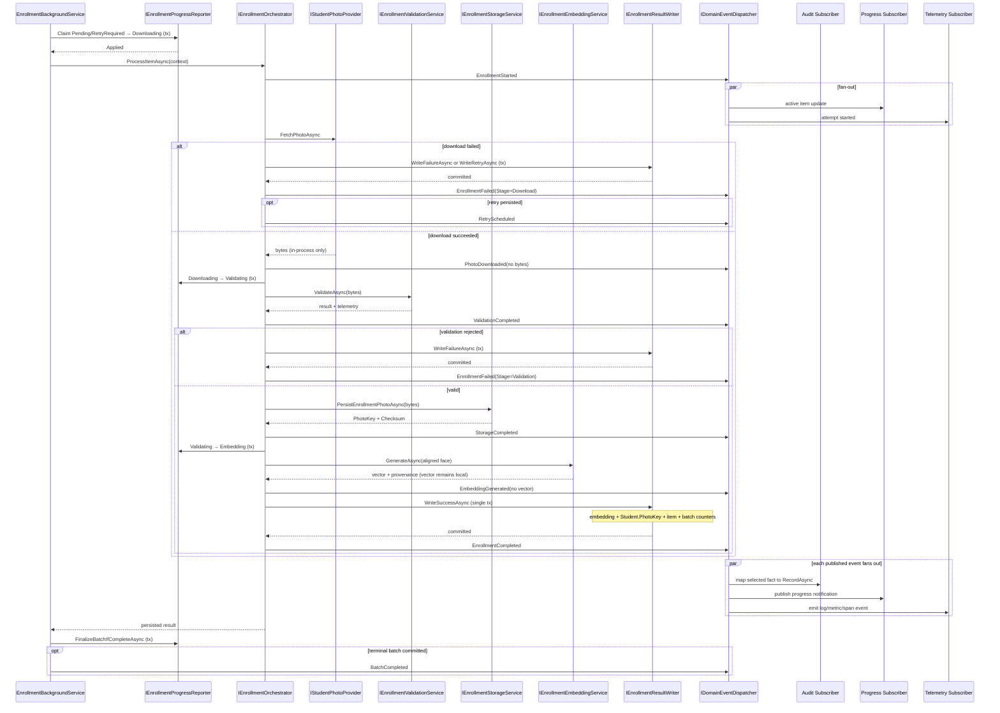
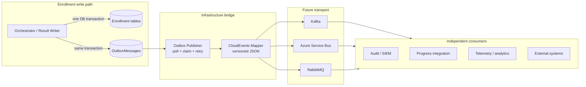

# AI20.PHASE2.0.19 — Pipeline Event Framework

**Type:** Architecture and contract design only. No production code was written or modified. Every C# block below is an illustrative proposal; no event, publisher, handler, outbox, message-bus adapter, database object, worker, telemetry emitter, or audit sink has been implemented.

**Decision:** Reuse the platform's existing lightweight `IDomainEvent` → `IDomainEventDispatcher` → `IDomainEventHandler<TEvent>` mechanism for in-process enrollment notifications. Do not introduce MediatR or a message-bus dependency for Phase 2. Keep authoritative progress transitions, retry classification, and result writes in their existing synchronous services and transactions; publish immutable facts after the relevant operation succeeds. Add a transactional outbox only when reliable out-of-process delivery is required.

---

## 0. Scope and reviewed baseline

This design is reconciled with the following Phase 2 contracts:

- `AI20_PHASE2_ENGINE_CONTRACTS.md` §15 fixes the item sequence as claim → download → validation → storage → embedding → result write → batch finalization.
- `AI20_PHASE2_AUDIT_ENHANCEMENT.md` keeps one `IEnrollmentAuditService.RecordAsync` compliance/diagnostic entry point and adds audit-specific identity, actor, outcome, target, and schema requirements.
- `AI20_PHASE2_PIPELINE_CONTEXT.md` defines the exact three-level correlation model: `CorrelationId` (batch/request) ⊃ `ExecutionTraceId` (item) ⊃ `PipelineExecutionId` (attempt).
- `AI20_PHASE2_PIPELINE_TELEMETRY.md` defines `EnrollmentStageTelemetry` with stage, monotonic elapsed milliseconds, diagnostic code, UTC timestamps, and optional machine name.
- `AI20_PHASE2_PIPELINE_STAGE_ENUM.md` consolidates stage identity into the canonical Application-layer `EnrollmentPipelineStage`.
- `AI20_ENROLLMENT_BACKGROUND.md` §3.7 establishes the current baseline: structured logging at item transitions and batch completion.
- `AI20_PHASE2_RESULT_WRITER_REVIEW.md` preserves the single success transaction spanning the embedding insert, student update, item completion, and batch counters.

The goal is to evolve from hard-coded inline logging/observation toward typed pub/sub contracts without moving business authority out of the orchestrator, progress reporter, retry service, or result writer.

---

## 1. Existing event infrastructure — grep findings

A repository-wide search for `INotification`, `IDomainEvent`, `MediatR`, `IPublisher`, and `DomainEvents` found an existing custom domain-event mechanism:

| Existing piece | Location | Current behavior | Reuse decision |
|---|---|---|---|
| `IDomainEvent` | `Abhyanvaya.Domain/Common/IDomainEvent.cs` | Marker contract containing `OccurredUtc` | Reuse |
| `DomainEventBase` | `Abhyanvaya.Domain/Common/DomainEventBase.cs` | Immutable base record that supplies UTC occurrence time | Reuse |
| `IHasDomainEvents` / `BaseEntity` | `Abhyanvaya.Domain/Common/` | Aggregates can collect and clear events | Reuse where an aggregate naturally owns an event |
| `IDomainEventDispatcher` | `Abhyanvaya.Application/Common/Interfaces/IDomainEventDispatcher.cs` | Dispatches a collection after successful persistence | Reuse |
| `IDomainEventHandler<TEvent>` | `Abhyanvaya.Application/Common/Interfaces/IDomainEventHandler.cs` | Supports multiple typed, side-effect-light handlers | Reuse for in-process observers |
| `DomainEventDispatcher` | `Abhyanvaya.Infrastructure/DomainEvents/DomainEventDispatcher.cs` | Logs every event, resolves all typed handlers from DI, catches handler failures | Reuse initially |
| `DomainEventPublisher.DispatchAndClearAsync` | `Abhyanvaya.Application/Internal/DomainEventPublisher.cs` | Dispatches aggregate-collected events and clears the collection | Reuse where applicable |
| Attendance event handlers | `Abhyanvaya.Infrastructure/DomainEvents/Handlers/AttendanceDomainEventHandlers.cs` | Structured logging observers | Direct precedent |

No MediatR package/use, `INotification`, or MediatR `IPublisher` mechanism was found. The platform is therefore **not greenfield for events**, but it does have a deliberately small custom mediator. Introducing MediatR would duplicate a working seam and add an unnecessary dependency.

The current dispatcher is best-effort, process-local, sequential, and handler failures are logged then swallowed. That is suitable for logging, telemetry emission, progress-stream notifications, and an audit adapter whose failure policy is explicitly non-blocking. It is **not** durable messaging and must not be used to hide required business state changes in handlers.

Because `EnrollmentPipelineStage` and `EnrollmentStageTelemetry` are Application-layer contracts, the proposed enrollment event records belong in an Application namespace such as `Abhyanvaya.Application.Enrollment.Events` while implementing the existing Domain-layer `IDomainEvent`. This preserves inward dependencies and avoids moving diagnostic DTOs into Domain.

---

## 2. Event framework boundaries

### 2.1 Events are immutable facts, not commands

Each event states that a lifecycle point has occurred. A handler must not determine whether validation passes, decide the item's durable status, perform the authoritative retry classification, or make the success transaction complete. Those actions remain direct calls in the §15 orchestration flow.

Examples:

- `ValidationCompleted` reports the result after `ValidateAsync`; it does not ask a handler to validate.
- `RetryScheduled` reports the durable `RetryRequired` write after it commits; it does not ask a handler to make the item retryable.
- `EnrollmentCompleted` is published only after `WriteSuccessAsync` commits; it cannot announce an enrollment that may still roll back.
- `BatchCompleted` is published only after `FinalizeBatchIfCompleteAsync` commits a terminal batch status.

### 2.2 Item and batch scope

Item-scoped events derive from `EnrollmentItemEventBase`; its constructor requires a non-null `ItemId`, item-scoped `ExecutionTraceId`, and attempt-scoped `PipelineExecutionId`. Batch-scoped events derive from `EnrollmentBatchEventBase`; `ItemId`, `ExecutionTraceId`, `PipelineExecutionId`, and `Stage` are intentionally null because no single item/attempt owns the fact.

`CorrelationId` remains required on both scopes because it identifies the originating batch/business operation.

### 2.3 Publication timing

The rule is **publish after the fact is true**:

1. Pure/external stage facts (`PhotoDownloaded`, `ValidationCompleted`, `StorageCompleted`, `EmbeddingGenerated`) publish after the stage returns successfully or, for validation, after it returns a typed rejection result.
2. Durable item outcomes (`EnrollmentCompleted`, `EnrollmentFailed`, `RetryScheduled`) publish after the corresponding result-writer transaction commits.
3. Durable batch outcomes (`BatchCompleted`, `BatchCancelled`) publish after the relevant batch transaction commits.
4. A handler failure does not reverse the completed operation. Reliable consumers require the future outbox described in §10.

---

## 3. Base event contracts (proposed)

```csharp
// Illustrative proposal only. No C# file was created or modified.
using Abhyanvaya.Domain.Common;

namespace Abhyanvaya.Application.Enrollment.Events;

public interface IEnrollmentDomainEvent : IDomainEvent
{
    Guid EventId { get; }
    string EventType { get; }
    int Version { get; }

    Guid CorrelationId { get; }
    Guid? PipelineExecutionId { get; }
    Guid? ExecutionTraceId { get; }

    int TenantId { get; }
    Guid BatchId { get; }
    Guid? ItemId { get; }
    EnrollmentPipelineStage? Stage { get; }
    EnrollmentStageTelemetry? Telemetry { get; }
}

/// <summary>
/// Common immutable envelope. EventId identifies this event occurrence and is never reused;
/// the three correlation identifiers retain the exact scopes defined by AI20.PHASE2.0.2.
/// </summary>
public abstract record EnrollmentEventBase : DomainEventBase, IEnrollmentDomainEvent
{
    protected EnrollmentEventBase(
        Guid correlationId,
        int tenantId,
        Guid batchId,
        Guid? itemId,
        Guid? executionTraceId,
        Guid? pipelineExecutionId,
        EnrollmentPipelineStage? stage,
        EnrollmentStageTelemetry? telemetry)
    {
        CorrelationId = correlationId;
        TenantId = tenantId;
        BatchId = batchId;
        ItemId = itemId;
        ExecutionTraceId = executionTraceId;
        PipelineExecutionId = pipelineExecutionId;
        Stage = stage;
        Telemetry = telemetry;
    }

    public Guid EventId { get; init; } = Guid.NewGuid();
    public abstract string EventType { get; }
    public virtual int Version => 1;

    public Guid CorrelationId { get; init; }
    public Guid? PipelineExecutionId { get; init; }
    public Guid? ExecutionTraceId { get; init; }

    public int TenantId { get; init; }
    public Guid BatchId { get; init; }
    public Guid? ItemId { get; init; }
    public EnrollmentPipelineStage? Stage { get; init; }
    public EnrollmentStageTelemetry? Telemetry { get; init; }
}

public abstract record EnrollmentItemEventBase : EnrollmentEventBase
{
    protected EnrollmentItemEventBase(
        Guid correlationId,
        Guid pipelineExecutionId,
        Guid executionTraceId,
        int tenantId,
        Guid batchId,
        Guid itemId,
        EnrollmentPipelineStage stage,
        EnrollmentStageTelemetry? telemetry = null)
        : base(
            correlationId, tenantId, batchId, itemId, executionTraceId,
            pipelineExecutionId, stage, telemetry)
    {
    }
}

public abstract record EnrollmentBatchEventBase : EnrollmentEventBase
{
    protected EnrollmentBatchEventBase(
        Guid correlationId,
        int tenantId,
        Guid batchId,
        EnrollmentStageTelemetry? telemetry = null)
        : base(
            correlationId, tenantId, batchId, itemId: null,
            executionTraceId: null, pipelineExecutionId: null,
            stage: null, telemetry)
    {
    }
}
```

`EventType` is a stable wire name, not `GetType().Name`; refactoring a CLR class must not silently change the serialized contract. `Version` versions the payload schema for that event type. `EventId` is unique per occurrence and supports deduplication; it must not be substituted for any correlation identifier.

The optional `Telemetry` member embeds the small `EnrollmentStageTelemetry` value when it is already available. A future bus envelope may instead carry a telemetry record identifier if telemetry is stored separately; either approach preserves correlation without introducing image/vector data.

---

## 4. Concrete item event contracts (proposed)

```csharp
// Illustrative proposal only. Payloads contain identifiers and bounded scalar metadata only.

public sealed record EnrollmentStarted(
    Guid CorrelationId,
    Guid PipelineExecutionId,
    Guid ExecutionTraceId,
    int TenantId,
    Guid BatchId,
    Guid ItemId,
    int StudentId,
    int AttemptNumber,
    string WorkerId)
    : EnrollmentItemEventBase(
        CorrelationId, PipelineExecutionId, ExecutionTraceId,
        TenantId, BatchId, ItemId, EnrollmentPipelineStage.Claim)
{
    public override string EventType => "enrollment.started";
}

public sealed record PhotoDownloaded(
    Guid CorrelationId,
    Guid PipelineExecutionId,
    Guid ExecutionTraceId,
    int TenantId,
    Guid BatchId,
    Guid ItemId,
    int StudentId,
    string PhotoProviderName,
    string? ContentType,
    int ByteSize,
    string? Checksum,
    EnrollmentStageTelemetry? StageTelemetry)
    : EnrollmentItemEventBase(
        CorrelationId, PipelineExecutionId, ExecutionTraceId,
        TenantId, BatchId, ItemId, EnrollmentPipelineStage.Download, StageTelemetry)
{
    public override string EventType => "enrollment.photo-downloaded";
}

public sealed record ValidationCompleted(
    Guid CorrelationId,
    Guid PipelineExecutionId,
    Guid ExecutionTraceId,
    int TenantId,
    Guid BatchId,
    Guid ItemId,
    int StudentId,
    bool IsValid,
    FailureCategory? FailureCategory,
    string? ReasonCode,
    float? QualityScore,
    int? SourceWidth,
    int? SourceHeight,
    EnrollmentStageTelemetry? StageTelemetry)
    : EnrollmentItemEventBase(
        CorrelationId, PipelineExecutionId, ExecutionTraceId,
        TenantId, BatchId, ItemId, EnrollmentPipelineStage.Validation, StageTelemetry)
{
    public override string EventType => "enrollment.validation-completed";
}

public sealed record StorageCompleted(
    Guid CorrelationId,
    Guid PipelineExecutionId,
    Guid ExecutionTraceId,
    int TenantId,
    Guid BatchId,
    Guid ItemId,
    int StudentId,
    string StorageProvider,
    string PhotoKey,
    string Checksum,
    int ByteSize,
    EnrollmentStageTelemetry? StageTelemetry)
    : EnrollmentItemEventBase(
        CorrelationId, PipelineExecutionId, ExecutionTraceId,
        TenantId, BatchId, ItemId, EnrollmentPipelineStage.Storage, StageTelemetry)
{
    public override string EventType => "enrollment.storage-completed";
}

public sealed record EmbeddingGenerated(
    Guid CorrelationId,
    Guid PipelineExecutionId,
    Guid ExecutionTraceId,
    int TenantId,
    Guid BatchId,
    Guid ItemId,
    int StudentId,
    string EmbeddingProvider,
    string Model,
    string ModelVersion,
    int Dimension,
    EmbeddingQuality Quality,
    EnrollmentStageTelemetry? StageTelemetry)
    : EnrollmentItemEventBase(
        CorrelationId, PipelineExecutionId, ExecutionTraceId,
        TenantId, BatchId, ItemId, EnrollmentPipelineStage.Embedding, StageTelemetry)
{
    public override string EventType => "enrollment.embedding-generated";
}

public sealed record EnrollmentCompleted(
    Guid CorrelationId,
    Guid PipelineExecutionId,
    Guid ExecutionTraceId,
    int TenantId,
    Guid BatchId,
    Guid ItemId,
    int StudentId,
    int AttemptNumber,
    Guid StudentFaceEmbeddingId,
    string PhotoKey,
    float? QualityScore,
    EnrollmentStageTelemetry? PipelineTelemetry)
    : EnrollmentItemEventBase(
        CorrelationId, PipelineExecutionId, ExecutionTraceId,
        TenantId, BatchId, ItemId, EnrollmentPipelineStage.ResultWrite, PipelineTelemetry)
{
    public override string EventType => "enrollment.completed";
}

public sealed record EnrollmentFailed(
    Guid CorrelationId,
    Guid PipelineExecutionId,
    Guid ExecutionTraceId,
    int TenantId,
    Guid BatchId,
    Guid ItemId,
    int StudentId,
    int AttemptNumber,
    EnrollmentPipelineStage FailedStage,
    FailureCategory? FailureCategory,
    string ReasonCode,
    string? Detail,
    bool IsRetryable,
    bool IsTerminal,
    string? PoisonReason,
    string? RetryPolicyVersion,
    EnrollmentStatus PersistedStatus,
    EnrollmentStageTelemetry? StageTelemetry)
    : EnrollmentItemEventBase(
        CorrelationId, PipelineExecutionId, ExecutionTraceId,
        TenantId, BatchId, ItemId, FailedStage, StageTelemetry)
{
    public override string EventType => "enrollment.failed";
}

public sealed record RetryScheduled(
    Guid CorrelationId,
    Guid PipelineExecutionId,
    Guid ExecutionTraceId,
    int TenantId,
    Guid BatchId,
    Guid ItemId,
    int StudentId,
    int CompletedAttemptNumber,
    int NextAttemptNumber,
    EnrollmentPipelineStage FailedStage,
    FailureCategory? FailureCategory,
    string ReasonCode,
    RetryDisposition Disposition,
    string PolicyName,
    string PolicyVersion,
    int BudgetCost,
    DateTimeOffset ScheduledUtc,
    DateTimeOffset? NextEligibleAttemptUtc)
    : EnrollmentItemEventBase(
        CorrelationId, PipelineExecutionId, ExecutionTraceId,
        TenantId, BatchId, ItemId, FailedStage)
{
    public override string EventType => "enrollment.retry-scheduled";
}
```

`EmbeddingGenerated` deliberately includes model provenance, dimension, and quality but **not** `NormalizedVector`. `PhotoDownloaded` contains byte count/checksum metadata but **not** downloaded bytes. `StorageCompleted.PhotoKey` is a durable internal reference, not a signed/public URL; secret-bearing URLs are prohibited.

`EnrollmentFailed.Detail` is optional, bounded, sanitized text. `ReasonCode` and `FailureCategory` are the primary queryable fields. `IsRetryable`, `IsTerminal`, `PoisonReason`, `RetryPolicyVersion`, and `PersistedStatus` report the already-made policy/write result; handlers do not recompute it.

`RetryScheduled` uses the 0.17 retry vocabulary. Despite its compact event name, it covers the durable automatic `Immediate`, `Delayed`, and `Scheduled` dispositions; `Disposition` and `NextEligibleAttemptUtc` state the exact treatment. It is not emitted for `Manual` or `Never`. Manual retry remains an audited command, while `Never` is represented by terminal `EnrollmentFailed` with poison metadata when applicable.

---

## 5. Concrete batch event contracts (proposed)

```csharp
// Illustrative proposal only.

public sealed record BatchCompleted(
    Guid CorrelationId,
    int TenantId,
    Guid BatchId,
    BatchStatus FinalStatus,
    int TotalCount,
    int CompletedCount,
    int FailedCount,
    int CancelledCount,
    int RetryRequiredCount,
    DateTimeOffset StartedUtc,
    DateTimeOffset CompletedUtc,
    long ElapsedMilliseconds)
    : EnrollmentBatchEventBase(CorrelationId, TenantId, BatchId)
{
    public override string EventType => "enrollment.batch-completed";
}

public sealed record BatchCancelled(
    Guid CorrelationId,
    int TenantId,
    Guid BatchId,
    int? RequestedByUserId,
    DateTimeOffset CancellationRequestedUtc,
    int CancelledPendingCount,
    int InFlightCount,
    BatchStatus PersistedStatus)
    : EnrollmentBatchEventBase(CorrelationId, TenantId, BatchId)
{
    public override string EventType => "enrollment.batch-cancelled";
}
```

`BatchCompleted` covers both a fully successful `Completed` result and a terminal `PartiallyFailed` result; `FinalStatus` preserves that distinction. `BatchCancelled` is the fact that cancellation was durably accepted and unclaimed work was swept, not a claim that every already-in-flight item stopped instantly. Its `InFlightCount` makes cooperative drain behavior explicit.

Batch events intentionally have no `ItemId`, item trace, attempt ID, or pipeline stage. Their counts are bounded summary values from the batch aggregate, not item collections.

---

## 6. Event catalog and exact firing points

| Event | Fires when in the §15 flow | Payload summary beyond the base envelope | Existing/future consumers | Scope |
|---|---|---|---|---|
| `EnrollmentStarted` | Immediately after the optimistic claim succeeds and the attempt context is assembled; before `FetchPhotoAsync` | Student, attempt number, worker | Structured log, progress-stream notifier, telemetry/active-work metrics, diagnostic audit subscriber | Item |
| `PhotoDownloaded` | After `FetchPhotoAsync` returns success; before `Downloading→Validating` and before raw bytes are handed to validation | Student, provider, content type, byte size, checksum, download telemetry | Progress reporter/read-model notifier, telemetry, provider health metrics | Item |
| `ValidationCompleted` | After `ValidateAsync` returns, before either failure write or storage call | Valid/rejected result, category/reason code, quality score, dimensions, validation telemetry | Progress notification, telemetry, quality metrics, audit on rejection | Item |
| `StorageCompleted` | After `PersistEnrollmentPhotoAsync` confirms the object exists; before transition to embedding | Storage provider, internal photo key, checksum, byte size, storage telemetry | Telemetry, storage health, orphan-reconciliation evidence | Item |
| `EmbeddingGenerated` | After `GenerateAsync` validates and normalizes the vector; before `WriteSuccessAsync` | Provider, model/version, dimension, quality, embedding telemetry; never vector values | Telemetry, model adoption/health metrics, provenance analytics | Item |
| `EnrollmentCompleted` | Only after the single `WriteSuccessAsync` transaction commits embedding + student + item + counters | Student, attempt, embedding row ID, photo key, quality, pipeline telemetry | Audit adapter, progress-stream publisher, completion metrics, future notifications | Item |
| `EnrollmentFailed` | After `WriteFailureAsync` or `WriteRetryAsync` commits the durable disposition; emitted for download/stage exceptions and typed rejections | Failed stage, category/code/detail, retryability, terminal/poison facts, policy version, persisted status, attempt | Audit adapter, retry/terminal analytics, Dead Letter projection, progress notification, stage/health metrics | Item |
| `RetryScheduled` | Immediately after `WriteRetryAsync` commits `RetryRequired`, eligibility, budget consumption, and retry count; follows `EnrollmentFailed` for that attempt | Completed/next attempt, disposition, policy name/version, budget cost, failed stage/category/code, next eligible instant | DB-queue wake adapter, retry dashboard/metrics, diagnostic audit | Item |
| `BatchCompleted` | After `FinalizeBatchIfCompleteAsync` commits `Completed` or `PartiallyFailed` when no work remains in flight | Final status, terminal counters, timing | Business audit, dashboard/progress stream, batch metrics, future external integration | Batch |
| `BatchCancelled` | After the cancel transaction commits `CancellationRequestedUtc` and pending-item cancellation sweep | Trusted actor ID, cancellation time, swept/in-flight counts, persisted status | Business audit, dashboard/progress stream, cancellation metrics, future external integration | Batch |

“Progress reporter” in the consumer column means a notification/projection adapter around the existing progress concern. The authoritative `IEnrollmentProgressReporter.TransitionItemAsync` and counter transaction still run inline before publication. Similarly, `IEnrollmentRetryService.Classify` remains an inline policy call; event consumers may observe retry decisions, wake the DB-backed queue, and calculate retry health, but must not become the sole place where durable retry state is decided.

On a failed download, no `PhotoDownloaded` event is emitted; the flow proceeds to its durable failure/retry write and then `EnrollmentFailed` (plus `RetryScheduled` when applicable). On an invalid photo, `ValidationCompleted(IsValid=false)` is emitted first, then the durable failure event after `WriteFailureAsync` commits.

---

## 7. Pipeline sequence with subscribers



`BatchCancelled` originates from the batch command flow rather than the happy-path item sequence: the batch service commits the cancellation request and pending-item sweep, then dispatches `BatchCancelled`.

---

## 8. Payload, correlation, and telemetry rules

### 8.1 Payload minimization

**Events carry identifiers, bounded scalar metadata, small enums/value data, and durable references only. They never carry large binaries.**

Specifically prohibited:

- raw or aligned image bytes;
- base64 image data;
- `NormalizedVector` or any embedding array;
- secret-bearing source/signed URLs;
- exception object graphs or unbounded stack traces;
- full student, item, or batch entity snapshots.

This follows the audit and serialization cautions established in AI20.PHASE2.0.6 and the result/metadata contracts: consumers use `TenantId`/`BatchId`/`ItemId`/`StudentId` or a safe internal key to retrieve authorized state when truly necessary. Event payloads must not become an alternate data store.

### 8.2 Three-level correlation

The event framework reuses the exact AI20.PHASE2.0.2 scheme:

| Identifier | Scope | Event behavior | Reconstruction query |
|---|---|---|---|
| `CorrelationId` | Batch/originating business request | Required on every item and batch event; propagated across external boundaries | Reconstruct the whole batch operation across API, worker, logs, audit, and dependencies |
| `ExecutionTraceId` | Item, stable across retries | Required on item events; null on batch events | Reconstruct one student's complete enrollment history across all attempts |
| `PipelineExecutionId` | One processing attempt | Required on item events; regenerated for each retry; null on batch events | Reconstruct one exact attempt and its ordered stage facts |

Nesting remains:

```text
CorrelationId (batch/request)
  └─ ExecutionTraceId (one item across retries)
       ├─ PipelineExecutionId (attempt 1)
       ├─ PipelineExecutionId (attempt 2)
       └─ PipelineExecutionId (attempt N)
```

`EventId` is outside this hierarchy: it identifies one emitted fact for deduplication. It must never be reused as a trace or attempt identifier. Logs, audit records, telemetry, and future bus messages should all copy the same four identifiers under stable field names.

### 8.3 Telemetry relationship

The `Telemetry` property can embed the existing `EnrollmentStageTelemetry` because it is small and directly describes the event's stage. Producers do not recompute duration from timestamps: they reuse the stage's monotonic `ElapsedMilliseconds` measurement from AI20.PHASE2.0.3.

Rules:

1. `Telemetry.Stage` must equal the event's `Stage` for a stage event.
2. `EnrollmentCompleted` may carry end-to-end telemetry with `Telemetry.Stage = Pipeline` even though the event's publication point is `ResultWrite`; adapters should preserve both facts.
3. Telemetry is observational and never drives retry or persistence.
4. If a future telemetry store supplies a stable record ID, an out-of-process projection may replace embedded telemetry with that reference while retaining all correlation IDs.
5. Event publication is a natural point to add an OpenTelemetry span event/log and event attributes. The active OTel `TraceId`/`SpanId`, when adopted, come from `Activity.Current`; they do not replace `ExecutionTraceId` or `PipelineExecutionId`.

---

## 9. Domain events versus audit events

Domain events and audit records are related but are not the same abstraction:

| Dimension | Enrollment domain event (this design) | `EnrollmentAuditEvent` / `RecordAsync` |
|---|---|---|
| Primary purpose | Decoupled pub/sub integration fact | Compliance/support record of who did what, to which target, with what outcome |
| Audience | Multiple application/infrastructure subscribers | Auditors, administrators, support, SIEM/export policy |
| Cardinality | Fine-grained pipeline facts, potentially high volume | Selected business/diagnostic actions according to audit policy |
| Actor | Often not relevant for autonomous stage facts | Explicit trusted actor type/identity is important |
| Delivery/retention | Best-effort in-process initially; future outbox/bus | Category-specific retention/durability defined by the audit design |
| Schema | Pipeline/correlation/stage payload | Audit action/category/outcome/target/actor/schema fields from AI20.PHASE2.0.6 |
| Authority | Notification that an operation already occurred | Evidence record; not a command and not the source of pipeline state |

An audit adapter may subscribe to selected domain events and map them to the existing single `IEnrollmentAuditService.RecordAsync` contract:

- `EnrollmentCompleted` → diagnostic `ItemCompleted`;
- terminal `EnrollmentFailed` → diagnostic `ItemFailed`;
- `BatchCompleted` → business `BatchCompleted`;
- `BatchCancelled` → business `BatchCancelled`;
- `RetryScheduled` may map to a diagnostic transition when policy requires it.

The mapping creates a **new audit record with its own audit `EventId`, actor/outcome/target fields, and retention classification**, while retaining the source domain `EventId` as a causation/source identifier when the audit schema permits. It must not serialize the domain event wholesale into the audit store.

Not every domain event needs an audit record: routine `PhotoDownloaded`, `StorageCompleted`, and `EmbeddingGenerated` facts normally belong in telemetry/logging. Conversely, an attempted or denied administrative action may require an audit record even though no successful domain event is published. OpenTelemetry logs/spans are also not a substitute for compliance audit because they may be sampled or expire.

---

## 10. Future outbox and message-bus bridge

In-process dispatch provides decoupling but not durable delivery. When an event must leave the process reliably, write a serialized outbox row in the **same database transaction as the authoritative state change**, then let a separate publisher deliver it.

For `EnrollmentCompleted`, the outbox insert must join the result writer's existing single transaction:

```text
StudentFaceEmbedding insert
+ Student update
+ StudentEnrollmentItem completion
+ StudentEnrollmentBatch counter update
+ OutboxMessage(EnrollmentCompleted)
= one commit
```

The same rule applies to failure/retry item writes and batch finalization/cancellation. External network publication must never occur inside those transactions.

Stage events that do not accompany a database mutation cannot gain atomicity from that transaction. They may remain best-effort telemetry, or a future design may persist a stage-event outbox row in its own short transaction if a concrete consumer requires reliable delivery. Do not add database writes to every stage speculatively.



The relay uses at-least-once delivery: claim rows safely, publish, record success, and retry failures. Consumers deduplicate by `EventId`. Poison messages move to the transport's dead-letter facility after bounded delivery attempts.

This must not be confused with AI20.PHASE2.0.17 **Dead Letter**, which is initially a tenant-safe SuperAdmin query/view over poisoned `EnrollmentStatus.Failed` item rows and is not a separate queue or claimable work. A broker DLQ holds integration messages that could not be delivered/consumed; the enrollment Dead Letter view holds business items that exhausted or were denied automatic processing. A bus message can dead-letter even though its enrollment item completed, and an enrollment item can enter the Dead Letter view even when every event message was delivered. Operators may correlate them by item/event IDs, but neither store replaces the other.

---

## 11. Message-bus compatibility

CloudEvents 1.0 JSON is recommended as a neutral **external envelope**, not as the in-process C# interface. Suggested mapping: `id = EventId`, `type = EventType`, `time = OccurredUtc`, `source = /abhyanvaya/enrollment`, `subject = tenants/{TenantId}/batches/{BatchId}/items/{ItemId?}`, `dataschema` identifies event type/version, and correlation/stage values are extension attributes. The `data` object contains the concrete payload.

| Transport | Topology and routing | Serialization | Ordering | Dead-letter / retry | Reliable DB-to-bus publication |
|---|---|---|---|---|---|
| Kafka | Prefer one versioned enrollment-events topic plus `type` header for the initial bounded catalog; topic-per-event-type is justified only for materially different retention/throughput/ACL needs | CloudEvents JSON initially; schema registry with JSON Schema/Avro/Protobuf may follow. Preserve stable `EventType` and `Version` | Partition by `ItemId` for strict per-item attempt/stage order; use `BatchId` for batch-wide order at the cost of hot partitions. Kafka provides order only within a partition, never global order | Consumer retry topics and a dead-letter topic; include original topic/partition/offset and `EventId` | Transactional outbox is still required. A Kafka producer transaction cannot atomically commit the relational result-writer transaction |
| Azure Service Bus | One enrollment topic with subscriptions filtered on event type, tenant, or consumer; separate topics only for isolation/SLA boundaries | CloudEvents JSON in the message body; map `EventType`, `Version`, correlation IDs, and stage to application properties for filters | Use sessions keyed by `ItemId` for per-item order; `BatchId` sessions only when batch serialization is required. Without sessions, do not promise order | Native delivery count and dead-letter subqueue; align reason/description with bounded retry policy and operational dead-letter monitoring | Write outbox beside the item/batch mutation, then relay to the topic. Service Bus transactions do not include the application database |
| RabbitMQ | Topic exchange such as `enrollment.events`; routing keys such as `enrollment.validation-completed.v1`; bind one durable queue per consumer | CloudEvents JSON body with type/version/correlation headers | Preserve order only within one queue/channel under constrained consumer concurrency; consistent-hash routing by `ItemId` may improve key ordering, but redelivery can reorder | Dead-letter exchange/queues plus TTL or delayed retry queues; retain `EventId` and original routing key | Transactional outbox required; publisher confirms prove broker acceptance but cannot atomically commit the relational database |

Cross-transport rules:

- Delivery is at least once; every consumer must be idempotent by `EventId`.
- Ordering is scoped to an aggregate key, not global. Consumers should also use `OccurredUtc`, attempt number, and durable aggregate state rather than assuming arrival order.
- Schema evolution is additive within a version. Breaking field meaning/removal creates a new `Version`/`dataschema`; consumers must tolerate unknown fields.
- Tenant isolation must be enforced by authorization and topology policy, not merely trusted from a message header.
- Never put image bytes or vectors on any transport.

---

## 12. In-process-first recommendation

Phase 2 should start with the existing `IDomainEventDispatcher` and typed `IDomainEventHandler<TEvent>` registrations:

1. Publish enrollment facts directly after successful stage calls or committed writes.
2. Add independent handlers for structured logging, telemetry/metrics, progress-stream notifications, and selected audit mapping.
3. Keep progress transitions, retry classification, queue eligibility, and result persistence as direct service calls. Existing handler guidance says handlers are side-effect-light and contain no business logic; this design preserves that rule.
4. Do not add MediatR: no MediatR mechanism exists in the repository, and its notification abstraction would duplicate the current dispatcher.
5. Do not add Kafka, Azure Service Bus, or RabbitMQ until an actual out-of-process consumer, throughput requirement, or delivery SLA exists.
6. When that requirement appears, add an outbox handler/serializer and relay behind Infrastructure. The event contracts and subscribers remain transport-neutral.

The current dispatcher invokes handlers sequentially and swallows handler exceptions. Before increasing event volume, its implementation may later need bounded parallelism, per-handler timeout/metrics, and cancellation policy, but those are implementation choices—not reasons to replace the contract now.

For transactionally coupled events, the eventual outbox row should be created by the write owner, not by a post-commit in-process handler. A post-commit handler can crash before inserting the row and would reintroduce the exact delivery gap the outbox is intended to close.

---

## 13. Failure, idempotency, and evolution rules

1. **One fact, one `EventId`.** A publisher retry uses the original `EventId`; creating a new ID would defeat consumer deduplication.
2. **No false success events.** Never publish `EnrollmentCompleted`, `RetryScheduled`, `BatchCompleted`, or `BatchCancelled` before the relevant commit.
3. **Expected stage failure path.** Publish the stage's completion event only when its semantics allow a failed result (`ValidationCompleted` does); otherwise publish `EnrollmentFailed` after disposition persistence.
4. **Handler isolation.** One in-process observer failure is logged and must not prevent other handlers or reverse the business operation. The existing dispatcher already catches each handler.
5. **Replay safety.** Audit, metrics, progress, and external handlers must be idempotent by `EventId`. Metrics systems that cannot deduplicate should count from a durable projection or accept explicitly documented at-least-once inflation.
6. **Causation.** When one domain event produces another integration artifact, preserve the source `EventId` as `CausationId` in the external/audit envelope if that envelope supports it; do not add a fourth pipeline correlation level.
7. **Versioning.** `EventType + Version` identifies the payload contract. Additive optional fields keep the version; breaking semantic/schema changes increment it.
8. **Privacy.** Treat student IDs, item IDs, internal photo keys, and failure detail under tenant-scoped access and retention policy even though they are not large binaries.

---

## 14. Decision summary

| Question | Decision |
|---|---|
| Is an event mechanism already present? | Yes: custom `IDomainEvent`, dispatcher, typed multi-handler routing, and aggregate collection already exist. |
| Should enrollment introduce MediatR? | No. Reuse the existing mechanism; no MediatR/`INotification`/`IPublisher` infrastructure was found. |
| Are events the new business workflow engine? | No. They report immutable facts; orchestrator/progress/retry/result-writer services remain authoritative. |
| How are item and batch events modeled? | Common envelope plus item-scoped and batch-scoped bases; batch events have no `ItemId`/item trace/attempt/stage. |
| How are events correlated? | Exact 0.2 hierarchy: batch `CorrelationId`, item `ExecutionTraceId`, attempt `PipelineExecutionId`, plus unique per-event `EventId`. |
| Can payloads contain images or embeddings? | No. Never image bytes, aligned crops, base64, or `NormalizedVector`; only IDs, bounded values, and safe references. |
| Are audit and domain events identical? | No. Audit is a policy/retention/compliance record and may be one subscriber projection of selected domain facts. |
| How is telemetry represented? | Optional existing `EnrollmentStageTelemetry` embedded/referenced; publication is an OTel emission point, not a replacement for pipeline correlation. |
| When is a message bus introduced? | Only with a concrete external consumer/SLA, through a transactional outbox and Infrastructure relay. |
| What delivery model should consumers assume? | At least once for future bus delivery; idempotency by stable `EventId`; ordering only by chosen item/batch key. |

---

## Constraints Confirmed

- No `.cs`, `.csproj`, `.tsx`, `.ts`, migration, configuration, or other non-markdown file was created, edited, or deleted.
- No production event, publisher, handler, DI registration, outbox table, relay, message-bus client, audit adapter, telemetry emitter, progress subscriber, or business logic was implemented.
- Every C# block is illustrative/proposed only.
- The design reuses the exact AI20.PHASE2.0.2 correlation hierarchy and the canonical `EnrollmentPipelineStage`; it does not invent a competing identifier or stage vocabulary.
- Domain events are explicitly distinct from the existing audit design; audit remains the single `RecordAsync` contract reviewed in AI20.PHASE2.0.6.
- Large payloads are explicitly prohibited: no image bytes and no normalized embedding vectors may be placed in an event.
- The only artifact produced by this task is `docs/AI20_PHASE2_PIPELINE_EVENTS.md`.
