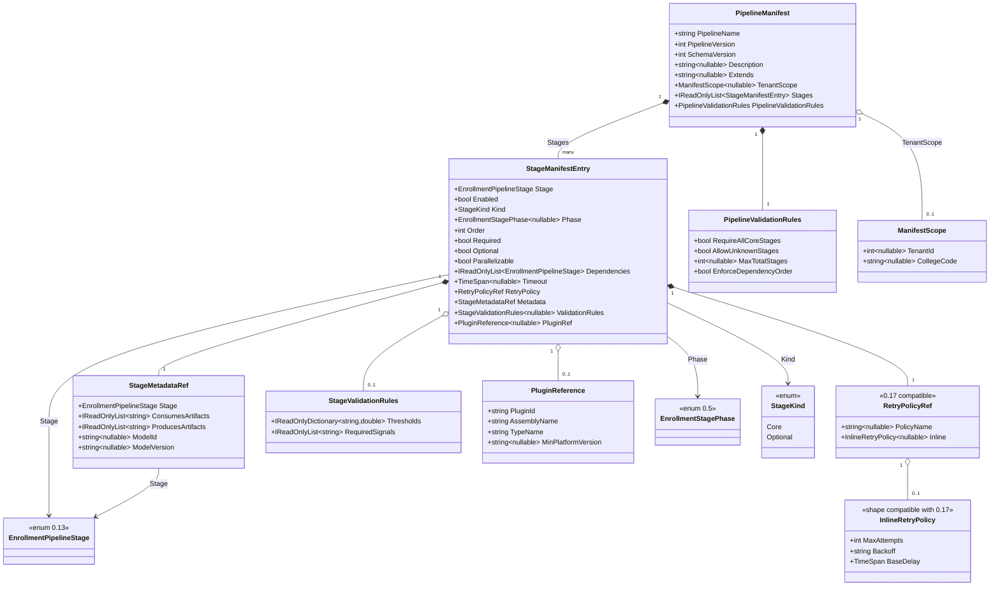
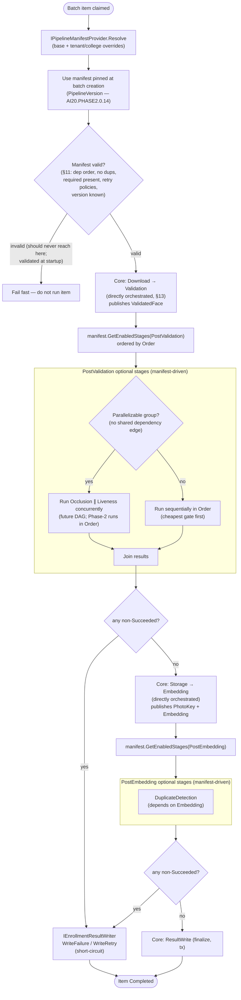
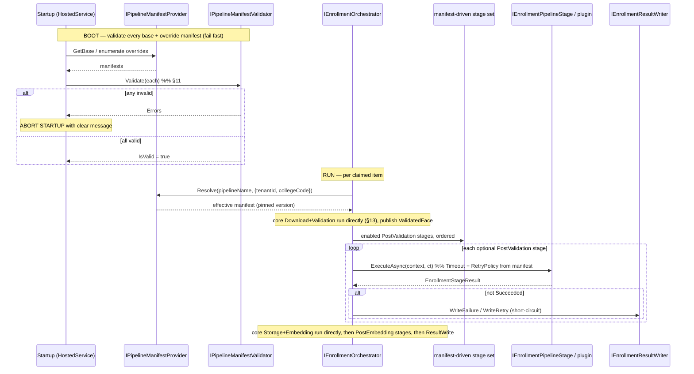

# AI20.PHASE2.0.16 — Pipeline Manifest

**Type:** Architecture/schema design only. No production code was written or modified to produce this document. Every C#, JSON, and YAML block below is an **illustrative proposal** inside a markdown code block — no manifest file, config section, entity, DTO, loader, validator, orchestrator change, migration, or UI behavior has been implemented. Nothing here modifies `appsettings.json` or any real configuration.

**Status of the code/config blocks below:** every block is a **proposed** shape that does not yet exist in the codebase. They are the design artifact of this milestone, not committed code or config.

**Reads this design builds on:**
- `docs/AI20_PHASE2_PIPELINE_STAGE_DESIGN.md` (AI20.PHASE2.0.5) — **the primary input.** Its `IEnrollmentPipelineStage`, the five fixed core stages, the two extension phases (`PostValidation`/`PostEmbedding`), and especially its §5 **configuration-driven registration** recommendation (the proposed `EnrollmentPipeline` appsettings section mirroring `StudentPhotoProviderFactory`). This manifest is the full realization of that §5 recommendation and builds directly on it.
- `docs/AI20_PHASE2_PIPELINE_STAGE_ENUM.md` (AI20.PHASE2.0.13) — the canonical `EnrollmentPipelineStage` enum used for **stage identity** in every manifest entry. Configuration serializes canonical enum names, never free-form strings.
- `docs/AI20_PHASE2_ENGINE_CONTRACTS.md` (AI20.PHASE2.0.1) — §4 `IEnrollmentOrchestrator` (the orchestrator that "would eventually execute from this manifest instead of hardcoded stages") and §2 (`EnrollmentStageResult`, `FailureCategory`).
- `Abhyanvaya.API/appsettings.json` — the existing configuration conventions (`StudentPhotoProvider`, `Embedding`, `InsightFace`) that this manifest's config-hosted form matches.

**Forward-references to sibling milestones authored in parallel (their contracts are referenced, not redefined here):**
- **AI20.PHASE2.0.14 — Pipeline Versioning** (`docs/AI20_PHASE2_PIPELINE_VERSIONING.md`): defines `PipelineVersion` + `PipelineDefinition` + batch version pinning. **A manifest is the concrete expression of a `PipelineDefinition` for a specific `PipelineVersion`; a batch pins a manifest version at creation.** This manifest's `PipelineVersion` field is the integer that 0.14 governs.
- **AI20.PHASE2.0.15 — Stage Capabilities** (`docs/AI20_PHASE2_STAGE_CAPABILITIES.md`): defines `StageDescriptor` / `StageCapabilities` / `StageMetadata` including the artifact producer/consumer model. **Each stage entry in the manifest carries or references the `StageCapabilities`/`StageMetadata` defined in AI20.PHASE2.0.15.** This document does not invent a competing capability model; its per-stage `Metadata` block is a thin reference/echo consistent with 0.15.
- **AI20.PHASE2.0.17 — Retry Policy** (`docs/AI20_PHASE2_RETRY_POLICY.md`): defines the rich retry model. **Each manifest stage entry's `RetryPolicy` field is a named retry-policy reference (or an inline policy) whose shape is compatible with 0.17.** This document does not redefine the retry model.

---

## 0. Design principles (carried from the baseline contracts)

This manifest obeys the same conventions established in `docs/AI20_PHASE2_ENGINE_CONTRACTS.md` §0 and `docs/AI20_PHASE2_PIPELINE_STAGE_DESIGN.md` §0:

1. **Manifest schema (types) lives in `Abhyanvaya.Application`; loading/validation/binding implementations live in `Abhyanvaya.Infrastructure`.** Domain enums/value objects are reused unchanged.
2. **Configuration-driven, no hardcoding.** The active set/order of optional stages is a manifest concern, selected exactly like `StudentPhotoProvider:DefaultProvider` — never hardcoded in a stage or a caller. The manifest is the single source of truth for "which optional AI checks run, in what order, with what policy."
3. **Fail fast at load time.** A manifest that references an unknown stage, an unknown retry policy, an unknown `PipelineVersion`, or that orders a consumer before its producer is a **startup error**, not a silent skip. This validation is the central value of the manifest approach (§11).
4. **Immutability.** A loaded manifest is an immutable in-memory value object (`sealed record`, `init` members). It is bound once at startup (or on a controlled reload) and never mutated during execution.
5. **Additive & non-breaking.** Introducing a manifest does not rewrite the core path. The five core stages stay directly orchestrated (`docs/AI20_PHASE2_PIPELINE_STAGE_DESIGN.md` §7); the manifest expresses BOTH core (for completeness/telemetry) and optional (fully manifest-driven) stages — see §13.
6. **Multi-tenant aware.** A base manifest may be overridden per tenant/college using the same ambient-tenant model (`ITenantContextAccessor`, `ITenantScoped`) the rest of the platform uses. Overrides **compose** onto a base; they do not replace the whole pipeline (§9).

---

## 1. What a Pipeline Manifest is

A **Pipeline Manifest** is a declarative, versioned document that fully describes one enrollment pipeline: its identity, its ordered list of stage entries, each stage's execution policy (enabled/retry/timeout/dependencies/parallelizable/optional/required/metadata/validation), and pipeline-level validation rules. The orchestrator should **eventually execute optional stages from this manifest instead of a hardcoded list**, resolving stages by their canonical `EnrollmentPipelineStage` identity.

Relationship to the versioning milestone (0.14):

| Concept (0.14) | Relationship to this manifest |
|---|---|
| `PipelineVersion` (integer) | The manifest's `PipelineVersion` field. A monotonically increasing integer that 0.14 governs. |
| `PipelineDefinition` | The abstract "what a pipeline of this version consists of." **A manifest is the concrete, serialized expression of a `PipelineDefinition` for one `PipelineVersion`.** |
| Batch version pinning | At batch creation, a batch records the `PipelineVersion` (and therefore the manifest revision) it will run under, so a mid-flight manifest change never reshapes an in-progress batch. |

The manifest is *declarative data*; the orchestrator (0.1 §4) and the stage abstraction (0.5) are the *executing code*. The manifest never contains logic — only identity, order, and policy.

---

## 2. Manifest schema — field tables

### 2.1 Pipeline-level fields

| Field | Type | Required | Description |
|---|---|---|---|
| `PipelineName` | `string` | Yes | Stable human-readable name of this pipeline (e.g. `"StudentEnrollment"`). Diagnostic + selection key; not the version. |
| `PipelineVersion` | `int` | Yes | Integer version consistent with **AI20.PHASE2.0.14**. Must match a known `PipelineDefinition`; a batch pins this at creation. |
| `SchemaVersion` | `int` | Yes | Version of the *manifest schema itself* (not the pipeline). Lets the loader evolve field shapes independently of pipeline content. |
| `Description` | `string?` | No | Free-text note for operators. |
| `Stages` | `StageManifestEntry[]` | Yes | The **execution order** — an ordered list of stage entries (§2.2). Order in the array is the authoritative linear order (with `Order` as a tie-breaker, per 0.5 §4). |
| `PipelineValidationRules` | `PipelineValidationRules` | Yes | Cross-stage rules validated at load (§2.3, §11). |
| `Extends` | `string?` | No | For an **override manifest**: the `PipelineName@Version` of the base manifest this one composes onto (§9). Null for a base manifest. |
| `TenantScope` | `ManifestScope?` | No | For an override: the tenant/college this override applies to (§9). Null ⇒ platform-wide base. |

### 2.2 Per-stage fields (`StageManifestEntry`)

| Field | Type | Required | Description |
|---|---|---|---|
| `Stage` | `EnrollmentPipelineStage` (enum, **0.13**) | Yes | Canonical stage identity. Serialized as the enum name (e.g. `"Liveness"`). Resolves a DI-registered `IEnrollmentPipelineStage` by name for optional stages. |
| `Enabled` | `bool` | Yes | Whether this stage runs. A disabled stage stays in the manifest (for telemetry/audit completeness) but is skipped by the orchestrator. |
| `Kind` | `StageKind` (enum) | Yes | `Core` (one of the five fixed stages) or `Optional` (a pluggable extension stage). Drives the reconciliation in §13. |
| `Phase` | `EnrollmentStagePhase?` (enum, **0.5**) | For optional | `PostValidation` or `PostEmbedding` — the extension slot. Null/ignored for `Core` stages (their position is fixed). |
| `Order` | `int` | Yes | Relative order **within the phase**; tie-breaker/fallback when array order is ambiguous (0.5 §4). Lower runs earlier. Never sorted by enum numeric value. |
| `Required` | `bool` | Yes | If true, the stage MUST be present and enabled for the manifest to be valid (a removal/disable is a load error). Core stages are always `Required: true`. |
| `Optional` | `bool` | Yes | If true, the stage may be absent/disabled without invalidating the manifest. Mutually exclusive with `Required`. |
| `Parallelizable` | `bool` | Yes | Whether this stage may run concurrently with other `Parallelizable` stages in the same phase that share no dependency edge (§12). Phase-2 linear execution may ignore this; it is forward-looking metadata for the DAG upgrade (0.5 §4). |
| `Dependencies` | `EnrollmentPipelineStage[]` | Yes (may be empty) | Stages that MUST precede this one. Ties to the **artifact producer/consumer model in AI20.PHASE2.0.15**: a consumer lists the producer of the artifact it reads (e.g. `DuplicateDetection` depends on `Embedding`; `Liveness` depends on `Validation`). Validated at load (§11). |
| `Timeout` | `duration string` (e.g. `"00:00:30"`) | No | Per-stage execution timeout. Absent ⇒ inherit pipeline/host default. |
| `RetryPolicy` | `string` \| `InlineRetryPolicy` | No | **Named retry-policy reference** (e.g. `"TransientEngine"`) resolved against the retry-policy catalog defined in **AI20.PHASE2.0.17**, OR an inline policy object whose shape is compatible with 0.17. Absent ⇒ no stage-level retry (item-level retry classification still applies via 0.1 §6). |
| `Metadata` | `StageMetadataRef` | Yes | Reference to / echo of the `StageCapabilities`/`StageMetadata` defined in **AI20.PHASE2.0.15** (produces/consumes artifacts, failure categories, cost class, model id/version). The manifest carries a *reference*, not a competing capability model (§2.4). |
| `ValidationRules` | `StageValidationRules?` | No | Per-stage rules (thresholds, required signals) validated at load and/or checked at runtime by the stage itself. |
| `PluginRef` | `PluginReference?` | No | For a **third-party/institution plugin stage**: how the stage assembly/type is identified and resolved (§7). Null for first-party stages resolved from DI. |

### 2.3 Pipeline-level validation rules (`PipelineValidationRules`)

| Field | Type | Description |
|---|---|---|
| `RequireAllCoreStages` | `bool` | The five core stages must all be present (default true). |
| `AllowUnknownStages` | `bool` | Whether a stage name not registered in DI / not a known plugin is tolerated (default false ⇒ load error). |
| `MaxTotalStages` | `int?` | Optional guard against runaway manifests. |
| `EnforceDependencyOrder` | `bool` | Whether the loader rejects a manifest where a consumer precedes its producer (default true) — see §11. |

### 2.4 How per-stage metadata references 0.15 (no competing model)

The manifest deliberately does **not** define its own capability taxonomy. `StageMetadataRef` is a thin pointer/echo whose authoritative definition is `StageCapabilities`/`StageMetadata` in AI20.PHASE2.0.15:

```csharp
// Illustrative proposal only. No C# file was created or modified.
namespace Abhyanvaya.Application.Enrollment.Pipeline.Manifest;

/// <summary>
/// Reference to the StageCapabilities/StageMetadata authoritatively defined in AI20.PHASE2.0.15.
/// The manifest carries the stage's canonical identity and (optionally) a snapshot of the capability
/// fields it needs for validation (producer/consumer artifacts) — it does NOT own the capability model.
/// At load time the loader resolves the live StageDescriptor from the capability registry (0.15) and
/// cross-checks it against this reference; a mismatch is a load error.
/// </summary>
public sealed record StageMetadataRef
{
    /// <summary>Canonical stage identity (0.13). The join key into the 0.15 capability registry.</summary>
    public required EnrollmentPipelineStage Stage { get; init; }

    /// <summary>Artifacts this stage CONSUMES (must be produced by an earlier stage). Echoes 0.15.</summary>
    public IReadOnlyList<string> ConsumesArtifacts { get; init; } = Array.Empty<string>();

    /// <summary>Artifacts this stage PRODUCES for later stages. Echoes 0.15.</summary>
    public IReadOnlyList<string> ProducesArtifacts { get; init; } = Array.Empty<string>();

    /// <summary>Model identity/version for AI stages (for reproducibility/telemetry). Sourced from 0.15.</summary>
    public string? ModelId { get; init; }
    public string? ModelVersion { get; init; }
}
```

---

## 3. Object model — class diagram



The proposed record shape (Application layer):

```csharp
// Illustrative proposal only. No C# file was created or modified.
namespace Abhyanvaya.Application.Enrollment.Pipeline.Manifest;

public enum StageKind { Core = 0, Optional = 1 }

/// <summary>Immutable, load-once description of one enrollment pipeline (the concrete expression of a
/// PipelineDefinition for a PipelineVersion — see AI20.PHASE2.0.14).</summary>
public sealed record PipelineManifest
{
    public required string PipelineName { get; init; }
    public required int PipelineVersion { get; init; }   // consistent with AI20.PHASE2.0.14
    public required int SchemaVersion { get; init; }
    public string? Description { get; init; }
    public string? Extends { get; init; }                // "Name@Version" of base, for overrides (§9)
    public ManifestScope? TenantScope { get; init; }     // null ⇒ platform-wide base
    public required IReadOnlyList<StageManifestEntry> Stages { get; init; }
    public required PipelineValidationRules PipelineValidationRules { get; init; }
}

public sealed record StageManifestEntry
{
    public required EnrollmentPipelineStage Stage { get; init; }   // identity (0.13)
    public required bool Enabled { get; init; }
    public required StageKind Kind { get; init; }
    public EnrollmentStagePhase? Phase { get; init; }              // (0.5), for optional stages
    public required int Order { get; init; }
    public required bool Required { get; init; }
    public required bool Optional { get; init; }
    public required bool Parallelizable { get; init; }
    public IReadOnlyList<EnrollmentPipelineStage> Dependencies { get; init; } = Array.Empty<EnrollmentPipelineStage>();
    public TimeSpan? Timeout { get; init; }
    public RetryPolicyRef RetryPolicy { get; init; } = RetryPolicyRef.None;  // shape ~ AI20.PHASE2.0.17
    public required StageMetadataRef Metadata { get; init; }        // ref to AI20.PHASE2.0.15
    public StageValidationRules? ValidationRules { get; init; }
    public PluginReference? PluginRef { get; init; }               // for third-party stages (§7)
}

public sealed record RetryPolicyRef   // compatible with AI20.PHASE2.0.17
{
    public string? PolicyName { get; init; }       // named reference into the 0.17 policy catalog
    public InlineRetryPolicy? Inline { get; init; }
    public static readonly RetryPolicyRef None = new();
}

public sealed record InlineRetryPolicy
{
    public required int MaxAttempts { get; init; }
    public required string Backoff { get; init; }   // e.g. "Exponential" | "Fixed" (0.17 vocabulary)
    public TimeSpan BaseDelay { get; init; }
}

public sealed record PipelineValidationRules
{
    public bool RequireAllCoreStages { get; init; } = true;
    public bool AllowUnknownStages { get; init; }
    public int? MaxTotalStages { get; init; }
    public bool EnforceDependencyOrder { get; init; } = true;
}

public sealed record StageValidationRules
{
    public IReadOnlyDictionary<string, double> Thresholds { get; init; } =
        new Dictionary<string, double>(StringComparer.OrdinalIgnoreCase);
    public IReadOnlyList<string> RequiredSignals { get; init; } = Array.Empty<string>();
}

public sealed record PluginReference
{
    public required string PluginId { get; init; }
    public required string AssemblyName { get; init; }
    public required string TypeName { get; init; }
    public string? MinPlatformVersion { get; init; }
}

public sealed record ManifestScope
{
    public int? TenantId { get; init; }
    public string? CollegeCode { get; init; }
}
```

---

## 4. JSON example — V1 base manifest (5 core stages)

This V1 base manifest expresses the current five-stage pipeline exactly as `docs/AI20_PHASE2_ENGINE_CONTRACTS.md` §15 fixes it (download → validate → storage → embedding → finalize). All five are `Core`/`Required` and present for completeness/telemetry even though they stay hardwired (§13). No optional stages are enabled — so this manifest behaves identically to today's flow.

```jsonc
{
  "PipelineManifest": {
    "pipelineName": "StudentEnrollment",
    "pipelineVersion": 1,
    "schemaVersion": 1,
    "description": "Baseline V1 — five fixed core stages, no optional AI stages enabled.",
    "extends": null,
    "tenantScope": null,
    "stages": [
      {
        "stage": "Download",
        "enabled": true,
        "kind": "Core",
        "phase": null,
        "order": 10,
        "required": true,
        "optional": false,
        "parallelizable": false,
        "dependencies": [],
        "timeout": "00:00:20",
        "retryPolicy": { "policyName": "TransientDownload" },
        "metadata": {
          "stage": "Download",
          "consumesArtifacts": [],
          "producesArtifacts": [ "DownloadedPhoto" ]
        }
      },
      {
        "stage": "Validation",
        "enabled": true,
        "kind": "Core",
        "phase": null,
        "order": 20,
        "required": true,
        "optional": false,
        "parallelizable": false,
        "dependencies": [ "Download" ],
        "timeout": "00:00:15",
        "retryPolicy": { "policyName": "None" },
        "metadata": {
          "stage": "Validation",
          "consumesArtifacts": [ "DownloadedPhoto" ],
          "producesArtifacts": [ "ValidatedFace" ]
        }
      },
      {
        "stage": "Storage",
        "enabled": true,
        "kind": "Core",
        "phase": null,
        "order": 30,
        "required": true,
        "optional": false,
        "parallelizable": false,
        "dependencies": [ "Validation" ],
        "timeout": "00:00:30",
        "retryPolicy": { "policyName": "TransientStorage" },
        "metadata": {
          "stage": "Storage",
          "consumesArtifacts": [ "DownloadedPhoto" ],
          "producesArtifacts": [ "PhotoKey" ]
        }
      },
      {
        "stage": "Embedding",
        "enabled": true,
        "kind": "Core",
        "phase": null,
        "order": 40,
        "required": true,
        "optional": false,
        "parallelizable": false,
        "dependencies": [ "Validation" ],
        "timeout": "00:00:30",
        "retryPolicy": { "policyName": "TransientEngine" },
        "metadata": {
          "stage": "Embedding",
          "consumesArtifacts": [ "ValidatedFace" ],
          "producesArtifacts": [ "Embedding" ],
          "modelId": "InsightFace",
          "modelVersion": "InsightFace-1.0"
        }
      },
      {
        "stage": "ResultWrite",
        "enabled": true,
        "kind": "Core",
        "phase": null,
        "order": 50,
        "required": true,
        "optional": false,
        "parallelizable": false,
        "dependencies": [ "Storage", "Embedding" ],
        "timeout": "00:00:30",
        "retryPolicy": { "policyName": "TransientDb" },
        "metadata": {
          "stage": "ResultWrite",
          "consumesArtifacts": [ "PhotoKey", "Embedding" ],
          "producesArtifacts": []
        }
      }
    ],
    "pipelineValidationRules": {
      "requireAllCoreStages": true,
      "allowUnknownStages": false,
      "maxTotalStages": 32,
      "enforceDependencyOrder": true
    }
  }
}
```

---

## 5. YAML example — V1 base manifest (5 core stages)

The same V1 base manifest in YAML (for a file-hosted manifest, §10):

```yaml
pipelineManifest:
  pipelineName: StudentEnrollment
  pipelineVersion: 1
  schemaVersion: 1
  description: Baseline V1 — five fixed core stages, no optional AI stages enabled.
  extends: null
  tenantScope: null
  stages:
    - stage: Download
      enabled: true
      kind: Core
      order: 10
      required: true
      optional: false
      parallelizable: false
      dependencies: []
      timeout: 00:00:20
      retryPolicy:
        policyName: TransientDownload
      metadata:
        stage: Download
        consumesArtifacts: []
        producesArtifacts: [ DownloadedPhoto ]
    - stage: Validation
      enabled: true
      kind: Core
      order: 20
      required: true
      optional: false
      parallelizable: false
      dependencies: [ Download ]
      timeout: 00:00:15
      retryPolicy:
        policyName: None
      metadata:
        stage: Validation
        consumesArtifacts: [ DownloadedPhoto ]
        producesArtifacts: [ ValidatedFace ]
    - stage: Storage
      enabled: true
      kind: Core
      order: 30
      required: true
      optional: false
      parallelizable: false
      dependencies: [ Validation ]
      timeout: 00:00:30
      retryPolicy:
        policyName: TransientStorage
      metadata:
        stage: Storage
        consumesArtifacts: [ DownloadedPhoto ]
        producesArtifacts: [ PhotoKey ]
    - stage: Embedding
      enabled: true
      kind: Core
      order: 40
      required: true
      optional: false
      parallelizable: false
      dependencies: [ Validation ]
      timeout: 00:00:30
      retryPolicy:
        policyName: TransientEngine
      metadata:
        stage: Embedding
        consumesArtifacts: [ ValidatedFace ]
        producesArtifacts: [ Embedding ]
        modelId: InsightFace
        modelVersion: InsightFace-1.0
    - stage: ResultWrite
      enabled: true
      kind: Core
      order: 50
      required: true
      optional: false
      parallelizable: false
      dependencies: [ Storage, Embedding ]
      timeout: 00:00:30
      retryPolicy:
        policyName: TransientDb
      metadata:
        stage: ResultWrite
        consumesArtifacts: [ PhotoKey, Embedding ]
        producesArtifacts: []
  pipelineValidationRules:
    requireAllCoreStages: true
    allowUnknownStages: false
    maxTotalStages: 32
    enforceDependencyOrder: true
```

---

## 6. Second example — V2 / institution override adding Liveness Detection

Two ways the platform reaches "college X requires Liveness, college Y doesn't":

- **(A) A new platform-wide V2** that adds Liveness for everyone (bump `pipelineVersion`, new `PipelineDefinition` per 0.14).
- **(B) A per-college override manifest** that composes onto the V1 base via `extends`, enabling Liveness only for that college (§9). The base is untouched; college Y keeps V1.

Below is **(B) — the override manifest** (the more interesting, multi-tenant case). It carries only the *delta*: it enables the optional `Liveness` stage in `PostValidation`, and does not repeat the five core stages (they are inherited from the base and merged at load — §9).

### 6.1 JSON — per-college override adding Liveness

```jsonc
{
  "PipelineManifest": {
    "pipelineName": "StudentEnrollment",
    "pipelineVersion": 2,
    "schemaVersion": 1,
    "description": "Override for College GITAM — requires Liveness Detection after Validation.",
    "extends": "StudentEnrollment@1",
    "tenantScope": { "tenantId": 42, "collegeCode": "GITAM" },
    "stages": [
      {
        "stage": "Liveness",
        "enabled": true,
        "kind": "Optional",
        "phase": "PostValidation",
        "order": 100,
        "required": false,
        "optional": true,
        "parallelizable": false,
        "dependencies": [ "Validation" ],
        "timeout": "00:00:10",
        "retryPolicy": { "policyName": "TransientEngine" },
        "metadata": {
          "stage": "Liveness",
          "consumesArtifacts": [ "ValidatedFace" ],
          "producesArtifacts": [],
          "modelId": "Liveness-AntiSpoof",
          "modelVersion": "v1"
        },
        "validationRules": {
          "thresholds": { "minLivenessScore": 0.85 },
          "requiredSignals": [ "liveness" ]
        }
      }
    ],
    "pipelineValidationRules": {
      "requireAllCoreStages": true,
      "allowUnknownStages": false,
      "enforceDependencyOrder": true
    }
  }
}
```

### 6.2 YAML — the same override, plus a plugin-based future stage

This YAML variant additionally shows a **third-party plugin stage** (§7) loaded by name — an institution-provided `Occlusion` model — to demonstrate both extension mechanisms in one document:

```yaml
pipelineManifest:
  pipelineName: StudentEnrollment
  pipelineVersion: 2
  schemaVersion: 1
  description: Override for College GITAM — Liveness + an institution Occlusion plugin.
  extends: StudentEnrollment@1
  tenantScope:
    tenantId: 42
    collegeCode: GITAM
  stages:
    - stage: Liveness
      enabled: true
      kind: Optional
      phase: PostValidation
      order: 100
      required: false
      optional: true
      parallelizable: true
      dependencies: [ Validation ]
      timeout: 00:00:10
      retryPolicy:
        policyName: TransientEngine
      metadata:
        stage: Liveness
        consumesArtifacts: [ ValidatedFace ]
        producesArtifacts: []
        modelId: Liveness-AntiSpoof
        modelVersion: v1
      validationRules:
        thresholds:
          minLivenessScore: 0.85
        requiredSignals: [ liveness ]
    - stage: Occlusion
      enabled: true
      kind: Optional
      phase: PostValidation
      order: 90
      required: false
      optional: true
      parallelizable: true
      dependencies: [ Validation ]
      timeout: 00:00:10
      retryPolicy:
        policyName: TransientEngine
      metadata:
        stage: Occlusion
        consumesArtifacts: [ ValidatedFace ]
        producesArtifacts: []
      validationRules:
        thresholds:
          maxOcclusionCoverage: 0.30
        requiredSignals: [ occlusion ]
      pluginRef:
        pluginId: gitam.occlusion.v1
        assemblyName: Gitam.Enrollment.Plugins
        typeName: Gitam.Enrollment.Plugins.OcclusionStage
        minPlatformVersion: 2.0.0
  pipelineValidationRules:
    requireAllCoreStages: true
    allowUnknownStages: false
    enforceDependencyOrder: true
```

> Note the effective pipeline after composing this override onto the V1 base: `Download → Validation → [Occlusion(order 90), Liveness(order 100)] (PostValidation) → Storage → Embedding → ResultWrite`. Both optional stages depend on `Validation` and share no artifact edge with each other, so they are `parallelizable: true` and could run concurrently once the DAG upgrade (0.5 §4) lands; Phase-2 linear execution simply runs them in `Order`.

---

## 7. Supports future plugins (third-party / institution-provided stages)

A plugin stage is one whose implementation is **not** compiled into the platform — it is supplied by a third party or an institution and loaded **by name** at startup. The manifest is how such a stage is declared, identified, resolved, and (conceptually) sandboxed.

**Identification.** A plugin entry carries `Stage` (still a canonical `EnrollmentPipelineStage` identity — plugins map onto known optional slots; the enum's reserved numeric gaps in 0.13 allow adding new plugin identities) plus a `PluginReference` (`PluginId`, `AssemblyName`, `TypeName`, `MinPlatformVersion`).

**Resolution (proposed, conceptual — not implemented here).** At startup the manifest loader:
1. Resolves first-party stages from the DI `IEnumerable<IEnrollmentPipelineStage>` by `Stage` name (exactly the 0.5 §5 pattern — the direct analogue of `StudentPhotoProviderFactory` grouping providers by name).
2. For entries with a `PluginRef`, resolves the type from a **dedicated plugin load context** (conceptually an `AssemblyLoadContext`), verifies it implements `IEnrollmentPipelineStage`, verifies its `StageName`/identity matches the manifest entry, and verifies `MinPlatformVersion` against the running platform version. Any failure is a **load error** (fail fast, §11) — a plugin never silently no-ops.

**Sandboxing (conceptual).** Because a stage produces *values* only and never touches DB or storage (design principle #5 of 0.5), a plugin's blast radius is already bounded by contract: it reads the shared context and returns an `EnrollmentStageResult`. The proposed additional guards: an isolated load context (so plugin dependencies cannot clash with platform assemblies), the per-stage `Timeout` as a hard execution ceiling, the `RetryPolicy` bounding transient retries, and the "expected failures never throw / unexpected exceptions are caught by the orchestrator and converted to a retry/fail write" rule (0.1 §4) that contains a misbehaving plugin. A plugin cannot reorder itself past its declared `Dependencies` (§11 rejects that at load), and it cannot escalate to `Core`/`Required` — only a platform base manifest may declare core stages.

This makes third-party stages **additive and manifest-declared**: adding one is editing a manifest + dropping an assembly, never editing the orchestrator.

---

## 8. Supports future AI stages (the seven future stages slot in with no orchestrator change)

The seven future stages from `docs/AI20_PHASE2_PIPELINE_STAGE_DESIGN.md` §6 — Liveness, Mask, Occlusion, Spoof, FaceQualityRanking, FaceNormalization (all `PostValidation`), and DuplicateDetection (`PostEmbedding`) — are already canonical members of the `EnrollmentPipelineStage` enum (0.13). Each becomes a manifest entry with `Kind: Optional`, the correct `Phase`, its `Dependencies` (all `PostValidation` stages depend on `Validation`; `DuplicateDetection` depends on `Embedding`), and a `Metadata` block referencing its 0.15 capabilities.

Because the orchestrator resolves optional stages **from the manifest** via `IEnrollmentPipelineStageProvider` (0.5 §5) at the two fixed extension points, adding any of these seven is:

1. Register the stage implementation in DI (`IEnrollmentPipelineStage`) — infrastructure wiring, one line.
2. Add its entry to the manifest (data), enabled, in the right phase/order, with dependencies + retry policy.

No `foreach` in the orchestrator changes; no branching changes. The orchestrator already iterates "the manifest's enabled optional stages for this phase, in order, short-circuiting on the first non-`Succeeded` result." This is precisely the value the manifest delivers: **new AI capability = new manifest data + a DI registration, not an orchestrator edit.**

---

## 9. Supports institution-specific customization (per-tenant / per-college overrides)

Requirement: one college requires Liveness, another doesn't — without forking the whole pipeline.

**Composition model: base manifest + scoped override, merged by canonical stage identity.** This mirrors the platform's existing multi-tenant conventions (`ITenantContextAccessor.CurrentTenantId`, `ITenantScoped`, per-tenant config resolution) rather than inventing a new one.

- A **base manifest** (`TenantScope: null`) defines the platform-wide pipeline for a `PipelineVersion` (e.g. the V1 in §4).
- An **override manifest** sets `Extends: "StudentEnrollment@1"` and `TenantScope: { tenantId, collegeCode }`, and lists only the *delta* stages (the §6 override adds `Liveness`).

**Merge algorithm (proposed, deterministic, at load/resolve time):**

| Step | Rule |
|---|---|
| 1. Start from the base | Take the base manifest's stage list as the working set. |
| 2. Match by identity | For each override entry, match on canonical `Stage` (0.13 enum) — not array position. |
| 3. Add or replace | A matched stage is **replaced field-by-field** by the override entry (e.g. override `Enabled`/`Timeout`/`ValidationRules`); an unmatched override stage is **added**. |
| 4. Core stages are protected | An override may **not** add, remove, or reorder `Core` stages, nor flip a `Required` core stage to disabled. Attempting to is a load error. Overrides customize the *optional* surface only. |
| 5. Re-validate | The merged manifest is validated in full (§11) exactly as a base manifest would be — dependency order, no duplicates, required present, retry policies resolve, version known. An override cannot produce an invalid effective pipeline. |
| 6. Resolve per item | At batch creation the effective manifest for the batch's `(tenantId, collegeCode)` is resolved and its `PipelineVersion` pinned (0.14). College Y with no override runs the pure base; College X runs base+override. |

This gives per-college customization that is **composable, validated, version-pinned, and core-safe** — an override is a small, auditable delta, and a college that opts out of Liveness simply has no override (or an override that sets `Liveness.enabled = false`).

---

## 10. Supports configuration-driven pipelines (where the manifest lives, how it loads/validates)

The manifest can physically live in three places. The recommendation is a **layered resolution** that matches how this codebase already layers configuration.

| Location | Pros | Cons | Recommended role |
|---|---|---|---|
| **appsettings.json** (`EnrollmentPipeline` section, extending the 0.5 §5 shape) | Zero new infrastructure; matches `StudentPhotoProvider`/`Embedding`/`InsightFace` conventions already in `appsettings.json`; bound via `IOptions`. | Redeploy/restart to change; no per-tenant rows; awkward for many colleges. | **The base manifest** (platform-wide V1/V2). |
| **Database** (a `PipelineManifest`/`PipelineManifestStage` table, tenant-scoped via `ITenantScoped`) | Per-tenant/per-college overrides without redeploy; auditable; naturally version-pinnable per 0.14; consistent with the rest of the tenant data. | Needs a migration + repository (future milestone); must be validated on read. | **Per-tenant/college overrides** (§9) and operator-editable pipelines. |
| **Standalone file** (JSON/YAML on disk or object storage) | Good for GitOps / plugin bundles shipping their own manifest fragment; easy diffing/review. | Needs a file watcher + provenance controls. | **Plugin-supplied fragments** and environment-specific bases. |

**Recommendation:** base manifest in **appsettings** (matches §4/§5 examples and existing conventions), overrides in the **database** (tenant-scoped), plugin fragments as **files**. A single `IPipelineManifestProvider` composes them (base ← overrides ← plugin fragments) and returns the effective, validated manifest.

**Loading + validation at startup (proposed, conceptual):**

```csharp
// Illustrative proposal only. No C# file was created or modified.
namespace Abhyanvaya.Application.Enrollment.Pipeline.Manifest;

/// <summary>
/// Resolves the effective, validated PipelineManifest for a scope. Base is bound from configuration
/// (mirroring IStudentPhotoProviderFactory reading StudentPhotoProvider config); overrides are merged
/// per §9. Validation (§11) runs eagerly so a bad manifest fails app startup, not the first batch.
/// </summary>
public interface IPipelineManifestProvider
{
    /// <summary>The platform base manifest for a pipeline version (from appsettings). Validated.</summary>
    PipelineManifest GetBase(string pipelineName, int pipelineVersion);

    /// <summary>The effective manifest for a tenant/college (base + overrides, merged + re-validated).</summary>
    PipelineManifest Resolve(string pipelineName, ManifestScope scope);
}

/// <summary>Validates a manifest; returns all violations (never throws for expected content errors).</summary>
public interface IPipelineManifestValidator
{
    ManifestValidationReport Validate(PipelineManifest manifest);
}

public sealed record ManifestValidationReport
{
    public required bool IsValid { get; init; }
    public required IReadOnlyList<string> Errors { get; init; }
}
```

At startup a hosted validation check (the same "fail-fast on missing config" discipline `StudentPhotoProviderFactory` uses for an unknown provider) calls `IPipelineManifestValidator.Validate` on every base manifest and every known override; **any error aborts startup with a clear message.** This turns "the pipeline is misconfigured" from a runtime surprise into a boot-time failure.

---

## 11. Manifest validation (the central value of the manifest approach)

Validation runs at **load time** (and again after any override merge, §9). It is the reason a declarative manifest is safer than a hardcoded list: the whole pipeline shape is checked *before* a single item runs. Each check, concretely:

| # | Check | Rule | Data source | On failure |
|---|---|---|---|---|
| 1 | **Dependency order** | Every stage's `Dependencies` must all appear **earlier** in the effective execution order. A consumer must run after its producer (e.g. `DuplicateDetection` after `Embedding`, `Liveness` after `Validation`). | Per-stage `Dependencies` + producer/consumer artifacts from **AI20.PHASE2.0.15** (`ConsumesArtifacts` must be produced by an earlier stage's `ProducesArtifacts`). | Load error listing the offending consumer→producer pair. |
| 2 | **No duplicate stages** | Each `EnrollmentPipelineStage` identity appears at most once in the effective manifest. | Canonical enum identity (0.13). | Load error naming the duplicated stage. |
| 3 | **Required stages present & enabled** | Every entry with `Required: true` (all five core stages, plus any override-required optional) is present and `Enabled: true`. Honors `RequireAllCoreStages`. | `Required` flag + `PipelineValidationRules.RequireAllCoreStages`. | Load error naming the missing/disabled required stage. |
| 4 | **Referenced retry policies exist** | Every `RetryPolicy.PolicyName` resolves to a policy in the **AI20.PHASE2.0.17** catalog; every inline policy has a valid shape (`MaxAttempts ≥ 0`, known `Backoff`). | Retry-policy catalog (0.17). | Load error naming the unknown policy. |
| 5 | **Version matches a known PipelineDefinition** | `PipelineVersion` must correspond to a registered `PipelineDefinition` per **AI20.PHASE2.0.14**; `SchemaVersion` must be a schema the loader understands. | 0.14 version registry. | Load error: unknown pipeline/schema version. |
| 6 | **Stages resolve** | Every non-plugin `Stage` resolves to a DI-registered `IEnrollmentPipelineStage` (for optional stages) or is a known core stage; every plugin `Stage` resolves via its `PluginRef` and implements the interface + matches identity + satisfies `MinPlatformVersion`. Governed by `AllowUnknownStages`. | DI stage set (0.5 §5) + plugin loader (§7). | Load error naming the unresolved stage. |
| 7 | **Phase/Kind consistency** | Core stages have `Kind: Core` and a fixed position; optional stages have `Kind: Optional` and a valid `Phase` (`PostValidation`/`PostEmbedding`). An optional stage may not claim a core position. | `Kind` + `Phase` fields. | Load error. |
| 8 | **Override legality** | An override does not add/remove/reorder core stages or disable a required core stage (§9 step 4); `Extends` points at an existing base version. | `Extends`/`TenantScope` + base. | Load error. |
| 9 | **Bounds** | Total effective stages ≤ `MaxTotalStages` (if set); `Parallelizable` stages sharing a dependency edge are flagged (they cannot actually parallelize). | `PipelineValidationRules`. | Load error / warning. |

The dependency-order + producer/consumer check (rows 1 and using 0.15 data) is the highest-value check: it makes an impossible pipeline (e.g. "run DuplicateDetection before Embedding") **unbuildable** rather than a latent runtime bug.

---

## 12. Execution-flow diagram — orchestrator loading, validating, and executing a manifest





---

## 13. Orchestrator reconciliation — core-hardwired vs optional-manifest-driven

Per `docs/AI20_PHASE2_PIPELINE_STAGE_DESIGN.md` §7, the five core stages may stay **directly orchestrated** while optional stages are **manifest/plugin driven**. This manifest expresses BOTH, and the decision is deliberate:

| Aspect | Core stages (Download, Validation, Storage, Embedding, ResultWrite) | Optional stages (the 7 future + plugins) |
|---|---|---|
| **How executed** | Directly orchestrated by `IEnrollmentOrchestrator` (0.1 §4) in a fixed, compiled sequence — unchanged. | Resolved from the manifest at the two extension points and iterated generically. |
| **Present in manifest?** | **Yes** — as `Kind: Core`, `Required: true` entries. | Yes — as `Kind: Optional` entries. |
| **Why present if hardwired?** | **Completeness, telemetry, validation, and documentation.** The manifest is the single, authoritative, human-readable description of the *entire* pipeline. Core entries give the validator the producer/consumer edges (0.15) needed to validate that optional stages' dependencies are satisfiable, let per-stage `Timeout`/`RetryPolicy` be declared uniformly, and let telemetry (0.3/0.13) label every stage — core and optional — from one source. A reader sees the whole pipeline in one file. | The manifest is their *only* definition; there is no compiled fallback list. |
| **Can the manifest reorder/disable them?** | **No.** Core entries are validated as fixed (§11 rows 3, 7, 8). The orchestrator does not read core order from the manifest — it executes them in code. The manifest's core entries are *descriptive and validating*, not *driving*. | **Yes.** Enable/disable/reorder within a phase is entirely manifest-driven (0.5 §4/§5). |
| **Rationale** | Performance-critical, tightly data-coupled, transaction-owning path (0.5 §7.1); each core stage already has a first-class contract. No scenario where a SuperAdmin reorders them. | Additive AI enrichment gates; must be pluggable/per-tenant without touching the hot path. |

**Net design:** the manifest is a **complete description** of the pipeline (all 5 core + N optional), but only its **optional** entries are **execution-driving**; its **core** entries are **descriptive + validating**. This gives one authoritative document without dissolving the fast, transactional core into a generic loop. When (and only when) a future milestone chooses to make core stages `IEnrollmentPipelineStage`-driven too, the manifest already describes them — no schema change needed, only a change in how the orchestrator reads the core entries.

---

## 14. Summary of key decisions

| # | Question | Decision |
|---|---|---|
| 1 | What is a manifest? | The concrete, versioned, serialized expression of a `PipelineDefinition` (0.14) for one integer `PipelineVersion`; declarative data, no logic. |
| 2 | Stage identity | Canonical `EnrollmentPipelineStage` enum (0.13), serialized by name — never free-form strings. |
| 3 | Per-stage policy | Enabled, Retry Policy (named ref / inline, compatible with 0.17), Timeout, Dependencies (producer/consumer from 0.15), Parallelizable, Optional/Required, Metadata (ref to 0.15), ValidationRules. |
| 4 | Where it lives | **Base in appsettings** (matches `StudentPhotoProvider`/`Embedding` conventions), **overrides in DB** (tenant-scoped), **plugin fragments as files**; composed by `IPipelineManifestProvider`. |
| 5 | Institution overrides | **Base + scoped override, merged by canonical stage identity**; overrides carry only a delta, cannot touch core stages, and the merged manifest is fully re-validated and version-pinned. |
| 6 | Core vs optional | Manifest **describes all** stages; **optional entries drive execution**, **core entries are descriptive + validating** while core stays directly orchestrated (0.5 §7). |
| 7 | Future AI stages | The 7 stages slot in as `Optional` manifest entries at the two extension points — new stage = manifest data + DI registration, **no orchestrator edit**. |
| 8 | Plugins | Declared by `PluginReference` (id/assembly/type/min-version), resolved from an isolated load context, sandboxed by the values-only contract + Timeout + RetryPolicy + catch-and-convert rule. |
| 9 | Validation | Load-time (and post-merge) checks — dependency/producer order, no duplicates, required present, retry policies resolve, version known, stages resolve, override legality — **fail fast at startup**. This is the manifest's central value. |

---

## Constraints Confirmed

- **No production code was written or modified.** Every C#, JSON, and YAML block above is a **proposed** schema, configuration shape, or contract — not a committed file. No `.cs`, `.csproj`, `.tsx`, `.ts`, `.json`, `.yaml`, or any other non-markdown file was created, edited, or deleted anywhere in the repository.
- **`appsettings.json` and all real configuration are unchanged.** The `EnrollmentPipeline`/manifest config shapes shown are illustrative only, inside markdown code blocks.
- **The orchestrator was not replaced or modified.** `IEnrollmentOrchestrator` (0.1 §4) is reconciled with, not rewritten by, this design; core stays directly orchestrated (§13) and only optional stages are manifest-driven.
- **No new enum values, entities, migrations, DI registrations, loaders, validators, or plugins were implemented.** The `EnrollmentPipelineStage` (0.13), `EnrollmentStagePhase` (0.5), and `FailureCategory` (Domain) vocabularies are reused unchanged.
- **Sibling milestones are forward-referenced, not redefined:** `PipelineVersion`/`PipelineDefinition` (AI20.PHASE2.0.14), `StageDescriptor`/`StageCapabilities`/`StageMetadata` (AI20.PHASE2.0.15), and the retry model (AI20.PHASE2.0.17). This document builds on their contracts without inventing conflicting models.
- **The only file added by this milestone is this document:** `docs/AI20_PHASE2_PIPELINE_MANIFEST.md`.
