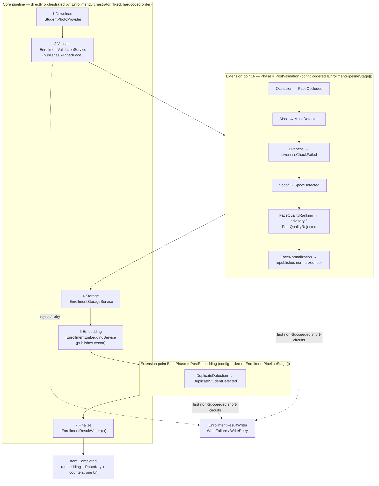
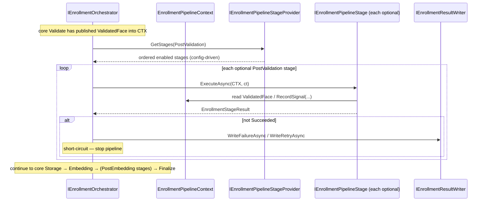

# AI20.PHASE2.0.5 — Pipeline Stage Abstraction Design

**Type:** Contract/interface design only. No production code was written or modified to produce this document. No business logic, DI registration, background worker, database update, migration, or image processing is implemented here — only a **proposed** abstraction (`IEnrollmentPipelineStage`), its supporting DTOs, and the composition/ordering/registration recommendations that would let future AI stages plug into the Phase 2 enrollment pipeline.

**Status of the code blocks below:** every C# block is a **proposed** contract that does not yet exist in the codebase. They are the design artifact of this milestone, not committed code. This document does **not** replace or modify `IEnrollmentOrchestrator` (baseline doc §4); it proposes an extension point that the orchestrator *may* compose later.

**Reads this design builds on:**
- `docs/AI20_PHASE2_ENGINE_CONTRACTS.md` — the baseline contracts, especially §2 (`EnrollmentItemContext`, `EnrollmentStageOutcome`, `EnrollmentStageResult`), §4 (`IEnrollmentOrchestrator`, the fixed-sequence orchestrator), and §15 (the current 5-stage sequence: download → validate → storage → embedding → finalize).
- `docs/AI20_ENROLLMENT_ENGINE.md` — §3.1–§3.6, the reject-by-default validation sub-checks (exactly-one-face, resolution, blur, pose, eyes/sunglasses, multiple-faces). This is the precedent for how future gate stages (liveness, mask, occlusion, spoof) would behave.
- `Abhyanvaya.Infrastructure/Recognition/ClassroomRecognitionPipeline.cs` — the real, already-implemented multi-step AI orchestration style this platform uses today (a single, directly-sequenced method — *not* stage-abstracted).
- `Abhyanvaya.Domain/Enums/FailureCategory.cs` — the existing failure vocabulary a new stage's failures map onto or extend.

---

## 0. Design principles (carried from Phase 1 and the baseline contracts)

This abstraction obeys the same conventions established in `docs/AI20_PHASE2_ENGINE_CONTRACTS.md` §0:

1. **Interfaces + DTOs live in `Abhyanvaya.Application`; implementations live in `Abhyanvaya.Infrastructure`.** Domain enums/value objects are reused unchanged.
2. **Expected failures never throw.** A stage that rejects a photo (not live, masked, occluded, spoofed, duplicate) returns an `EnrollmentStageResult` carrying a `FailureCategory`, never an exception. Only genuinely unexpected/programmer errors throw.
3. **All async methods take a trailing `CancellationToken cancellationToken = default`.**
4. **DTOs are `sealed record` with `required`/`init` members.**
5. **The AI engine stays storage-agnostic and persistence-agnostic.** A pipeline stage produces *values* (a verdict + optional artifact); only `IEnrollmentResultWriter`/`IEnrollmentProgressReporter` touch the DB and only `IEnrollmentStorageService` touches object storage. No stage writes state.
6. **Configuration-driven, no hardcoding.** The active set/order of optional stages is selected through configuration exactly like `StudentPhotoProvider:DefaultProvider` (`StudentPhotoProviderFactory`) and `IEmbeddingProviderFactory` — never hardcoded in a stage or a caller.
7. **Immutability is the default.** `EnrollmentItemContext` (identity/metadata) stays immutable end-to-end. Where mutation is unavoidable (threading a produced artifact from one stage to the next), it is confined to a single-item, single-threaded, orchestrator-owned accumulator with write-once discipline — see §2 for the explicit reconciliation.

---

## 1. The generic interface: `IEnrollmentPipelineStage`

### 1.1 Decision — non-generic, uniform interface (recommended)

**Recommendation: a single, non-generic `IEnrollmentPipelineStage` whose `ExecuteAsync` takes a shared context and returns the shared `EnrollmentStageResult`.** A generic `IEnrollmentPipelineStage<TInput, TOutput>` is explicitly **rejected** for Phase 2.

| Criterion | Non-generic `IEnrollmentPipelineStage` (recommended) | Generic `IEnrollmentPipelineStage<TInput, TOutput>` (rejected) |
|---|---|---|
| Orchestrator composition | All stages sit in one `IEnumerable<IEnrollmentPipelineStage>`, iterated in a uniform loop — no reflection, no type gymnastics. | Heterogeneous `TInput`/`TOutput` per stage cannot live in one strongly-typed collection; the orchestrator would need non-generic base interfaces, `dynamic`, or per-stage adapters to iterate them — defeating the point. |
| Threading data between stages | Each stage reads its inputs from / writes its output into a shared context (§2). The interface stays type-uniform. | The orchestrator must statically know stage *N*'s output equals stage *N+1*'s input, i.e. it must know every stage — the exact coupling this abstraction exists to remove. |
| Matching the codebase | Mirrors the uniform-verdict style of `IStudentPhotoProvider` / `IEnrollmentValidationService` (one request in, one result record out). | No precedent in this codebase; providers/services here are not generic. |
| Failure vocabulary | One shared `EnrollmentStageResult` (baseline §2) — the orchestrator branches uniformly. | Per-stage `TOutput` fragments the disposition vocabulary; the orchestrator can no longer branch without inspecting concrete types. |

**Conclusion:** the *variability* between stages (a liveness stage needs the aligned face; a duplicate stage needs the embedding vector) is real, but it is **data variability**, not **contract variability**. Model it in the context/envelope (§2), not in the interface's type parameters. Every stage shares one exact input type (the context envelope) and one exact output type (`EnrollmentStageResult`); a common envelope stays shared while per-stage data differences are read out of that envelope by name.

### 1.2 Proposed interface

```csharp
namespace Abhyanvaya.Application.Enrollment.Pipeline;

/// <summary>
/// A single, composable step in the enrollment pipeline (e.g. liveness, mask, occlusion, spoof,
/// quality ranking, duplicate detection, face normalization). Every stage implements exactly one
/// method — <see cref="ExecuteAsync"/> — reading whatever it needs from the shared
/// <see cref="EnrollmentPipelineContext"/> and returning a shared <see cref="EnrollmentStageResult"/>
/// so the orchestrator can sequence and branch uniformly without knowing any stage's internals.
///
/// A stage produces VALUES only: it may write a produced artifact (a normalized crop, a liveness
/// score) into the context, but it NEVER touches the database or object storage (design principle #5).
/// </summary>
public interface IEnrollmentPipelineStage
{
    /// <summary>
    /// Stable, config-addressable identity for this stage (e.g. "Liveness", "Spoof"). Used by the
    /// configuration-driven pipeline definition to enable/disable and order stages, mirroring how
    /// IStudentPhotoProvider.ProviderName + StudentPhotoProvider:DefaultProvider select a provider.
    /// </summary>
    string StageName { get; }

    /// <summary>
    /// Default relative execution order WITHIN its phase, used only as a tie-breaker/fallback when the
    /// configuration does not specify an explicit order. Lower runs earlier. Configuration is
    /// authoritative (see §4/§5); this property is the safe hardcoded default.
    /// </summary>
    int Order { get; }

    /// <summary>
    /// The phase this stage belongs to, so the orchestrator knows WHERE in the fixed core sequence to
    /// invoke it (see §7). Optional stages never interleave with core stages arbitrarily — they run at
    /// the two defined extension points only.
    /// </summary>
    EnrollmentStagePhase Phase { get; }

    /// <summary>
    /// Runs this stage against the current pipeline context. Returns Succeeded to proceed, or
    /// Failed/RetryRequired/Cancelled to short-circuit. Expected rejections are returned as results
    /// (never thrown); only unexpected engine/programmer errors throw (design principle #2).
    /// </summary>
    Task<EnrollmentStageResult> ExecuteAsync(
        EnrollmentPipelineContext context, CancellationToken cancellationToken = default);
}

/// <summary>
/// The two orchestrator-provided extension points where optional stages run. Core stages are NOT
/// modelled as IEnrollmentPipelineStage in Phase 2 (see §7) — these phases exist so an optional stage
/// declares which slot it belongs to.
/// </summary>
public enum EnrollmentStagePhase
{
    /// <summary>Runs after core Validate (aligned face available) and before core Storage/Embedding.
    /// Gate + transform stages: liveness, mask, occlusion, spoof, quality ranking, normalization.</summary>
    PostValidation = 0,

    /// <summary>Runs after core Embedding (the 512-d vector is available) and before core Finalize.
    /// Stages that need the embedding: duplicate detection.</summary>
    PostEmbedding = 1,
}
```

`EnrollmentStageResult` and `EnrollmentStageOutcome` are **reused unchanged** from `docs/AI20_PHASE2_ENGINE_CONTRACTS.md` §2 (see §3 below).

---

## 2. Execution context: the stage-input envelope

### 2.1 The problem

A stage must receive (a) the immutable item identity/metadata (`EnrollmentItemContext`), (b) the artifact the *previous* stage produced (raw bytes after download, aligned face after validation, the embedding vector after the embedding stage), and (c) a place to record what it produces — **without every stage knowing about every other stage's internals**. Two candidate shapes:

| Option | Shape | Verdict |
|---|---|---|
| **(A) Strictly-typed per-stage inputs threaded by the orchestrator** | The orchestrator passes each stage exactly the typed input it needs and captures a typed output. | **Rejected.** This is only possible if the orchestrator statically knows each stage's input/output types — i.e. it must know every stage. That is precisely the coupling this abstraction removes, and it is incompatible with the non-generic, uniformly-iterated interface chosen in §1. |
| **(B) A single per-item context envelope / accumulator** (recommended) | One `EnrollmentPipelineContext` carries the immutable identity plus write-once artifact slots; each stage reads the slots it needs and writes the slot it produces. | **Recommended.** Keeps the interface uniform and lets the orchestrator iterate stages blindly. |

### 2.2 Recommended envelope — write-once accumulator (not an untyped bag)

Within Option (B) there is a further choice: an **untyped dictionary bag** (`IDictionary<string, object>`) vs **strongly-typed write-once slots**. **Recommend strongly-typed, write-once nullable slots**, not an untyped bag:

- An untyped bag loses compile-time safety, invites key-string typos, and hides which stage produced what — the opposite of this codebase's `sealed record` + `required` discipline.
- Strongly-typed slots keep IntelliSense, keep the data self-documenting, and let a stage express its precondition simply (`if (context.AlignedFace is null) throw ...` is a programmer error, not an expected failure).

```csharp
namespace Abhyanvaya.Application.Enrollment.Pipeline;

/// <summary>
/// Per-item, orchestrator-owned working accumulator for ONE enrollment item's pass through the
/// pipeline. Created once by the orchestrator, mutated ONLY by the orchestrator and the stages it
/// invokes, and discarded when the item completes. It is NEVER shared across items or threads: exactly
/// one item flows through exactly one context on exactly one worker task (baseline §4 — the
/// orchestrator is Scoped, one item per instance).
///
/// IMMUTABILITY RECONCILIATION (design principle #7): the identity/metadata (<see cref="Item"/>) is the
/// immutable EnrollmentItemContext and never changes. The artifact slots below are a DELIBERATE, scoped
/// divergence from strict immutability — see §2.3 for why, and note the write-once discipline that
/// preserves most of the immutability guarantee.
/// </summary>
public sealed class EnrollmentPipelineContext
{
    public EnrollmentPipelineContext(EnrollmentItemContext item) => Item = item;

    /// <summary>Immutable identity/metadata for this item (baseline §2). Never mutated.</summary>
    public EnrollmentItemContext Item { get; }

    // ---- Artifacts produced by the CORE stages, published into the context by the orchestrator ----

    /// <summary>Raw downloaded photo bytes (produced by the download stage). Never logged.</summary>
    public IReadOnlyList<byte>? DownloadedPhoto { get; private set; }

    /// <summary>Aligned single-face crop + advisory quality data (produced by core Validate). Never logged.</summary>
    public EnrollmentValidatedFace? ValidatedFace { get; private set; }

    /// <summary>The L2-normalized 512-d embedding (produced by core Embedding).</summary>
    public IReadOnlyList<float>? Embedding { get; private set; }

    // ---- Enrichment produced by OPTIONAL stages (advisory metadata for audit/quality) ----

    /// <summary>Advisory signals optional stages contribute (e.g. liveness score, spoof score). Additive only.</summary>
    public IReadOnlyDictionary<string, double> StageSignals => _signals;
    private readonly Dictionary<string, double> _signals = new(StringComparer.OrdinalIgnoreCase);

    // ---- Write-once publishers (called by the orchestrator between core stages, or by a stage that
    //      transforms an artifact, e.g. Face Normalization replacing ValidatedFace). ----

    public void PublishDownloadedPhoto(IReadOnlyList<byte> bytes) => SetOnce(ref _downloadSet, () => DownloadedPhoto = bytes);
    public void PublishValidatedFace(EnrollmentValidatedFace face) => SetOnce(ref _validatedSet, () => ValidatedFace = face);
    public void PublishEmbedding(IReadOnlyList<float> vector) => SetOnce(ref _embeddingSet, () => Embedding = vector);

    /// <summary>Optional stages record advisory signals here; additive, not a mutation of a prior value.</summary>
    public void RecordSignal(string name, double value) => _signals[name] = value;

    private bool _downloadSet, _validatedSet, _embeddingSet;
    private static void SetOnce(ref bool flag, Action set)
    {
        if (flag) throw new InvalidOperationException("Pipeline artifact already published (write-once).");
        set();
        flag = true;
    }
}

/// <summary>The validated, aligned face plus advisory quality — the exact bytes downstream stages consume.</summary>
public sealed record EnrollmentValidatedFace
{
    public required IReadOnlyList<byte> AlignedFaceBytes { get; init; }
    public float? QualityScore { get; init; }
    public int? SourceWidth { get; init; }
    public int? SourceHeight { get; init; }
}
```

### 2.3 Why this is consistent with the "immutability" principle

The baseline doc emphasizes immutability (`sealed record` + `init`, `EnrollmentItemContext` explicitly documented as "immutable working context"). This design **preserves that where it matters and diverges only where the domain forces it**, with justification:

- **Identity/metadata stays fully immutable.** `EnrollmentItemContext` is unchanged and unchangeable — no stage can alter which student/tenant/batch it is processing.
- **Artifact slots are write-once, single-threaded, single-item.** They are the moral equivalent of a `record`'s `init` members, except they are populated at different times (once per stage boundary) rather than all at construction. A dictionary "pipeline bag" would have been the mutable-anywhere option; write-once typed slots deliberately reject that.
- **The divergence is bounded and necessary.** A pipeline that threads a *produced* artifact (aligned face → embedding) fundamentally has data that does not exist at item-construction time, so a fully-immutable single record is impossible without the orchestrator statically threading typed outputs (Option A, rejected in §2.1). The accumulator is the minimal, contained mutation surface: no cross-item sharing, no cross-thread sharing, no overwrite of a published value. This mirrors how `ClassroomRecognitionPipeline` already accumulates working state (`detection`, `studentEmbeddings`, `recognitions`) within one method scope for one job — this design merely names and encapsulates that same per-job accumulation so multiple stages can share it.

---

## 3. Stage result: reuse `EnrollmentStageResult` (recommended)

**Recommendation: stages return the existing `EnrollmentStageResult` from baseline §2 — do not introduce a new stage-specific result type.**

Justification:

- **It is already the single disposition vocabulary.** Baseline §2 defines `EnrollmentStageResult` as "the single vocabulary every stage speaks so the orchestrator can branch uniformly without inspecting exception types." A new per-stage result would fragment that vocabulary and force the orchestrator to translate — reintroducing per-stage knowledge.
- **Outcome + FailureCategory + Reason is exactly what a gate stage needs.** Every one of the seven future stages either passes (`Succeeded`) or rejects with a category+reason (`Failed`), or hits a transient engine fault (`RetryRequired`), or observes cancellation (`Cancelled`). No stage needs to return *data* through its result — produced artifacts and advisory signals go into the context envelope (§2), not the result. This clean split (disposition in the result, data in the context) is what lets the result type stay shared.
- **The factory helpers already fit.** `EnrollmentStageResult.Ok()`, `.Fail(category, reason)`, `.Retry(category, reason)` are exactly the three verdicts a stage produces.

```csharp
// Reused UNCHANGED from docs/AI20_PHASE2_ENGINE_CONTRACTS.md §2 — shown here for reference only.
public enum EnrollmentStageOutcome { Succeeded = 0, Failed = 1, RetryRequired = 2, Cancelled = 3 }

public sealed record EnrollmentStageResult
{
    public required EnrollmentStageOutcome Outcome { get; init; }
    public FailureCategory? FailureCategory { get; init; }
    public string? Reason { get; init; }

    public static EnrollmentStageResult Ok() => new() { Outcome = EnrollmentStageOutcome.Succeeded };
    public static EnrollmentStageResult Fail(FailureCategory category, string reason) =>
        new() { Outcome = EnrollmentStageOutcome.Failed, FailureCategory = category, Reason = reason };
    public static EnrollmentStageResult Retry(FailureCategory? category, string reason) =>
        new() { Outcome = EnrollmentStageOutcome.RetryRequired, FailureCategory = category, Reason = reason };
}
```

---

## 4. Ordering: how stage order is determined and enforced

Three options were considered:

| Option | What it is | Assessment |
|---|---|---|
| (a) Hardcoded sequence in the orchestrator | The orchestrator calls each stage in a fixed, compiled order. | Simplest and safest — but conflicts with the codebase's config-driven-no-hardcoding rule (§0.6) for the *optional* stages, and means editing the orchestrator to add a stage. |
| **(b) Declarative order (config-authoritative, with an `Order` fallback)** — **recommended** | Each stage exposes `StageName` + a default `Order` + a `Phase`; the *authoritative* enabled set and order come from configuration; `Order` is the tie-breaker/default. | Deterministic linear order, easy insertion of a new optional stage without touching the orchestrator, and consistent with the provider pattern. Best fit for Phase 2. |
| (c) Full DAG / dependency graph | Stages declare dependencies; a scheduler topologically sorts and may run independent stages in parallel. | Overkill for Phase 2. Justified only once real parallelism or conditional branching is required (see trigger below). |

**Recommendation for Phase 2: option (b) — a linear, declarative, configuration-authoritative order, scoped to the two extension phases.**

- The **five core stages keep a fixed hardcoded sequence** inside the orchestrator (download → validate → storage → embedding → finalize) — see §7; they are performance-critical and tightly data-coupled, and there is no scenario where a SuperAdmin should reorder them.
- The **optional stages** are ordered by configuration within their `Phase`. The `Order` property is the safe default when configuration omits an explicit order. Within a phase the stages run **sequentially**, short-circuiting on the first non-`Succeeded` result (a gate that rejects stops the item immediately — cheaper stages should be ordered first, e.g. occlusion/mask before the more expensive spoof/liveness models).

**What would trigger moving to option (c), a DAG:** the moment two optional stages become genuinely order-independent *and* expensive enough that running them in parallel matters (e.g. Liveness and Mask can run in either order or concurrently), **while** a hard ordering constraint also exists (e.g. Occlusion must precede Face Quality Ranking because ranking consumes the occlusion mask). A linear order can *serialize* a DAG safely (it just forgoes parallelism), so Phase 2 loses only concurrency, not correctness — which is why the linear model is the right starting point and the DAG is a later, evidence-driven upgrade.

---

## 5. Registration strategy

Three options were considered:

| Option | What it is | Assessment |
|---|---|---|
| (a) Fixed hardcoded list in the orchestrator | `new IEnrollmentPipelineStage[] { new LivenessStage(), ... }`. | Violates DI and the no-hardcoding rule; untestable in isolation; requires editing the orchestrator per stage. Rejected. |
| (b) DI collection with an `Order` property | Register all stages as `IEnumerable<IEnrollmentPipelineStage>`, sort by `Order` at composition. | Good, but still lacks a per-environment enable/disable switch and does not mirror the established provider selection pattern. |
| **(c) Configuration-driven pipeline definition over the DI collection** — **recommended** | Stages are DI-registered as `IEnumerable<IEnrollmentPipelineStage>`; a resolver reads an appsettings list of enabled stage names (in order) and filters+orders the DI collection accordingly, exactly like `StudentPhotoProvider:DefaultProvider`. | Best fit: honors DI, honors the codebase's configuration-driven provider pattern, and lets an operator enable/disable/reorder stages per environment without a redeploy of code. |

**Recommendation: option (c) — a configuration-driven pipeline definition resolved from a DI-registered `IEnumerable<IEnrollmentPipelineStage>`.** This is the direct analogue of `StudentPhotoProviderFactory` (which groups `IEnumerable<IStudentPhotoProvider>` by name and selects via `StudentPhotoProvider:DefaultProvider`) and `IEmbeddingProviderFactory`.

Proposed resolver contract (Application layer) and configuration shape:

```csharp
namespace Abhyanvaya.Application.Enrollment.Pipeline;

/// <summary>
/// Resolves the ordered, enabled optional stages for a given phase from the DI-registered stage set,
/// using the configuration-driven pipeline definition. Mirrors IStudentPhotoProviderFactory /
/// IEmbeddingProviderFactory: the active set is selected entirely through configuration, never
/// hardcoded in the resolver or in the orchestrator.
/// </summary>
public interface IEnrollmentPipelineStageProvider
{
    /// <summary>Enabled stages for the phase, already ordered (config order first, then Order fallback).</summary>
    IReadOnlyList<IEnrollmentPipelineStage> GetStages(EnrollmentStagePhase phase);

    /// <summary>All registered stage names (for diagnostics / a config-validation health check).</summary>
    IReadOnlyList<string> GetRegisteredStages();
}
```

```jsonc
// appsettings.json — PROPOSED shape, mirroring "StudentPhotoProvider": { "DefaultProvider": "..." }.
// Absent/empty => no optional stages run (the pipeline behaves exactly like today's 5-stage flow).
"EnrollmentPipeline": {
  "PostValidationStages": [ "Occlusion", "Mask", "Liveness", "Spoof", "FaceQualityRanking", "FaceNormalization" ],
  "PostEmbeddingStages":  [ "DuplicateDetection" ]
}
```

The resolver enforces the same graceful/explicit behavior as `StudentPhotoProviderFactory`: a configured name with no matching registered stage is an explicit startup error (fail fast, not silent skip); an unlisted-but-registered stage simply does not run. This keeps "which AI checks are active" an operations decision, not a code change.

---

## 6. The seven future stages

Each future stage is a **proposed** consumer of `IEnrollmentPipelineStage`. The `FailureCategory` column lists whether it maps onto an existing value or needs a **new proposed** enum value. **Proposed names only — none of these are added to `FailureCategory.cs` by this milestone.**

| # | Stage (`StageName`) | Phase | What it checks / produces | Failure classification | `FailureCategory` mapping |
|---|---|---|---|---|---|
| 1 | Liveness Detection (`Liveness`) | PostValidation | Estimates whether the aligned face is a live person vs. a printed/screen photo, using a liveness model over the aligned crop. Records a `liveness` advisory signal; rejects below threshold. | Permanent (a static source photo will fail the same way every retry). Model/engine fault ⇒ transient. | **New:** `LivenessCheckFailed`. Engine fault reuses `EmbeddingEngineFailed` (transient). |
| 2 | Mask Detection (`Mask`) | PostValidation | Detects a face covering (surgical/cloth mask) that hides the mouth/nose region needed for a reliable reference embedding. Rejects masked faces. | Permanent. | **New:** `MaskDetected`. (Conceptually a specialization of occlusion; kept distinct so the SuperAdmin failure screen can say "remove the mask" specifically.) |
| 3 | Occlusion (`Occlusion`) | PostValidation | Detects other occlusions of the face (hand, hair, object, heavy shadow) covering a significant fraction of the face region. Records an `occlusion` coverage signal; rejects above threshold. | Permanent. | **New:** `FaceOccluded`. |
| 4 | Spoof Detection (`Spoof`) | PostValidation | Anti-spoofing / presentation-attack detection (screen replay, paper mask, deepfake artifacts) on the aligned crop. Records a `spoof` score; rejects likely spoofs. | Permanent for a confirmed spoof; model fault ⇒ transient. | **New:** `SpoofDetected`. Engine fault reuses `EmbeddingEngineFailed`. |
| 5 | Face Quality Ranking (`FaceQualityRanking`) | PostValidation | Refines/produces a richer composite quality ranking beyond the core validator's advisory `QualityScore` (sharpness, illumination, frontality, face area). Primarily **advisory** — records a `qualityRank` signal; optionally hard-rejects only clearly poor faces if a floor is configured. | Advisory by default (no rejection); permanent only if a hard floor is configured. | **Advisory ⇒ no category** by default. If a hard floor is enabled, reuse `LowResolutionRejected`/`BlurRejected` where those are the actual cause, else **New (optional):** `PoorQualityRejected`. |
| 6 | Duplicate Detection (`DuplicateDetection`) | PostEmbedding | Compares the freshly generated embedding against existing active embeddings (same tenant/scope) via cosine similarity to catch the same person enrolled under two student records, or a wrong photo matching another student. Records a `duplicateSimilarity` signal; rejects above threshold. | Permanent (requires a human/data fix, like the other terminal categories). | **New:** `DuplicateStudentDetected`. |
| 7 | Face Normalization (`FaceNormalization`) | PostValidation | **Transform, not a gate.** Applies additional normalization to the aligned crop (illumination normalization, geometric refinement) and publishes a normalized `EnrollmentValidatedFace` that the core Embedding stage then consumes — improving embedding consistency. Rarely rejects. | Normally `Succeeded` (produces a transformed artifact); a normalization engine fault ⇒ transient. | **No new category** for the normal path. Engine fault reuses `EmbeddingEngineFailed` (transient), or **New (optional):** `NormalizationFailed` if a distinct transient category is wanted. |

**Proposed new `FailureCategory` values (names only — NOT added to the enum in this milestone):** `LivenessCheckFailed`, `MaskDetected`, `FaceOccluded`, `SpoofDetected`, `DuplicateStudentDetected`, and optionally `PoorQualityRejected` / `NormalizationFailed`. All of the reject-type new values are **permanent** (mirroring `NoFaceDetected`/`MultipleFacesDetected`/`BlurRejected` in `FailureCategory.cs`), so the existing retry classifier (`IEnrollmentRetryService.Classify`, baseline §6) would treat them as terminal-but-manually-retriable, consistent with `docs/AI20_ENROLLMENT_ENGINE.md` §7.

---

## 7. Reconciliation with the existing `IEnrollmentOrchestrator`

This is the central architectural decision of this milestone.

**Recommendation: `IEnrollmentPipelineStage` is a *parallel, optional extension point* for the future/optional enrichment stages ONLY. The five core stages (download → validate → storage → embedding → finalize) remain directly orchestrated by the existing `IEnrollmentOrchestrator` exactly as designed in baseline §4. `IEnrollmentOrchestrator` is NOT rewritten into "just run a list of stages."**

### 7.1 Why not convert the core stages into `IEnrollmentPipelineStage`

- **Performance-critical, tightly data-coupled core path.** The core stages thread heavy artifacts with strict ordering guarantees: validation produces `AlignedFaceBytes` consumed directly by embedding (baseline §10 explicitly avoids a re-download/re-detect); storage must succeed *before* the DB records the key (baseline §9). Forcing these through a generic, uniformly-iterated abstraction adds indirection and an accumulator round-trip for the hottest path with no benefit — the orchestrator already knows these five stages and must, because it owns the transaction sequencing and the `IEnrollmentProgressReporter` status transitions between them.
- **Each core stage already has a first-class contract.** `IEnrollmentValidationService`, `IEnrollmentStorageService`, `IEnrollmentEmbeddingService`, `IEnrollmentResultWriter`, and `IStudentPhotoProvider` already exist with precise, non-generic request/response records. Re-wrapping them as `IEnrollmentPipelineStage` would duplicate contracts and blur the storage/DB-boundary guarantees (principle #5).
- **The orchestrator's transaction/branching responsibilities are core-specific.** Baseline §4 makes the orchestrator the single owner of "the order of the enrollment stages and how to branch on each stage's result," driving `IEnrollmentProgressReporter` transitions and the terminal `IEnrollmentResultWriter` write. That responsibility does not generalize cleanly to arbitrary stages and should not be dissolved into a loop.
- **It matches the existing platform precedent.** `ClassroomRecognitionPipeline` is a single directly-sequenced method for its performance-critical path, not a stage-abstracted engine. Keeping the enrollment core directly orchestrated is consistent with that established style.

### 7.2 Where the optional stages plug in

The orchestrator invokes the configured optional stages at exactly **two extension points**, via `IEnrollmentPipelineStageProvider` (§5), running them sequentially and short-circuiting on the first non-`Succeeded` result — which routes to the same `IEnrollmentResultWriter.WriteFailureAsync`/`WriteRetryAsync` path the core stages already use:

1. **`PostValidation`** — after core Validate publishes the `EnrollmentValidatedFace` into the context and **before** core Storage/Embedding. Liveness, Mask, Occlusion, Spoof, Face Quality Ranking, and Face Normalization live here (they need the aligned face; Normalization may republish a transformed face for Embedding to consume).
2. **`PostEmbedding`** — after core Embedding publishes the vector and **before** core Finalize. Duplicate Detection lives here (it needs the embedding).

This gives the best of both: the hot, transactional core stays fixed, fast, and simple; the pluggable AI enrichment gates become configuration-driven, independently testable, and additive without ever touching the orchestrator's core sequence. `IEnrollmentOrchestrator`'s contract (baseline §4) is unchanged — only its *implementation* gains two `foreach` extension points that call `IEnrollmentPipelineStageProvider`.

---

## 8. Composition diagram (current 5 core + future 7 optional)





---

## 9. Summary of recommendations

| # | Question | Recommendation |
|---|---|---|
| 1 | Generic vs non-generic interface | **Non-generic** `IEnrollmentPipelineStage`; data variability lives in the shared context, not in type parameters. |
| 2 | Execution context | A per-item, orchestrator-owned **write-once accumulator** (`EnrollmentPipelineContext`) wrapping the immutable `EnrollmentItemContext` — not an untyped bag, not orchestrator-threaded typed inputs. |
| 3 | Stage result | **Reuse `EnrollmentStageResult`** (baseline §2); disposition in the result, produced data in the context. |
| 4 | Ordering | **Linear, declarative, config-authoritative order** within two phases; core stays a fixed hardcoded sequence. DAG only when parallelism + hard cross-stage constraints both appear. |
| 5 | Registration | **Configuration-driven pipeline definition over a DI `IEnumerable<IEnrollmentPipelineStage>`**, mirroring `StudentPhotoProviderFactory` / `IEmbeddingProviderFactory`. |
| 6 | Future stages → failure categories | 7 stages mapped; proposed new (names-only) categories: `LivenessCheckFailed`, `MaskDetected`, `FaceOccluded`, `SpoofDetected`, `DuplicateStudentDetected` (+ optional `PoorQualityRejected`, `NormalizationFailed`). |
| 7 | Reconciliation with `IEnrollmentOrchestrator` | `IEnrollmentPipelineStage` is a **parallel, optional extension point** for enrichment stages at two hook points; the 5 core stages stay directly orchestrated. The orchestrator contract is unchanged. |

---

## Constraints Confirmed

- **No production code was written or modified.** Every C# / JSON block above is a **proposed** contract or configuration shape, not a committed file. No `.cs`, `.csproj`, `.tsx`, `.ts`, or any other non-markdown file was created, edited, or deleted anywhere in the repository.
- **The orchestrator was not replaced or modified.** `IEnrollmentOrchestrator` (baseline §4) is reconciled with, not rewritten by, this design; `IEnrollmentPipelineStage` is proposed as an optional extension point only.
- **No new `FailureCategory` values were added.** The new category names in §6 are proposals only; `Abhyanvaya.Domain/Enums/FailureCategory.cs` is unchanged.
- **No business logic, DI registration, HTTP endpoint, background worker, database update, migration, or image processing was implemented.** Only interfaces, DTOs, an enum, an ordering/registration recommendation, and diagrams are described.
- **All designs reuse existing Application-layer contracts and Domain enums/value objects** (`EnrollmentItemContext`, `EnrollmentStageResult`, `EnrollmentStageOutcome`, `FailureCategory`, the provider-factory pattern) without changing them.
- **The only file added by this milestone is this document:** `docs/AI20_PHASE2_PIPELINE_STAGE_DESIGN.md`.
