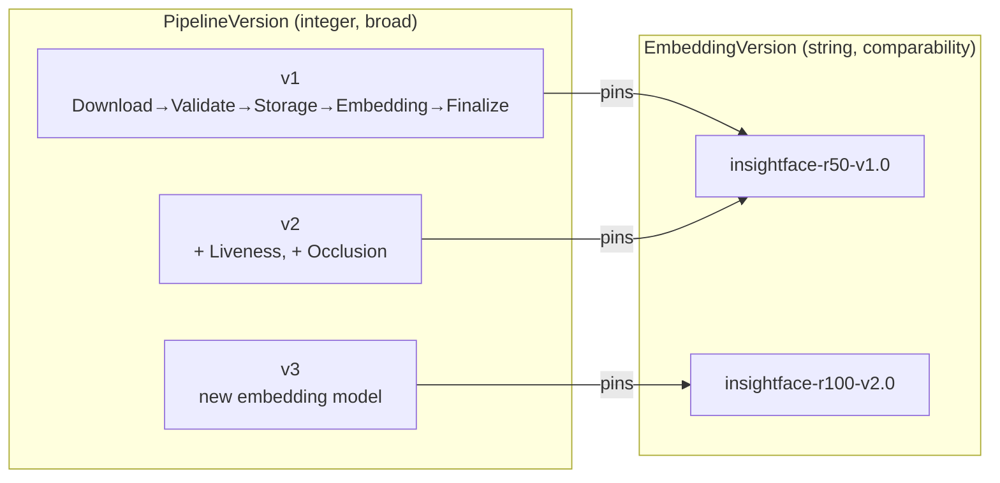
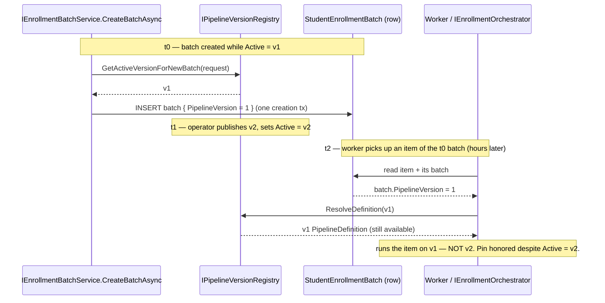
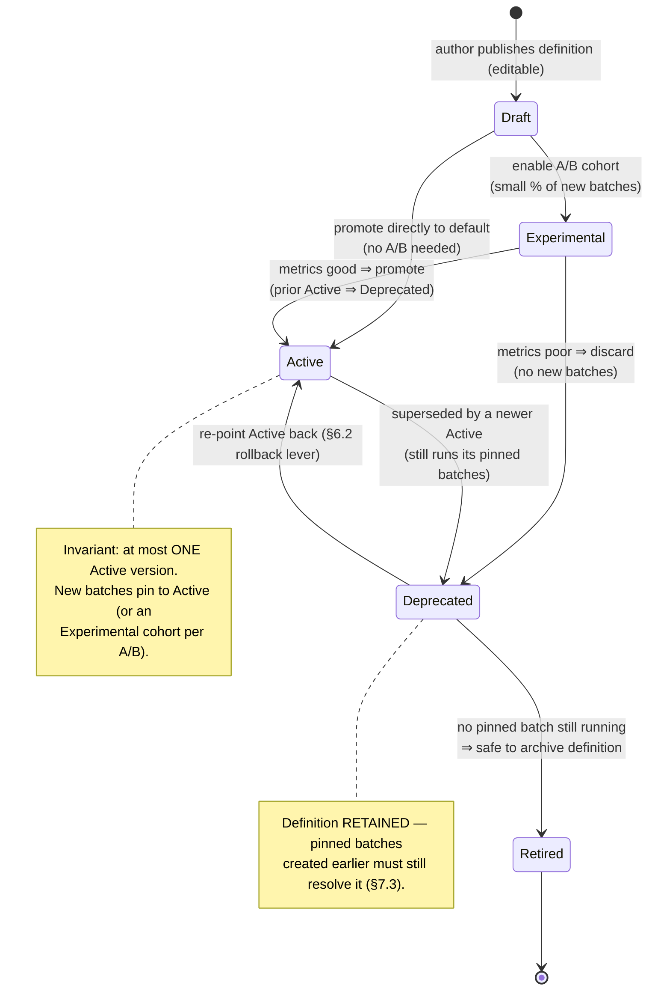
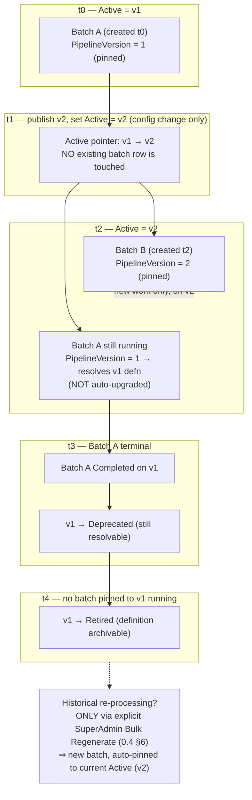
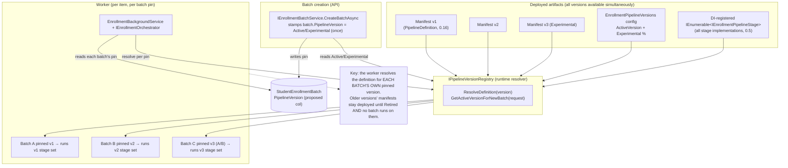

# AI20.PHASE2.0.14 — Pipeline Versioning Framework

**Type:** Architecture/contract design only. No production code was written or modified to produce this document. No business logic, HTTP endpoint, background worker, DI registration, database update, migration, entity column, or image processing is implemented here — only a **proposed** versioning framework (its concepts, metadata shape, compatibility/migration/rollback rules, and the batch version-pinning mechanism) that would let multiple enrollment pipeline versions coexist in Phase 2 and beyond.

**Status of the code blocks below:** every C#/JSON/YAML block is a **proposed** contract, configuration shape, or schema note that does not yet exist in the codebase. They are the design artifact of this milestone, not committed code. In particular, the `StudentEnrollmentBatch.PipelineVersion` column discussed in §7 is a **proposed future schema addition**, explicitly *not* a migration authored here.

**Reads this design builds on (and must stay consistent with):**
- `docs/AI20_PHASE2_ENGINE_CONTRACTS.md` — the 10-interface Phase 2 baseline (`IEnrollmentOrchestrator`, `IEnrollmentBatchService`, `IEnrollmentProgressReporter`, `IEnrollmentResultWriter`, …), the fixed five-stage core sequence, and the Clean Architecture boundary rules (§0).
- `docs/AI20_PHASE2_PIPELINE_STAGE_DESIGN.md` — the `IEnrollmentPipelineStage` abstraction, the 5 core + 7 optional stages, linear declarative ordering, and the **configuration-driven pipeline definition** resolved from a DI-registered stage set.
- `docs/AI20_PHASE2_PIPELINE_STAGE_ENUM.md` — the canonical Application-layer `EnrollmentPipelineStage` **diagnostic** enum vs. the persisted Domain `EnrollmentStatus` **business** status. This document respects that distinction: a *pipeline version* is neither of those — it is a third, orthogonal concept (see §1.4).
- `docs/AI20_PHASE2_EMBEDDING_METADATA.md` — the platform-owned `EmbeddingVersion` string scheme (`{provider}-{modelFamily}-v{major}.{minor}`), `EngineProvider`, cross-provider incompatibility conclusions, and the SuperAdmin **Bulk Regenerate** rollout. §1.5, §4, and §5 reconcile pipeline versioning against embedding versioning.
- `docs/AI20_PHASE2_RESULT_WRITER_REVIEW.md` — the **compensating-action** framing (`Rollback` is reserved for an uncommitted transaction; undoing committed work is a compensating business operation). §6 applies exactly that framing to pipeline rollback.
- `Abhyanvaya.Domain/Entities/StudentEnrollmentBatch.cs` / `StudentEnrollmentItem.cs` — the real entities. `StudentEnrollmentBatch` currently has **no** pipeline-version column; §7 proposes where a pin would live as documentation only.
- `docs/AI20_ENROLLMENT_BACKGROUND.md` — the durable DB-row-backed queue + worker model; batches run minutes-to-hours, which is precisely why an executing batch must never be auto-upgraded mid-flight (§7).

**Forward-references to sibling milestones (design in parallel; not depended upon by shape here):**
- **AI20.PHASE2.0.16 — Pipeline Manifest.** A `PipelineDefinition` for a given version is expressed concretely as the **Pipeline Manifest** defined in AI20.PHASE2.0.16. This document keeps `PipelineDefinition` at the versioning-framework level of abstraction and does not duplicate the manifest's field-by-field design.
- **AI20.PHASE2.0.20 — Configuration Snapshot.** The effective configuration for a batch (including its pinned `PipelineVersion`) is captured by the **ConfigurationSnapshot** concept defined in AI20.PHASE2.0.20. This document references that concept as a forward-reference and does not depend on its exact shape.

---

## 0. Design principles (carried from the baseline)

This framework obeys the conventions established in `docs/AI20_PHASE2_ENGINE_CONTRACTS.md` §0 and `docs/AI20_PHASE2_PIPELINE_STAGE_DESIGN.md` §0:

1. **Interfaces + DTOs live in `Abhyanvaya.Application`; implementations live in `Abhyanvaya.Infrastructure`.** Domain entities/enums/value objects are reused unchanged. `PipelineVersion` metadata is an Application-layer concept; the *pin* (§7) is the only proposed Domain persistence touch, and it is proposed only.
2. **Configuration-driven, no hardcoding.** Which version is "Active", which are "Experimental", and each version's stage set are selected through configuration — mirroring `StudentPhotoProvider:DefaultProvider` and the `EnrollmentPipeline` stage config from the stage-design doc — never hardcoded in a stage or a caller.
3. **Immutability of history.** A version, once used to run a batch, is an immutable historical fact. A published `PipelineDefinition`/Manifest for a version is treated as append-only content-addressable data: you never edit version *N* in place; you publish version *N+1*.
4. **Expected states never throw.** "The Active version moved on since this batch was created" is an *expected* condition the worker resolves deterministically (§7), not an exception.
5. **Reuse over reinvention.** Pipeline versioning composes the existing stage abstraction, the existing embedding-version scheme, the existing batch/worker/claim model, and the compensating-action framing — it introduces no parallel infrastructure.

---

## 1. `PipelineVersion` — the identifier

### 1.1 Definition

```csharp
// Illustrative proposal only. No C# file was created or modified.
namespace Abhyanvaya.Application.Enrollment.Versioning;

/// <summary>
/// Monotonic, orderable identity of one whole enrollment pipeline configuration
/// (the ordered set of core + optional stages, their enabled flags, thresholds, and the pinned
/// embedding-model identity it uses). A batch is pinned to exactly one PipelineVersion for its
/// entire lifetime (see §7). This is NOT the Domain business status (EnrollmentStatus) and NOT the
/// Application diagnostic stage enum (EnrollmentPipelineStage) — it is a third, orthogonal concept.
/// </summary>
public readonly record struct PipelineVersion(int Value) : IComparable<PipelineVersion>
{
    public int CompareTo(PipelineVersion other) => Value.CompareTo(other.Value);
    public override string ToString() => $"v{Value}";
}
```

A `PipelineVersion` is a single monotonic integer (`1`, `2`, `3`, …). "Pipeline V1" is `PipelineVersion(1)`. The wrapper is a design nicety (type-safety, comparability, a stable `v{n}` string); a plain `int` column backs it in persistence (§7).

### 1.2 Why integer, not semver — justification

The task specifies an integer. The justification is that a pipeline version answers exactly one question — *"which one of our finite, centrally-published pipeline configurations is this?"* — and a monotonic integer answers that question with the fewest moving parts:

| Property | Monotonic integer (chosen) | Semver (`major.minor.patch`) |
|---|---|---|
| **Orderability** | Total order for free; `v2 > v1` is a single integer compare. "Is this batch's version older than the current Active version?" is one `<`. | Requires a 3-component precedence comparator; "newer" is well-defined but heavier than needed. |
| **DB-friendliness** | One `int` column, one B-tree index, trivial `WHERE PipelineVersion = @v` and `ORDER BY PipelineVersion`. The pin (§7) is an `int`. | A string column or three columns; range/equality queries are clumsier and the pin is fatter. |
| **No false semantics** | An integer makes **no promise** about backward compatibility between adjacent numbers. Compatibility is decided explicitly (§4), never inferred from the number. | Semver *implies* that a `minor` bump is backward-compatible and a `major` bump is breaking. For a whole pipeline (stages + thresholds + model) that implication is frequently wrong and dangerously misleading — a "minor" threshold change can still make embeddings incomparable. |
| **Authoring cost** | Publishing a new version is "increment the counter." No debate about whether a change is major/minor/patch. | Every change triggers a classification argument that carries no runtime meaning here. |
| **Uniqueness** | Guaranteed unique by construction (a single incrementing source). | Two authors can disagree on the next number; more coordination. |

**Where semver *would* matter — and why it is delegated, not adopted here.** Semver earns its keep when consumers need to reason about *compatibility from the version string alone* — e.g. a public API or a library where callers pin `^1.2` and expect non-breaking upgrades. The enrollment pipeline is an *internal, centrally-operated* artifact with a small, curated set of versions; nobody "pins a range." The one place a compatibility-bearing, semver-*like* string genuinely lives is the **embedding-model identity**, which already uses `{provider}-{modelFamily}-v{major}.{minor}` (embedding-metadata §8), where `major` = incomparable embedding space and `minor` = regenerate-for-accuracy. That is the correct home for semver semantics because embeddings are the thing whose *comparability across versions* must be encoded in the identifier. The pipeline version does not re-encode that; it *references* it (§1.5).

**Conclusion:** a monotonic integer for the pipeline version (simple, orderable, DB-friendly, semantically honest) plus the existing semver-like string for the embedding model it pins. The two schemes are complementary, not competing.

### 1.3 Version zero / absence

Because the pin column does not exist yet (§7), the absence of a pin must have a defined meaning for already-created batches:

- A batch with **no** persisted `PipelineVersion` (all batches created before the proposed column ships) is treated as `PipelineVersion(1)` — the V1 pipeline that is the only pipeline in existence today. This is a read-time default in the resolver (§7.3), not a data backfill, and it keeps historical batches interpretable without a migration.

### 1.4 Relationship to `EnrollmentStatus` and `EnrollmentPipelineStage`

Per `docs/AI20_PHASE2_PIPELINE_STAGE_ENUM.md`, the platform already has two carefully separated stage/status vocabularies. `PipelineVersion` is a **third, orthogonal axis** and must not be conflated with either:

| Concept | Layer | Question answered | Lifetime | Persisted |
|---|---|---|---|---|
| `EnrollmentStatus` (Domain) | Domain | "What is the durable business state of this item?" | Across restarts/retries | `StudentEnrollmentItem.Status` |
| `EnrollmentPipelineStage` (Application) | Application | "Which unit of work is executing right now?" | One live attempt (diagnostic) | Never (in-memory/telemetry only) |
| **`PipelineVersion`** (Application, pinned in Domain) | Application concept, **pinned** in Domain | "Which whole pipeline configuration is this batch running?" | Fixed for a batch's entire life | **Proposed** `StudentEnrollmentBatch.PipelineVersion` (§7) |

The three are independent: an item can be `EnrollmentStatus.Embedding` (business status), executing `EnrollmentPipelineStage.Storage` (diagnostic stage), all within a batch pinned to `PipelineVersion(2)` — three related-but-non-interchangeable facts, exactly as the enum doc's §6.4 illustrates for the first two.

### 1.5 Relationship to `EmbeddingVersion` (0.4) — broader-than, may-pin

This is the reconciliation the task calls for. A **pipeline version is broader than, and may pin, an embedding-model version:**

- The `EmbeddingVersion` (`docs/AI20_PHASE2_EMBEDDING_METADATA.md` §4/§8) identifies *only the embedding artifact* — the model, provider, and normalization that determine whether two vectors are comparable. It is a string because comparability semantics (major/minor) must be readable from it.
- The `PipelineVersion` identifies *the whole pipeline*: the ordered core + optional stages, their enabled flags and thresholds, **and** which `EmbeddingVersion` the embedding stage is configured to produce. The embedding version is therefore one *component* of a pipeline version's definition.

The relationship is **many-to-one, pinning:**

- One `EmbeddingVersion` can appear in several pipeline versions (e.g. V2 adds a Liveness stage but keeps `insightface-r50-v1.0`; both V1 and V2 pin the same embedding model).
- A single pipeline version pins **exactly one** `EmbeddingVersion` (its embedding stage cannot be configured to two models at once).
- Changing the pinned `EmbeddingVersion` **always** requires a new pipeline version, because it changes the pipeline's output contract. The converse is not true: many pipeline changes (adding an occlusion gate, tightening a blur threshold) bump `PipelineVersion` without touching `EmbeddingVersion`.



**Why this layering is correct:** a pipeline change that does *not* alter the embedding space (a new gate stage, a stricter threshold) must still be a distinct, pinnable pipeline version for reproducibility and rollback — but it must **not** be forced to bump the embedding version, because the embeddings it produces remain comparable with the prior pipeline's. Conversely, a genuine embedding-model change is caught by the embedding-version's own `major`/`minor` rules and *additionally* forces a pipeline-version bump. The two identifiers thus fail-safe independently: `EmbeddingVersion` protects vector comparability (embedding-metadata §7); `PipelineVersion` protects end-to-end reproducibility.

---

## 2. `PipelineDefinition` — what a version consists of

A `PipelineVersion` is just an identifier; its *content* is a `PipelineDefinition`. This document keeps `PipelineDefinition` at the **versioning-framework level of abstraction** and defers the concrete field-by-field shape to the Pipeline Manifest.

> **Forward-reference (AI20.PHASE2.0.16).** A `PipelineDefinition` for a given version is expressed concretely as the **Pipeline Manifest** defined in AI20.PHASE2.0.16. The manifest is the serialized, shippable representation of the abstract `PipelineDefinition` described here. This document intentionally does not duplicate the manifest's stage-entry schema, threshold encoding, or serialization format.

At the versioning level, a `PipelineDefinition` is the answer to "what does running version *N* mean?":

```csharp
// Illustrative proposal only — abstraction level; the concrete serialized form is the
// Pipeline Manifest (AI20.PHASE2.0.16). No C# file was created or modified.
namespace Abhyanvaya.Application.Enrollment.Versioning;

/// <summary>
/// The immutable content of one PipelineVersion: which stages run, in what order, with what
/// enabled flags, and which embedding-model identity the embedding stage is pinned to. This is the
/// abstract shape; its concrete, serialized representation is the Pipeline Manifest (0.16).
/// </summary>
public sealed record PipelineDefinition
{
    public required PipelineVersion Version { get; init; }

    /// <summary>The fixed core stage sequence (Download→Validate→Storage→Embedding→Finalize) is implied
    /// and NOT reorderable (stage-design §4/§7); listed here only for completeness/audit.</summary>
    public required IReadOnlyList<CoreStageDescriptor> CoreStages { get; init; }

    /// <summary>Ordered, enabled optional stages per phase (PostValidation / PostEmbedding), expressed
    /// with the canonical EnrollmentPipelineStage identity + Order (stage-enum §3, stage-design §5).</summary>
    public required IReadOnlyList<OptionalStageDescriptor> OptionalStages { get; init; }

    /// <summary>The EmbeddingVersion this pipeline version pins (0.4 §8). Exactly one. See §1.5.</summary>
    public required string PinnedEmbeddingVersion { get; init; }

    /// <summary>Version-scoped metadata (author, status, changelog, …). See §3.</summary>
    public required PipelineVersionMetadata Metadata { get; init; }
}

public sealed record OptionalStageDescriptor
{
    public required EnrollmentPipelineStage Stage { get; init; }   // canonical enum (0.13)
    public required EnrollmentStagePhase Phase { get; init; }       // PostValidation / PostEmbedding (0.5)
    public required int Order { get; init; }
    public required bool Enabled { get; init; }
}

public sealed record CoreStageDescriptor
{
    public required EnrollmentPipelineStage Stage { get; init; }
}
```

Two boundaries this design deliberately respects:

- **The five core stages are not reorderable per version.** Per stage-design §4/§7 they are a fixed, hardcoded, data-coupled sequence. A `PipelineDefinition` records them for audit/reproducibility but a version cannot rearrange or drop them. What versions *do* vary is the **optional** stage set/order and thresholds, plus the pinned embedding model.
- **`PipelineDefinition` does not re-specify the manifest.** Enabled flags, thresholds, per-stage parameters, and serialization belong to the manifest (0.16). At this level we only assert *that* a version has an ordered stage set and a pinned embedding version — the framework contract — not *how* it is encoded.

---

## 3. Version metadata

Every version carries authorship and lifecycle metadata so an operator can answer "who published this, when, why, and is it safe to use?" without reading code.

```csharp
// Illustrative proposal only. No C# file was created or modified.
namespace Abhyanvaya.Application.Enrollment.Versioning;

public sealed record PipelineVersionMetadata
{
    public required PipelineVersion Version { get; init; }
    public required DateTime CreatedUtc { get; init; }
    /// <summary>SuperAdmin/engineer identity that published this version (audit; never a system anon).</summary>
    public required string Author { get; init; }
    public required PipelineVersionStatus Status { get; init; }
    public required string Description { get; init; }
    /// <summary>Human-readable, ordered list of what changed relative to the previous version.</summary>
    public required IReadOnlyList<string> Changelog { get; init; }
    /// <summary>Set when Status becomes Deprecated — the earliest date new batches may be refused.</summary>
    public DateTime? DeprecatedUtc { get; init; }
    /// <summary>Set when Status becomes Retired — after this, the definition may be archived.</summary>
    public DateTime? RetiredUtc { get; init; }
}

/// <summary>Lifecycle state of a pipeline version. See §8 (lifecycle diagram) for transitions.</summary>
public enum PipelineVersionStatus
{
    /// <summary>Authored but not yet runnable by any batch. Editable until it leaves Draft.</summary>
    Draft = 0,
    /// <summary>Runnable only for A/B or opt-in experimental batches (a small % of new batches). Not the default.</summary>
    Experimental = 1,
    /// <summary>The single default version new batches are pinned to. At most one Active version at a time.</summary>
    Active = 2,
    /// <summary>No longer chosen for NEW batches, but existing pinned batches still run on it; definition retained.</summary>
    Deprecated = 3,
    /// <summary>Fully sunset. No batch may be pinned to it and none is still running on it; definition archivable.</summary>
    Retired = 4,
}
```

| Field | Purpose |
|---|---|
| `CreatedUtc` / `Author` | Provenance — when and by whom the version was published. Mirrors `StudentEnrollmentBatch.CreatedUtc`/`CreatedBy` conventions. |
| `Status` | The lifecycle gate that decides whether new batches may pin to this version (§8). |
| `Description` | One-paragraph human summary shown in the SuperAdmin version registry. |
| `Changelog` | Ordered deltas from the prior version — the operator's "what will change if I switch Active to this?" |
| `DeprecatedUtc` / `RetiredUtc` | Lifecycle timestamps; `RetiredUtc` gates safe archival of the definition (only once no batch runs on it). |

**Invariant: at most one `Active` version at any time.** Exactly one version is the default new batches pin to. Zero or more `Experimental` versions may coexist alongside it for A/B testing (§ A/B). `Deprecated` versions keep running their already-pinned batches but attract no new ones.

---

## 4. Compatibility rules

"Compatibility" here has **two distinct sub-questions**, and conflating them is the classic versioning bug this section prevents:

### 4.1 Data-readability compatibility (persisted rows written by V1, read under V2)

All persisted enrollment data (`StudentEnrollmentBatch`, `StudentEnrollmentItem`, `StudentFaceEmbedding`, `Student.PhotoKey`) is written through the **same Domain schema regardless of pipeline version**. A pipeline version changes *which stages run and which model embeds*, not the shape of the rows. Therefore:

- **A batch/item/embedding row written under V1 remains fully readable and valid under V2.** V2's worker reading a V1 batch's counters, an item's status/timestamps, or a completed embedding row sees ordinary Domain data. There is no version-tagged row format to translate.
- The only version-bearing field on a row is `StudentFaceEmbedding.EmbeddingVersion` (embedding-metadata §5), which already encodes the *embedding* identity, plus the proposed `StudentEnrollmentBatch.PipelineVersion` pin (§7). Both are additive and readable by any pipeline version.
- **Rule:** a new pipeline version MUST NOT change the meaning or shape of an existing persisted column. Schema-breaking changes are a separate Domain migration concern, never something a `PipelineVersion` silently does.

### 4.2 Embedding comparability compatibility (vectors produced under different versions)

This is the sharp edge, and it is governed entirely by the **embedding-version rules already concluded in 0.4**, not re-decided here:

- Two embeddings are comparable **iff** they share `EngineProvider` **and** `NormalizationMethod` **and** a compatible `EmbeddingVersion` (embedding-metadata §7 — cross-provider/cross-model cosine similarity is "numerical noise," and the matcher must **refuse to compare** an incomparable pair rather than emit a garbage score).
- Because a pipeline version pins exactly one `EmbeddingVersion` (§1.5), the comparability question between "vectors from V1" and "vectors from V2" reduces to comparing their **pinned** `EmbeddingVersion`s:
  - **Same pinned `EmbeddingVersion`** (e.g. V1 and V2 both pin `insightface-r50-v1.0`): vectors are comparable. Adding a Liveness/Occlusion gate in V2 changes *which faces are accepted*, not the *space* accepted faces are embedded into. Old V1 embeddings remain valid gallery entries against V2 probes.
  - **`EmbeddingVersion` minor bump** (V2 pins `...-v1.1`): treated as a **regeneration candidate** per embedding-metadata §6/§8 — comparable-enough to not corrupt matching immediately, but old embeddings should be regenerated for accuracy.
  - **`EmbeddingVersion` major bump** (V3 pins `...-v2.0`): **incomparable.** Old V1/V2 embeddings must be regenerated before they can be matched against V3 vectors; until then the matcher's provider/version interlock (embedding-metadata §7) refuses the cross-version comparison rather than producing noise.

**Consequence for migration (§5):** the *cost* of moving to a new pipeline version is determined by whether it bumps the pinned `EmbeddingVersion`. A stage-only version bump is cheap (old embeddings stay valid); an embedding-model version bump is expensive (old embeddings need Bulk Regenerate). The framework surfaces this by reading the two versions' pinned `EmbeddingVersion`s and classifying the transition.

---

## 5. Migration strategy — V1 → V2 for new batches while old batches finish on V1

### 5.1 The core rule

Migration is **forward-only for new batches and non-disruptive for in-flight batches:**

1. Publish V2 (`Draft` → validated → `Active`). Publishing V2 flips the **Active** pointer; it does **not** touch any existing batch row.
2. From that instant, **new** batches created via `IEnrollmentBatchService.CreateBatchAsync` are pinned to V2 (the then-current Active version — §7.2).
3. **Existing** batches created under V1 keep their `PipelineVersion = 1` pin and **finish entirely on V1.** The worker resolves each batch's own pinned definition (§7.3); it never upgrades an in-flight batch. This is the guarantee `docs/AI20_ENROLLMENT_BACKGROUND.md` demands: batches run minutes-to-hours, so mid-flight upgrades are forbidden.
4. V1 transitions to `Deprecated` (still runs its pinned batches) and only to `Retired` once no batch is pinned to it and still non-terminal.

This gives a clean "drain V1, fill V2" migration with zero coordination: no pause, no drain window enforced by operators — the pin does the isolation automatically.

### 5.2 Historical re-processing (does old data get re-run on V2?)

**Not automatically — never.** Publishing V2 does not re-enroll anyone. Re-processing historical students under a newer version is an **explicit, opt-in** operation, and it is precisely the SuperAdmin **Bulk Regenerate** concept from `docs/AI20_PHASE2_EMBEDDING_METADATA.md` §6:

- When (and only when) V2's pinned `EmbeddingVersion` differs from what students currently have (a minor or major embedding bump), those students' embeddings become **regeneration candidates** — a queryable predicate over the persisted `StudentFaceEmbedding.EmbeddingVersion`.
- A SuperAdmin triggers **Bulk Regenerate** for a scope (college/year/quality threshold). This **enqueues a new enrollment batch** — which, being new, is pinned to the current Active version (V2) at creation. The regenerate rollout therefore inherits V2 automatically, plus all the existing batching, throttling (`AI20_ENROLLMENT_BACKGROUND.md` §3.5 semaphores), retry, and progress machinery for free.
- If V2 pins the **same** `EmbeddingVersion` as V1 (stage-only change), there is *no* embedding-staleness and *no* forced regeneration — the new gates simply apply to future enrollments. Re-processing would only be warranted if an operator wants old students re-screened by the new gates, which is again an explicit Bulk-Regenerate decision, not an automatic one.

> **Link:** the "stale embedding" count and Bulk Regenerate entry point are the ones defined in `docs/AI20_PHASE2_EMBEDDING_METADATA.md` §6; pipeline versioning does not introduce a second regeneration mechanism — it reuses that one, feeding it the new Active version by virtue of the pin.

### 5.3 ConfigurationSnapshot forward-reference

> **Forward-reference (AI20.PHASE2.0.20).** The effective configuration for a batch — including its pinned `PipelineVersion` and the resolved `PipelineDefinition`/Manifest it maps to — is captured by the **ConfigurationSnapshot** concept defined in AI20.PHASE2.0.20. Migration correctness ultimately rests on that snapshot being taken at batch-creation time and being immutable thereafter; this document specifies the *pin* (the version integer) and defers the *full effective-config capture* to 0.20 without depending on its exact shape.

---

## 6. Rollback strategy — reverting a faulty V2

### 6.1 What "rollback" can and cannot mean

Applying the compensating-action framing from `docs/AI20_PHASE2_RESULT_WRITER_REVIEW.md` §6/§8 to versions:

- **`Rollback` is reserved for an active, uncommitted transaction** — and a pipeline version change is *not* a transaction. So "rolling back a version" is a category error in the ACID sense. What we actually have are two separate, legitimate operations:

| Operation | What it is | Disruptive to running batches? |
|---|---|---|
| **Re-point Active** (forward fix) | Set the Active pointer back to V1 (or forward to a fixed V3). Purely changes which version *new* batches pin to. | **No.** In-flight batches keep their own pin (§7). |
| **Compensating re-enrollment** | For students already enrolled under the faulty V2, run a new batch (pinned to the corrected Active version) that re-produces their embeddings/records. | It is itself new work; it does not undo V2's committed rows in place. |

### 6.2 Re-pointing Active (the cheap, immediate lever)

If V2 proves faulty *before or shortly after* going Active:

1. Set **Active** back to V1 (V2 → `Deprecated`, or `Retired` if nothing ran on it). This is a single config/registry change.
2. **New** batches immediately pin to V1 again.
3. **Batches already created under V2 keep `PipelineVersion = 2`.** Per the pin invariant (§7), they continue on V2 — the framework does **not** yank a running batch onto a different version mid-flight (that would violate reproducibility and could corrupt a partially-processed batch). If V2 is so faulty that its in-flight batches must stop, the correct action is **cancel** those batches via the existing `IEnrollmentBatchService.CancelBatchAsync` (setting `CancellationRequestedUtc`, `AI20_ENROLLMENT_BACKGROUND.md` §3.6), then re-create them under the restored version — not a silent version swap.

### 6.3 Compensating re-enrollment (for already-committed V2 results)

"Rollback" of results that V2 **already committed** is, exactly per the result-writer review, a **compensating business operation, not a DB rollback:**

- The V2 enrollment transactions have already committed (embedding row + `Student.PhotoKey` + item + counters, `AI20_PHASE2_ENGINE_CONTRACTS.md` §11). No `RollbackAsync` can rewind them.
- The compensating action is a **new batch** (pinned to the corrected Active version) that re-enrolls the affected students, superseding their V2 embeddings via the existing filtered-unique-index behavior (`EmbeddingStorage`, embedding-metadata §6) — the same mechanism Bulk Regenerate uses. Old and new coexist only momentarily; matching always uses the active row.
- This must be **idempotent, observable, and retryable** (result-writer review §8) — which it is, because it *is* the ordinary enrollment pipeline, which already has those properties.

**Rollback summary:** re-point Active to fix *future* batches instantly (non-disruptive); use cancel + re-create for *in-flight* faulty batches; use compensating re-enrollment (a corrected-version batch) to supersede *already-committed* faulty results. There is no "DB rollback of a version," consistent with the result-writer review's naming discipline.

---

## 7. Batch version pinning (CRITICAL) — a batch always runs the version it was created with

This is the heart of the framework. The invariant is absolute:

> **A batch executes every one of its items using the pipeline version it was pinned to at creation. An executing batch is NEVER auto-upgraded, even after the global Active version moves on.**

`docs/AI20_ENROLLMENT_BACKGROUND.md` makes this non-negotiable: batches are DB-row-backed work that runs for minutes to hours; the Active version can change while a batch is mid-flight; upgrading it mid-flight would mean different items in the same batch ran through different pipelines (inconsistent, non-reproducible, and — if the embedding model changed — silently incomparable within one batch).

### 7.1 Where the pin lives — proposed schema note (documentation only)

The pin is captured as a new column on the batch, set once at creation and read (never written) thereafter:

```csharp
// PROPOSED FUTURE SCHEMA ADDITION — documentation only. This is NOT a migration and is NOT added
// to Abhyanvaya.Domain/Entities/StudentEnrollmentBatch.cs by this milestone. It illustrates WHERE
// the pin would live if/when a future DB milestone adds it.
public class StudentEnrollmentBatch // : ITenantScoped  (existing entity — shown for context only)
{
    // ... all existing members unchanged ...

    /// <summary>
    /// PROPOSED: the PipelineVersion this batch is pinned to, captured from the then-current Active
    /// version at batch creation and IMMUTABLE thereafter. Read by the worker/orchestrator for every
    /// item; never updated once set. Absence (legacy rows) is read as PipelineVersion(1) — see §1.3.
    /// </summary>
    public int PipelineVersion { get; set; } // proposed; default 1 for pre-column batches
}
```

```jsonc
// PROPOSED appsettings shape (documentation only) — mirrors the "EnrollmentPipeline" stage config
// from AI20_PHASE2_PIPELINE_STAGE_DESIGN.md §5. Defines the Active/Experimental version pointers.
"EnrollmentPipelineVersions": {
  "ActiveVersion": 1,
  "Experimental": [
    // { "Version": 2, "TrafficPercent": 5 }   // see § A/B testing
  ]
}
```

Design notes on the column:
- **`int`, not the wrapper struct** — persistence uses a plain integer column (one B-tree-friendly value), which the resolver wraps into `PipelineVersion` on read (§1.2 "DB-friendly").
- **Set once, immutable** — written only inside `CreateBatchAsync`'s creation transaction (`AI20_PHASE2_ENGINE_CONTRACTS.md` §3), alongside the batch row and its item rows. No other code path writes it. It is deliberately *not* part of any status-transition or counter update.
- **No item-level pin needed** — pinning at the *batch* level is sufficient and correct: every item belongs to exactly one batch, and the invariant is "all items in a batch share one version." An item-level column would be redundant denormalization with a drift risk.

### 7.2 Setting the pin at creation

`IEnrollmentBatchService.CreateBatchAsync` (baseline §3) resolves the **then-current Active version** from configuration/registry and stamps it onto the new batch row within the same creation transaction:

```csharp
// Illustrative proposal only — inside the existing CreateBatchAsync transaction. No file modified.
var activeVersion = _versionRegistry.GetActiveVersionForNewBatch(request); // may return Experimental for A/B (see § A/B)
batch.PipelineVersion = activeVersion.Value;   // captured ONCE, here, from the then-current Active
// ... insert batch + item rows + counter init, all in the one ExecuteInTransactionAsync ...
```

After this commit, the batch's version is frozen. Whatever the Active pointer does afterward is irrelevant to this batch.

### 7.3 Reading the pin — how the worker resolves the right definition after Active moves on

Every time the worker/orchestrator processes an item, it resolves the item's **batch's pinned** version — not the global Active version — and looks up that version's `PipelineDefinition`/Manifest:

```csharp
// Illustrative proposal only. No C# file was created or modified.
namespace Abhyanvaya.Application.Enrollment.Versioning;

/// <summary>
/// Resolves the immutable PipelineDefinition for a batch's PINNED version. This is the single seam
/// that makes pinning airtight: the worker always asks "what version is THIS batch?", never "what is
/// the current Active version?". All published versions' definitions/manifests are available at once
/// (see §10 deployment), so an older pinned version resolves correctly even after Active advanced.
/// </summary>
public interface IPipelineVersionRegistry
{
    /// <summary>The version NEW batches should be pinned to (Active, or an Experimental cohort per A/B).</summary>
    PipelineVersion GetActiveVersionForNewBatch(CreateEnrollmentBatchRequest request);

    /// <summary>The immutable definition/manifest for any published version — including Deprecated ones
    /// still running pinned batches. Absence of a pin (legacy) resolves to v1 (§1.3).</summary>
    PipelineDefinition ResolveDefinition(PipelineVersion version);

    /// <summary>All known versions + metadata, for the SuperAdmin registry screen and health checks.</summary>
    IReadOnlyList<PipelineVersionMetadata> GetAllVersions();
}
```

The orchestration flow becomes:

```csharp
// Illustrative — inside the worker's per-item processing, before ProcessItemAsync. No file modified.
var batch = await _batchRepo.GetAsync(item.BatchId, ct);
var pinned = batch.PipelineVersion == 0 ? new PipelineVersion(1) : new PipelineVersion(batch.PipelineVersion);
var definition = _versionRegistry.ResolveDefinition(pinned);   // ← the batch's OWN version, not Active
// The optional-stage set the orchestrator runs (stage-design §5/§7 extension points) comes from
// `definition`, NOT from the global "current Active" config. Two batches with different pins run
// different stage sets concurrently on the same worker, each faithful to its own version.
```

**Why this is airtight:**
1. The pin is written exactly once, in the creation transaction, and never mutated — so it cannot drift or be silently upgraded.
2. The worker resolves the *batch's* pin on **every** item, so even a batch that was created hours ago and is still draining resolves its original definition regardless of how many times Active advanced meanwhile.
3. All published versions' definitions/manifests are simultaneously available at runtime (§10) — there is no "the old version's config was overwritten" failure mode; older definitions are retained until the version is `Retired` *and* no batch runs on it.
4. Resolution is deterministic and side-effect-free ("Active moved on" is an expected condition, resolved by data lookup, not an exception — principle #4).



---

## A/B testing and Experimental versions coexisting with Active

Experimental and A/B versions reuse the same pin mechanism — the only difference is **which version a new batch is pinned to at creation.**

### A.1 How an Experimental version runs alongside Active

- One version is `Active` (default). Zero or more are `Experimental`. Each Experimental version declares a **traffic percentage** in `EnrollmentPipelineVersions:Experimental` (§7.1 config shape).
- At `CreateBatchAsync`, `GetActiveVersionForNewBatch` performs a **deterministic cohort assignment**: with probability = an Experimental version's `TrafficPercent`, the new batch is pinned to that Experimental version; otherwise it is pinned to `Active`. Assignment is made **once** and frozen by the pin — a batch never straddles two versions.
- Because the pin is at the *batch* level, an A/B cohort is naturally a set of whole batches. This is the right granularity: it keeps every item within a batch on one pipeline (so the batch's results are internally comparable and reproducible), while letting the *population* of batches split across versions for comparison.

```jsonc
// PROPOSED — a 5% experimental cohort for v2 while v1 stays Active.
"EnrollmentPipelineVersions": {
  "ActiveVersion": 1,
  "Experimental": [ { "Version": 2, "TrafficPercent": 5 } ]
}
```

### A.2 How results are compared

Because each batch is stamped with its `PipelineVersion` pin, all downstream read-models can group by it:

- **Success/failure rates, quality distribution, speed metrics** (from `IEnrollmentStatisticsService`, baseline §7, and the stage timestamps) can be aggregated **per pinned version** — a straightforward `GROUP BY PipelineVersion` over batches. "Does v2's added Liveness gate reject more photos than v1?" and "is v2 slower?" become direct comparisons of the two cohorts' aggregates.
- **Embedding comparability caveat (from §4.2):** if the Experimental version bumps the pinned `EmbeddingVersion` (major), its embeddings are *incomparable* with Active's — so the A/B comparison must be about *pipeline outcomes* (accept/reject rates, quality, latency, downstream recognition accuracy measured within-version), never a raw cross-version vector comparison, which the matcher's interlock would refuse anyway.
- Telemetry/diagnostic records already carry the diagnostic `EnrollmentPipelineStage` (0.13); adding the batch's pinned `PipelineVersion` as a grouping tag on those records lets per-stage timing/failure charts be split by version too.

### A.3 Promotion or discard

- **Promote:** if the Experimental version's cohort metrics are satisfactory, transition it `Experimental` → `Active` (and the prior Active → `Deprecated`). This is a single registry/config change; the pin invariant then makes *new* batches pin to the promoted version while everything already running finishes on its own version — the identical, non-disruptive migration of §5.
- **Discard:** if the experiment is unsatisfactory, transition it `Experimental` → `Deprecated` → `Retired` (once its cohort batches finish), and remove it from the `Experimental` traffic config. Batches already pinned to it finish on it (or are cancelled + re-created per §6.2 if it was harmful); no new batches are assigned to it.
- Either way, promotion/discard is a **status transition on the version**, never a mutation of any pinned batch — which is why the whole scheme stays airtight.

---

## 8. Version lifecycle diagram



---

## 9. Migration diagram — V1 drains while V2 fills, pin prevents mid-flight upgrade



---

## 10. Deployment diagram — all versions shipped, worker resolves per-batch pin at runtime



---

## 11. Summary of design decisions

| # | Question | Decision |
|---|---|---|
| 1 | Version identifier | **Monotonic integer** `PipelineVersion` — simple, totally-ordered, DB-friendly, and semantically honest (implies no compatibility). Semver's compatibility semantics live where they belong: the embedding-model `EmbeddingVersion` string (0.4). |
| 2 | `PipelineDefinition` | The abstract content of a version (ordered core + optional stages, pinned `EmbeddingVersion`, metadata); its concrete serialized form is the **Pipeline Manifest (0.16)** — not duplicated here. |
| 3 | Version metadata | `CreatedUtc`, `Author`, `Status` (Draft/Experimental/Active/Deprecated/Retired), `Description`, `Changelog`, deprecate/retire timestamps; invariant of **one Active version**. |
| 4 | Compatibility | Two sub-questions: persisted rows stay readable across versions (same Domain schema); embedding **comparability** is governed entirely by the pinned `EmbeddingVersion`'s 0.4 rules (same/minor/major). |
| 5 | Migration | Forward-only for new batches; in-flight batches finish on their own version; historical re-processing only via explicit SuperAdmin **Bulk Regenerate (0.4 §6)**, which auto-pins to the current Active version. |
| 6 | Rollback | Re-point Active (non-disruptive, instant) for future batches; cancel + re-create for in-flight faulty batches; **compensating re-enrollment** (not DB rollback) for already-committed results — consistent with the result-writer review's naming discipline. |
| 7 | **Batch pinning (critical)** | Proposed immutable `StudentEnrollmentBatch.PipelineVersion` column, stamped once from the then-current Active version inside the creation transaction, read (never written) by the worker on every item via `IPipelineVersionRegistry.ResolveDefinition`. The worker resolves the **batch's own** pin, never the global Active — so an executing batch is never auto-upgraded even after Active advances. |
| 8 | A/B / Experimental | Reuse the same pin; `GetActiveVersionForNewBatch` assigns a batch to Active or an Experimental cohort (by `TrafficPercent`) **once** at creation. Results compared by grouping on the pin; promote (→ Active) or discard (→ Deprecated/Retired) is a version status transition, never a batch mutation. |

---

## Constraints Confirmed

- **No production code was written or modified.** Every C#/JSON block above is a **proposed** contract, configuration shape, or schema note rendered inside markdown — not a committed source file. No `.cs`, `.csproj`, `.tsx`, `.ts`, or any other non-markdown file was created, edited, or deleted anywhere in the repository.
- **No migration and no entity change were authored.** The `StudentEnrollmentBatch.PipelineVersion` column in §7 is an explicitly **proposed future schema addition**, documentation-only; `Abhyanvaya.Domain/Entities/StudentEnrollmentBatch.cs` and `StudentEnrollmentItem.cs` are unchanged, and no EF Core migration was created.
- **No business logic, HTTP endpoint, background worker, DI registration, database update, or image processing** was implemented. `IPipelineVersionRegistry`, `PipelineDefinition`, `PipelineVersion`, and `PipelineVersionMetadata` are proposed contracts only.
- **All designs reuse existing concepts without changing them:** the `IEnrollmentPipelineStage` abstraction and its config-driven definition (0.5), the canonical `EnrollmentPipelineStage` diagnostic enum vs. Domain `EnrollmentStatus` (0.13), the `EmbeddingVersion`/`EngineProvider` scheme and Bulk Regenerate (0.4), the durable DB-backed queue/worker/pin model (`AI20_ENROLLMENT_BACKGROUND.md`), and the compensating-action framing (`AI20_PHASE2_RESULT_WRITER_REVIEW.md`).
- **Forward-references only, no dependency on unshipped shapes:** the Pipeline Manifest (AI20.PHASE2.0.16) and ConfigurationSnapshot (AI20.PHASE2.0.20) are referenced conceptually without depending on their exact structures.
- **The only file added by this milestone is this document:** `docs/AI20_PHASE2_PIPELINE_VERSIONING.md`.
