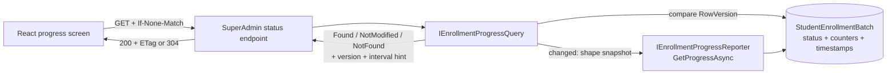

# AI20.PHASE2.0.9 — Real-Time Progress Architecture

**Type:** Contract and architecture design only. No production implementation is included.

**Decision:** Use adaptive, conditional HTTP polling as the Phase 2 progress transport. Preserve `IEnrollmentProgressReporter.GetProgressAsync` as the canonical read, add a version-aware query contract around the same batch-row snapshot, and stop polling at terminal state. Keep polling-backed Server-Sent Events (SSE) as the first upgrade if measured UX demand later justifies a push-like connection.

---

## 1. Existing Contract and Repository Evidence

`IEnrollmentProgressReporter` in `AI20_PHASE2_ENGINE_CONTRACTS.md` has three proposed responsibilities:

1. `TransitionItemAsync` atomically changes an item status and the denormalized batch counters.
2. `FinalizeBatchIfCompleteAsync` assigns the terminal batch status.
3. `GetProgressAsync(batchId, tenantId, ...)` performs an O(1), pull-based read of the batch counters and timestamps.

The current sequence in that document has no publication step after a transition. A client learns about a change only by calling `GetProgressAsync`. This matches `AI20_ENROLLMENT_BACKGROUND.md` §3.2: `GET /api/enrollment/batches/{id}/status` reads the `StudentEnrollmentBatch` row rather than aggregating thousands of item rows.

The value pushed or polled must be the complete `EnrollmentProgress` snapshot, not only a percentage. It contains:

- `BatchStatus`;
- all `EnrollmentStatistics` counters (`Total`, `Pending`, `Downloading`, `Validating`, `Embedding`, `Completed`, `Failed`, `RetryRequired`, and `Cancelled`);
- `StartedUtc`, `CompletedUtc`, and `CancellationRequestedUtc`;
- derived terminal, cancellation, elapsed-time, completion-percentage, and success-rate semantics.

### 1.1 Real-time infrastructure search

A repository-wide search for `SignalR`, `Hub`, `IHubContext`, `AddSignalR`, `MapHub`, WebSockets, `EventSource`, and `text/event-stream` found **no existing real-time transport infrastructure**. No SignalR client package is present in `abhyanvaya-ui/package.json`.

Redis libraries exist for optional distributed caching, but `render.yaml` deploys the Starter web service with `UseRedis=false`. That is not a configured SignalR backplane or progress pub/sub facility.

### 1.2 Existing frontend precedent

The React/MUI SPA already has a purpose-built `AttendanceRecognitionPollingService` and `useAttendanceSessionPolling` hook. They:

- call a REST status endpoint immediately and every 2 seconds;
- suppress overlapping requests with an `inFlight` guard;
- notify subscribers;
- treat polling errors as non-fatal; and
- stop on a terminal status.

`AttendanceRecognitionReviewPage` also uses a timer for local progress messaging, while the current `StudentEnrollmentPage` explicitly contains no API calls or polling yet. Therefore REST polling is an established long-running-job pattern, whereas every push transport would be a first-of-its-kind addition.

The SPA authenticates REST calls by adding a bearer token from `localStorage` through an Axios interceptor. This matters for SSE: native browser `EventSource` cannot set an `Authorization` header, so an SSE client would need a fetch-stream implementation or an authentication redesign. Tokens must not be placed in query strings.

---

## 2. Platform-Specific Decision Drivers

| Driver | Consequence for AI20 |
|---|---|
| Render Starter deployment | `render.yaml` identifies one Starter web service, and prior AI16–AI19 work records a 512 MB memory constraint. A few SuperAdmin connections are viable, but each long-lived SSE/WebSocket/SignalR connection consumes a socket and per-connection state and must reconnect across deploys/restarts. Exact Render connection and idle-timeout limits must be rechecked when implementation is scheduled. |
| Minutes-to-hours batch duration | A SuperAdmin is unlikely to watch continuously. A 3–10 second visible-page refresh is effectively live for this workflow, while hidden-tab backoff avoids hours of unnecessary traffic. |
| Low expected audience | Usually only one or a few SuperAdmins would watch a batch. Connection count is not a near-term reason to reject push, but it also weakens the benefit of adding a real-time subsystem. |
| Possible multi-instance future | A connection terminates on one instance. Event-driven SignalR/raw WebSocket publication from another instance needs distributed fan-out such as Redis or Azure SignalR Service. That complexity is premature today but mandatory before horizontal scale. |
| Durable source of truth | Batch counters and status are already committed transactionally to PostgreSQL. Reading that row avoids lossy in-memory notifications and remains correct after process restart or a dropped client connection. |
| Institutional networks | College administrators may use restrictive proxies or firewalls. Ordinary short HTTP requests are the safest; SSE commonly traverses HTTP infrastructure better than WebSockets, subject to proxy buffering/timeouts. |
| Existing JWT client | Axios already sends bearer headers. Polling reuses it directly. SignalR needs its client library/token factory; SSE needs authenticated fetch streaming because native `EventSource` cannot send the existing header. |

Render supports long-lived HTTP and WebSocket workloads in principle, but support alone does not remove operational concerns: rolling deploys disconnect clients, idle intermediaries may require heartbeat traffic, and horizontal fan-out is an application concern. No design should promise an indefinitely stable connection; every push client would still require reconnect plus a fresh snapshot.

---

## 3. Per-Transport Evaluation

| Transport | Render-hosting fit | Multi-instance fit | Client complexity | Firewall friendliness | Recommendation |
|---|---|---|---|---|---|
| **Polling (current de facto approach)** | **Best.** Short requests release connections; low persistent memory/socket cost; survives restarts naturally. O(1) batch-row reads keep each request cheap. | **Best.** Any instance reads the same PostgreSQL state; no sticky session or backplane. | **Lowest.** Reuses Axios, bearer-header authentication, the existing polling service/hook shape, overlap protection, and terminal stop behavior. | **Best.** Standard HTTPS works through the broadest range of institutional proxies. | **1st — implement adaptive conditional polling in Phase 2.** |
| **SSE** | **Good for a few viewers.** One long-lived HTTP response per viewer; needs heartbeat/reconnect and validation that Render/proxies do not buffer or terminate the stream unexpectedly. | **Good only when polling-backed.** Each instance can repeatedly read PostgreSQL without fan-out. A genuinely event-driven publisher still needs distributed pub/sub when scaled. | **Moderate.** One-way semantics fit progress, but native `EventSource` cannot send the existing bearer header; use authenticated fetch streaming and write reconnect/parsing logic. | **Good.** Usually friendlier than WebSockets, although buffering proxies and idle timeouts require heartbeat comments. | **2nd — preferred future push-like upgrade after UX/load evidence.** |
| **SignalR** | **Viable but heavier.** Handles reconnect/transport negotiation, but maintains connection state and heartbeat traffic on the memory-constrained API instance. | **Requires scale-out design.** Redis backplane or Azure SignalR Service is needed when workers and connected clients can land on different instances. Current Render config has no active Redis. | **High relative to precedent.** Adds the SignalR JavaScript client, hub lifecycle, groups, authorization, reconnection, and server registrations. | **Medium.** Negotiation/fallback helps, but WebSocket restrictions and long-lived connection policies still apply. | **3rd — reconsider only if several bidirectional live features emerge.** |
| **Raw WebSockets** | **Weakest.** Long-lived sockets are viable at low count but require custom heartbeat, reconnect, framing, error, and lifecycle handling. | **Weakest.** Needs sticky connection awareness plus custom distributed fan-out/pub-sub. | **Highest.** Bespoke protocol, authentication, subscription, replay, reconnect, and state reconciliation duplicate features supplied by SignalR. | **Lowest.** Most likely to be blocked or disrupted by restrictive institutional networks. | **4th — do not choose for one-way progress.** |

SSE does not inherently reduce database reads if its implementation merely polls `GetProgressAsync` on the server. It moves the timer from browser to server and keeps a connection open. Its benefit is a simpler one-way update experience and centralized cadence, not free event delivery.

---

## 4. Ranked Recommendation

### 4.1 First — adaptive conditional polling

Implement the already-designed REST read with these refinements:

1. Poll immediately when the progress screen opens.
2. While the tab is visible and the batch is active, use the server hint (recommended default: 3 seconds).
3. Back off to 10 seconds after repeated unchanged responses and to 15–30 seconds while the tab is hidden.
4. On transient errors, use bounded exponential backoff with jitter; never overlap requests.
5. Stop after `EnrollmentProgress.IsTerminal` becomes true.
6. Return a strong opaque version from the batch `RowVersion`, expose it as an HTTP `ETag`, and honor `If-None-Match` with `304 Not Modified`.
7. Immediately refresh after a local create, cancel, resume, or retry command rather than waiting for the next timer.

This gives a maximum normal visible-page staleness of about three seconds, which is proportionate to a batch that runs for minutes or hours. It adds no persistent connections, real-time package, pub/sub process, or cross-instance routing.

Conditional polling still performs an indexed O(1) batch-row read. Its optimization is reduced response shaping, JSON serialization, transfer, and React state churn when the version is unchanged; it does not pretend to eliminate the database read.

### 4.2 Second — polling-backed SSE

If user testing shows that three-second freshness is inadequate, add SSE without changing the worker or transition transaction. An SSE endpoint can repeatedly call the same version-aware query, emit only changed snapshots, send heartbeat comments, and terminate after a terminal snapshot.

This form deliberately avoids in-memory pub/sub. It remains restart-safe and multi-instance-safe because PostgreSQL is the durable handoff. The trade-off is that it retains periodic DB reads while also holding HTTP connections. The SPA must use bearer-authenticated `fetch` streaming rather than native `EventSource`.

### 4.3 Third — SignalR

SignalR becomes reasonable only if the platform accumulates multiple live, bidirectional features such as operator commands, recognition events, notifications, and presence. At that point its group routing and reconnection support may justify a shared real-time platform. For this single one-way, low-concurrency screen it introduces disproportionate server/client concepts and a future backplane obligation.

### 4.4 Fourth — raw WebSockets

Raw WebSockets offer no material UX advantage over SignalR or SSE here and leave protocol reliability to application code. They should not be selected for AI20 progress.

---

## 5. Proposed Top-Choice Contract

The following is an **illustrative proposed contract only**. It is not implemented.

```csharp
namespace Abhyanvaya.Application.Common.Interfaces;

/// <summary>
/// Version-aware O(1) read of the durable batch progress snapshot.
/// Presentation maps Version to ETag and NotModified to HTTP 304.
/// </summary>
public interface IEnrollmentProgressQuery
{
    Task<EnrollmentProgressReadResult> GetProgressAsync(
        EnrollmentProgressReadRequest request,
        CancellationToken cancellationToken = default);
}

public sealed record EnrollmentProgressReadRequest
{
    public required Guid BatchId { get; init; }
    public required int TenantId { get; init; }

    /// <summary>
    /// Opaque version previously returned to this client (HTTP If-None-Match at the API boundary).
    /// Null requests the complete snapshot.
    /// </summary>
    public string? KnownVersion { get; init; }
}

public enum EnrollmentProgressReadOutcome
{
    Found = 0,
    NotModified = 1,
    NotFound = 2,
}

public sealed record EnrollmentProgressReadResult
{
    public required EnrollmentProgressReadOutcome Outcome { get; init; }

    /// <summary>Present only when Outcome is Found.</summary>
    public EnrollmentProgress? Progress { get; init; }

    /// <summary>
    /// Opaque encoding of StudentEnrollmentBatch.RowVersion; never interpreted by the client.
    /// Present for Found and NotModified.
    /// </summary>
    public string? Version { get; init; }

    /// <summary>
    /// Suggested active, visible-page cadence. The client may back off further when hidden or unchanged.
    /// Null means stop polling (terminal or not found).
    /// </summary>
    public TimeSpan? RecommendedPollAfter { get; init; }
}
```

### 5.1 Contract rules

| Rule | Decision |
|---|---|
| Tenant isolation | Query by both `BatchId` and `TenantId`; an absent or cross-tenant row returns `NotFound`. The API separately enforces the SuperAdmin policy. |
| Version source | Use an opaque representation of `StudentEnrollmentBatch.RowVersion`, which must change in the same transaction as status/counter changes. Do not hash serialized JSON on every request. |
| Snapshot consistency | Read version, status, counters, and timestamps from the same batch row/query. Never combine independently timed item aggregates. |
| HTTP mapping | `Found` → `200` + body + `ETag`; `NotModified` → `304` + `ETag` and poll hint; `NotFound` → `404`. HTTP types remain in Presentation, not Application. |
| Terminal behavior | Return the final snapshot once with no next-poll hint; the client stops. |
| Cadence ownership | Server supplies a baseline hint; the browser applies visibility backoff, jitter, and retry backoff. |
| Cache safety | Responses are tenant/user-authorized and should not be publicly cached. ETag is a validator, not permission to use a shared public cache. |

---

## 6. Relationship to `IEnrollmentProgressReporter.GetProgressAsync`

The existing proposed `GetProgressAsync(Guid batchId, int tenantId, ...)` remains the canonical way to shape `EnrollmentProgress`. The new query is an additive read optimization, not a competing source of truth:



An implementation should execute this as one O(1) projection where practical, so the diagram expresses contract ownership rather than requiring two physical SQL queries. The reporter's existing read-model mapping should be extracted/reused internally; the query adds conditional-version and cadence semantics.

`TransitionItemAsync` and `FinalizeBatchIfCompleteAsync` must **not** synchronously call a network publisher. Their transaction succeeds or fails solely on durable database work. This preserves the Phase 2 invariant that progress is derived from committed state and prevents a disconnected dashboard or backplane outage from delaying enrollment.

For the second-choice SSE upgrade, the stream would wrap repeated calls to `IEnrollmentProgressQuery`/`GetProgressAsync`, not require the reporter to publish in-memory events. A genuinely event-driven stream would be a later, separate architecture requiring an outbox plus distributed pub/sub for reliable multi-instance delivery; direct publish-after-transition risks commit-order races and lost events.

---

## 7. Recommended Flow

```mermaid
sequenceDiagram
    participant BG as EnrollmentBackgroundService
    participant PROG as IEnrollmentProgressReporter
    participant DB as PostgreSQL batch row
    participant UI as React SuperAdmin dashboard
    participant API as Status endpoint / IEnrollmentProgressQuery

    UI->>API: GET status (no ETag)
    API->>DB: Read snapshot + RowVersion
    DB-->>API: Progress V1
    API-->>UI: 200 EnrollmentProgress + ETag V1 + poll-after 3s

    BG->>PROG: TransitionItemAsync(...)
    PROG->>DB: Commit item status + counters + RowVersion V2
    DB-->>PROG: committed

    Note over UI: Timer fires; no worker-to-client coupling
    UI->>API: GET status (If-None-Match V1)
    API->>DB: Read snapshot + RowVersion
    DB-->>API: Progress V2
    API-->>UI: 200 updated EnrollmentProgress + ETag V2

    UI->>API: GET status (If-None-Match V2)
    API->>DB: Read RowVersion
    DB-->>API: V2 unchanged
    API-->>UI: 304 Not Modified + next poll hint

    BG->>PROG: FinalizeBatchIfCompleteAsync(batchId)
    PROG->>DB: Commit terminal status + RowVersion V3
    UI->>API: GET status (If-None-Match V2)
    API->>DB: Read final snapshot V3
    API-->>UI: 200 terminal EnrollmentProgress + ETag V3
    Note over UI: Stop polling
```

The progress change reaches the client on the next scheduled read, with bounded staleness rather than instantaneous push. That is intentional for this workflow.

---

## 8. SSE Upgrade Boundary

If polling later proves insufficient, the proposed boundary would be:

```csharp
namespace Abhyanvaya.Application.Common.Interfaces;

/// <summary>
/// Optional future one-way stream. An initial snapshot is always emitted, followed by changed
/// snapshots, and the sequence ends after a terminal snapshot or client cancellation.
/// </summary>
public interface IEnrollmentProgressStream
{
    IAsyncEnumerable<EnrollmentProgress> StreamProgressAsync(
        Guid batchId,
        int tenantId,
        CancellationToken cancellationToken = default);
}
```

The initial implementation should be polling-backed:

1. Read through `IEnrollmentProgressQuery`.
2. Yield the initial snapshot.
3. Delay by the recommended interval.
4. Re-read with the prior version and yield only on change.
5. End on terminal state or request cancellation.

The API would map this to `text/event-stream`, emit heartbeat comments, disable response buffering where supported, and ensure cancellation releases the scoped services promptly. Reconnection must always request a fresh durable snapshot; per-transition event replay is unnecessary because progress snapshots supersede intermediate states.

This interface is documented as an upgrade boundary, not part of the Phase 2 recommendation and not an instruction to implement SSE now.

---

## 9. Decision Triggers and Risks

Reconsider SSE when measured evidence shows one or more of:

- SuperAdmins need sub-second stage visibility to operate the batch;
- conditional polling creates meaningful database or network load;
- several dashboards commonly watch batches concurrently; or
- product requirements explicitly demand live notifications while the screen remains open.

Reconsider SignalR only when AI20 is no longer the sole real-time use case and a shared bidirectional platform offsets the backplane and client-library cost.

Before any push implementation, validate on the deployed Render plan: maximum concurrent connections, idle/proxy timeout behavior, heartbeat cadence, deploy reconnect behavior, CORS, authorization, and response buffering. For horizontal scaling, document and test fan-out; the currently disabled Redis cache configuration must not be mistaken for a ready SignalR/SSE message bus.

---

## Constraints Confirmed

- No `.cs`, `.csproj`, `.tsx`, `.ts`, or other production/configuration file was created or modified.
- No endpoint, worker, polling service, SSE stream, SignalR hub, WebSocket handler, DI registration, package, database change, or migration was implemented.
- Every C# block is an illustrative **proposed** contract inside this design document only.
- Existing `EnrollmentProgress`, `EnrollmentStatistics`, and `IEnrollmentProgressReporter` code was read but not changed.
- The only deliverable created for this task is `docs/AI20_PHASE2_PROGRESS_STREAMING.md`.
