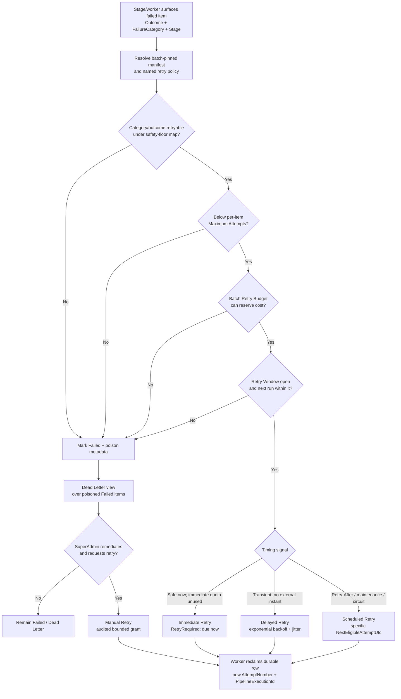

# AI20.PHASE2.0.17 — Retry Classification Framework

**Type:** Architecture and contract design only. No production code, configuration, database migration, worker, API, or UI implementation is included.

**Baseline enriched:** `docs/AI20_PHASE2_ENGINE_CONTRACTS.md` §6 (`IEnrollmentRetryService`) and its `EnrollmentStageOutcome` vocabulary. The implemented Domain enums remain unchanged: `EnrollmentStatus` still has the single non-terminal `RetryRequired` state, and `FailureCategory` remains the business failure taxonomy.

**Forward references:** AI20.PHASE2.0.14 supplies pipeline-version pinning for a batch. AI20.PHASE2.0.16 (`docs/AI20_PHASE2_PIPELINE_MANIFEST.md`, authored in parallel) supplies a per-stage `Retry Policy` field. This document defines the stable, named policy identities that field references.

---

## 0. Decision Summary

The richer model is a **retry decision model**, not a larger persisted status enum. `EnrollmentStatus.RetryRequired` remains the durable queue-visible state for every automatic retry disposition. The decision attached to that state says *when and under which limits* it may be claimed again.

1. A stage reports `FailureCategory` plus `EnrollmentStageOutcome.RetryRequired` or `Failed`; it does not choose a delay or spend a retry budget.
2. `IEnrollmentRetryService` resolves the pinned named policy and returns one of five dispositions: Immediate, Delayed, Scheduled, Manual, or Never Retry.
3. The worker/orchestrator persists the decision and enacts it by re-queueing now, making it claimable after a delay/schedule, or marking it `Failed`.
4. Per-item maximum attempts, a batch retry budget, and a retry window are independent gates. Every automatic retry must pass all three.
5. A poison item remains `EnrollmentStatus.Failed` with explicit poison metadata; adding a competing `Poison` status is not recommended.
6. Dead Letter is initially a queryable SuperAdmin view over poisoned `Failed` items, not a second queue table.
7. Manual retry is an audited SuperAdmin command after remediation. It starts a new attempt but does not silently erase prior automatic retry consumption.

---

## 1. Vocabulary and First-Class Concepts

### 1.1 Retry dispositions

| Disposition | Precise meaning | Trigger and timing | Enacted by |
|---|---|---|---|
| **Immediate Retry** | Re-queue the whole item for a new attempt with no intentional policy delay. It is still a new claim and never an in-method loop. | Only for a transient fault where another attempt is safe immediately and there is no overload/rate-limit signal. At most one consecutive immediate retry is recommended; it consumes attempt and batch budget. | `IEnrollmentRetryService` decides; worker writes `RetryRequired`, signals the durable queue, and permits immediate claim. |
| **Delayed Retry** | Re-queue the whole item after a computed backoff interval. | Default for transient network, storage, engine, and stuck-attempt failures. `NextEligibleAttemptUtc = now + backoff`. | Retry service computes delay; worker/orchestrator persists it and the queue claim excludes the item until due. |
| **Scheduled Retry** | Re-queue at a specific externally meaningful UTC instant rather than a relative progression alone. | Used for `Retry-After`, known provider maintenance, a circuit-open-until time, or an operator-configured quiet period. `NextEligibleAttemptUtc` is the supplied schedule, bounded by the retry window. | Retry service selects the instant; worker claims when due. |
| **Manual Retry** | Park the item until a SuperAdmin explicitly requests a new attempt after correcting or accepting the underlying condition. No autonomous timer makes it eligible. | Triggered only by the existing row-level or Bulk Retry UI/API command. The command records actor, reason, and policy treatment before moving the item to `Pending`. | SuperAdmin authorizes; `IEnrollmentRetryService.RetryAsync` validates and enacts; worker later claims normally. |
| **Never Retry** | Do not automatically execute the same input again because the failure is deterministic, unsafe, cancelled, or policy-forbidden. | Immediate terminal classification or the result of exhausting any automatic gate. It becomes poison/dead-lettered when appropriate. A later manual retry is a separate human override after remediation, not a contradiction of this automatic disposition. | Retry service decides; result writer persists `Failed` and poison metadata. |

`Immediate`, `Delayed`, and `Scheduled` are **automatic** dispositions. `Manual` is human-gated. `Never Retry` describes the current failure under the current input and pinned policy; it does not prohibit a SuperAdmin from supplying evidence that the source/configuration was fixed and issuing a new manual attempt.

### 1.2 Retry Budget

A **Retry Budget** caps aggregate retry cost so a systemic outage cannot make thousands of items amplify load.

- **Item budget:** `MaxAutomaticRetries` is the number of automatic re-queues permitted after the initial attempt. Recommended default: `3`.
- **Batch budget:** a pinned token bucket shared by all items in the batch. One pipeline-level re-queue consumes tokens according to the failed stage: `Download = 1`, `Validation/Storage = 2`, `Embedding/ResultWrite = 3`. The weighting approximates resource cost and is policy data, not enum ordering.
- **Recommended initial baseline:** capacity `max(25, ceil(TotalStudents × 0.25))` tokens; refill `max(1, ceil(TotalStudents × 0.01))` tokens per hour while the window is open; lifetime spend ceiling `max(50, ceil(TotalStudents × 0.50))` tokens. These are tunable starting values, not hardcoded constants.
- A retry is authorized only if tokens can be reserved atomically. Exhaustion changes the item to poison with reason `BatchRetryBudgetExhausted`; it must not busy-loop in `RetryRequired`.
- Budget is consumed by **pipeline-level** attempts, not by Polly retries inside one stage call. Manual retry does not draw from the old automatic bucket by default; it receives an explicit, tightly bounded manual grant (§8).

The batch token reservation and item transition must be atomic or concurrency-safe so parallel workers cannot overspend the bucket.

### 1.3 Retry Window

The **Retry Window** is the maximum wall-clock span during which automatic retries may start. Recommended default: `24 hours` from the first failed automatic attempt, not from each later retry.

`now < RetryWindowExpiresUtc` must hold when a retry is authorized and again when it is claimed. A delayed/scheduled instant beyond the deadline is rejected instead of creating work that can never run. Window expiry produces poison reason `RetryWindowExpired` and routes to Dead Letter / operator review.

Manual intervention may open a **new explicit window** only when the operator requests it and provides a reason. It must not silently roll the original window forward.

### 1.4 Retry Backoff

Pipeline-level delayed retry uses capped exponential backoff with full jitter:

```text
cap(attempt) = min(MaxDelay, BaseDelay × 2^(automaticRetryOrdinal - 1))
delay        = random(0, cap(attempt))

Recommended defaults:
BaseDelay = 30 seconds
MaxDelay  = 30 minutes
```

Provider `Retry-After` or a circuit-breaker reopen time takes precedence and yields `Scheduled Retry`, provided it falls inside the window. Jitter must be independently generated per item to de-correlate a batch.

This is separate from `ExternalPhotoImportPolicies`: that Polly policy retries `HttpRequestException`, `TaskCanceledException`, HTTP 5xx, and 429 up to three times at 2/4/8 seconds **inside one download stage invocation**. Those low-level retries do not increment `RetryCount`, do not create a new `PipelineExecutionId`, and do not re-run validation/storage/embedding. Only after the stage-level policy is exhausted does the stage surface a transient result; pipeline policy then decides whether to re-queue the whole item as a new attempt.

| Dimension | Low-level transient retry | Pipeline-level retry |
|---|---|---|
| Example | Retry a flaky HTTP GET within `FetchPhotoAsync` | Re-run the item after exhausted HTTP/storage/engine failure |
| Owner | Infrastructure resilience adapter (Polly) | `IEnrollmentRetryService` policy + worker |
| Attempt identity | Same `AttemptNumber` and `PipelineExecutionId` | New `AttemptNumber` and `PipelineExecutionId` |
| Durable state | No queue/status transition | `RetryRequired`, eligibility time, retry metadata |
| Counter/budget | Does not increment `RetryCount` or batch budget | Increments automatic retry consumption and spends batch tokens |
| Delay scale | Seconds, held within one call | Seconds to hours, durable across process restarts |

### 1.5 Maximum Attempts

**Maximum Attempts** is the hard per-item ceiling. Recommended default:

```text
MaxAutomaticRetries = 3
MaximumAutomaticAttempts = 1 initial attempt + 3 retries = 4
```

The real `StudentEnrollmentItem.RetryCount` remains the count of **automatic retries consumed**, exactly as its Domain documentation states. An automatic re-queue reserves/increments it once; low-level Polly calls do not.

`AttemptNumber` is broader: it increments for every orchestrator execution, including a manual retry. Therefore the Phase 2 implementation must not permanently derive it as `RetryCount + 1` after manual intervention. It requires a separately persisted total-attempt ordinal or an append-only attempt record. Manual retry must neither reuse an old attempt number nor reset audit history.

Maximum attempts and Retry Budget are both required: the former stops one pathological item; the latter stops many individually well-behaved items from creating a batch-wide storm.

### 1.6 Poison Item

A **Poison Item** is an item that cannot proceed automatically because:

- its category is non-retryable under the pinned policy;
- maximum attempts, retry budget, or retry window was exhausted;
- required retry metadata/policy cannot be resolved safely; or
- repeated `Unknown` failures reached the conservative cap.

**Recommendation:** do not add `EnrollmentStatus.Poison`. Persist `EnrollmentStatus.Failed` as the authoritative terminal business state and add explicit poison metadata when implementation is authorized, conceptually `PoisonedUtc`, `PoisonReason`, `TerminalRetryDisposition`, and `RetryPolicyVersion`. This avoids a second terminal status that would require new counters, filters, transitions, and batch-finalization rules, while making poison distinguishable from an ordinary first-pass permanent failure.

Until such metadata exists, poison can be derived from `Failed + FailureCategory + RetryCount + pinned limits`, but that derivation is less auditable when policy versions change. Explicit metadata is the long-term recommendation.

### 1.7 Dead Letter

**Dead Letter** is the operational holding surface for poison items. The initial design should be a tenant-safe, SuperAdmin-only query/view over `Failed` items carrying poison metadata, with filters for batch, category, stage, poison reason, attempt count, and age.

A separate dead-letter table or broker queue is not required: the durable item row already contains identity, failure, retry count, and last-attempt facts. Introduce a separate store only if future requirements need immutable per-attempt payload snapshots, independent retention, replay across deleted batches, or broker interoperability.

Dead Letter is not claimable work. Only an audited operator command may move an item out of it.

### 1.8 Operator Intervention

**Operator Intervention** is the Manual Retry path exposed by the existing SuperAdmin row-level Retry and Bulk Retry concepts in `AI20_ENROLLMENT_UI.md` §4.

The command must:

1. require SuperAdmin authorization and tenant/batch validation;
2. show the terminal category, poison reason, previous attempts, and pinned policy;
3. require a non-empty remediation/override reason for poison items;
4. allow category-filtered selection and bounded paging for Bulk Retry;
5. create an audit event containing actor, item/batch, prior state, reason, and requested policy treatment;
6. assign a new attempt identity and move the item to `Pending`, never directly invoke the orchestrator from the API request;
7. preserve prior `RetryCount`, failure history, and poison evidence;
8. grant a bounded manual retry allowance (recommended one attempt and a new 2-hour window). Any automatic retries after that attempt require an explicit policy choice; default is no automatic budget reset.

Bulk Retry must be rate-limited and budgeted as a command. A human click must not become an unbounded way to bypass storm protection.

---

## 2. FailureCategory Default Classification

The Domain category is the stable business input. Stage/diagnostic context may refine timing (for example, a provider `Retry-After` changes Delayed to Scheduled), but must not turn deterministic validation rejection into automatic retry.

| `FailureCategory` | Default named policy | Default disposition | Max automatic retries / total automatic attempts | Rationale and manual path |
|---|---|---|---|---|
| `PhotoNotFound` | `NeverRetryPolicy` | Never Retry | `0 / 1` | Repeating the same URL will return the same 404. Manual retry only after the source photo is confirmed present or URL data is corrected. |
| `AccessDenied` | `NeverRetryPolicy` | Never Retry | `0 / 1` | 403 normally requires credential/configuration repair. Bulk manual retry is appropriate after repair. |
| `InvalidImage` | `NeverRetryPolicy` | Never Retry | `0 / 1` | Same bytes remain non-image data. Replace/fix source before manual retry. |
| `CorruptImage` | `NeverRetryPolicy` | Never Retry | `0 / 1` | Deterministic decode failure for the same source object. |
| `NoFaceDetected` | `NeverRetryPolicy` | Never Retry | `0 / 1` | A valid unchanged photo will still contain no detectable face. |
| `MultipleFacesDetected` | `NeverRetryPolicy` | Never Retry | `0 / 1` | Enrollment requires exactly one face; source correction is required. |
| `BlurRejected` | `NeverRetryPolicy` | Never Retry | `0 / 1` | Quality rejection is deterministic for the same image. |
| `LowResolutionRejected` | `NeverRetryPolicy` | Never Retry | `0 / 1` | Re-running cannot add source detail. |
| `StorageUploadFailed` | `TransientStoragePolicy` | Delayed Retry | `3 / 4` | Usually provider/network transient. A `Retry-After` or open circuit upgrades timing to Scheduled. |
| `EmbeddingEngineFailed` | `TransientEnginePolicy` | Delayed Retry | `3 / 4` | Engine/session/resource faults may clear; delay prevents CPU/memory thrash. Known deterministic dimension/configuration faults should be diagnostically refined and may be overridden to Never Retry by the stage policy. |
| `Timeout` | `StuckRecoveryPolicy` | Delayed Retry | `2 / 3` | Recovery already observed a long/stuck attempt; immediate retry risks overlap or repeated saturation. Retry only after lease/stuck cleanup and backoff. |
| `Unknown` | `ConservativeUnknownPolicy` | Delayed Retry | `1 / 2` | One delayed diagnostic retry avoids losing a one-off fault; repetition poisons quickly because retryability is unproven. |

The existing engine contracts allow `EnrollmentStageOutcome.RetryRequired` with a nullable category for exhausted HTTP 5xx/429/connection faults. Until the Domain taxonomy gains a dedicated network category, resolve that combination through `TransientNetworkPolicy`: Delayed by default, Scheduled when `Retry-After`/circuit timing exists, maximum `3 / 4`. `Outcome = Failed` with no category is treated as `ConservativeUnknownPolicy`, not silently made retryable.

Cancellation is not a failure category and is never retried by this framework. `EnrollmentStageOutcome.Cancelled` follows batch cancellation semantics.

---

## 3. Named Policies for the Pipeline Manifest

AI20.PHASE2.0.16's per-stage `Retry Policy` field should reference a stable policy name, not embed arbitrary thresholds in each manifest stage.

| Policy name | Intended stages/faults | Allowed dispositions | Default limits |
|---|---|---|---|
| `TransientNetworkPolicy` | Download HTTP 5xx/429/timeouts after Polly exhausts | Immediate once only when safe; otherwise Delayed or Scheduled | 3 automatic retries, 24h window |
| `TransientStoragePolicy` | Storage provider transient faults | Delayed or Scheduled | 3 automatic retries, 24h window |
| `TransientEnginePolicy` | Validation/embedding engine transient faults | Delayed; Scheduled during circuit/maintenance | 3 automatic retries, 24h window |
| `TransientDbPolicy` | Result-write transient database availability faults after the active transaction rolls back | Delayed only; never retry a transaction with an unknown commit outcome without an idempotency check | 3 automatic retries, 24h window |
| `StuckRecoveryPolicy` | Recovery sweep `Timeout` | Delayed only | 2 automatic retries, 24h window |
| `ConservativeUnknownPolicy` | Unclassified expected/unexpected fault | Delayed once, then Never | 1 automatic retry, 2h window |
| `NeverRetryPolicy` | Deterministic source/validation failures | Never Retry | 0 automatic retries |
| `ManualRecoveryPolicy` | SuperAdmin override after remediation | Manual Retry | One manual attempt, 2h explicit window; no implicit automatic reset |

The 0.16 manifest examples authored in parallel use shorter wire names. The policy catalog must register these as stable aliases, resolving to exactly one canonical definition:

| Manifest wire name | Canonical policy |
|---|---|
| `TransientDownload` | `TransientNetworkPolicy` |
| `TransientStorage` | `TransientStoragePolicy` |
| `TransientEngine` | `TransientEnginePolicy` |
| `TransientDb` | `TransientDbPolicy` |
| `None` | `NeverRetryPolicy` |

A manifest may override a stage's default policy name, but only with a policy compatible with the category safety floor. For example, it may reduce `Embedding` to `NeverRetryPolicy`/`None`; it may not map `NoFaceDetected` to `TransientNetworkPolicy`. Unknown policy names are a manifest load error as required by 0.16; if unresolved policy data somehow reaches runtime, evaluation fails closed to `NeverRetryPolicy` and creates an operational configuration alert.

0.16 also permits an `InlineRetryPolicy`. Inline values may only **reduce** the resolved catalog policy's automatic permissions; they cannot bypass the category safety floor, batch budget, retry window, jitter, or manual-authorization rules. For compatibility with 0.16, inline `MaxAttempts` means **total automatic pipeline attempts including the initial attempt**, `Backoff` must resolve to a supported strategy such as `Exponential` or `Fixed`, and `BaseDelay` is the progression input. Invalid or more-permissive inline values fail manifest validation.

Illustrative manifest fragment only:

```yaml
pipelineVersion: enrollment-2026.07
stages:
  - stage: Download
    retryPolicy: TransientDownload
  - stage: Validation
    retryPolicy: None
  - stage: Storage
    retryPolicy: TransientStorage
  - stage: Embedding
    retryPolicy: TransientEngine
  - stage: ResultWrite
    retryPolicy: TransientDb
```

---

## 4. Who Decides and Who Acts

| Participant | Owns | Must not own |
|---|---|---|
| Stage/service | Detect fault; return expected `FailureCategory`, `Reason`, stage identity, diagnostic details, and `EnrollmentStageOutcome.RetryRequired` or `Failed` | Backoff calculation, durable counter changes, batch budget, queue timing, or manual authorization |
| `IEnrollmentRetryService` | Pure policy evaluation: category/outcome/stage + pinned policy + attempt/budget/window state → disposition, eligibility time, cost, terminal/poison reason | Running the stage, sleeping a worker thread, directly processing an item |
| Orchestrator/result writer | Ask for the decision; atomically persist failure, `RetryCount` consumption, eligibility/poison metadata, and counters | Inventing category-specific retry rules |
| Worker/durable queue | Claim only due `Pending`/`RetryRequired` rows, signal/poll, start a new attempt with incremented `AttemptNumber`, and respect cancellation/concurrency | Reclassifying failures or bypassing a denied budget |
| Recovery service | Identify stuck durable in-flight items and surface `Timeout` to the same retry service | Maintaining a separate retry taxonomy |
| SuperAdmin/API | Request Manual Retry after remediation; provide scope/reason | Directly calling stage services, resetting history, or overriding tenant/policy checks |

Illustrative enrichment of the retry decision contract:

```csharp
// Proposed contract only; no C# implementation exists.
public enum RetryDisposition
{
    Immediate,
    Delayed,
    Scheduled,
    Manual,
    Never
}

public sealed record RetryDecision
{
    public required RetryDisposition Disposition { get; init; }
    public required EnrollmentStatus NextStatus { get; init; }
    public required string PolicyName { get; init; }
    public required string PolicyVersion { get; init; }
    public DateTimeOffset? NextEligibleAttemptUtc { get; init; }
    public required int BudgetCost { get; init; }
    public string? TerminalReason { get; init; }
}

public interface IEnrollmentRetryService
{
    RetryDecision Classify(RetryEvaluationContext context);
    Task<BulkRetryResult> RetryAsync(
        BulkRetryRequest request,
        CancellationToken cancellationToken = default);
    Task<EnrollmentTransitionResult> ResetStuckItemAsync(
        Guid itemId,
        CancellationToken cancellationToken = default);
}
```

`EnrollmentStageOutcome.RetryRequired` is a stage's **retryability signal**, not the final durable decision. The retry service may still return `Never` because a gate was exhausted. Conversely, a stage's `Failed` outcome is not autonomously upgraded to automatic retry; only a SuperAdmin can choose the Manual path after remediation.

---

## 5. Where Policy Lives

| Layer/artifact | Responsibility |
|---|---|
| **Domain** | Own the closed `FailureCategory` and `EnrollmentStatus` business vocabulary. A Domain/Application policy catalog defines the safe category-to-default-policy map without depending on Infrastructure exceptions. |
| **Application** | Own `RetryDisposition`, policy/evaluation DTOs, `IEnrollmentRetryService`, named policy identities, safety-floor validation, and pure decision semantics. |
| **Infrastructure** | Implement policy evaluation, durable eligibility/poison metadata, atomic token reservation, queue due-time query, Polly low-level adapters, recovery sweep, options binding, and jitter/time providers. |
| **Pipeline Manifest (0.16)** | Select a named policy per canonical `EnrollmentPipelineStage`. It references this catalog; it does not duplicate executable retry algorithms. |
| **Pipeline version pin (0.14)** | Pin the resolved manifest version, retry policy-set version, thresholds, and budget/window parameters to the batch at creation. |
| **API/UI** | Present decisions/dead letters and submit authorized Manual/Bulk Retry commands. It never classifies categories. |

Runtime configuration may provide defaults for newly created batches, but a running batch reads its pinned policy snapshot. Editing current configuration must not change the treatment of items already in that batch.

---

## 6. Policy Evolution and Tuning

Retry policy is versioned with the enrollment pipeline:

1. Publish a new immutable policy-set version when mappings, limits, costs, or backoff parameters change.
2. AI20.PHASE2.0.14 pins the pipeline/manifest/policy-set snapshot when the batch is created.
3. Every attempt and retry decision records the pinned version. A batch continues under that version across restarts and retries.
4. A policy defect is corrected by publishing a new version. Existing batches change only through an explicit, audited administrative migration/override; no silent in-place reinterpretation occurs.
5. Manual Retry defaults to the batch's pinned policy. If the operator elects a newer policy, that choice is explicit, authorized, and recorded per command/item.

Threshold tuning should use production evidence from:

- `docs/AI20_PHASE2_PIPELINE_TELEMETRY.md`: stage, duration, diagnostic code, attempt correlation, first-try versus eventual success;
- `docs/AI20_PHASE2_HEALTH_METRICS.md`: retry rate, queue length, throughput, and stage-attributed failures;
- `docs/AI20_ENROLLMENT_BACKGROUND.md` §3.7: structured transition and batch summary logs.

Review at least retry success by category/stage/attempt ordinal, p50/p95 recovery time, budget exhaustion, dead-letter age, manual-retry success, queue growth, and provider rate-limit signals. Tune by releasing a new policy version; do not alter historical decisions to make metrics look better.

---

## 7. Decision Tree



---

## 8. Automatic Delayed Retry Sequence

```mermaid
sequenceDiagram
    participant W as Enrollment Worker
    participant O as Orchestrator
    participant S as Stage Service
    participant R as IEnrollmentRetryService
    participant DB as Durable DB Queue

    W->>DB: Claim item, AttemptNumber=1<br/>Pending → in-flight
    W->>O: ProcessItem(context, attempt 1)
    O->>S: Execute stage
    Note over S: Low-level Polly retries transient calls<br/>inside attempt 1 (no RetryCount change)
    S-->>O: RetryRequired + transient category
    O->>R: Classify(pinned policy, counts, budget, window)
    R-->>O: Delayed, cost=1,<br/>NextEligibleAttemptUtc=T1
    O->>DB: Atomic write: RetryRequired,<br/>RetryCount=1, reserve budget, due=T1
    O-->>W: Attempt 1 ended

    Note over W,DB: Worker does not sleep for the item;<br/>poll excludes it until T1
    W->>DB: At T1 claim due item,<br/>AttemptNumber=2, new PipelineExecutionId
    W->>O: ProcessItem(context, attempt 2)
    O->>S: Execute stage again
    S-->>O: RetryRequired + transient category
    O->>R: Classify(updated counts, budget, window)
    R-->>O: Delayed with larger jitter cap,<br/>NextEligibleAttemptUtc=T2
    O->>DB: Atomic write: RetryRequired,<br/>RetryCount=2, reserve budget, due=T2

    W->>DB: At T2 claim due item,<br/>AttemptNumber=3, new PipelineExecutionId
    W->>O: ProcessItem(context, attempt 3)
    O->>S: Execute stage
    S-->>O: Succeeded
    O->>DB: Persist success and Completed
```

---

## 9. Operator Manual Retry Sequence

```mermaid
sequenceDiagram
    actor A as SuperAdmin
    participant UI as Enrollment Failures UI
    participant API as Enrollment API
    participant R as IEnrollmentRetryService
    participant AUD as Audit Service
    participant DB as Durable DB / Dead Letter View
    participant W as Enrollment Worker

    UI->>DB: Read poisoned Failed item and history
    DB-->>UI: Category, poison reason,<br/>attempts, pinned policy
    A->>UI: Select Retry/Bulk Retry<br/>and enter remediation reason
    UI->>API: Manual retry command
    API->>R: RetryAsync(actor, scope, reason,<br/>requested policy treatment)
    R->>DB: Validate tenant, Failed/poison state,<br/>bounded manual grant and concurrency
    R->>AUD: Record ManualRetryRequested<br/>actor + reason + old/new policy choice
    R->>DB: Atomic Failed → Pending,<br/>preserve RetryCount/history,<br/>clear active poison marker, set manual window
    R-->>API: RequeuedCount + rejected items
    API-->>UI: Command result

    W->>DB: Claim Pending item
    Note over W,DB: New monotonically increasing AttemptNumber<br/>and new PipelineExecutionId
    W->>W: Execute one manual-granted attempt
    alt succeeds
        W->>DB: Completed
    else fails or grant exhausted
        W->>DB: Failed + new poison metadata
        Note over DB: Returns to Dead Letter view;<br/>no silent budget reset
    end
```

---

## 10. Persistence and Queue Semantics

The durable DB-backed queue remains authoritative:

- Claim queries continue to use `EnrollmentStatus.Pending` and `EnrollmentStatus.RetryRequired`, but must also require `NextEligibleAttemptUtc <= now` (or null/due semantics defined by policy).
- A delayed/scheduled retry is persisted before the worker releases the item. No in-memory timer is correctness-critical.
- `LastAttemptUtc` continues to support stuck recovery. It is not the retry due time; overloading it for both meanings would make recovery and scheduling ambiguous.
- `RetryCount` is incremented once per authorized automatic re-queue. It is not reset on success, manual retry, restart, or policy-version change; it remains historical consumption.
- Recovery surfaces `FailureCategory.Timeout` and delegates to `StuckRecoveryPolicy`, preserving one classification path.
- A poison transition must remove the row from claim eligibility in the same transaction that records the terminal reason and updates batch counters.
- Batch finalization treats poison as `Failed`; therefore the existing `FailedCount` and `PartiallyFailed` semantics remain valid.

Conceptual persistence additions (`NextEligibleAttemptUtc`, poison metadata, policy version, batch retry tokens, and a total attempt ordinal/history) are recommendations for a later implementation milestone only. No schema change is made here.

---

## 11. Invariants and Safety Rules

1. Expected failures are classified by `FailureCategory`; Infrastructure exception type never becomes the policy API.
2. Deterministic validation categories cannot be made automatically retryable by a manifest override.
3. Every automatic retry consumes the item ceiling and batch budget exactly once.
4. Every pipeline retry creates a new attempt identity; low-level Polly retries do not.
5. No worker thread sleeps until a durable retry is due.
6. Unknown or missing policy data fails closed and reaches operator-visible poison state.
7. Manual Retry is authorized, audited, bounded, and history-preserving.
8. Policy version is immutable for a batch unless an explicit audited override is performed.
9. Dead Letter items are not claimable.
10. Cancellation does not consume retry budget and is not converted into poison.

---

## Constraints Confirmed

- This document is architecture-only. No retry service, worker, queue, controller, UI, options class, Polly policy, database column, migration, or production behavior was implemented.
- No `.cs`, `.csproj`, `.tsx`, `.ts`, or other non-markdown file was created, edited, or deleted.
- The implemented `EnrollmentStatus` and `FailureCategory` enums remain unchanged; `RetryRequired` remains the sole durable automatic-retry status.
- Every C# and YAML block is illustrative/proposed only.
- Low-level Polly retry and pipeline-level durable re-queue retry are explicitly separate.
- AI20.PHASE2.0.14 batch version pinning and AI20.PHASE2.0.16 manifest retry-policy references are incorporated.
- The only output artifact for AI20.PHASE2.0.17 is `docs/AI20_PHASE2_RETRY_POLICY.md`.
