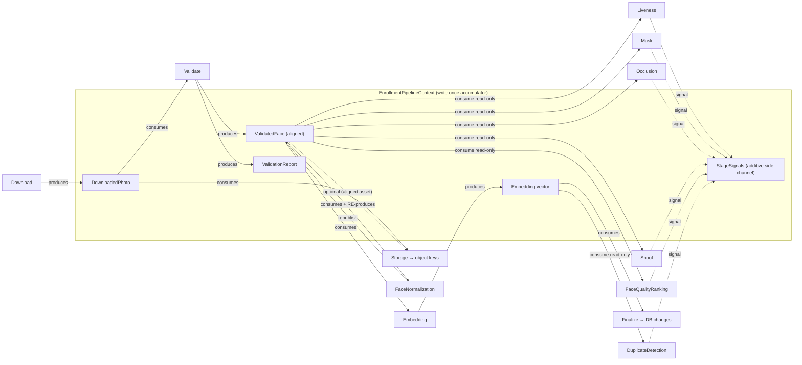
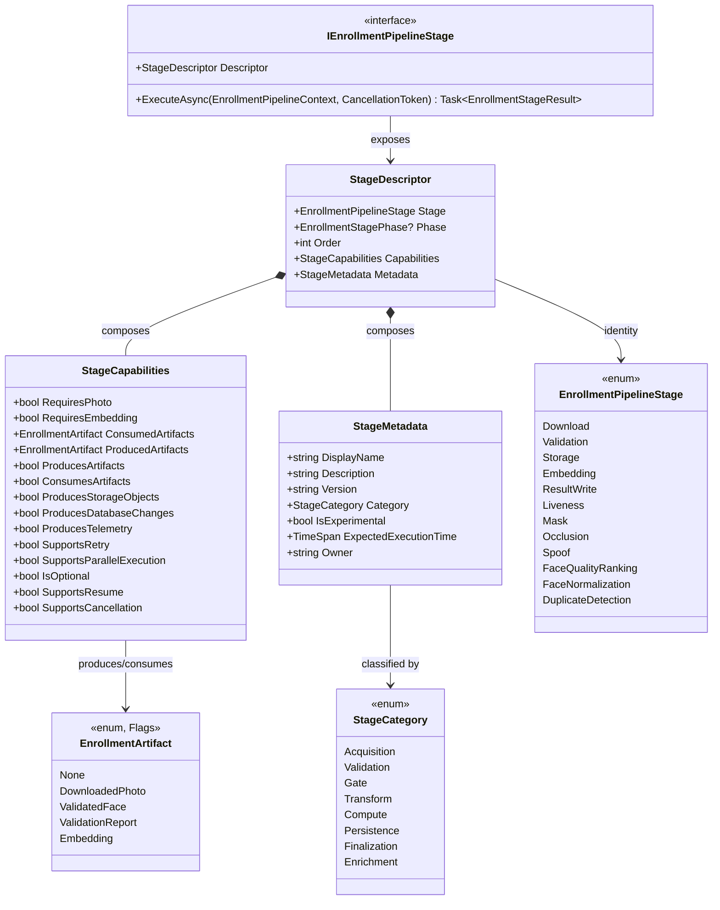

# AI20.PHASE2.0.15 — Stage Capability Metadata

**Type:** Contract/model design only. No production code was written or modified to produce this document. No business logic, DI registration, background worker, orchestrator change, database update, migration, or image processing is implemented here — only a **proposed** capability-metadata model (`StageCapabilities`, `StageMetadata`, `StageDescriptor`) that lets each pipeline stage *expose* its own behavioral contract, plus the capability matrix and the orchestrator-consumption pattern that removes hardcoded per-stage knowledge.

**Status of the code blocks below:** every C# block is a **proposed** contract that does not yet exist in the codebase. They are the design artifact of this milestone, not committed code. This document does **not** modify `IEnrollmentPipelineStage` (AI20.PHASE2.0.5 §1), `IEnrollmentOrchestrator` (AI20.PHASE2.0.1 §4), the `EnrollmentPipelineStage` enum (AI20.PHASE2.0.13 §3), or any other frozen Phase 2 contract — it composes them.

**Reads this design builds on:**
- `docs/AI20_PHASE2_PIPELINE_STAGE_DESIGN.md` (0.5) — `IEnrollmentPipelineStage`, the 5 core + 7 future stages, the write-once **artifact accumulator** (`EnrollmentPipelineContext`), the two extension phases (`EnrollmentStagePhase`), and the **config-authoritative ordering/registration** recommendation this milestone extends. Capability metadata is the natural evolution of §4/§5's "stages declare their own `StageName`/`Order`/`Phase`" — stages now declare their *full* behavioral contract instead of the orchestrator hardcoding knowledge of each one.
- `docs/AI20_PHASE2_ENGINE_CONTRACTS.md` (0.1) — the orchestrator and the per-stage service contracts (`IEnrollmentValidationService`/`IEnrollmentStorageService`/`IEnrollmentEmbeddingService`/`IEnrollmentResultWriter`) whose real behaviors the capability flags describe.
- `docs/AI20_PHASE2_PIPELINE_TELEMETRY.md` (0.3) — `EnrollmentStageTelemetry` (grounds `ProducesTelemetry`; per-stage `ElapsedMilliseconds` informs `ExpectedExecutionTime`).
- `docs/AI20_PHASE2_STORAGE_ASSETS.md` (0.10) — which stage touches object storage (grounds `ProducesStorageObjects`).
- `docs/AI20_PHASE2_RESULT_WRITER_REVIEW.md` (0.8) and `docs/AI20_PHASE2_PIPELINE_CONTEXT.md` (0.2) — the durable-queue resume, the `CancellationRequested` snapshot, and the retry model (ground `SupportsResume`/`SupportsCancellation`/`SupportsRetry`).
- `docs/AI20_PHASE2_PIPELINE_STAGE_ENUM.md` (0.13) — the canonical `EnrollmentPipelineStage` enum, reused verbatim as `StageDescriptor`'s **stage-identity** field (no new stage-naming enum is invented).
- `docs/AI20_PHASE2_VALIDATION_REPORT.md` (0.11) — the `ValidationReport` artifact that Validate produces alongside the aligned face.

---

## 0. Design principles (carried from Phase 2)

This model obeys the conventions established across the Phase 2 contracts:

1. **Interfaces + DTOs live in `Abhyanvaya.Application`; Domain stays untouched.** The three new types are `Abhyanvaya.Application.Enrollment.Pipeline` records, exactly like `EnrollmentPipelineContext`. They reference the existing `EnrollmentPipelineStage` (0.13) and `EnrollmentStagePhase` (0.5) enums unchanged.
2. **Metadata is declarative and non-authoritative.** A descriptor *describes* a stage; it never *executes* one. It drives orchestrator composition/branching decisions, but it is data, not behavior.
3. **DTOs are `sealed record` with `required`/`init` members.** Capability flags default to the safest value (`false`) so an unspecified capability is never accidentally granted.
4. **One fact, one field.** `StageDescriptor` reuses the canonical `EnrollmentPipelineStage` for identity rather than re-declaring a `StageName` string — resolving the "third naming authority" risk called out in 0.13 §4.
5. **Configuration stays authoritative for *which* and *in-what-order* stages run** (0.5 §4/§5). Capabilities describe a stage's *nature*; configuration + `Order` still choose the *active set*. Capabilities make that configuration **validatable** (§7) rather than replacing it.

---

## 1. The three concepts and their non-overlapping responsibilities

The task requires three distinct concepts. The single most important design decision is the **clean separation** between them, so a change to one never forces a change to another:

| Concept | Answers | Nature of its fields | Changes when… | Consumed by |
|---|---|---|---|---|
| **`StageCapabilities`** | *"What is this stage allowed/able to do, and what does it need/produce?"* | The **behavioral contract**: booleans + a `[Flags]` artifact enum. Machine-checkable predicates the orchestrator branches on. | The stage's runtime **behavior** changes (it starts producing storage objects, becomes parallelizable, gains a transient failure mode). | The orchestrator/registry — **at runtime**, to make sequencing/transaction/retry decisions. |
| **`StageMetadata`** | *"What is this stage, who owns it, how mature is it, how long does it take?"* | **Descriptive/informational**: strings, a category enum, an experimental flag, a `TimeSpan`, an owner. Human- and dashboard-facing. | The stage's **description** changes (renamed, re-versioned, graduates from experimental, re-benchmarked). | Dashboards, health checks, docs, log scopes, timeout budgeting — **for display/observability**, not branching. |
| **`StageDescriptor`** | *"Which concrete stage is this, and what are its capabilities + metadata?"* | The **composite**: a canonical `EnrollmentPipelineStage` identity + `EnrollmentStagePhase` placement + one `StageCapabilities` + one `StageMetadata`. | Never itself — it only wires the other three together. | The orchestrator/registry — it is the **only** thing they consume; they never touch a stage's internals. |

**The delineation rule that keeps them from overlapping:** if a field is a *predicate the orchestrator must evaluate to alter control flow* (open a transaction? retry? run in parallel? validate ordering?) it belongs on **`StageCapabilities`**. If it is a *label a human or dashboard reads* (name, version, owner, maturity, expected duration) it belongs on **`StageMetadata`**. `ExpectedExecutionTime` and `IsExperimental` are the two fields the prompt lists that land on **Metadata** (a duration budget and a maturity label are descriptive, not behavioral gates); the other twelve requested fields are behavioral and land on **Capabilities**.

---

## 2. `StageCapabilities` — the behavioral contract

```csharp
namespace Abhyanvaya.Application.Enrollment.Pipeline;

/// <summary>
/// The write-once artifacts a stage can PRODUCE into, or CONSUME out of, the
/// EnrollmentPipelineContext accumulator (AI20.PHASE2.0.5 §2). Modeled as [Flags] so a single stage
/// can name multiple artifacts (Validate produces BOTH the aligned face AND the validation report),
/// and so composition-time ordering validation (§7) can compute produced-before-consumed as a set
/// operation. Advisory signals (RecordSignal) are an ADDITIVE side-channel, deliberately NOT modeled
/// here — they never gate ordering, so they are not accumulator artifacts.
/// </summary>
[Flags]
public enum EnrollmentArtifact
{
    None            = 0,
    DownloadedPhoto = 1 << 0,   // raw bytes — produced by Download, consumed by Validate + Storage
    ValidatedFace   = 1 << 1,   // aligned 112x112 crop — produced by Validate, consumed by Embedding/gates
    ValidationReport = 1 << 2,  // per-dimension report (AI20.PHASE2.0.11) — produced by Validate
    Embedding       = 1 << 3,   // L2-normalized 512-d vector — produced by Embedding, consumed by Finalize/Duplicate
}

/// <summary>
/// The BEHAVIORAL capability flags of one pipeline stage: what it needs, what it produces, and which
/// orchestration behaviors (retry, parallelism, transactions, resume, cancellation) apply to it.
/// Every field is a predicate the orchestrator/registry evaluates to make a control-flow decision —
/// replacing "if (stage is XStage)" hardcoding (§6). All flags default to the SAFEST value (false /
/// None) so an unspecified capability is never accidentally granted.
/// </summary>
public sealed record StageCapabilities
{
    // ---- Inputs the stage requires (preconditions — power composition-time ordering validation, §7) ----

    /// <summary>Requires image bytes as input — the raw photo OR the aligned face crop. False for the
    /// Download stage (it PRODUCES the photo) and for stages that work only on the vector (Finalize,
    /// DuplicateDetection). See §5 for why "photo" here spans both raw and aligned image bytes.</summary>
    public bool RequiresPhoto { get; init; }

    /// <summary>Requires the L2-normalized embedding vector as input. True only for Finalize (writes it)
    /// and DuplicateDetection (compares it). False for Embedding itself (it PRODUCES the vector).</summary>
    public bool RequiresEmbedding { get; init; }

    /// <summary>The accumulator artifacts this stage reads. Must be a subset of the union of artifacts
    /// produced by EARLIER stages — validated at composition time (§7).</summary>
    public EnrollmentArtifact ConsumedArtifacts { get; init; } = EnrollmentArtifact.None;

    // ---- Outputs the stage produces ----

    /// <summary>The accumulator artifacts this stage writes (write-once slots on EnrollmentPipelineContext).
    /// Distinct from ProducesStorageObjects (object storage) and ProducesDatabaseChanges (the DB).</summary>
    public EnrollmentArtifact ProducedArtifacts { get; init; } = EnrollmentArtifact.None;

    /// <summary>Convenience predicate: does this stage contribute any accumulator artifact?</summary>
    public bool ProducesArtifacts => ProducedArtifacts != EnrollmentArtifact.None;

    /// <summary>Convenience predicate: does this stage read any accumulator artifact?</summary>
    public bool ConsumesArtifacts => ConsumedArtifacts != EnrollmentArtifact.None;

    /// <summary>Writes to OBJECT STORAGE (R2/local). True ONLY for Storage — the sole storage seam
    /// (AI20.PHASE2.0.10 §0). Lets the orchestrator know a failure here is a StorageUploadFailed class.</summary>
    public bool ProducesStorageObjects { get; init; }

    /// <summary>Makes DURABLE DATABASE changes to item/embedding/student/counters. True ONLY for Finalize
    /// (ResultWrite) — the single transactional finalizer (AI20.PHASE2.0.1 §11). Per design principle #5,
    /// no other stage writes state; progress transitions BETWEEN stages are owned by the orchestrator /
    /// IEnrollmentProgressReporter, not by a stage. Drives the "wrap in a transaction?" decision (§6).</summary>
    public bool ProducesDatabaseChanges { get; init; }

    /// <summary>Emits an EnrollmentStageTelemetry record (AI20.PHASE2.0.3 §7). True for all stages in the
    /// current design; kept as a flag so a future zero-overhead stage can opt out without a contract change.</summary>
    public bool ProducesTelemetry { get; init; }

    // ---- Orchestration behaviors ----

    /// <summary>Has an EXPECTED transient failure mode that is auto-retry-eligible (network/storage/engine/DB
    /// faults). False for gate stages whose expected failures are PERMANENT rejects (a masked photo is masked
    /// every attempt — retrying is pointless). NOTE: an UNEXPECTED exception from any stage is still converted
    /// to a transient retry by the orchestrator's catch-all (AI20.PHASE2.0.1 §4); this flag governs only the
    /// stage's OWN declared/expected failure disposition (§6 retry example).</summary>
    public bool SupportsRetry { get; init; }

    /// <summary>Safe to run CONCURRENTLY with its sibling stages in the same phase — i.e. it is read-only over
    /// the shared artifacts and produces NO write-once artifact that another sibling might race. True for the
    /// read-only PostValidation gates; FALSE for FaceNormalization (it republishes ValidatedFace — a write) and
    /// for every tightly-ordered core stage. This is the flag that would drive a future DAG scheduler (0.5 §4).</summary>
    public bool SupportsParallelExecution { get; init; }

    /// <summary>The pipeline may skip this stage (via configuration) without breaking correctness. True for all
    /// 7 optional AI stages; false for the 5 core stages. Combined with config to decide "run it?" (§6).</summary>
    public bool IsOptional { get; init; }

    /// <summary>Safe to RE-EXECUTE from scratch on a resumed/re-claimed attempt after an interruption
    /// (durable-queue resume, AI20.PHASE2.0.8 / 0.2). Every current stage is idempotent-on-re-run because the
    /// pipeline resumes at ATTEMPT granularity (a new PipelineExecutionId), not mid-stage. False would mark a
    /// stage that must NOT be blindly re-run after a crash without compensation.</summary>
    public bool SupportsResume { get; init; }

    /// <summary>Honors cooperative cancellation (the CancellationToken / batch CancellationRequested snapshot,
    /// AI20.PHASE2.0.2 §2) DURING its execution. False for Finalize: once its terminal transaction begins it
    /// must run to completion to stay atomic (AI20.PHASE2.0.1 §11) — cancellation is honored BEFORE it, not
    /// mid-commit.</summary>
    public bool SupportsCancellation { get; init; }
}
```

---

## 3. `StageMetadata` — descriptive/informational

```csharp
namespace Abhyanvaya.Application.Enrollment.Pipeline;

/// <summary>Broad functional classification of a stage — a human/dashboard label, never a branching input.</summary>
public enum StageCategory
{
    Acquisition = 0,   // fetches the source photo (Download)
    Validation  = 1,   // the reject-by-default quality gate that also produces the aligned face
    Gate        = 2,   // pass/reject AI check (Liveness, Mask, Occlusion, Spoof, DuplicateDetection, optional FaceQualityRanking)
    Transform   = 3,   // mutates/republishes an artifact (FaceNormalization)
    Compute     = 4,   // produces a derived value with no gate (Embedding)
    Persistence = 5,   // writes object storage (Storage)
    Finalization = 6,  // the terminal transactional write (Finalize/ResultWrite)
    Enrichment  = 7,   // advisory-only signal contribution (FaceQualityRanking in its advisory mode)
}

/// <summary>
/// DESCRIPTIVE, human/dashboard-facing metadata about a stage. Contains NOTHING the orchestrator branches
/// on: names, docs, version, category, maturity, an expected-duration budget, and an owner. Changing any
/// field here never alters control flow — that is the boundary against StageCapabilities (§1).
/// </summary>
public sealed record StageMetadata
{
    /// <summary>Human-friendly display name for dashboards/logs (e.g. "Liveness Detection").
    /// The MACHINE identity is the canonical EnrollmentPipelineStage on the descriptor, NOT this string.</summary>
    public required string DisplayName { get; init; }

    /// <summary>One-line description of what the stage checks/produces, for the admin UI / health page.</summary>
    public required string Description { get; init; }

    /// <summary>Semantic version of THIS stage's implementation/model contract (e.g. "1.0.0"). Lets the
    /// dashboard show which liveness model generation ran; independent of the app version.</summary>
    public required string Version { get; init; }

    /// <summary>Functional classification for grouping in the UI/health page. Descriptive only.</summary>
    public required StageCategory Category { get; init; }

    /// <summary>Maturity flag: the stage is proposed/preview and may be disabled by default or excluded from
    /// SLAs. True for all 7 future stages (unimplemented in Phase 2); false for the 5 shipped-contract core
    /// stages. This is a MATURITY LABEL — the RUN-vs-SKIP decision uses Capabilities.IsOptional + config,
    /// not this flag (see §6). Kept here, not on Capabilities, because "how mature" is descriptive.</summary>
    public required bool IsExperimental { get; init; }

    /// <summary>Advisory expected wall-clock duration under normal load — a BUDGET, not a measurement. Sourced
    /// from the per-stage EnrollmentStageTelemetry.ElapsedMilliseconds averages (AI20.PHASE2.0.3). Used for
    /// timeout budgeting, the stuck-item recovery threshold, and dashboard "expected vs actual" — never to
    /// branch. Descriptive, so it lives on Metadata rather than Capabilities.</summary>
    public required TimeSpan ExpectedExecutionTime { get; init; }

    /// <summary>Owning team/individual for on-call routing and change control (e.g. "ai-enrollment").</summary>
    public required string Owner { get; init; }
}
```

---

## 4. `StageDescriptor` — the composite the orchestrator/registry consumes

```csharp
namespace Abhyanvaya.Application.Enrollment.Pipeline;

/// <summary>
/// The single composite that ties a stage's canonical IDENTITY (the EnrollmentPipelineStage enum from
/// AI20.PHASE2.0.13 — NOT a new naming enum) and its extension-slot PLACEMENT (EnrollmentStagePhase from
/// AI20.PHASE2.0.5) to its behavioral StageCapabilities and descriptive StageMetadata. This is the ONLY
/// object the orchestrator/registry consumes to reason about a stage — they never inspect a concrete stage
/// type again (§6). It is the runtime encoding of "stages declare their own properties" (0.5 §4/§5).
/// </summary>
public sealed record StageDescriptor
{
    /// <summary>Canonical, config-addressable identity. Reuses AI20.PHASE2.0.13's EnrollmentPipelineStage so
    /// there is exactly one stage vocabulary across telemetry, CurrentStage, config, and this descriptor.</summary>
    public required EnrollmentPipelineStage Stage { get; init; }

    /// <summary>Which orchestrator extension slot an OPTIONAL stage runs in (PostValidation / PostEmbedding).
    /// Null for the 5 core stages, which are directly orchestrated and not slotted (0.5 §7).</summary>
    public EnrollmentStagePhase? Phase { get; init; }

    /// <summary>Default relative order WITHIN its phase — the safe fallback tie-breaker when configuration
    /// omits an explicit order (0.5 §4). Configuration remains authoritative; enum numeric value is NOT order.</summary>
    public int Order { get; init; }

    /// <summary>The behavioral contract (§2).</summary>
    public required StageCapabilities Capabilities { get; init; }

    /// <summary>The descriptive metadata (§3).</summary>
    public required StageMetadata Metadata { get; init; }
}
```

### 4.1 How a stage exposes its descriptor (proposed extension to `IEnrollmentPipelineStage`)

The `IEnrollmentPipelineStage` contract (0.5 §1) today exposes loose `StageName`/`Order`/`Phase` members. The natural evolution is to **collapse those into one `Descriptor`** so a stage declares its *entire* self-description in one place, and the orchestrator's hardcoded knowledge disappears:

```csharp
// PROPOSED evolution of IEnrollmentPipelineStage — the loose StageName/Order/Phase become one Descriptor.
public interface IEnrollmentPipelineStage
{
    /// <summary>The stage's full self-description: identity + phase + order + capabilities + metadata.
    /// Replaces the separate StageName/Order/Phase members — a stage now declares ITS OWN properties,
    /// and the orchestrator reads them instead of hardcoding per-stage knowledge.</summary>
    StageDescriptor Descriptor { get; }

    Task<EnrollmentStageResult> ExecuteAsync(
        EnrollmentPipelineContext context, CancellationToken cancellationToken = default);
}
```

The 5 core stages are directly orchestrated and are not `IEnrollmentPipelineStage` instances (0.5 §7), but a **static descriptor table** (a `CoreStageDescriptors` catalog) declares their capabilities so the SAME registry-driven reasoning in §6/§7 applies uniformly to core and optional stages alike.

---

## 5. Artifact producer/consumer model (the accumulator dependency view)

`ProducedArtifacts`/`ConsumedArtifacts` are grounded directly in the write-once accumulator of `EnrollmentPipelineContext` (0.5 §2): `DownloadedPhoto`, `ValidatedFace` (the aligned crop), the `ValidationReport` (0.11), and the `Embedding` vector. The rule is a simple set relation: **a stage that consumes an artifact must run after some stage that produces it.**

- **Download** consumes nothing (only item identity); **produces** `DownloadedPhoto`.
- **Validate** consumes `DownloadedPhoto`; **produces** `ValidatedFace` + `ValidationReport`.
- **Embedding** consumes `ValidatedFace`; **produces** `Embedding`.
- **Storage** consumes `DownloadedPhoto` (the canonical original) — and optionally `ValidatedFace` for the aligned asset (0.10 §2); it **produces** object-storage keys, which are *external side effects*, not accumulator artifacts (hence `ProducesStorageObjects`, not `ProducedArtifacts`).
- **Finalize** consumes `Embedding` (+ the storage `PhotoKey`); it **produces** durable DB changes (`ProducesDatabaseChanges`), not an accumulator artifact.
- **PostValidation gates** (Liveness, Mask, Occlusion, Spoof, FaceQualityRanking) consume `ValidatedFace` read-only and produce advisory **signals** (the additive `RecordSignal` channel) — deliberately *not* accumulator artifacts, so they never gate ordering.
- **FaceNormalization** consumes `ValidatedFace` and **re-produces** `ValidatedFace` (a transform), which is why it is the one optional stage that is **not** parallel-safe.
- **DuplicateDetection** consumes `Embedding` read-only and produces a `duplicateSimilarity` signal.

> On `RequiresPhoto` vs `ConsumedArtifacts`: `RequiresPhoto` is a coarse **precondition** ("this stage needs image bytes — raw OR aligned"), while `ConsumedArtifacts` names the *exact* accumulator slot. Both feed §7's ordering validation; `RequiresPhoto`/`RequiresEmbedding` give a human-readable precondition, `ConsumedArtifacts` gives the machine-checkable set.



---

## 6. The capability matrix (12 stages × every capability field)

This is the centerpiece deliverable. Rows are all 12 stages (5 core + 7 future); columns are every requested capability field. Twelve behavioral fields live on `StageCapabilities` (Table A); the two descriptive fields (`IsExperimental`, `ExpectedExecutionTime`) live on `StageMetadata` (Table B). Together they are the full 14-field matrix.

**Legend:** ✓ = true / ✗ = false. Stage identity uses the canonical `EnrollmentPipelineStage` (0.13).

### Table A — `StageCapabilities` (behavioral)

| Stage (Phase) | Retry | Parallel | ProducesArtifacts | ConsumesArtifacts | RequiresPhoto | RequiresEmbedding | IsOptional | SupportsResume | SupportsCancellation | ProducesTelemetry | ProducesStorageObjects | ProducesDatabaseChanges |
|---|:--:|:--:|:--:|:--:|:--:|:--:|:--:|:--:|:--:|:--:|:--:|:--:|
| **Download** (core) | ✓ | ✗ | ✓ | ✗ | ✗ | ✗ | ✗ | ✓ | ✓ | ✓ | ✗ | ✗ |
| **Validation** (core) | ✗ | ✗ | ✓ | ✓ | ✓ | ✗ | ✗ | ✓ | ✓ | ✓ | ✗ | ✗ |
| **Storage** (core) | ✓ | ✗ | ✗ | ✓ | ✓ | ✗ | ✗ | ✓ | ✓ | ✓ | ✓ | ✗ |
| **Embedding** (core) | ✓ | ✗ | ✓ | ✓ | ✓ | ✗ | ✗ | ✓ | ✓ | ✓ | ✗ | ✗ |
| **Finalize / ResultWrite** (core) | ✓ | ✗ | ✗ | ✓ | ✗ | ✓ | ✗ | ✓ | ✗ | ✓ | ✗ | ✓ |
| **Liveness** (PostValidation) | ✗ | ✓ | ✗ | ✓ | ✓ | ✗ | ✓ | ✓ | ✓ | ✓ | ✗ | ✗ |
| **Mask** (PostValidation) | ✗ | ✓ | ✗ | ✓ | ✓ | ✗ | ✓ | ✓ | ✓ | ✓ | ✗ | ✗ |
| **Occlusion** (PostValidation) | ✗ | ✓ | ✗ | ✓ | ✓ | ✗ | ✓ | ✓ | ✓ | ✓ | ✗ | ✗ |
| **Spoof** (PostValidation) | ✗ | ✓ | ✗ | ✓ | ✓ | ✗ | ✓ | ✓ | ✓ | ✓ | ✗ | ✗ |
| **FaceQualityRanking** (PostValidation) | ✗ | ✓ | ✗ | ✓ | ✓ | ✗ | ✓ | ✓ | ✓ | ✓ | ✗ | ✗ |
| **FaceNormalization** (PostValidation) | ✗ | ✗ | ✓ | ✓ | ✓ | ✗ | ✓ | ✓ | ✓ | ✓ | ✗ | ✗ |
| **DuplicateDetection** (PostEmbedding) | ✗ | ✓ | ✗ | ✓ | ✗ | ✓ | ✓ | ✓ | ✓ | ✓ | ✗ | ✗ |

### Table B — `StageMetadata` (descriptive: the remaining two requested fields + supporting metadata)

| Stage | Category | IsExperimental | ExpectedExecutionTime | Version | Owner |
|---|---|:--:|---|---|---|
| **Download** | Acquisition | ✗ | ~2000 ms (network-bound) | 1.0.0 | ai-enrollment |
| **Validation** | Validation | ✗ | ~300 ms | 1.0.0 | ai-enrollment |
| **Storage** | Persistence | ✗ | ~500 ms (N object PUTs) | 1.0.0 | ai-enrollment |
| **Embedding** | Compute | ✗ | ~250 ms (ONNX) | 1.0.0 | ai-enrollment |
| **Finalize / ResultWrite** | Finalization | ✗ | ~50 ms (1 DB tx) | 1.0.0 | ai-enrollment |
| **Liveness** | Gate | ✓ | ~150 ms | 0.1.0 | ai-enrollment |
| **Mask** | Gate | ✓ | ~80 ms | 0.1.0 | ai-enrollment |
| **Occlusion** | Gate | ✓ | ~100 ms | 0.1.0 | ai-enrollment |
| **Spoof** | Gate | ✓ | ~200 ms | 0.1.0 | ai-enrollment |
| **FaceQualityRanking** | Enrichment | ✓ | ~120 ms | 0.1.0 | ai-enrollment |
| **FaceNormalization** | Transform | ✓ | ~120 ms | 0.1.0 | ai-enrollment |
| **DuplicateDetection** | Gate | ✓ | ~400 ms (vector search) | 0.1.0 | ai-enrollment |

### 6.1 Justification of the non-obvious cells

- **`SupportsRetry`** encodes whether a stage has an *expected, auto-retry-eligible transient* failure — **not** whether an unexpected exception can be retried (that is handled uniformly by the orchestrator's catch-all, 0.1 §4).
  - **✓ Download / Storage / Embedding / Finalize:** their expected failures are infrastructure/transient — 5xx/timeout (`DL_HTTP_5XX`), `StorageUploadFailed`, `EmbeddingEngineFailed`, DB/concurrency faults. All are retry-eligible up to the cap (0.1 §6, `IEnrollmentRetryService.Classify`).
  - **✗ Validation and all gates:** their expected outcomes are **permanent rejects** (`NoFaceDetected`, `BlurRejected`, `MaskDetected`, `SpoofDetected`, `DuplicateStudentDetected`, …). A masked photo is masked on every attempt, so auto-retry is pointless (0.5 §6 — these map to permanent categories). **FaceNormalization** has no expected business failure at all, so ✗.
- **`SupportsParallelExecution`** = read-only over shared artifacts, no write-once production. **✓** for the PostValidation gates (they only read `ValidatedFace` and append signals — this is exactly the "Liveness and Mask can run concurrently" case a future DAG would exploit, 0.5 §4) and for DuplicateDetection (read-only over `Embedding`). **✗** for **FaceNormalization** because it *re-produces* `ValidatedFace` (a write-once conflict with any concurrent reader) and for every core stage (tight sequential data-coupling).
- **`ProducesArtifacts`** is true only for stages that write a write-once accumulator slot: Download, Validation, Embedding, and FaceNormalization (the transform). Storage and Finalize are ✗ here because their outputs are object-storage keys and DB rows respectively — captured by `ProducesStorageObjects`/`ProducesDatabaseChanges`, not the accumulator. Gates are ✗ because signals are an additive side-channel, not artifacts (§5).
- **`RequiresPhoto`** spans raw **or** aligned image bytes (§5): ✗ for Download (produces it), ✗ for Finalize and DuplicateDetection (vector-only), ✓ for everything that needs an image.
- **`RequiresEmbedding`** ✓ only for **Finalize** (writes the vector) and **DuplicateDetection** (compares vectors); ✗ for Embedding itself (it *produces* the vector).
- **`ProducesStorageObjects`** ✓ **only for Storage** — the single storage seam (0.10 §0).
- **`ProducesDatabaseChanges`** ✓ **only for Finalize** — the single transactional finalizer (0.1 §11). Notably **DuplicateDetection is ✗**: it *reads* existing active embeddings to compare, but writes nothing (0.5 §6). Inter-stage progress transitions are the orchestrator's/`IEnrollmentProgressReporter`'s job, not a stage's (principle #5).
- **`SupportsCancellation`** ✓ for all except **Finalize** — once the terminal atomic transaction begins it must complete to preserve the "no half-written result" invariant (0.1 §11); cancellation is honored *before* it, not mid-commit.
- **`SupportsResume`** ✓ across the board because the durable queue resumes at **attempt** granularity (a fresh `PipelineExecutionId`, 0.2 §3 / 0.13 §6), and every stage is idempotent-on-re-run (re-download, re-validate, deterministic-key re-upload, re-embed; Finalize is guarded by `RowVersion` so a re-run cannot double-commit, 0.1 §5/§11). The flag exists so a future non-idempotent stage can declare ✗ and force compensation.
- **`ProducesTelemetry`** ✓ for all — each stage emits `EnrollmentStageTelemetry` (0.3 §7); the flag is retained so a future zero-overhead stage can opt out.
- **`IsExperimental`** ✓ for the 7 future stages (unimplemented, preview) and ✗ for the 5 core stages whose contracts are frozen — a *maturity* label, distinct from `IsOptional` (which is the run/skip *behavior*, §6.2).

---

## 7. How the orchestrator uses metadata instead of hardcoded logic

The whole point: the orchestrator/registry reads `descriptor.Capabilities`/`descriptor.Metadata` and **never inspects a concrete stage type**. Below, each `if (stage is XStage)` anti-pattern is replaced by a capability read.

### 7.1 Parallel execution — behavior, not type

```csharp
// BEFORE — the orchestrator hardcodes which stages are parallel-safe:
if (stage is LivenessStage || stage is MaskStage || stage is OcclusionStage || stage is SpoofStage)
    await RunInParallelGroupAsync(stage);
else
    await RunSequentiallyAsync(stage);

// AFTER — the stage declares it; the orchestrator just reads the flag:
if (stage.Descriptor.Capabilities.SupportsParallelExecution)
    parallelGroup.Add(stage);      // gather read-only, artifact-free gates to fan out
else
    await RunSequentiallyAsync(stage);   // FaceNormalization etc. stay serial
```

### 7.2 Skipping optional stages — `IsOptional` + config, not a conditional

```csharp
// BEFORE — a hardcoded per-stage on/off ladder the orchestrator must edit for every new stage:
if (settings.EnableLiveness)      await liveness.ExecuteAsync(ctx, ct);
if (settings.EnableMask)          await mask.ExecuteAsync(ctx, ct);
if (settings.EnableDuplicate)     await duplicate.ExecuteAsync(ctx, ct);

// AFTER — capability + config, uniform over any stage set (no orchestrator edit to add a stage):
foreach (var stage in registry.GetStages(phase))   // already config-filtered/ordered (0.5 §5)
{
    var caps = stage.Descriptor.Capabilities;
    if (caps.IsOptional && !config.IsEnabled(stage.Descriptor.Stage))
        continue;                                    // safely skip — declared optional
    var result = await stage.ExecuteAsync(ctx, ct);
    if (result.Outcome != EnrollmentStageOutcome.Succeeded) break;  // short-circuit
}
```

### 7.3 Transaction scoping — `ProducesDatabaseChanges`, not a hardcoded "if Finalize"

```csharp
// BEFORE:
if (stage is FinalizeStage)
    await unitOfWork.ExecuteInTransactionAsync(() => stage.ExecuteAsync(ctx, ct));
else
    await stage.ExecuteAsync(ctx, ct);

// AFTER — only stages that declare DB changes get a transaction wrapper:
if (stage.Descriptor.Capabilities.ProducesDatabaseChanges)
    await unitOfWork.ExecuteInTransactionAsync(() => stage.ExecuteAsync(ctx, ct));
else
    await stage.ExecuteAsync(ctx, ct);   // I/O + CPU stages hold no DB lock (0.1 §4)
```

### 7.4 Retry eligibility — per-stage `SupportsRetry`, not one global rule

```csharp
// BEFORE — a single global rule, or a per-stage switch, decides retryability:
var retryable = result.Outcome == EnrollmentStageOutcome.RetryRequired && globalRetryEnabled;

// AFTER — the stage's declared disposition drives it (gates never auto-retry a permanent reject):
var caps = stage.Descriptor.Capabilities;
if (result.Outcome == EnrollmentStageOutcome.RetryRequired && caps.SupportsRetry)
    await writer.WriteRetryAsync(failure, ct);       // Download/Storage/Embedding/Finalize
else if (result.Outcome != EnrollmentStageOutcome.Succeeded)
    await writer.WriteFailureAsync(failure, ct);     // gate rejects → terminal, no wasted retry
```

### 7.5 Cancellation window — `SupportsCancellation`

```csharp
// AFTER — the orchestrator only injects a live token where mid-stage cancellation is safe:
var stageToken = stage.Descriptor.Capabilities.SupportsCancellation ? ct : CancellationToken.None;
await stage.ExecuteAsync(ctx, stageToken);   // Finalize runs with None → atomic commit protected
```

### 7.6 Timeout budgeting — `ExpectedExecutionTime` (Metadata)

```csharp
// AFTER — per-stage timeout/stuck-threshold derived from the declared budget, not a global constant:
using var timeout = new CancellationTokenSource(stage.Descriptor.Metadata.ExpectedExecutionTime * SlaMultiplier);
```

### 7.7 Composition-time ORDER validation — `RequiresEmbedding`/`RequiresPhoto`/`ConsumedArtifacts` (forward-reference to 0.16)

The capabilities make a manifest's stage **order** machine-verifiable *before any item runs*: walk the ordered stage list accumulating each stage's `ProducedArtifacts`; if a stage's `ConsumedArtifacts` (or `RequiresEmbedding`/`RequiresPhoto` precondition) is not yet satisfied by the accumulated produced-set, the manifest is invalid.

```csharp
// PROPOSED composition-time validation (would live in the AI20.PHASE2.0.16 Pipeline Manifest validator):
var available = EnrollmentArtifact.None;
foreach (var d in manifest.OrderedDescriptors)
{
    var caps = d.Capabilities;
    if (caps.RequiresEmbedding && !available.HasFlag(EnrollmentArtifact.Embedding))
        throw new PipelineCompositionException(
            $"{d.Stage} requires the embedding but no earlier stage produced it " +
            $"(a PostEmbedding stage was ordered before Embedding).");

    if ((caps.ConsumedArtifacts & ~available) != EnrollmentArtifact.None)
        throw new PipelineCompositionException(
            $"{d.Stage} consumes {caps.ConsumedArtifacts & ~available} which no earlier stage produced.");

    available |= caps.ProducedArtifacts;   // publish this stage's outputs for downstream stages
}
```

This connects the ordering-validation idea of 0.5 §4 to the **Pipeline Manifest** milestone (**AI20.PHASE2.0.16**, authored in parallel): the manifest defines *which stages, in what order, per environment*, and its validation rules **consume exactly these capabilities** — `ConsumedArtifacts`/`ProducedArtifacts` for artifact-dependency ordering, `RequiresPhoto`/`RequiresEmbedding` for coarse preconditions, `Phase`/`Order` for slot placement, `SupportsParallelExecution` to decide fan-out groups, and `IsOptional` to permit omission. This milestone deliberately defines only the *vocabulary*; 0.16 owns the *manifest and its validator* that put it to work.

---

## 8. UML — class diagram



---

## 9. Summary of decisions

| # | Question | Decision |
|---|---|---|
| 1 | Where does each field live? | **Capabilities = behavioral predicates the orchestrator branches on** (SupportsRetry/ParallelExecution/Resume/Cancellation, Produces/Consumes Artifacts, RequiresPhoto/Embedding, IsOptional, ProducesTelemetry/StorageObjects/DatabaseChanges). **Metadata = descriptive labels** (DisplayName, Description, Version, Category, **IsExperimental**, **ExpectedExecutionTime**, Owner). |
| 2 | Field types | Booleans for the twelve behavioral predicates; a `[Flags] EnrollmentArtifact` enum for produce/consume sets (so ordering validation is a set operation); `TimeSpan` for the duration budget; a `StageCategory` enum for classification. |
| 3 | Stage identity | Reuse the canonical `EnrollmentPipelineStage` (0.13) on `StageDescriptor.Stage` — **no new stage-naming enum** (resolves the "third naming authority" risk). |
| 4 | Artifacts vs storage vs DB | Three separate outputs: accumulator **artifacts** (`ProducedArtifacts`), **object storage** (`ProducesStorageObjects`, Storage only), **DB** (`ProducesDatabaseChanges`, Finalize only). Advisory signals are an additive side-channel, not artifacts. |
| 5 | Notable matrix calls | DuplicateDetection `ProducesDatabaseChanges = ✗` (reads only); Finalize `SupportsCancellation = ✗` (atomic commit) + `ProducesDatabaseChanges = ✓`; gates `SupportsRetry = ✗` (permanent rejects) but `SupportsParallelExecution = ✓`; FaceNormalization `SupportsParallelExecution = ✗` (re-produces ValidatedFace); Download `RequiresPhoto = ✗` (produces it); Embedding `RequiresEmbedding = ✗` (produces it). |
| 6 | Orchestrator consumption | Reads `descriptor.Capabilities`/`Metadata` for parallelism, skip, transaction-scoping, retry, cancellation, and timeout — **never** `if (stage is XStage)`. |
| 7 | Ordering validation | `ConsumedArtifacts`/`ProducedArtifacts` + `RequiresPhoto`/`RequiresEmbedding` make manifest ordering machine-verifiable; the validator is owned by **AI20.PHASE2.0.16 (Pipeline Manifest)**, which consumes this vocabulary. |

---

## Constraints Confirmed

- **No production code was written or modified.** Every C# block above is a **proposed** contract inside a markdown code block — no `.cs`, `.csproj`, `.tsx`, `.ts`, or any other non-markdown file was created, edited, or deleted anywhere in the repository.
- **No business logic, DI registration, HTTP endpoint, background worker, orchestrator change, database update, migration, or image processing was implemented.** Only the three model definitions, the capability matrix, the orchestrator-consumption pattern, and diagrams are described.
- **No existing Phase 2 contract was modified.** `IEnrollmentPipelineStage` (0.5), `IEnrollmentOrchestrator` (0.1), `EnrollmentPipelineStage` (0.13), `EnrollmentStagePhase` (0.5), `EnrollmentPipelineContext` (0.5), and `EnrollmentStageTelemetry` (0.3) are **composed/referenced**, not changed; the §4.1 `Descriptor` property is a **proposed** evolution shown for context only.
- **Domain untouched.** The new types are `Abhyanvaya.Application.Enrollment.Pipeline` records/enums; no Domain enum or value object is added or altered.
- **All designs reuse existing Application-layer contracts and the canonical stage enum without changing them**, and preserve Clean Architecture layering (dependencies point inward only).
- **The only file added by this milestone is this document:** `docs/AI20_PHASE2_STAGE_CAPABILITIES.md`.
