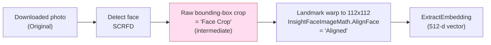
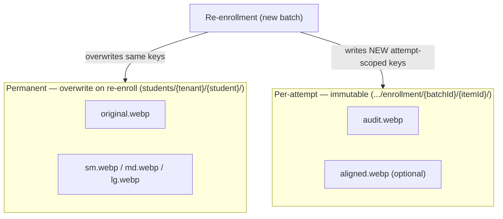
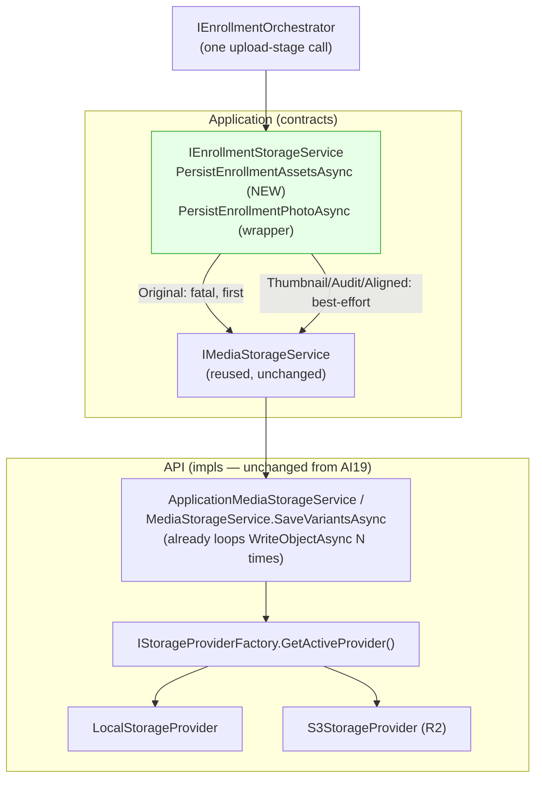

# AI20.PHASE2.0.10 — Storage Asset Architecture

**Type:** Contract/architecture design only. No production code was written or modified to produce this document. No `.cs`, `.csproj`, `.tsx`, `.ts`, DI registration, migration, or image-processing logic is implemented here. Every C# block below is a **proposed** contract that does not yet exist in the codebase — the design artifact of this milestone, not committed code.

**Question this milestone answers:** should the current single-asset `IEnrollmentStorageService.PersistEnrollmentPhotoAsync()` (AI20.PHASE2.0.1 §9) generalize into a multi-asset `PersistEnrollmentAssetsAsync()` — and if so, which asset kinds are genuinely worth persisting, how are their keys named, what is the failure model, and does any of this require a change to the already-implemented AI19 provider-aware storage stack?

---

## 0. Design principles carried in

This design is bound by the same conventions that produced `AI20_PHASE2_ENGINE_CONTRACTS.md` and the already-shipped AI19 media architecture:

1. **The engine stays storage-agnostic (AI18/AI19 rule).** Only `IEnrollmentStorageService` touches object storage; validation/embedding services only *produce* bytes.
2. **`IEnrollmentStorageService` is the enrollment analogue of `IRecognitionMediaService`** — build a deterministic key, delegate the byte write to `IMediaStorageService` → `IStorageProviderFactory` → `IStorageProvider`, and return the key. It never talks to a provider directly and introduces **no** new storage plumbing.
3. **Storage is *not* transactional (baseline §9, explicit).** Object storage cannot be made all-or-nothing; any multi-object write inherently carries partial-failure risk. The design's job is to decide *where that risk is best absorbed*, not to pretend it away.
4. **Existing student-photo key space is authoritative.** An AI-enrolled photo must be indistinguishable from a manually-uploaded one everywhere else in the app, so the canonical asset stays under `students/{tenantId}/{studentId}` exactly as `StudentMediaPaths.BuildStoragePath` already defines (`Abhyanvaya.Application/StudentMediaPaths.cs:7-8`).
5. **Reuse, never duplicate.** `IMediaStorageService.SaveVariantsAsync` (`Abhyanvaya.API/Media/MediaStorageService.cs:38-59`) **already** writes N objects in a loop (`sm`/`md`/`lg`) via `IStorageProvider.WriteObjectAsync`. "Persist N assets" is therefore a *solved, proven* pattern in this codebase, not a new capability.

---

## 1. The seven proposed asset kinds — and what actually gets produced today

The prompt proposes seven kinds. Before deciding what to persist, it matters *what the pipeline actually produces*, because persisting an asset that no stage ever generates is design fiction, and persisting an intermediate that is never independently consumed is storage waste.

| # | Proposed kind | Produced by which stage today (per AI20 docs)? | Downstream consumer other than the immediate next stage? |
|---|---|---|---|
| 1 | **Original** | The download stage — raw bytes from `IStudentPhotoProvider.FetchPhotoAsync`. **Persisted today.** | The whole app (`Student.PhotoKey`), every re-render, re-detection, dispute. |
| 2 | **Thumbnail** | The existing WebP variant pipeline (`BuildWebpVariantsAsync` → `sm`/`md`/`lg`) that `IEnrollmentStorageService` §9 already reuses. | UI (student lists, cards). |
| 3 | **Aligned** | Validation stage — the 112×112 ArcFace-aligned crop (`InsightFaceImageMath.AlignFace`, `AI20_ENROLLMENT_ENGINE.md:29,149`), surfaced as `EnrollmentValidationResult.AlignedFaceBytes`. | The embedding stage (in-memory today); potentially *re-embedding on model upgrade*. |
| 4 | **Normalized** | **Nothing.** No stage produces a brightness/contrast-normalized *image*. The only "normalization" in the pipeline is L2 **vector** normalization (`EmbeddingNormalizer`), which is not an image asset. | None — does not exist. |
| 5 | **Audit** | Not a distinct production step — it is the *same bytes as Original* captured with a different **lifecycle** (immutable, per-attempt, compliance-retained). | Dispute resolution / compliance export. |
| 6 | **Preview** | Would be produced by the *same* downscale path as Thumbnail. | UI — identical consumer to Thumbnail. |
| 7 | **Face Crop** | Validation stage, *intermediate* — the raw bounding-box crop (`BoundingBoxWidth/Height` region) that exists only as a step *before* `AlignFace` warps it to 112×112. | **None.** It is consumed only by the alignment step that immediately supersedes it. |

The `Aligned` vs `Face Crop` distinction is real and worth stating precisely, because it is the single most likely source of a two-names-one-asset mistake:



**"Face Crop" is the geometrically-uncorrected predecessor of "Aligned."** They are two sequential transforms of one pipeline stage, not two independent assets. Only the terminal `Aligned` artifact has any downstream value.

---

## 2. Asset-consolidation decision (the decisive call)

**From seven proposed kinds, persist four; merge two; drop one.**

| Proposed kind | Decision | Justification |
|---|---|---|
| **Original** | **KEEP** | The canonical student photo; already persisted today; `Student.PhotoKey` depends on it. Non-negotiable. |
| **Thumbnail** | **KEEP** (as the existing `sm`/`md`/`lg` WebP variant set, not a new bespoke asset) | This is not new work — it is the variant generation `IEnrollmentStorageService` §9 already reuses. Kept, but realized by the existing pipeline. |
| **Preview** | **DROP → merge into Thumbnail** | "Preview" and "Thumbnail" are the same concept — a downscaled, UI-optimized WebP — with two names. The existing media stack already produces a *multi-size* variant set (`sm`/`md`/`lg`); "preview" is just one of those sizes. Introducing a second parallel downscale asset would duplicate the variant pipeline for zero benefit. **Keep only Thumbnail (= the variant set); do not persist a separate `preview` object.** |
| **Face Crop** | **DROP → intermediate of Aligned** | The raw bounding-box crop is never consumed by anything except the alignment step that immediately replaces it (§1 diagram). Persisting an intermediate that is never independently useful is pure storage waste (extra PUT cost, extra bytes, zero readers). **Persist only the terminal `Aligned` artifact.** |
| **Normalized** | **DROP (reserve the enum value only)** | No stage produces a normalized *image* today; "normalization" in this pipeline is L2 *vector* normalization, not an image asset. Persisting it would mean persisting bytes that do not exist. Reserve `EnrollmentAssetKind.Normalized` for a hypothetical future validation stage, but persist nothing under it now. |
| **Aligned** | **KEEP (optional / config-gated)** | Genuinely distinct and genuinely useful: (a) enables **re-embedding on a future model upgrade** without re-downloading + re-detecting every student — a real need for a pipeline whose embeddings are permanent ground truth; (b) supports dispute/debug ("show the exact crop we embedded"). Marked *optional* so a cost-sensitive bulk run can disable it. |
| **Audit** | **KEEP** | Distinct from Original **by lifecycle, not by bytes**. Original is the *current* canonical photo — overwritten on re-enrollment and potentially subject to a future retention/cleanup policy. Audit is an *immutable, per-attempt, never-deleted* copy retained for compliance/dispute even after a later re-enrollment changes the canonical photo. Different lifecycle ⇒ different asset. |

**Net result: 4 persisted asset kinds — `Original`, `Thumbnail` (variant set), `Aligned` (optional), `Audit`.** Two names collapse (`Preview`→`Thumbnail`), one intermediate is dropped (`Face Crop`→ subsumed by `Aligned`), and one non-existent asset is reserved-but-unpersisted (`Normalized`).

---

## 3. Permanent vs per-attempt — the lifecycle split

This is the architecturally important distinction. The four kept assets fall into two lifecycle classes:

- **Permanent / overwrite-on-re-enrollment ("the current photo").** `Original` + `Thumbnail` variants represent *the student's photo right now*. A re-enrollment (new, better source photo) **should** overwrite them, exactly as a manual re-upload does today — that is what keeps AI-enrolled and manually-uploaded photos indistinguishable. They live under the existing `students/{tenantId}/{studentId}` prefix with fixed variant filenames, so a re-write hits the same keys.
- **Per-attempt / historical (immutable-of-record).** `Audit` + `Aligned` are evidence of *a specific enrollment attempt*. They must survive a later re-enrollment (so a dispute about the January embedding is still answerable after a March re-enroll). They are therefore keyed by `{batchId}/{itemId}`, so a new batch never clobbers an earlier attempt's evidence.



### 3.1 Key-naming scheme

Extending `StudentMediaPaths.BuildStoragePath` (`students/{tenantId}/{studentId}`) and the per-attempt `{batchId}/{itemId}` identifiers already carried on `EnrollmentItemContext`:

| Asset kind | Persisted? | Lifecycle | Key pattern |
|---|---|---|---|
| **Original** | Yes | Permanent (overwrite) | `students/{tenantId}/{studentId}/original.webp` |
| **Thumbnail** (variant set) | Yes | Permanent (overwrite) | `students/{tenantId}/{studentId}/{sm\|md\|lg}.webp` |
| **Aligned** | Optional (config-gated) | Per-attempt (immutable) | `students/{tenantId}/{studentId}/enrollment/{batchId}/{itemId}/aligned.webp` |
| **Audit** | Yes | Per-attempt (immutable) | `students/{tenantId}/{studentId}/enrollment/{batchId}/{itemId}/audit.webp` |
| **Preview** | No — merged into Thumbnail | — | — |
| **Face Crop** | No — intermediate of Aligned | — | — |
| **Normalized** | No — reserved, not produced | — | — |

Notes:
- The permanent keys sit **exactly** where a manual upload's variants already sit (`{basePath}/{variant}.webp`, per `MediaStorageService.SaveVariantsAsync:56`), so `StudentMediaPaths.BuildVariantPath` and the AI19 `MediaController` resolve them with **zero change** — the indistinguishability invariant (§0.4) holds for free.
- Per-attempt keys are nested under the **same student prefix** (`students/{tenantId}/{studentId}/enrollment/...`) rather than a separate top-level namespace, so tenant-scoped listing/cleanup/export of "everything for this student" remains a single-prefix operation.
- Per-attempt keys are scoped to `{itemId}`, **not** to retry count. A retry of the *same* item overwrites its own attempt keys (bounded storage), while a *later re-enrollment* (different `batchId`) writes a distinct path (preserved evidence). This gives "one immutable record per enrollment attempt" without unbounded growth from auto-retries.

---

## 4. Proposed multi-asset contract

The plural method becomes the canonical contract; the existing singular `PersistEnrollmentPhotoAsync` is retained as a thin convenience wrapper for the common "just refresh the canonical photo" path (most re-enrollments), delegating to the plural method. Because nothing is implemented yet, this is a clean design choice rather than a migration.

```csharp
namespace Abhyanvaya.Application.Common.Interfaces;

/// <summary>
/// Persists the validated enrollment assets to tenant storage and returns the deterministic keys.
/// The enrollment analogue of IRecognitionMediaService: the only seam between the pipeline and
/// storage; the engine stays unaware. Delegates every byte write to the existing
/// IMediaStorageService → IStorageProviderFactory → IStorageProvider stack (no new provider logic).
/// </summary>
public interface IEnrollmentStorageService
{
    /// <summary>
    /// Uploads one-to-many enrollment assets in a single call. The canonical Original asset is
    /// MANDATORY, uploaded first, and fatal-on-failure (identical rule to the singular contract).
    /// Derived assets (Aligned, Audit, and the display variants) are supplementary and best-effort:
    /// a derived-asset failure is reported per-asset in the result but does NOT throw, because only
    /// the Original underpins the DB invariant (Student.PhotoKey). See §5 for the failure model.
    /// </summary>
    Task<EnrollmentStorageResult> PersistEnrollmentAssetsAsync(
        EnrollmentStorageRequest request, CancellationToken cancellationToken = default);

    /// <summary>
    /// Convenience wrapper for "persist only the canonical photo (+ its display variants)".
    /// Builds a single-Original request and calls PersistEnrollmentAssetsAsync. Retained so the
    /// simple re-enrollment path stays simple; throws if the Original was not written.
    /// </summary>
    Task<EnrollmentStorageResult> PersistEnrollmentPhotoAsync(
        EnrollmentStorageRequest request, CancellationToken cancellationToken = default);
}

/// <summary>The persistable asset kinds. Normalized is reserved but not produced/persisted today (§2).</summary>
public enum EnrollmentAssetKind
{
    Original = 0,   // canonical raw photo — permanent, mandatory
    Thumbnail = 1,  // the sm/md/lg WebP display variant set — permanent
    Aligned = 2,    // 112x112 ArcFace-aligned crop — per-attempt, optional
    Audit = 3,      // immutable compliance copy — per-attempt
    Normalized = 4, // RESERVED — no producer today; never persisted (§2)
}

/// <summary>One asset to persist: its kind, bytes, and content type. Carries per-asset metadata a
/// bare byte[] map could not (content type, and — via Kind — its lifecycle/criticality tier).</summary>
public sealed record EnrollmentAssetInput
{
    public required EnrollmentAssetKind Kind { get; init; }
    /// <summary>The asset bytes. For Thumbnail, this is the source image the variant pipeline downscales.</summary>
    public required byte[] Bytes { get; init; }
    public string? ContentType { get; init; }
}

public sealed record EnrollmentStorageRequest
{
    public required int TenantId { get; init; }
    public required int StudentId { get; init; }
    /// <summary>Attempt scope for per-attempt (immutable) assets. Required when any per-attempt
    /// asset (Aligned/Audit) is present so those keys can be built.</summary>
    public Guid? BatchId { get; init; }
    public Guid? ItemId { get; init; }
    /// <summary>The assets to persist. MUST contain exactly one Original (validated by the impl).</summary>
    public required IReadOnlyList<EnrollmentAssetInput> Assets { get; init; }
    public required Guid ExecutionTraceId { get; init; }
}

/// <summary>Per-asset persistence outcome.</summary>
public sealed record EnrollmentStoredAsset
{
    public required EnrollmentAssetKind Kind { get; init; }
    /// <summary>Stored key, set only when Persisted is true.</summary>
    public string? StorageKey { get; init; }
    public string? Checksum { get; init; }
    public int ByteSize { get; init; }
    public required bool Persisted { get; init; }
    /// <summary>Non-sensitive reason when a supplementary asset failed to persist (never image data).</summary>
    public string? FailureReason { get; init; }
}

public sealed record EnrollmentStorageResult
{
    /// <summary>The canonical Original key — what IEnrollmentResultWriter records on Student.PhotoKey.
    /// Always present on a successful return (the Original is fatal-on-failure, so a returned result
    /// always has a real Original key). Never null/empty.</summary>
    public required string PhotoKey { get; init; }
    public required string Checksum { get; init; }
    public required int ByteSize { get; init; }
    /// <summary>Every attempted asset keyed by kind, including best-effort derived assets and their
    /// per-asset success/failure. Lets the writer/audit record which supplementary assets landed.</summary>
    public required IReadOnlyDictionary<EnrollmentAssetKind, EnrollmentStoredAsset> Assets { get; init; }
}
```

### 4.1 Why a typed asset *list*, not a raw `Dictionary<Kind, byte[]>` and not wide nullable arrays

The prompt asks to pick one shape and justify. The choice is **`IReadOnlyList<EnrollmentAssetInput>`**, evaluated against the two alternatives:

| Shape | Rejected because |
|---|---|
| Wide record of named nullable arrays (`byte[]? OriginalBytes; byte[]? AlignedBytes; …`) | Adding a future asset kind changes the DTO shape (not open/closed); on any given call most fields are `null`; and it cannot express per-asset content type without yet more parallel nullable fields. |
| Raw `IReadOnlyDictionary<EnrollmentAssetKind, byte[]>` | A bare `byte[]` cannot carry the asset's own content type, and the map gives the *illusion* of arbitrary flexibility while the real contract ("exactly one Original, mandatory") is invisible in the type. |
| **`IReadOnlyList<EnrollmentAssetInput>` (chosen)** | Each asset is a self-describing record (kind + bytes + content type); adding a kind is an enum value, not a DTO reshape (open/closed); the "exactly one Original" invariant is validated once at the top of the impl and surfaced as a thrown programmer-error if violated. The **result** is keyed as a dictionary (`kind → EnrollmentStoredAsset`) because *lookup by kind* is exactly what the caller wants on the way out. |

The `Original` invariant is enforced by validation rather than by a separate `required byte[] OriginalBytes` field, keeping the request uniform (one collection) while still making a missing Original a hard, fail-fast error.

---

## 5. Single call vs. multiple calls — and where partial-failure risk lives

Two API shapes were considered:

| Option | Shape | Failure ownership |
|---|---|---|
| **A — one call, N internal uploads (chosen)** | `PersistEnrollmentAssetsAsync(request)` uploads all assets internally | The storage service owns ordering + per-asset criticality. |
| B — many calls, caller-sequenced | `PersistEnrollmentAssetAsync(kind, bytes)` called N times by the orchestrator | The orchestrator owns ordering + partial-completion handling. |

**Recommendation: Option A — a single call with tiered, well-defined partial-failure semantics.**

Because object storage is explicitly non-transactional (§0.3), *no* API shape can make a 3–4 object upload atomic. The right design is not to hide that, but to define a **criticality tier** so partial failure has a *correct, documented* meaning:

```mermaid
sequenceDiagram
    participant ORCH as IEnrollmentOrchestrator
    participant STORE as IEnrollmentStorageService
    participant MEDIA as IMediaStorageService
    ORCH->>STORE: PersistEnrollmentAssetsAsync(Original + Thumbnail + Aligned? + Audit)
    STORE->>MEDIA: write Original  (MANDATORY, first)
    alt Original write fails
        MEDIA-->>STORE: throws
        STORE-->>ORCH: THROW (nothing recorded; == today's contract)
        Note over ORCH: classify transient StorageUploadFailed → retry
    else Original ok
        MEDIA-->>STORE: Original key
        STORE->>MEDIA: write Thumbnail variants (best-effort)
        STORE->>MEDIA: write Audit (best-effort)
        STORE->>MEDIA: write Aligned (best-effort, if enabled)
        Note over STORE: derived-asset failure → Persisted=false + FailureReason,<br/>logged/audited, does NOT throw
        STORE-->>ORCH: EnrollmentStorageResult (PhotoKey + per-asset map)
    end
```

**Failure model:**
1. **Original is uploaded first and is fatal.** If it fails, the method throws — byte-for-byte the existing §9 rule ("throws if nothing was written; never returns a null/empty key"). The orchestrator classifies it as transient `StorageUploadFailed` and retries. The DB write (`IEnrollmentResultWriter.WriteSuccessAsync`) still runs *after* this succeeds, so the "upload before DB records the key" ordering guarantee is preserved unchanged.
2. **Derived assets (Thumbnail variants, Audit, Aligned) are best-effort.** A failure on any of them is recorded per-asset (`Persisted = false` + `FailureReason`) and logged/audited, but does **not** throw, because none of them underpins a DB invariant — their loss degrades *auditability/UI*, not *correctness*.

### 5.1 Why this respects (rather than violates) the "all-or-nothing" philosophy

`IEnrollmentResultWriter` is transactional because it writes to a transactional store (the DB). Storage is *not* transactional, so mechanically copying that philosophy is impossible. What we preserve is its **intent**: *a `Completed` item never has a `Student.PhotoKey` pointing at nothing.* That intent depends solely on the **Original**, which is fatal-on-failure and verified *before* the DB write. So the invariant the transactional writer cares about is fully protected; the supplementary assets are deliberately outside it.

Option B is rejected precisely because it *scatters* this policy: the orchestrator would have to re-encode "Original goes first and is fatal; the rest are best-effort" itself, duplicating knowledge the storage service is the natural owner of and making it easy to get the tiering wrong (e.g. accidentally treating an Audit failure as fatal). The storage service is the only component that knows each asset's criticality tier, so it is the correct place to absorb the non-transactional risk. Concentrating N uploads behind one call also keeps the orchestrator's "upload stage" a single, clean step (matching how the recognition pipeline makes one `PersistFaceThumbnailAsync` call per face).

---

## 6. Storage-backend compatibility

### 6.1 Does multi-asset need a new provider capability? — No.

`IStorageProvider` (`Abhyanvaya.API/Media/IStorageProvider.cs:22`) exposes a **single-object** `WriteObjectAsync(relativeKey, content, options, ct)`. There is no batch/multi-put method, and none is needed:

- Multi-asset persistence = **calling the existing single-object write N times.** This is not hypothetical — `MediaStorageService.SaveVariantsAsync` (`MediaStorageService.cs:54-58`) **already** loops `WriteObjectAsync` over N variants (`sm`/`md`/`lg`) today. The exact "upload N objects" pattern this milestone needs is already shipped and in production.
- S3/R2 have **no atomic multi-object PUT** anyway — the S3 API only offers per-object `PutObject` (see `S3StorageProvider.WriteObjectAsync` using `PutObjectRequest`, `S3StorageProvider.cs:47-60`). A batch provider method would be a fiction with no atomicity to offer.

**Conclusion: this is purely an application-layer orchestration change. Zero changes to `IStorageProvider`, `IStorageProviderFactory`, `LocalStorageProvider`, or `S3StorageProvider`** — confirmed directly against the actual interface shape (single `WriteObjectAsync`) and the existing N-write loop in `SaveVariantsAsync`.

### 6.2 Per-backend assessment

| Backend | Implemented today? | Multi-asset impact (N objects vs 1) | Notes |
|---|---|---|---|
| **Local disk** (`LocalStorageProvider`) | **Yes — real** | Negligible. N `File.WriteAllBytesAsync` writes; directories auto-created (`LocalStorageProvider.cs:48-52`). No per-object count limit, no per-op cost — only disk space. | Directly assessable. No concern at any realistic bulk size. |
| **Cloudflare R2** (`S3StorageProvider`) | **Yes — real** | Real cost line. Each asset = one R2 **Class A** (write) operation, billed per request. Enrolling *thousands of students × 3–4 assets* multiplies Class A ops accordingly. No per-object-count cap; storage is cheap, *operations* are the cost. | Directly assessable. This is the primary reason `Aligned` is config-gated (§2) and `Face Crop`/`Preview`/`Normalized` are dropped (§2): fewer PUTs per student directly reduces bulk-enrollment cost. `DisablePayloadSigning`/checksum handling already correct for R2 (`S3StorageProvider.cs:53-54`). |
| **AWS S3** | **No — hypothetical** (would run through the same `S3StorageProvider`) | Same as R2: N `PutObject` calls, per-request cost + storage. | Forward-looking. Would work through the existing S3 provider with standard region/creds; no interface change. |
| **MinIO** | **No — hypothetical** | N `PutObject` calls; self-hosted ⇒ no per-op billing, but per-request overhead remains. | Forward-looking. S3-API compatible; runs through `S3StorageProvider` with `ForcePathStyle = true` (`S3StorageProvider.cs:206`) + a custom endpoint. No new provider needed. |
| **Azure Blob** | **No — hypothetical** | N `Upload`/`PutBlob` calls; Azure bills per storage transaction. | Forward-looking, and the one exception: Azure Blob uses a **different SDK and auth model** (not the S3 API), so it would require a **new `IStorageProvider` implementation regardless of this milestone** (per AI19's Open/Closed note — "one new provider + one factory branch"). Multi-asset itself still reduces to N single writes even there. |

For the three backends that don't exist today (S3, MinIO, Azure Blob), this analysis is explicitly **forward-looking/hypothetical** — only **Local disk** and **Cloudflare R2** are real, implemented, and directly assessable per the AI19 docs. In all five cases, the multi-asset requirement adds *no new provider capability* — it is N invocations of the single-object write that every provider already implements.

---

## 7. End-state architecture (multi-asset, on the unchanged AI19 stack)



Everything below `IEnrollmentStorageService` is **exactly the AI19 provider-aware stack, untouched**. The only new surface is the plural method + its DTOs in the Application layer, and the orchestration (upload-Original-first-then-best-effort) inside the *Infrastructure* implementation of `IEnrollmentStorageService`.

---

## 8. Summary of decisions

| Question | Decision |
|---|---|
| Generalize to `PersistEnrollmentAssetsAsync`? | **Yes** — plural is canonical; singular retained as a thin wrapper. |
| Which of the 7 assets? | **Keep 4:** Original, Thumbnail (variant set), Aligned (optional), Audit. **Merge:** Preview→Thumbnail. **Drop:** Face Crop (intermediate of Aligned), Normalized (not produced; enum reserved). |
| Face Crop vs Aligned | Sequential transforms of one stage; only terminal **Aligned** persisted. |
| Permanent vs per-attempt | **Permanent (overwrite):** Original + Thumbnail under `students/{tenant}/{student}/`. **Per-attempt (immutable):** Audit + Aligned under `.../enrollment/{batchId}/{itemId}/`. |
| Request DTO shape | Typed `IReadOnlyList<EnrollmentAssetInput>` (open/closed, self-describing) over raw dict or wide nullable arrays. |
| One call vs many | **One call**, N internal uploads, **tiered failure**: Original fatal-first, derived best-effort. |
| Provider change needed? | **No** — pure application-layer orchestration; `SaveVariantsAsync` already loops `WriteObjectAsync` N times. |
| Cost consideration | R2/S3 bill per PUT; more assets × thousands of students = real Class A cost — the reason Aligned is gated and 3 kinds are dropped. |

---

## Constraints Confirmed

- No production code was written or modified. Every C# block above is a **proposed contract**, not a committed file.
- No `.cs`, `.csproj`, `.tsx`, `.ts`, or any non-markdown file anywhere in the repository was created or edited.
- No business logic, HTTP endpoint, background worker, DI registration, database update, migration, or image processing was implemented.
- The design **reuses** the existing, already-implemented AI19 storage stack (`IMediaStorageService`, `IStorageProviderFactory`, `IStorageProvider`, `LocalStorageProvider`, `S3StorageProvider`) and the existing `StudentMediaPaths` key convention **without changing any of them**; it introduces no new storage provider or provider-interface capability.
- The only new surface described is the proposed plural `IEnrollmentStorageService.PersistEnrollmentAssetsAsync` contract + DTOs in the Application layer (design only).
- Sole deliverable produced: `docs/AI20_PHASE2_STORAGE_ASSETS.md`.
