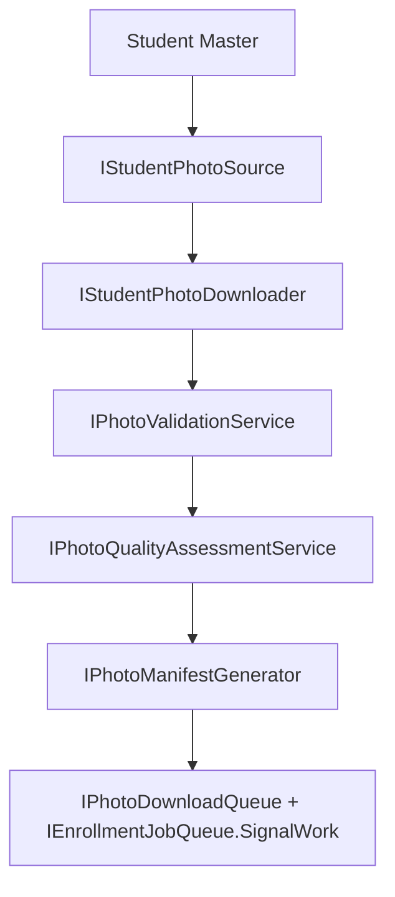

# AI21.PHASE1 — Enterprise Student Photo Acquisition Framework

## Architecture

AI21.PHASE1 introduces a pre-enrollment acquisition layer:

```
Application/PhotoAcquisition          → models + options
Application/Common/Interfaces         → IPhoto* contracts
Infrastructure/PhotoAcquisition       → implementations
Domain/Entities                       → StudentPhotoAcquisitionBatch/Item
Infrastructure/DependencyInjection    → AddPhotoAcquisitionPlatform()
```

Frozen AI20 layers (Recognition, Attendance, Governance, Operations) are unchanged.

## Workflow



## Validation

`IPhotoValidationService` verifies:

- Image exists (non-empty bytes)
- Supported format (JPEG/PNG/WebP)
- Corruption (ImageSharp load)
- Minimum resolution (configurable)
- Maximum byte size (configurable)
- Duplicate images (SHA-256 hash within batch)

## Quality Assessment

`IPhotoQualityAssessmentService` calculates (no AI recognition):

- Blur score (variance of Laplacian)
- Brightness
- Contrast
- Face visibility (placeholder 0.5)
- Rotation (EXIF orientation)
- Occlusion (placeholder 0)

## Outputs

| Output | Producer |
|---|---|
| Download manifest | `IPhotoManifestGenerator` |
| Quality report | Per-item JSON + `IPhotoAcquisitionReportService` |
| Failed downloads | Manifest failed section |
| Retry queue | Items with `RetryQueued` status + download queue |
| Enrollment queue | Items with `ReadyForEnrollment` + enrollment wake signal |

## Thread Safety

- Coordinator uses `SemaphoreSlim` for parallel downloads
- `PhotoDownloadQueue` uses lock-free counters + channels
- Repository persists immutable batch/item state

## Configuration

`PhotoAcquisition` section:

- `MaxConcurrentDownloads` (default 16)
- `MaxRetryAttempts` (default 3)
- `MinimumWidth` / `MinimumHeight`
- `MaximumByteSize`
- `DownloadTimeoutSeconds`

## Production Checklist

- [ ] Configure `StudentPhotoProvider:DefaultProvider`
- [ ] Configure `PhotoAcquisition` limits for tenant scale
- [ ] Run acquisition batch via `IPhotoDownloadCoordinator`
- [ ] Review manifest and quality report
- [ ] Confirm enrollment queue depth > 0
- [ ] Trigger enrollment batch creation (existing AI20 flow)

## Modified Files

| File | Change |
|---|---|
| `Abhyanvaya.Domain/Enums/PhotoAcquisitionStatus.cs` | Added |
| `Abhyanvaya.Domain/Entities/PhotoAcquisitionEntities.cs` | Added |
| `Abhyanvaya.Application/PhotoAcquisition/PhotoAcquisitionModels.cs` | Added |
| `Abhyanvaya.Application/Common/Interfaces/IPhotoAcquisitionServices.cs` | Added |
| `Abhyanvaya.Application/Common/Interfaces/IApplicationDbContext.cs` | Added acquisition DbSets |
| `Abhyanvaya.Infrastructure/PhotoAcquisition/*` | Added framework |
| `Abhyanvaya.Infrastructure/Persistence/Configurations/PhotoAcquisitionConfiguration.cs` | Added |
| `Abhyanvaya.Infrastructure/Persistence/ApplicationDbContext.cs` | Added DbSets |
| `Abhyanvaya.Infrastructure/DependencyInjection.cs` | `AddPhotoAcquisitionPlatform()` |
| `Abhyanvaya.Application.UnitTests/PhotoAcquisition/PhotoAcquisitionFrameworkTests.cs` | Added |
| `Abhyanvaya.Infrastructure/Migrations/20260718044855_AddPhotoAcquisitionTables.cs` | Added |
| `Abhyanvaya.Infrastructure/Persistence/ApplicationDbContextModelSnapshot.cs` | Updated |

## Verification

- Build: 0 errors
- Tests: validation, quality, retry, 1000+ concurrent downloads, corrupt files, timeouts
- Recognition, Attendance, Operations unchanged
- Queue ready for enrollment via `IEnrollmentJobQueue`
