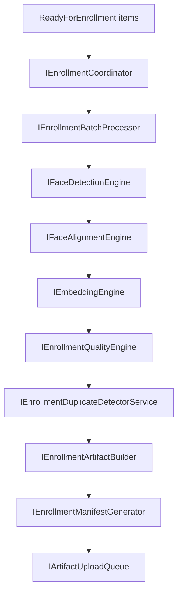

# AI21.PHASE2 — Enterprise Face Enrollment Pipeline

## Architecture

AI21.PHASE2 converts validated photos from AI21.PHASE1 into enrolled AI identities using existing AI20 recognition/enrollment engines.

```
Application/FaceEnrollment           → models, policy, EnrollmentState
Application/Common/Interfaces        → pipeline contracts
Infrastructure/FaceEnrollment        → coordinator, processor, adapters
Domain/Entities                      → FaceEnrollmentBatch, FaceEnrollmentJob
Infrastructure/DependencyInjection   → AddFaceEnrollmentPipeline()
```

Frozen layers: Recognition, Attendance, Governance, Operations, Workers, AI20 enrollment orchestrator internals.

## Pipeline



## Enrollment Lifecycle (`EnrollmentState`)

Queued → DownloadingCompleted → Processing → DetectingFace → AligningFace → GeneratingEmbedding → QualityValidation → DuplicateChecking → ArtifactBuilding → Completed

Failure paths: Failed, Retry, Cancelled

## Artifacts

Immutable `EnrollmentArtifact` contains references only (no storage):

- PhotoReference, AlignedPhotoReference, EmbeddingReference
- EmbeddingDimension, EmbeddingVersion, QualityScore
- ManifestId, EnrollmentVersion, Checksum

## Failure Handling

`IEnrollmentFailureHandler` covers:

- No face / multiple faces
- Low quality / embedding failure
- Duplicate enrollment
- Cancellation / timeout / worker failure (retryable vs terminal)

## Configuration

`FaceEnrollmentPolicy` section:

- MinimumWidth/Height, MinimumQualityScore
- MinimumDetectionConfidence
- MaxRetryAttempts, MaxParallelism
- RecognitionConfigurationVersion, EnrollmentPolicyVersion

## Reuse Matrix

| AI Step | Reused Interface | Implementation |
|---|---|---|
| Face detection | `IFaceDetectionEngine` | `EnrollmentFaceAnalysisBridge` → `IEnrollmentFaceAnalysisService` |
| Face alignment | `IFaceAlignmentEngine` | Same bridge (single analyze call) |
| Embedding | `IEmbeddingEngine` | `InsightFaceEmbeddingEngine` (AI20) |
| Duplicate metadata | `IEnrollmentDuplicateDetector` | AI20 persistence detector |
| Telemetry/Tracing | `IAITelemetryService`, `IAITracingService` | AI20.PHASE2.6 |

## Modified Files

| File | Change |
|---|---|
| `Abhyanvaya.Domain/Enums/EnrollmentState.cs` | Added |
| `Abhyanvaya.Domain/Entities/FaceEnrollmentEntities.cs` | Added |
| `Abhyanvaya.Domain/Events/FaceEnrollmentEvents.cs` | Added |
| `Abhyanvaya.Application/FaceEnrollment/FaceEnrollmentModels.cs` | Added |
| `Abhyanvaya.Application/Common/Interfaces/IFaceEnrollmentPipelineServices.cs` | Added |
| `Abhyanvaya.Infrastructure/FaceEnrollment/*` | Added pipeline |
| `Abhyanvaya.Infrastructure/Persistence/Configurations/FaceEnrollmentConfiguration.cs` | Added |
| `Abhyanvaya.Infrastructure/Persistence/ApplicationDbContext.cs` | Added DbSets |
| `Abhyanvaya.Application/Common/Interfaces/IApplicationDbContext.cs` | Added DbSets |
| `Abhyanvaya.Infrastructure/DependencyInjection.cs` | `AddFaceEnrollmentPipeline()` |
| `Abhyanvaya.Application.UnitTests/FaceEnrollment/FaceEnrollmentPipelineTests.cs` | Added |
| `docs/AI21_PHASE2_ENROLLMENT_PIPELINE.md` | Added |
| `docs/AI21_PHASE2_REUSE_ANALYSIS.md` | Added |

## Verification Checklist

Before marking enrollment complete for an item:

- [x] Exactly one face (policy)
- [x] Embedding exists and dimension valid
- [x] Embedding normalized (policy)
- [x] Quality score valid
- [x] Duplicate check passed
- [x] Artifact generated
- [x] Manifest generated
- [x] Enrollment events published
- [x] Artifact queued for storage (PHASE3)

## Production Usage

```csharp
var result = await coordinator.RunAcquisitionBatchAsync(new EnrollmentBatchRequest
{
    AcquisitionBatchId = acquisitionBatchId,
    TenantId = tenantId,
});
```

Apply migration: `dotnet ef database update --project Abhyanvaya.Infrastructure --startup-project Abhyanvaya.API`
