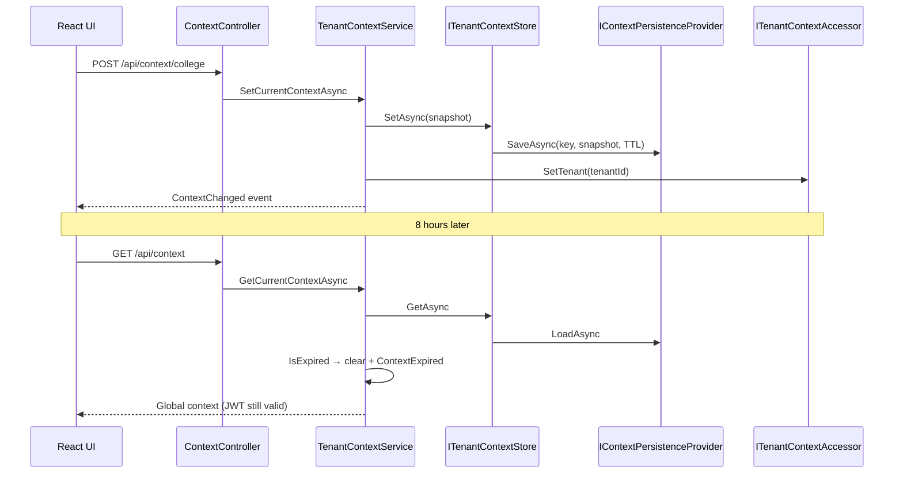

# AI22.6 Context Flow Diagram

```mermaid
sequenceDiagram
    participant UI as React UI
    participant API as ContextController
    participant Svc as TenantContextService
    participant Store as ITenantContextStore
    participant Persist as IContextPersistenceProvider
    participant Acc as ITenantContextAccessor

    UI->>API: POST /api/context/college
    API->>Svc: SetCurrentContextAsync
    Svc->>Store: SetAsync(snapshot)
    Store->>Persist: SaveAsync(key, snapshot, TTL)
    Svc->>Acc: SetTenant(tenantId)
    Svc-->>UI: ContextChanged event

    Note over UI,Acc: 8 hours later

    UI->>API: GET /api/context
    API->>Svc: GetCurrentContextAsync
    Svc->>Store: GetAsync
    Store->>Persist: LoadAsync
    Svc->>Svc: IsExpired → clear + ContextExpired
    Svc-->>UI: Global context (JWT still valid)
```
