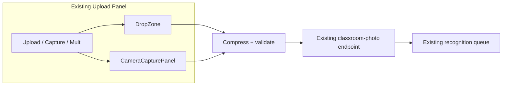

# AI22.7A Phase 1 — Enterprise Camera Capture

| Field | Value |
|-------|-------|
| **Document ID** | AI22.7A-Phase1-Enterprise-Camera-Capture |
| **Status** | Implemented |
| **Date** | July 2026 |
| **Scope** | Extend existing classroom photo upload panel — do not replace attendance workflow |

---

## 1. Architecture Impact

| Layer | Change |
|-------|--------|
| **Domain** | `ClassroomPhotoAcquisitionMethod` enum; `ClassroomImageMetadata` extended with acquisition method, geo, blur score |
| **Application** | `ClassroomPhotoCaptureContextDto`; optional capture context on upload services |
| **API** | Same endpoint `POST /attendance-sessions/{id}/classroom-photo`; optional form fields |
| **Infrastructure** | EF OwnsOne mapping + migration `AI227A_ClassroomPhotoCaptureMetadata` |
| **Frontend** | Acquisition method tabs + MediaDevices camera capture; still uploads a single `File` |
| **AI / SignalR** | **No changes** — recognition queue path unchanged |
| **Pages** | **No new attendance page** — `AiAttendancePanel` / `ClassroomPhotoUpload` enhanced in place |

---

## 2. Backend Changes

- Optional `captureContext` parameter on `IClassroomPhotoService` / `IAttendancePhotoService` (default `null` → backward compatible).
- Controller reads optional form fields: `acquisitionMethod`, `captureDevice`, `captureTimestampUtc`, `orientation`, `latitude`, `longitude`, `blurScore`.
- Required field remains `file`.

## 3. Frontend Changes

| Artifact | Purpose |
|----------|---------|
| `PhotoAcquisitionMethodTabs` | Upload / Capture / Capture Multiple |
| `CameraCapturePanel` | Live preview, device selector, permission, capture, retake, multi gallery |
| `useCameraDevices` / `useCameraStream` | MediaDevices integration |
| `useBlurDetection` | Soft blur warning hook |
| `classroomImageProcessing` | Compression, orientation via `createImageBitmap`, blur score |
| `geolocationCapture` | Best-effort location metadata |

Multi-capture: user captures several frames, **selects one**, then uploads through the **same single-file API** (recognition still expects one classroom image per session).

## 4. Database

Migration adds nullable columns on `AttendanceSession`:

- `ImageAcquisitionMethod`
- `ImageCaptureLatitude`
- `ImageCaptureLongitude`
- `ImageBlurScore`

Existing columns `CaptureTimestamp`, `CaptureDevice`, `ImageOrientation` reused.

## 5. Security

- Upload still requires `CanManageAttendance`.
- Camera permission is browser-granted; denial falls back to Upload Image.
- Geolocation is optional and never blocks upload.
- No change to tenant isolation or JWT.

## 6. Performance

- Client-side JPEG compression (quality 0.85, max edge 2560px) reduces upload size.
- Camera stream stopped on unmount.
- Blur detection is O(pixels) on downscaled canvas — soft warning only.

## 7. Tests

- Unit: `ClassroomPhotoCaptureContextTests`
- Vitest: `classroomImageProcessing.test.ts` (blur score)

## 8. Migration Impact

Apply: `dotnet ef database update` (or deploy pipeline migration step). Additive nullable columns — safe for existing sessions.

## 9. Compatibility

| Client | Behavior |
|--------|----------|
| Legacy UI (file only) | Works — no capture fields required |
| New UI upload tab | Sends `acquisitionMethod=Upload` + optional meta |
| New UI camera | Sends `CameraCapture` / `CameraMultiCapture` |

## 10. Future Enhancements

- Persist multi-frame set server-side (would need API + recognition design)
- Server-side blur gate (currently soft client warning)
- EXIF GPS embedding in JPEG bytes
