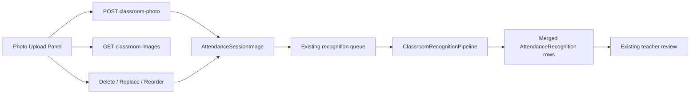

# AI22.7A Phase 2 — Multiple Classroom Images

| Field | Value |
|-------|-------|
| **Document ID** | AI22.7A-Phase2-Multiple-Classroom-Images |
| **Status** | Implemented |
| **Date** | July 2026 |
| **Scope** | Enhance existing Photo Upload section into an image collection — do not redesign attendance |

---

## 1. Goal

Support **1–10** classroom images per attendance session with upload, multi-capture, drag & drop, reorder, delete, replace, retry, thumbnails, metadata, status, and progress.

Recognition processes **all** images and merges faces into **one** attendance session / review set. Teacher workflow (review → finalize) is unchanged. Duplicate face detection remains inside the AI matcher.

---

## 2. Architecture Impact

| Layer | Change |
|-------|--------|
| **Domain** | `AttendanceSessionImage` entity + `AttendanceSessionImageStatus`; `ClearClassroomImage()` on session |
| **Application** | Multi-image APIs on `IClassroomPhotoService` / `AttendancePhotoService`; DTOs + max limit 10 |
| **API** | Existing `POST .../classroom-photo` adds to collection; new list/delete/replace/reorder/requeue endpoints |
| **Infrastructure** | EF config + migration `AI227A_AttendanceSessionImage`; pipeline loops all images |
| **Frontend** | Collection panel replaces single-image card; multi upload/capture; DnD reorder |
| **Operational Context** | **Unchanged** |
| **Pages** | **No new attendance page** |

---

## 3. Backend

### Entity: `AttendanceSessionImage`

Per-image storage key, sequence (1-based), dimensions, capture metadata, status, processing error.

Session `ImageMetadata` remains the **denormalized primary** (sequence 1) for backward compatibility.

### APIs

| Method | Route | Purpose |
|--------|-------|---------|
| POST | `/api/attendance-sessions/{id}/classroom-photo` | Add image (legacy response shape preserved) |
| GET | `/api/attendance-sessions/{id}/classroom-images` | List collection |
| DELETE | `/api/attendance-sessions/{id}/classroom-images/{imageId}` | Delete + renumber + requeue if remaining |
| PUT | `/api/attendance-sessions/{id}/classroom-images/{imageId}` | Replace + requeue |
| PUT | `/api/attendance-sessions/{id}/classroom-images/reorder` | Reorder sequences + requeue |
| POST | `/api/attendance-sessions/{id}/classroom-images/requeue` | Retry recognition for all images |

### Recognition orchestration

`ClassroomRecognitionPipeline`:

1. Load all `AttendanceSessionImage` rows (legacy backfill from session metadata if needed).
2. Clear existing recognitions once.
3. For each image: detect → match → persist face thumbnails with `imageSequence`.
4. Insert merged recognitions; set session face counts; move to AwaitingReview.
5. On failure, mark in-flight images Failed.

Face thumbnail keys: sequence 1 keeps legacy path; sequence ≥2 uses `images/{seq}/faces/...`.

---

## 4. Frontend

| Artifact | Purpose |
|----------|---------|
| `ClassroomPhotoCollectionPanel` | Thumbnails, status chips, metadata, DnD reorder, delete/replace/retry |
| `ClassroomPhotoUpload` | Tabs + collection; multi-file upload; multi-capture add-all |
| `ClassroomPhotoDropZone` | Optional `multiple` + remaining slots |
| `CameraCapturePanel` | `onConfirmMultiAll` adds all frames |
| `useClassroomPhotoUpload` | Collection state + list/delete/replace/reorder/requeue |

Recognition / review / finalize panels are unchanged.

---

## 5. Database

Migration: `20260723171856_AI227A_AttendanceSessionImage`

Creates `AttendanceSessionImage` with unique `(AttendanceSessionId, ImageSequence)` and tenant/session index. Cascade delete with session.

Apply: `dotnet ef database update` (or deploy pipeline).

---

## 6. Tests

- `ClassroomPhotoCollectionTests` — limits, status codes, DTO contracts
- Existing capture-context tests remain valid

---

## 7. Compatibility

| Client | Behavior |
|--------|----------|
| Legacy single-file upload | Works — creates/adds first (or next) session image |
| Phase 1 camera single capture | Works |
| Phase 2 multi collection | Uses list/mutate APIs; recognition still one session |

---

## 8. Non-goals

- No attendance page redesign
- No Operational Context changes
- No change to teacher review/finalize UX
- Duplicate faces still resolved by AI pipeline (not a separate UI feature)
