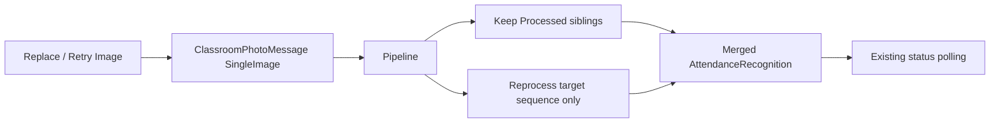

# AI22.7A Phase 3 — Image Management

| Field | Value |
|-------|-------|
| **Document ID** | AI22.7A-Phase3-Image-Management |
| **Status** | Implemented |
| **Date** | July 2026 |
| **Scope** | Enterprise image management on existing collection — do not redesign Recognition Review |

---

## Goal

Teachers can replace a failed classroom image **without recreating the attendance session**. Recognition restarts for the **replaced image only**; successfully Processed sibling images are not re-run.

---

## Architecture

| Layer | Change |
|-------|--------|
| Domain | `ClassroomRecognitionScope` (FullSession / SingleImage / PendingOnly) |
| Queue message | Optional `Scope` + `TargetImageId` on `ClassroomPhotoMessage` (defaults preserve Phase 1/2) |
| Pipeline | Selective process; delete recognitions only for affected `ImageSequence`s; merge retained rows |
| API | Extended image DTO; `POST .../classroom-images/{imageId}/requeue` |
| Status polling | Optional `CurrentImageSequence`, `ProcessedImageCount`, `TotalImageCount` |
| Frontend | Image Details dialog; per-image Retry; Replace still available |
| Recognition Review | **Unchanged** |
| SignalR | Attendance continues to use existing HTTP polling (no new hub) |

---

## Queue scopes

| Action | Scope |
|--------|-------|
| Replace image | `SingleImage` + `TargetImageId` |
| Per-image retry | `SingleImage` + `TargetImageId` |
| Add new image | `PendingOnly` |
| Session requeue | `PendingOnly` |
| Delete / Reorder | `FullSession` (sequences renumbered) |

---

## Image Details (DTO)

Exposed: Capture Timestamp, Device, GPS, Orientation, File Size, Resolution, Recognition/Batch Status, Detected Face Count (plus existing fields).

---

## Backward compatibility

- Existing `ClassroomPhotoMessage` positional constructors still work (`Scope` defaults to `FullSession`).
- Legacy single-image upload path unchanged.
- Teacher review / finalize UX unchanged.

---

## Testing

- `ClassroomRecognitionScopeTests`
- Manual: replace failed image → only that image moves Processing → Processed; other Processed images stay Processed with prior faces
