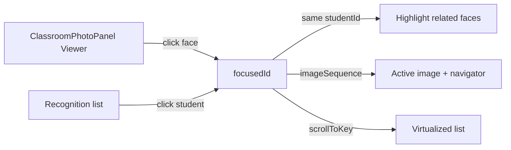

# AI22.7A Phase 4 — Enterprise Recognition Review Workspace

| Field | Value |
|-------|-------|
| **Document ID** | AI22.7A-Phase4-Enterprise-Recognition-Workspace |
| **Status** | Implemented |
| **Date** | July 2026 |
| **Scope** | Enhance Recognition Review canvas — do **not** redesign workflow, AI, SignalR, or finalize |

---

## Goal

Transform the existing Teacher Recognition Review into an enterprise review workspace across five incremental prompts (4.1–4.5), preserving Clean Architecture and the current review → finalize flow.

---

## Architecture Review

| Layer | Change |
|-------|--------|
| Backend DTO | Expose `ImageSequence` on `AttendanceRecognitionReviewDto` (read-only; enables multi-image face sync) |
| Review service | Map `ImageSequence` in `MapToReviewDtoAsync` |
| Pipeline / AI / SignalR | **Unchanged** |
| Frontend viewer | `useEnterpriseImageViewer` — GPU `translate3d` + `scale`; overlays share transform |
| Sync | Face click ↔ student highlight; student click highlights all occurrences; mini image navigator |
| Confidence | UI-only `enterpriseConfidence` badges, filters, bbox colors, legend |
| Productivity | Sticky toolbar, shortcuts, bulk ops, search, resizable split |
| Polish | Undo/redo (Reset-based), activity panel, session timer, progress, hover preview, theme-aware |



---

## Prompt map

### 4.1 Enterprise Image Viewer
- Zoom in/out, wheel, pinch, pan (Space+drag / middle-drag), reset
- Fit width / height / screen, 100% / 200% / 400%
- Keyboard: `+` `-` `0` arrows
- GPU transforms; boxes scale with image layer

### 4.2 Face ↔ Student Synchronization
- Click face → focus list row, scroll, animate
- Click student → highlight all faces for that student across images
- Mini navigator: Image N ●/○
- Single active selection

### 4.3 Confidence Visualization
- Enterprise badge: percent + stars + label
- Filters: Excellent / High / Medium / Low / Unknown
- BBox colors: green / yellow / orange / gray
- Compact legend + “Hide high confidence”

### 4.4 Teacher Productivity
- Shortcuts: A / R / Del / N / P / M (+ legacy I)
- Bulk approve / reject / manual match / unknown
- Search: name, roll, student number
- Status filters + sticky toolbar + resizable panels

### 4.5 Enterprise Review Experience
- Animated highlight, smooth scroll, hover face preview
- Undo / Redo, review history + AI Activity panel
- Session timer, progress, remaining, average review time
- Respects MUI light/dark theme; responsive grid

---

## Performance Review

| Technique | Implementation |
|-----------|----------------|
| GPU transforms | `translate3d` + `scale` + `willChange` |
| Overlay stability | Boxes inside same transformed layer (no separate re-layout) |
| Canvas virtualization | Only active `imageSequence` faces rendered on canvas |
| List virtualization | Existing `VirtualizedRecognitionList` + `scrollToKey` |
| Image caching | Preload `Image()` for session classroom URLs on load |

---

## Regression Review

- Finalize attendance flow unchanged
- Batch approve / reject / unknown unchanged
- Assign student / reject reason dialogs unchanged
- No pipeline algorithm changes
- No SignalR redesign
- Operational Context / camera capture / gallery management untouched

---

## Accessibility

- Viewer keyboard: `+` `-` `0` Space-pan arrows
- Review keyboard: A R N P M Delete
- Face overlays are keyboard-activatable (`role="button"`)
- Sticky toolbar + filter chips labeled
- Respects `prefers-reduced-motion` on list/card animations

---

## Testing

```bash
cd abhyanvaya-ui
npm test -- src/utils/enterpriseRecognitionWorkspace.test.ts
npx tsc -b
```

---

## Files (created / modified)

See deliverable folder copy under Desktop `AI22.7A Phase 4\Prompt 1 to 5`.
