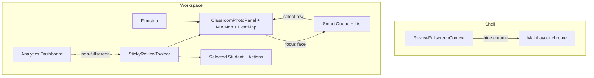
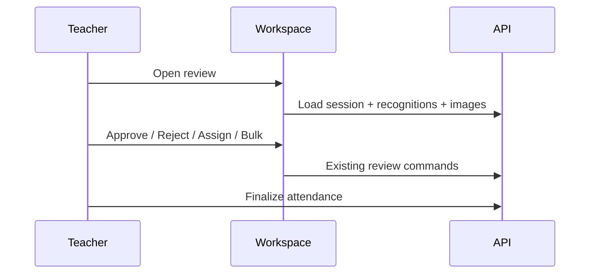

# AI22.7A Phase 5 — Review Workspace Productivity

| Field | Value |
|-------|-------|
| **Document ID** | AI22.7A-Phase5-Review-Workspace-Productivity |
| **Status** | Implemented |
| **Date** | August 2026 |
| **Scope** | Enterprise full-screen review workspace productivity — **no** workflow, AI, SignalR, API, or database redesign |

---

## Goal

Convert Teacher Recognition Review into an enterprise full-screen productivity workspace across ten incremental prompts (5.1–5.10), preserving Phase 4 viewer/sync/confidence foundations and the existing review → finalize flow.

---

## Architecture

| Layer | Change |
|-------|--------|
| Backend / AI / SignalR / DB | **Unchanged** |
| Reorder API | Reused existing `PUT .../classroom-images/reorder` for filmstrip drag |
| Layout chrome | `ReviewFullscreenProvider` + `MainLayout` hide AppBar / Drawer / Footer |
| Preferences | `localStorage` via `reviewWorkspacePrefs` (fullscreen, heat map, mini map, smart queue, last image) |
| Viewer | Reuses `useEnterpriseImageViewer` GPU transforms; mini map calls `setOffset` |
| Heat map | Face rectangle CSS fills only (no canvas redraw) |
| Analytics / productivity | Client-side from existing recognition DTOs + session timer |

---

## Prompt map

### 5.1 Full Screen Review Workspace
- Toggle full screen (toolbar / `F`)
- Hide navigation, sidebar, header, footer
- Retain toolbar, image, list, selected student, review actions
- `Esc` exits; preference stored in `localStorage`
- F11-compatible (workspace mode does not fight browser fullscreen)

### 5.2 Mini Map Navigation
- Bottom-right overview image
- Viewport rectangle tracks zoom/pan
- Drag rectangle updates shared viewer offset
- Mouse / touch / trackpad via pointer events

### 5.3 Filmstrip Image Navigator
- Horizontal Lightroom-style thumbnails
- Status badges (Processing / Ready / Needs Review / Errors)
- Click selects image; drag reorder reuses existing reorder API
- Remembers last selected image per session

### 5.4 Smart Review Queue
- Categories: Needs Review, Unknown, Duplicate, Low Confidence, Rejected, Approved
- Only Pending filter + auto-collapse approved
- Remaining count + estimated minutes
- Bulk approve/reject unchanged (toolbar)

### 5.5 Confidence Heat Map
- Green / Yellow / Orange / Red fills on existing face rectangles
- Opacity slider + legend + toggle
- Preference in `localStorage`
- GPU/CSS only — no canvas redraw

### 5.6 Review Analytics Dashboard
- Cards: images, faces, students, approved/rejected/unknown/duplicates, avg/lowest confidence, times, ETA
- Charts: confidence distribution, status distribution, progress
- Built from existing review DTOs / statistics

### 5.7 Keyboard Productivity Mode
| Shortcut | Action |
|----------|--------|
| Space / Shift+Space | Next / previous face |
| Enter | Approve |
| Delete | Reject |
| Tab / Shift+Tab | Next / previous image |
| Ctrl+Z / Ctrl+Y | Undo / Redo |
| F / H / M | Fullscreen / Heat map / Mini map |
| Ctrl+M | Manual match |
| ? | Shortcut help |
| Esc | Close help / exit fullscreen |

Pan: Alt+drag or middle-drag (Space reserved for next face).

### 5.8 Session Productivity Metrics
- Elapsed time, students/faces reviewed, reviews/min, avg decision time
- Manual corrections, approval %, ETA, session score
- Toolbar strip; no PII; optional pref persistence for UI only

### 5.9 Enterprise Workspace Polish
- Transitions / reduced-motion respect
- Collapse non-essential panels in fullscreen
- Large-monitor / tablet grid densification
- Virtualized list retained; filmstrip lazy-friendly thumbnails
- ARIA labels on toolbar, filmstrip, mini map, switches
- Theme-aware (dark-mode ready via MUI palette)

### 5.10 ADL Documentation
- This document + implementation summary / testing / files lists

---

## Review flow (unchanged)

---

## Performance

| Technique | Implementation |
|-----------|----------------|
| Shared GPU transform | Viewer + overlays + heat fills |
| Mini map | Lightweight overview; updates offset only |
| Virtual list | Existing `VirtualizedRecognitionList` |
| Prefs | localStorage reads once + patch writes |
| Analytics | Memoized client aggregates |

---

## Accessibility

- Toolbar / filmstrip / mini map ARIA labels
- Keyboard productivity mode + help dialog
- Focusable face rectangles
- `prefers-reduced-motion` respected on transitions
- Screen-reader friendly chips and progress bars

---

## Future extension points

- Server-side review analytics (optional)
- Collaborative multi-teacher queue
- Persist productivity metrics to tenant telemetry
- Heat map modes (by status / by student conflict)

---

## Known constraints

- No backend redesign for Phase 5
- No AI / SignalR / database changes
- Teacher finalize workflow unchanged
- Material UI only
- Heat map is CSS fill overlay, not a separate canvas layer
- Space no longer pans the image (Alt/middle-drag instead)

---

## Key files

| Area | Path |
|------|------|
| Prefs | `abhyanvaya-ui/src/utils/reviewWorkspacePrefs.ts` |
| Smart queue | `abhyanvaya-ui/src/utils/smartReviewQueue.ts` |
| Heat map | `abhyanvaya-ui/src/utils/confidenceHeatMap.ts` |
| Analytics | `abhyanvaya-ui/src/utils/reviewAnalytics.ts` |
| Fullscreen context | `abhyanvaya-ui/src/context/ReviewFullscreenContext.tsx` |
| Layout | `abhyanvaya-ui/src/layouts/MainLayout.tsx` |
| Page | `abhyanvaya-ui/src/pages/AttendanceRecognitionReviewPage.tsx` |
| Panel / viewer | `abhyanvaya-ui/src/components/attendance-recognition/*` |
| Tests | `abhyanvaya-ui/src/utils/reviewWorkspaceProductivity.test.ts` |
