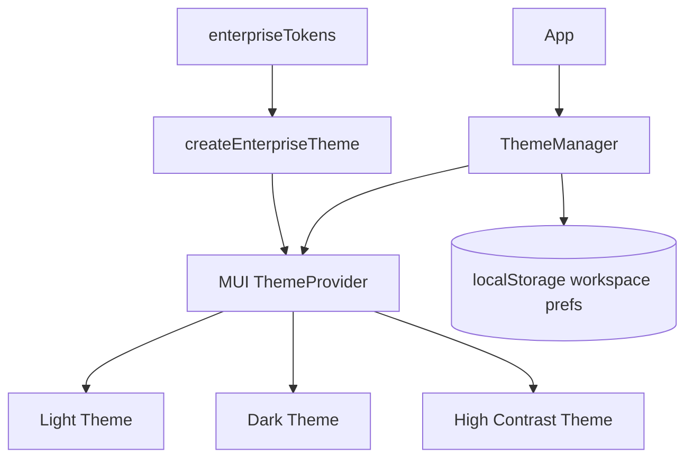

# AI22.7B — Enterprise Visual Experience

| Field | Value |
|-------|-------|
| **Document ID** | AI22.7B-Enterprise-Visual-Experience |
| **Status** | Implemented |
| **Date** | August 2026 |
| **Scope** | Theme, dark mode, accessibility, tablet/responsive, motion, personalization — **no** page redesign, API, AI, or workflow changes |

---

## Theme Architecture

`ThemeManager` wraps the React app (`App.tsx`) and provides MUI `ThemeProvider` with enterprise tokens.

### Tokens
- Spacing, typography, elevation, radius, shadows, motion
- Semantic: success / warning / error / info
- Domain: recognition confidence, image status, gallery, toolbar, overlay readability
- Future custom themes: extend `createEnterpriseTheme` / `ResolvedColorScheme`

---

## Dark Mode (5.2)

| Mode | Behavior |
|------|----------|
| Light | Default enterprise light palette |
| Dark | MUI dark surfaces; charts use palette keys |
| System | `prefers-color-scheme` |
| High Contrast | Near-black surfaces + color-blind friendly confidence accents |

- Preference persisted in `abhyanvaya.enterpriseWorkspace.v1`
- Classroom / recognition **images** tagged `data-enterprise-media="true"` — never inverted
- Overlay labels keep dark translucent backgrounds for readability on photos

---

## Accessibility (5.3)

- Skip link → `#main-content`
- Focus-visible rings via CssBaseline
- Reduced motion global override
- Touch/icon button naming guidance
- In-app **Accessibility Checker** + Report dialog (WCAG 2.2 AA heuristics)
- Color-blind friendly confidence palette in High Contrast
- Large fonts via density / Large monitor profile

---

## Tablet (5.4)

- Touch density profile (44px targets)
- Pinch zoom retained in enterprise viewer
- Swipe left/right changes classroom image
- Filmstrip horizontal pan (`touchAction: pan-x`)
- Stylus/pen treated as touch for swipe origin
- Landscape/portrait adaptive grid from `md` breakpoint

---

## Responsive (5.5)

- Targets: 1366×768, 1920×1080, 4K/ultrawide (main max-width 1920), tablet, laptop, mobile stack
- Resizable review panels from `md+`
- Panel sizes persisted in workspace prefs
- Fullscreen review densifies viewport height

---

## Motion (5.6)

- Material Motion durations/easings in theme
- Shared keyframes: `enterprise-highlight-pulse`, `enterprise-fade-in`
- `useEnterpriseMotion` honors `prefers-reduced-motion` + user override
- Skeleton wave animation via MuiSkeleton defaults

---

## Design Tokens / Visual Consistency (5.7)

- Central tokens in `enterpriseTokens.ts`
- Component audit: `visualConsistencyAudit.ts` (`VISUAL_COMPONENT_AUDIT`)
- MuiButton / Paper / Dialog / Chip / IconButton standardized via theme `components`

---

## Workspace Profiles (5.8)

| Profile | Intent |
|---------|--------|
| Compact | Denser controls, shorter filmstrip |
| Standard | Default |
| Large Monitor | Slightly larger type/controls |
| Touch | 44px targets, taller filmstrip |

Remembers: theme, fullscreen, panel sizes, filmstrip height, mini map, heatmap, smart-queue pending, density.

---

## Performance

- Theme created with `useMemo` on scheme/density
- GPU viewer transforms unchanged (Phase 4/5A)
- Motion disabled under reduced motion (no layout thrash)
- Images excluded from theme filters

---

## Future Extension Points

- Tenant-branded custom theme packs
- Server-synced workspace profiles
- Full axe-core CI gate
- Optional dual-monitor review layout presets

---

## Known Constraints

- No business logic / API / AI changes
- No page redesign — chrome + tokens + adaptive layout only
- Accessibility checker is heuristic, not a certification tool
- Mini-map / heat-map preferences dual-written (legacy review prefs + enterprise store)

---

## Testing

| Suite | Coverage |
|-------|----------|
| `enterpriseTheme.test.ts` | Themes, prefs, tablet helpers, a11y checker, visual audit |
| Manual | Light/Dark/System/HC, skip link, swipe image change, panel resize persist |

---

## Implementation Summary

### Files Created
- `abhyanvaya-ui/src/theme/**` (ThemeManager, tokens, a11y, tablet, motion, personalization, audit, tests)
- `docs/AI22.7B_ENTERPRISE_VISUAL_EXPERIENCE.md`
- `docs/AI22.7B_IMPLEMENTATION_SUMMARY.md`

### Files Modified
- `abhyanvaya-ui/src/App.tsx`
- `abhyanvaya-ui/src/layouts/MainLayout.tsx`
- `abhyanvaya-ui/src/pages/AttendanceRecognitionReviewPage.tsx`
- `abhyanvaya-ui/src/components/attendance-recognition/RecognitionReviewPanel.tsx`
- `abhyanvaya-ui/src/components/attendance-recognition/ClassroomPhotoPanel.tsx`
- `abhyanvaya-ui/src/components/attendance-recognition/FilmstripNavigator.tsx`
- `abhyanvaya-ui/src/components/attendance-recognition/ReviewAnalyticsDashboard.tsx`
- `abhyanvaya-ui/vitest.config.ts` (happy-dom)
- `abhyanvaya-ui/package.json` / lockfile (happy-dom)
