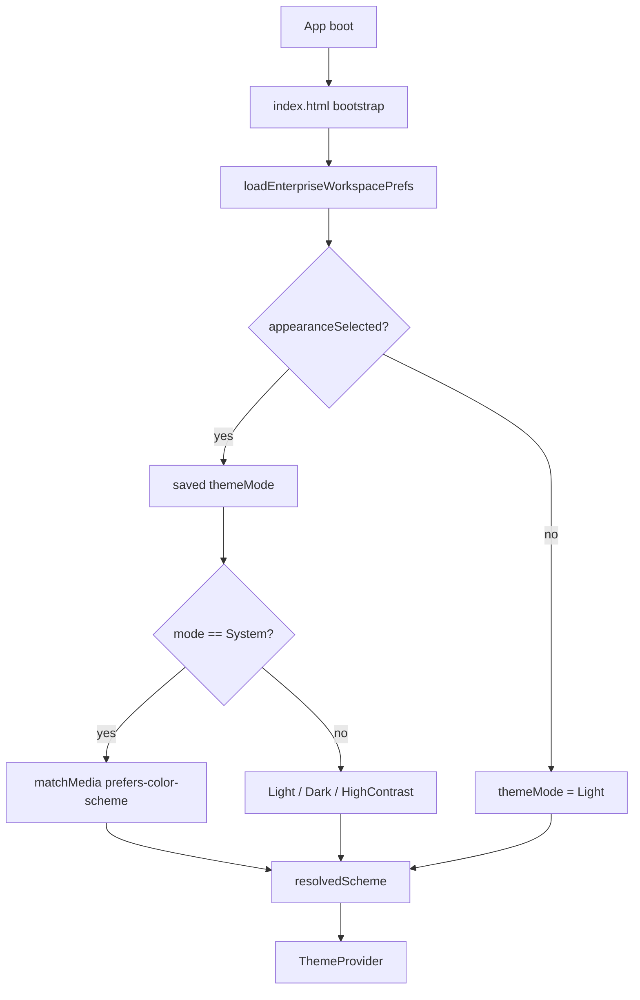

# AI22.7B-R1 — Theme Initialization Fix

| Field | Value |
|-------|-------|
| **Document ID** | AI22.7B-R1-Theme-Initialization |
| **Status** | Implemented |
| **Date** | August 2026 |
| **Scope** | Theme init only — no workflow, API, AI, Attendance, Enrollment, or Recognition Review changes |

---

## Problem

Application opened in Dark Mode after login because the workspace default was `themeMode: "system"`. On Windows Dark OS, that resolved to Dark for first-time / non-explicit users.

## Architecture

### Precedence (required)

1. User Theme Preference (Appearance menu selection)
2. System Theme — **only** if preference === `system`
3. Application Default → **Light**

### Rules

- Dark is never the application default
- `prefers-color-scheme` is consulted only when preference is System
- Logout must not clear theme preference (Auth logout only removes `token`)
- High Contrast persists like Light/Dark/System
- Anti-flicker bootstrap in `index.html` resolves scheme before React paints

---

## Files Created

- `abhyanvaya-ui/src/theme/resolveInitialTheme.ts`
- `docs/AI22.7B_R1_THEME_INITIALIZATION.md`
- `docs/AI22.7B_R2_APPEARANCE_VALIDATION.md`
- `docs/AI22.7B_R3_ENTERPRISE_THEME_AUDIT.md`

## Files Modified

- `abhyanvaya-ui/src/theme/workspacePersonalization.ts` — default Light; `appearanceSelected` flag; migration of polluted `system`
- `abhyanvaya-ui/src/theme/ThemeManager.tsx` — System-only OS listener; document scheme sync
- `abhyanvaya-ui/src/theme/ThemeModeToggle.tsx` — Appearance menu labels (R2)
- `abhyanvaya-ui/src/theme/createEnterpriseTheme.ts` — resolveColorScheme always falls back to light
- `abhyanvaya-ui/src/theme/index.ts` — exports
- `abhyanvaya-ui/src/theme/enterpriseTheme.test.ts` — R1 unit tests
- `abhyanvaya-ui/index.html` — anti-flicker bootstrap
- `abhyanvaya-ui/src/layouts/MainLayout.tsx` — theme tokens (R3)
- `abhyanvaya-ui/src/pages/Dashboard.tsx` — theme tokens (R3)
- `abhyanvaya-ui/src/pages/Login.tsx` (+ Forgot/Reset/Change password) — theme gradient (R3)

---

## Testing checklist

- [ ] Fresh browser profile / cleared `abhyanvaya.enterpriseWorkspace.v1` → Light after login
- [ ] Select Dark → logout → login → Dark
- [ ] Select Light → logout → login → Light
- [ ] Select System + OS Dark → Dark
- [ ] Select System + OS Light → Light
- [ ] Select High Contrast → logout → login → High Contrast
- [ ] No Dark flash before Light on cold start
- [ ] Unit tests: `resolveInitialTheme` suite in `enterpriseTheme.test.ts`

## Architecture impact

| Area | Impact |
|------|--------|
| Backend / API / AI | None |
| Attendance / Enrollment / Review workflows | None |
| Operational Context | None |
| Storage | Same key `abhyanvaya.enterpriseWorkspace.v1`; added `appearanceSelected` |
| Auth logout | Unchanged — does not touch theme storage |
