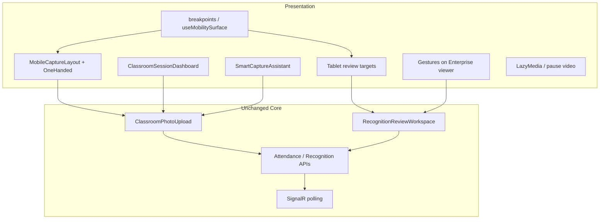

# AI22.7C — Mobile & Tablet Classroom Architecture

| Field | Value |
|-------|-------|
| **Document ID** | AI22.7C-Mobile-Architecture |
| **Status** | Phase 1 Complete |
| **Date** | July 2026 |
| **ADL note** | Supplemental documentation only — existing ADL volumes are not modified |

---

## Architecture overview

AI22.7C Phase 1 is an **Enterprise Mobility enhancement** of the existing classroom attendance workflow. Mobile, tablet, and desktop share one Attendance Session, Recognition Pipeline, and Teacher Review flow. Only the presentation layer adapts.

## Responsive strategy

| Width / surface | Mode |
|-----------------|------|
| `< 768px` | Mobile Capture Mode |
| Tablet band (~768–1366 + coarse/min-side heuristics) | Tablet Review enhancements |
| Larger desktop | Existing desktop UX |

Detection influences **layout and interaction** only — never recognition or backend processing.

## Gesture architecture

- Shared viewer: `useEnterpriseImageViewer`
- Swipe navigation + long-press menu: `ClassroomPhotoPanel`
- Helpers: `mobility/gestures.ts` + `theme/tabletExperience`

## Device matrix

See `AI22.7C_PHASE8_ACCESSIBILITY.md`.

## Performance strategy

- Lazy / async images
- Adaptive quality hints from `detectDeviceCapability`
- Pause hidden camera preview
- Existing blob cleanup

## Accessibility strategy

- WCAG AA via enterprise theme tokens
- Touch targets ≥ 44–48px
- Gesture alternatives via toolbar + keyboard
- Live regions for guidance

## Reuse analysis

| Existing asset | Reused for |
|----------------|------------|
| Attendance page / AiAttendancePanel | Mobile capture host |
| CameraCapturePanel / ClassroomPhotoUpload | Capture & upload |
| Recognition progress / review workspace | Status + review |
| Image quality / blur utilities | Smart Capture Assistant |
| AI22.7B theme tokens | All chrome styling |
| Operational faculty context | Dashboard |

## Theme

Mobile components use AI22.7B enterprise tokens only — no new color systems or spacing scales.

## Future Phase 2 extension points

Stubs in `abhyanvaya-ui/src/mobility/extensionPoints.ts` (all disabled):

- Offline read-cache / sync queue
- PWA install
- Background synchronization

## Supplemental ADL topics (this pack)

- Mobile Classroom Experience
- Tablet Classroom Experience
- Touch Architecture
- Future PWA integration (extension points only)

## Files created (Phase 1 aggregate)

See `AI22.7C_PHASE9_ARCHITECTURE.md`.
