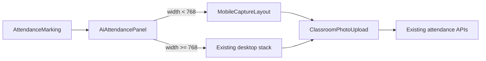

# AI22.7C Phase 1.1 — Mobile Capture Workspace

| Field | Value |
|-------|-------|
| **Document ID** | AI22.7C-Phase1.1-Mobile-Capture |
| **Status** | Implemented |
| **Date** | July 2026 |
| **Scope** | Presentation-only mobile capture layout on Attendance — no API / SignalR / workflow changes |

---

## Objective

Optimize the existing Attendance / AI Photo Attendance page for phone-sized screens (`width < 768px`) while leaving desktop unchanged.

## Architecture impact

- Device width selects **layout chrome only** (`MobileCaptureLayout`, sticky bottom bar, large touch targets).
- Reuses `ClassroomPhotoUpload`, `CameraCapturePanel`, `RecognitionProgressSummary`, and the same upload/recognition hooks.
- No forked attendance session, no new endpoints, no backend changes.

## Enhancements

- Large Capture button + sticky bottom action bar
- Large camera preview (`maxHeight` / `minHeight` on xs)
- Secondary dense panels hidden on phone (session card grid, coverage/activity)
- Portrait + landscape via flexible preview aspect / safe-area padding
- Enterprise theme tokens only (AI22.7B)

## Files Created

- `abhyanvaya-ui/src/mobility/breakpoints.ts`
- `abhyanvaya-ui/src/mobility/useMobilitySurface.ts`
- `abhyanvaya-ui/src/mobility/MobileCaptureLayout.tsx`
- `abhyanvaya-ui/src/mobility/index.ts`
- `abhyanvaya-ui/src/mobility/mobility.test.ts`
- `docs/AI22.7C_PHASE1_MOBILE_CAPTURE.md`

## Files Modified

- `abhyanvaya-ui/src/components/attendance/AiAttendancePanel.tsx` — Mobile Capture Mode wiring
- `abhyanvaya-ui/src/components/attendance/CameraCapturePanel.tsx` — larger preview / touch targets on xs

## Desktop

Unchanged when `width >= 768`. Same capture → upload → recognition → review workflow.

## Unit tests

- `mobility.test.ts` — `isMobileCaptureWidth`, `resolveMobilitySurface`
